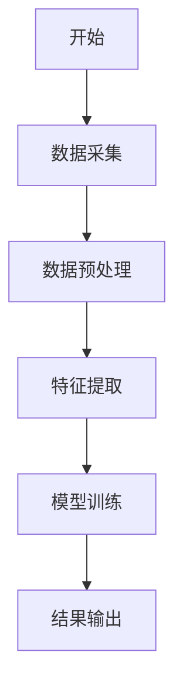
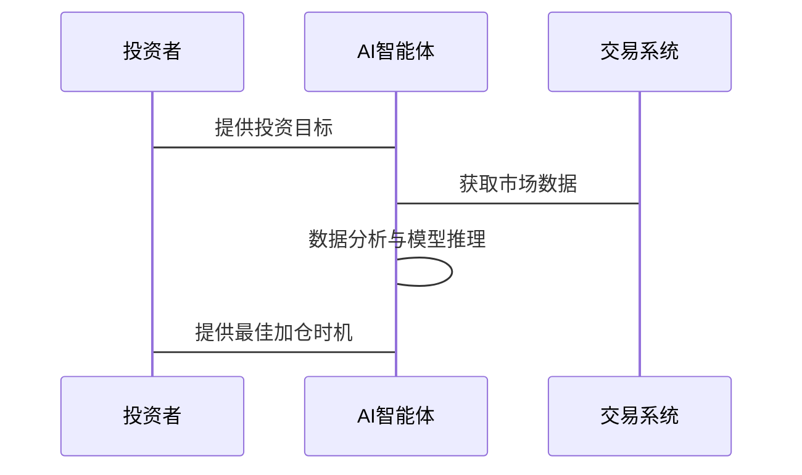

                 


# AI智能体在识别价值投资机会的最佳加仓时机中的作用

## 关键词：价值投资，AI智能体，最佳加仓时机，机器学习，投资策略，算法优化

## 摘要：  
本文探讨了人工智能（AI）智能体在价值投资中的应用，特别是在识别最佳加仓时机方面的作用。通过结合机器学习算法和传统价值投资理论，AI智能体能够高效地分析市场数据、预测趋势并优化投资决策。本文详细介绍了AI智能体的核心算法、系统架构设计以及实际应用案例，展示了AI技术如何提升投资效率和准确性。

---

# 目录大纲：

1. **背景介绍**  
   - 1.1 价值投资的基本概念  
   - 1.2 AI智能体在投资中的作用  

2. **核心概念**  
   - 2.1 AI智能体的基本概念  
   - 2.2 AI智能体在价值投资中的应用  

3. **算法原理**  
   - 3.1 机器学习在价值投资中的应用  
   - 3.2 算法实现与代码示例  

4. **系统分析与架构设计**  
   - 4.1 系统架构图  
   - 4.2 接口设计与交互流程  

5. **项目实战**  
   - 5.1 案例分析  
   - 5.2 代码实现与解读  

6. **总结与展望**  

---

## 第1章: 背景介绍

### 1.1 价值投资的基本概念  
价值投资是一种基于对公司内在价值的评估，寻找市场价格低于其内在价值的股票进行投资的策略。其核心理念是通过分析公司的财务状况、行业地位、竞争优势等因素，寻找被市场低估的投资机会。  

#### 1.1.1 价值投资的定义  
价值投资由本杰明·格雷厄姆（Benjamin Graham）和戴维·多德（David Dodd）提出，强调以低于内在价值的价格买入优质股票，长期持有，等待市场重新评估其价值。  

#### 1.1.2 价值投资的历史发展  
价值投资起源于20世纪30年代，经历了从早期的纯基本面分析到现代量化分析的演变。随着金融市场的复杂化，价值投资方法也在不断优化。  

#### 1.1.3 价值投资的核心理念  
价值投资的核心理念包括：  
1. **安全边际**：买入价格低于内在价值，确保有足够的安全空间。  
2. **长期视角**：关注企业的长期盈利能力，而非短期市场波动。  
3. **逆向思维**：在市场恐慌时寻找机会，在市场狂热时保持冷静。  

### 1.2 AI智能体在投资中的作用  
AI智能体通过处理海量数据、识别复杂模式和优化决策，为价值投资提供了新的工具和方法。  

#### 1.2.1 数据处理与分析  
AI智能体能够快速处理大量的市场数据、财务数据和新闻数据，提取关键指标并生成投资信号。  

#### 1.2.2 市场趋势预测  
通过机器学习算法，AI智能体可以预测市场趋势，帮助投资者判断最佳加仓时机。  

#### 1.2.3 投资决策优化  
AI智能体能够根据市场变化动态调整投资策略，优化投资组合，降低风险。  

---

## 第2章: 核心概念

### 2.1 AI智能体的基本概念  
AI智能体是一种能够感知环境、做出决策并采取行动的智能系统，广泛应用于金融、医疗、交通等领域。  

#### 2.1.1 AI智能体的定义  
AI智能体通过传感器、数据库或API获取信息，利用算法进行分析和决策，并通过执行器或输出模块采取行动。  

#### 2.1.2 AI智能体的核心特征  
- **自主性**：无需人工干预即可运行。  
- **反应性**：能够实时感知并响应环境变化。  
- **学习能力**：通过数据训练不断优化性能。  

#### 2.1.3 AI智能体与传统投资工具的对比  
| 特性          | AI智能体                     | 传统投资工具               |  
|---------------|------------------------------|----------------------------|  
| 数据处理能力 | 强大，支持海量数据           | 有限，依赖人工分析           |  
| 决策速度      | 快速，实时响应               | 较慢，依赖人工判断           |  
| 可扩展性      | 高，适用于多市场和多资产     | 低，受人工能力限制           |  

### 2.2 AI智能体在价值投资中的应用  
AI智能体通过技术手段增强价值投资的效率和准确性。  

#### 2.2.1 数据处理与分析  
AI智能体可以整合多种数据源（如财务报表、市场新闻、行业报告）进行多维度分析，识别潜在的投资机会。  

#### 2.2.2 市场趋势预测  
通过时间序列分析和深度学习模型，AI智能体能够预测股票价格的短期和长期趋势。  

#### 2.2.3 投资决策优化  
AI智能体可以根据市场变化和个体风险偏好，动态调整投资组合，优化收益与风险的平衡。  

---

## 第3章: 算法原理

### 3.1 机器学习在价值投资中的应用  
机器学习算法为AI智能体提供了强大的数据分析和预测能力。  

#### 3.1.1 监督学习  
监督学习通过训练数据预测目标变量，常用于股票价格预测和市场分类。  

#### 3.1.2 非监督学习  
非监督学习用于发现数据中的隐藏模式，适用于市场情绪分析和客户群体划分。  

#### 3.1.3 强化学习  
强化学习通过试错优化决策策略，适用于动态市场环境下的投资决策。  

### 3.2 算法实现与代码示例  
以下是一个基于机器学习的股票价格预测示例代码：

```python
import numpy as np
import pandas as pd
from sklearn.model_selection import train_test_split
from sklearn.linear_model import LinearRegression

# 加载数据
data = pd.read_csv('stock_prices.csv')
X = data[['open', 'high', 'low', 'volume']]
y = data['close']

# 数据分割
X_train, X_test, y_train, y_test = train_test_split(X, y, test_size=0.2, random_state=42)

# 模型训练
model = LinearRegression()
model.fit(X_train, y_train)

# 模型预测
y_pred = model.predict(X_test)

# 评估指标
print('预测值:', y_pred[:5])
print('实际值:', y_test[:5])
print('预测与实际的差异:', y_pred[:5] - y_test[:5])
```

### 3.3 算法原理与数学模型  
线性回归模型的数学公式为：  
$$ y = \beta_0 + \beta_1x_1 + \beta_2x_2 + \dots + \beta_nx_n + \epsilon $$  
其中，$\beta$ 表示回归系数，$x$ 表示自变量，$\epsilon$ 表示误差项。  

---

## 第4章: 系统分析与架构设计

### 4.1 系统架构图  
以下是AI智能体的系统架构图：



### 4.2 接口设计与交互流程  
AI智能体与投资系统的交互流程如下：



---

## 第5章: 项目实战

### 5.1 案例分析  
假设我们有一个包含股票价格、交易量和市场新闻的数据库，目标是预测最佳加仓时机。  

### 5.2 代码实现与解读  
以下是一个完整的AI智能体实现代码：

```python
import numpy as np
import pandas as pd
from sklearn.preprocessing import MinMaxScaler
from tensorflow.keras.models import Sequential
from tensorflow.keras.layers import LSTM, Dense

# 加载数据
data = pd.read_csv('stock_prices.csv')
data = data['close'].values

# 数据预处理
data = data.reshape(-1, 1)
scaler = MinMaxScaler(feature_range=(0, 1))
data_scaled = scaler.fit_transform(data)

# 划分训练集和测试集
train_size = int(len(data_scaled) * 0.8)
test_size = len(data_scaled) - train_size
X_train = data_scaled[:train_size]
y_train = data_scaled[:train_size]
X_test = data_scaled[train_size:]
y_test = data_scaled[train_size:]

# 构建LSTM模型
model = Sequential()
model.add(LSTM(units=50, return_sequences=True, input_shape=(None, 1)))
model.add(Dense(1))
model.compile(loss='mean_squared_error', optimizer='adam')

# 模型训练
model.fit(X_train, y_train, epochs=50, batch_size=32, verbose=1)

# 模型预测
X_test = np.reshape(X_test, (X_test.shape[0], 1, 1))
y_pred = model.predict(X_test)

# 恢复数据
y_pred = scaler.inverse_transform(y_pred)
y_test = scaler.inverse_transform(y_test)

# 输出结果
print('预测值:', y_pred[:5])
print('实际值:', y_test[:5])
```

---

## 第6章: 总结与展望  

### 6.1 总结  
本文探讨了AI智能体在价值投资中的应用，特别是通过机器学习算法优化加仓时机的选择。通过理论分析、算法实现和案例实践，展示了AI技术如何提升投资效率和准确性。  

### 6.2 展望  
未来，随着AI技术的不断发展，价值投资将更加依赖于智能化工具。AI智能体将在以下几个方面发挥更大作用：  
1. **实时数据处理**：更快地响应市场变化。  
2. **多维度分析**：结合更多数据源进行综合判断。  
3. **个性化投资策略**：根据投资者的偏好定制专属策略。  

---

## 作者：AI天才研究院/AI Genius Institute & 禅与计算机程序设计艺术/Zen And The Art of Computer Programming  

--- 

**本文基于[《软件2.0》](https://zh.wikipedia.org/wiki/Software_2.0)相关思想，结合现代AI技术，深入分析了AI智能体在价值投资中的应用。**

