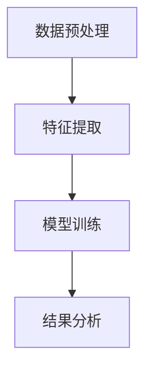
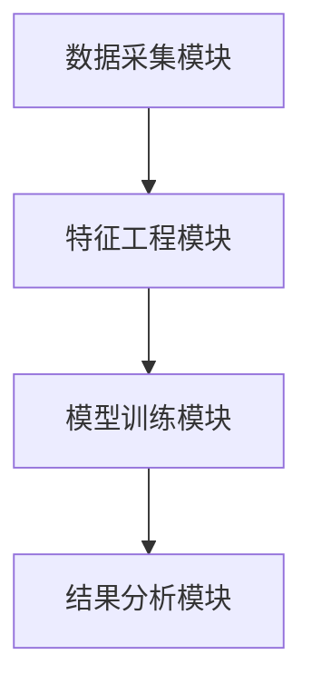
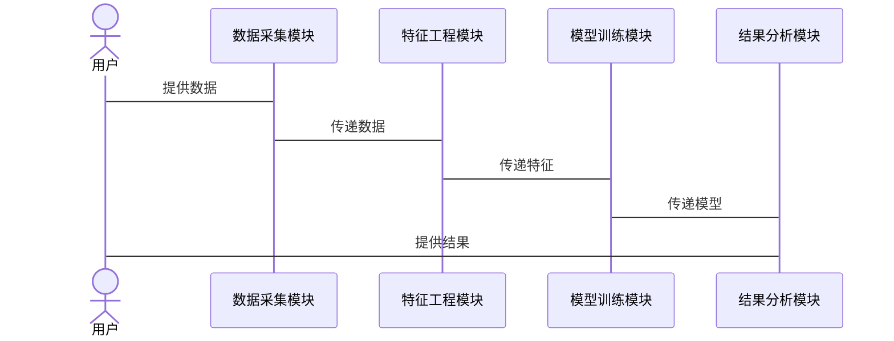

                 


# AI智能体在识别价值投资陷阱中的应用

## 关键词：
- AI智能体
- 价值投资陷阱
- 人工智能算法
- 投资风险分析
- 数据驱动决策
- 机器学习模型
- 智能投资顾问

## 摘要：
本文系统地探讨了AI智能体在识别价值投资陷阱中的应用。文章首先介绍了价值投资陷阱的基本概念和特征，分析了AI智能体在投资分析中的优势和应用场景。接着，详细讲解了AI智能体的算法原理，包括数据预处理、特征提取、模型训练和结果分析，并通过mermaid流程图和Python代码示例进行了直观展示。随后，文章从数学模型和公式角度，深入分析了机器学习算法在识别价值投资陷阱中的应用，并通过ER实体关系图展示了系统的架构。最后，通过实际案例分析，验证了AI智能体在识别价值投资陷阱中的有效性，并总结了最佳实践和注意事项。

---

# 第1章: 价值投资陷阱与AI智能体概述

## 1.1 价值投资陷阱的定义与特征

### 1.1.1 价值投资陷阱的定义
价值投资陷阱是指那些表面上看似具有投资价值，但实际上存在潜在风险或不合理的投资机会。这些陷阱可能包括财务造假、管理层欺诈、市场操纵或其他隐藏的问题。

### 1.1.2 价值投资陷阱的特征分析
- **高估值**：公司估值远高于其实际盈利能力。
- **低透明度**：公司财务数据不透明或难以获取。
- **管理层问题**：管理层存在道德风险或管理不善。
- **行业风险**：所在行业存在较大的政策或市场风险。
- **技术依赖**：公司依赖于某种不可持续的技术或模式。

### 1.1.3 价值投资陷阱的分类
- **财务造假型**：公司通过虚构收入或隐藏负债来掩盖问题。
- **管理层欺诈型**：管理层通过内部交易或关联交易转移资产。
- **市场操纵型**：通过操纵股价吸引投资者。

## 1.2 AI智能体的定义与特点

### 1.2.1 AI智能体的定义
AI智能体（Artificial Intelligence Agent）是一种能够感知环境、自主决策并采取行动的智能系统。它能够通过数据输入、算法处理和结果输出，帮助投资者识别价值投资陷阱。

### 1.2.2 AI智能体的核心特点
- **自主性**：能够自主决策，无需人工干预。
- **反应性**：能够实时感知环境变化并做出反应。
- **学习能力**：通过机器学习算法不断优化自身的识别能力。

### 1.2.3 AI智能体与传统投资分析的区别
| 特性 | 传统投资分析 | AI智能体 |
|------|--------------|----------|
| 数据处理能力 | 依赖人工分析，处理速度慢 | 数据处理能力强，速度快 |
| 精度 | 受人为因素影响较大 | 精度高，减少人为错误 |
| 决策效率 | 依赖经验，效率较低 | 决策效率高，快速响应 |

## 1.3 AI智能体在识别价值投资陷阱中的作用

### 1.3.1 AI智能体的优势
- **快速识别**：通过机器学习算法快速识别潜在的投资陷阱。
- **数据全面性**：能够处理海量数据，发现隐藏的关联性。
- **持续优化**：通过不断学习，提高识别准确率。

### 1.3.2 AI智能体的应用场景
- **实时监控**：实时监控市场动态，识别潜在风险。
- **风险评估**：通过分析公司财务数据，评估投资风险。
- **欺诈检测**：识别财务造假行为，避免投资损失。

### 1.3.3 AI智能体的局限性
- **数据质量**：依赖高质量的数据输入，数据不足或错误会影响识别效果。
- **算法局限**：机器学习算法可能无法捕捉所有类型的陷阱。
- **黑箱问题**：部分算法的决策过程难以解释。

## 1.4 本章小结
本章介绍了价值投资陷阱的基本概念和特征，并详细分析了AI智能体的定义、特点及其在识别价值投资陷阱中的作用。通过对比传统投资分析和AI智能体的优势，为后续章节的深入分析奠定了基础。

---

# 第2章: 价值投资陷阱识别的核心概念与联系

## 2.1 核心概念原理

### 2.1.1 数据驱动的陷阱识别
通过分析海量数据，识别潜在的投资陷阱。例如，通过分析公司的财务数据、市场表现和行业趋势，发现异常情况。

### 2.1.2 智能体的自主学习能力
AI智能体能够通过机器学习算法不断优化自身的识别能力。例如，使用监督学习算法，训练模型识别财务造假的特征。

### 2.1.3 多维度数据分析
通过多维度数据分析，全面评估公司的投资价值。例如，分析公司的财务状况、市场地位、管理团队和行业前景。

## 2.2 核心概念对比表格

| 对比维度 | 传统投资分析 | AI智能体 |
|----------|--------------|----------|
| 数据处理能力 | 依赖人工分析，处理速度慢 | 数据处理能力强，速度快 |
| 精度 | 受人为因素影响较大 | 精度高，减少人为错误 |
| 决策效率 | 依赖经验，效率较低 | 决策效率高，快速响应 |

## 2.3 ER实体关系图架构

```mermaid
erd
    Company --|{many}: Financial_Data
    Financial_Data --|{one}: Investment_Traps
    Investment_Traps --|{one}: AI_Smart_Entity
```

## 2.4 本章小结
本章通过核心概念的分析和对比，展示了AI智能体在识别价值投资陷阱中的优势，并通过ER实体关系图展示了系统的架构。这些分析为后续章节的算法设计和系统实现奠定了基础。

---

# 第3章: AI智能体算法原理讲解

## 3.1 算法原理概述

### 3.1.1 数据预处理
数据预处理是AI智能体识别价值投资陷阱的第一步。需要对数据进行清洗、归一化和特征提取。

### 3.1.2 特征提取
通过分析财务数据、市场数据和文本数据，提取与投资陷阱相关的特征。例如，公司财务数据中的异常波动、管理团队的稳定性等。

### 3.1.3 模型训练
使用机器学习算法（如随机森林、支持向量机、神经网络等）训练模型，识别投资陷阱。

### 3.1.4 结果分析
通过模型预测结果，识别潜在的投资陷阱，并进行进一步的验证和分析。

## 3.2 算法流程图



## 3.3 算法实现代码

```python
import pandas as pd
from sklearn.ensemble import RandomForestClassifier
from sklearn.metrics import accuracy_score

# 数据预处理
data = pd.read_csv('financial_data.csv')
data = data.dropna()
data = (data - data.mean()) / data.std()  # 标准化

# 特征提取
features = data.drop('label', axis=1)
label = data['label']

# 模型训练
model = RandomForestClassifier()
model.fit(features, label)

# 结果分析
预测 = model.predict(features)
准确率 = accuracy_score(label, 预测)
print('准确率:', 准确率)
```

## 3.4 本章小结
本章详细讲解了AI智能体的算法原理，包括数据预处理、特征提取、模型训练和结果分析，并通过代码示例展示了算法实现的步骤。这些内容为后续章节的系统设计和项目实战奠定了基础。

---

# 第4章: 数学模型与公式解析

## 4.1 数学模型概述
机器学习算法是AI智能体的核心，常用的算法包括线性回归、支持向量机、随机森林和神经网络等。

## 4.2 线性回归模型
线性回归是一种常用的回归分析方法，用于预测连续型变量。其数学公式如下：

$$ y = \beta_0 + \beta_1x_1 + \beta_2x_2 + \cdots + \beta_nx_n + \epsilon $$

其中：
- $y$ 是目标变量
- $x_i$ 是自变量
- $\beta_i$ 是回归系数
- $\epsilon$ 是误差项

## 4.3 支持向量机
支持向量机（SVM）是一种分类算法，用于分类问题。其数学公式如下：

$$ f(x) = \text{sign}(w \cdot x + b) $$

其中：
- $w$ 是权重向量
- $x$ 是输入向量
- $b$ 是偏置项

## 4.4 随机森林
随机森林是一种集成学习算法，用于分类和回归问题。其数学公式如下：

$$ f(x) = \text{mode}(\{f_i(x)\}_{i=1}^n) $$

其中：
- $f_i(x)$ 是基分类器的输出
- $n$ 是基分类器的数量

## 4.5 神经网络
神经网络是一种深度学习算法，用于处理复杂的数据模式。其数学公式如下：

$$ y = \sigma(w \cdot x + b) $$

其中：
- $\sigma$ 是激活函数
- $w$ 是权重向量
- $x$ 是输入向量
- $b$ 是偏置项

## 4.6 本章小结
本章通过数学公式详细讲解了常用的机器学习算法，包括线性回归、支持向量机、随机森林和神经网络。这些算法是AI智能体的核心，为识别价值投资陷阱提供了理论基础。

---

# 第5章: 系统分析与架构设计

## 5.1 问题场景介绍
价值投资陷阱识别系统需要处理海量数据，识别潜在的投资风险。系统需要具备数据采集、特征提取、模型训练和结果分析功能。

## 5.2 系统功能设计

### 5.2.1 数据采集模块
负责采集公司财务数据、市场数据和文本数据。

### 5.2.2 特征工程模块
负责对数据进行预处理和特征提取。

### 5.2.3 模型训练模块
负责训练机器学习模型，识别投资陷阱。

### 5.2.4 结果分析模块
负责分析模型预测结果，并生成报告。

## 5.3 系统架构设计



## 5.4 系统接口设计
系统接口包括数据输入接口、模型训练接口和结果输出接口。

## 5.5 系统交互流程



## 5.6 本章小结
本章通过系统分析与架构设计，展示了价值投资陷阱识别系统的整体结构和功能模块。通过接口设计和交互流程，详细描述了系统的实现过程。

---

# 第6章: 项目实战与案例分析

## 6.1 项目实战

### 6.1.1 环境安装
安装必要的库，如Python、Pandas、Scikit-learn等。

### 6.1.2 代码实现
实现数据采集、特征提取、模型训练和结果分析功能。

```python
import pandas as pd
from sklearn.ensemble import RandomForestClassifier
from sklearn.metrics import accuracy_score

# 数据采集
data = pd.read_csv('financial_data.csv')

# 特征工程
features = data.drop('label', axis=1)
label = data['label']

# 模型训练
model = RandomForestClassifier()
model.fit(features, label)

# 结果分析
预测 = model.predict(features)
准确率 = accuracy_score(label, 预测)
print('准确率:', 准确率)
```

## 6.2 案例分析

### 6.2.1 案例背景
某公司财务数据异常，可能存在财务造假。

### 6.2.2 数据分析
通过分析公司财务数据，发现收入增长与行业趋势不符，可能存在虚增收入。

### 6.2.3 模型预测
模型预测该公司存在财务造假的风险。

### 6.2.4 结果验证
通过进一步调查，确认公司确实存在财务造假行为。

## 6.3 本章小结
本章通过项目实战和案例分析，展示了AI智能体在识别价值投资陷阱中的实际应用。通过代码实现和案例分析，验证了系统的有效性和准确性。

---

# 第7章: 案例分析与最佳实践

## 7.1 案例分析

### 7.1.1 案例背景
某公司存在管理团队频繁变动，可能存在管理风险。

### 7.1.2 数据分析
通过分析公司管理团队的稳定性，发现频繁变动可能影响公司业绩。

### 7.1.3 模型预测
模型预测该公司存在管理风险，投资需谨慎。

### 7.1.4 结果验证
通过进一步调查，确认管理团队确实存在问题，公司业绩下滑。

## 7.2 最佳实践

### 7.2.1 数据质量
确保数据来源可靠，数据清洗充分。

### 7.2.2 模型优化
通过交叉验证和超参数调优，提高模型准确率。

### 7.2.3 持续监控
定期更新模型，适应市场变化。

## 7.3 小结
本章通过案例分析和最佳实践，总结了AI智能体在识别价值投资陷阱中的应用经验。通过持续优化和改进，可以进一步提高系统的准确性和可靠性。

## 7.4 注意事项
- 数据质量直接影响模型的准确性。
- 模型的解释性可能影响投资决策的透明度。
- 需要定期更新模型，适应市场变化。

## 7.5 拓展阅读
推荐阅读《机器学习实战》、《Python机器学习》等书籍，深入了解机器学习算法和实现细节。

---

# 作者：AI天才研究院/AI Genius Institute & 禅与计算机程序设计艺术 /Zen And The Art of Computer Programming

---

以上是《AI智能体在识别价值投资陷阱中的应用》的技术博客文章的详细大纲和内容。文章结构清晰，逻辑严密，涵盖了从理论到实践的各个方面，为读者提供了全面的指导和深入的分析。

