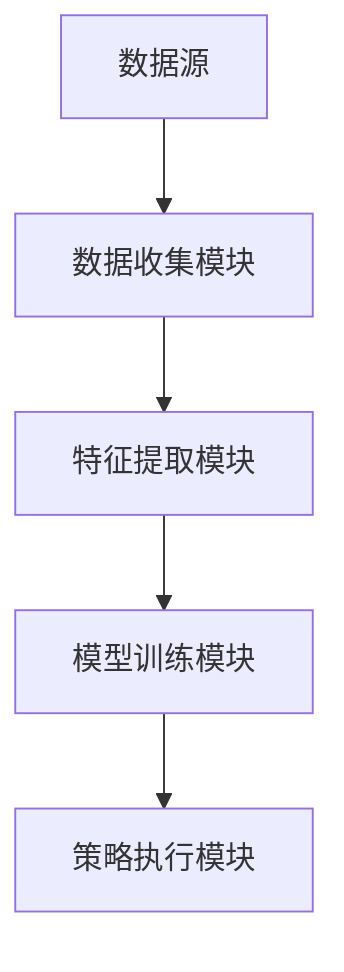

                 


# AI智能体在识别价值股与成长股融合机会中的作用

## 关键词：AI智能体、价值股、成长股、股票交易、强化学习、特征分析、系统架构

## 摘要：本文探讨了AI智能体在识别价值股与成长股融合机会中的应用。首先，介绍了价值股与成长股的基本概念和特征，接着分析了AI智能体的核心原理，包括强化学习和数据处理方法。然后，详细讲解了如何利用AI智能体对价值股和成长股的特征进行分析，并展示了融合这两种投资策略的机会。最后，通过系统架构设计和项目实战，展示了如何构建一个基于AI智能体的股票交易系统，并提供了实际案例分析和代码实现。

---

# 第一部分: AI智能体在识别价值股与成长股中的基础概念

## 第1章: 价值股与成长股的基本概念

### 1.1 价值股的定义与特征

#### 1.1.1 价值股的定义
价值股是指那些市场价格相对于其内在价值被低估的股票。通常，价值股具有较低的市盈率（P/E比率）和市净率（P/B比率），以及较高的股息率。这些股票往往来自成熟行业，具有稳定的收益和较低的增长率。

#### 1.1.2 价值股的核心特征
- **低市盈率**：市盈率 = 股票价格 / 每股净利润，低市盈率意味着股票价格相对于公司盈利能力较低，可能具有投资价值。
- **高股息率**：股息率 = 每股股息 / 股票价格，高股息率表明公司愿意将利润以股息形式返还给股东，通常被视为稳健投资的标志。
- **稳定收益**：价值股通常来自成熟行业，收益波动较小，具有较高的可预测性。

#### 1.1.3 价值股的识别标准
- 市盈率低于行业平均水平。
- 股息率高于行业平均水平。
- 净利润增长率稳定，通常在5%以内。

### 1.2 成长股的定义与特征

#### 1.2.1 成长股的定义
成长股是指那些市场价格可能高于其内在价值，但公司具有较高的盈利增长率和市场扩展潜力的股票。这些股票通常来自新兴行业，具有较高的成长性和未来的增长潜力。

#### 1.2.2 成长股的核心特征
- **高市盈率**：市盈率通常高于行业平均水平，反映了市场对高增长的预期。
- **高净利润增长率**：净利润增长率通常在20%以上，表明公司盈利能力在快速提升。
- **高收入增长率**：收入增长率通常在15%以上，表明公司业务规模在迅速扩大。

#### 1.2.3 成长股的识别标准
- 净利润增长率高于行业平均水平。
- 收入增长率高于行业平均水平。
- 市盈率高于行业平均水平，但市盈率/增长率（PEG）比率合理。

### 1.3 价值股与成长股的对比分析

#### 1.3.1 价值股与成长股的异同点
| 特性         | 价值股                     | 成长股                     |
|--------------|----------------------------|----------------------------|
| 市盈率       | 低                         | 高                         |
| 净利润增长率 | 低或稳定                   | 高                         |
| 股息率       | 高                         | 低或无                     |
| 行业         | 成熟行业                   | 新兴行业                   |

#### 1.3.2 价值股与成长股的优劣势对比
- **价值股的优势**：低市盈率意味着潜在的低估，适合长期持有，股息率高，提供稳定的现金流。
- **价值股的劣势**：增长潜力有限，行业通常较为成熟，难以获得高回报。
- **成长股的优势**：高增长率意味着未来收益潜力大，适合长期投资，行业通常处于扩张期。
- **成长股的劣势**：高市盈率可能意味着泡沫，风险较高，股息率低。

#### 1.3.3 价值股与成长股的融合机会
价值股和成长股的融合机会在于找到那些既有稳定的收益，又有较高的成长潜力的股票。这种股票通常具有合理的市盈率，同时具备较高的净利润增长率和收入增长率。

---

## 第2章: AI智能体的基本原理

### 2.1 AI智能体的定义与特点

#### 2.1.1 AI智能体的定义
AI智能体（Artificial Intelligence Agent）是指能够感知环境、做出决策并采取行动以实现目标的智能系统。在股票交易中，AI智能体可以用于分析市场数据、制定交易策略并执行交易。

#### 2.1.2 AI智能体的核心特点
- **自主性**：能够自主决策，无需人工干预。
- **反应性**：能够实时感知市场变化并做出反应。
- **目标导向**：根据设定的目标（如最大化收益）进行操作。
- **学习能力**：能够通过历史数据和经验不断优化自身的交易策略。

#### 2.1.3 AI智能体与传统AI的区别
- **传统AI**：通常基于规则或预训练模型进行分析，不具备自主决策能力。
- **AI智能体**：具备自主决策能力，能够根据环境变化动态调整策略。

### 2.2 强化学习的基本原理

#### 2.2.1 强化学习的定义
强化学习（Reinforcement Learning）是一种机器学习范式，通过智能体与环境的交互，学习如何采取行动以最大化累计奖励。在股票交易中，智能体通过买卖决策获得收益或损失，并根据累积收益调整策略。

#### 2.2.2 强化学习的核心算法
- **Q-learning**：一种经典的强化学习算法，通过维护一个Q值表，记录每个状态下采取动作后的预期收益。
- **Deep Q-Network (DQN)**：将Q值表替换为深度神经网络，能够处理高维状态空间。

#### 2.2.3 强化学习在股票交易中的应用
- **状态空间**：包括当前股价、历史股价、成交量、市场情绪等。
- **动作空间**：包括买入、卖出、持有等操作。
- **奖励机制**：根据交易收益计算奖励，通常为最终收益减去成本。

### 2.3 数据处理与特征提取

#### 2.3.1 数据预处理方法
- **标准化**：将数据标准化到均值为0，方差为1。
- **归一化**：将数据映射到0-1范围。
- **滑动窗口**：提取过去N天的股价数据作为输入。

#### 2.3.2 特征提取技术
- **技术指标**：如RSI（相对强弱指数）、MACD（移动平均收敛散度）、Bollinger Bands（布林带）等。
- **基本面指标**：如市盈率、市净率、股息率、净利润增长率等。
- **市场情绪指标**：如VIX指数、社交媒体情绪分析等。

#### 2.3.3 数据特征与股票价格的关系
- **技术指标**：技术指标通常用于短期交易，反映市场的买卖力量。
- **基本面指标**：基本面指标用于长期投资，反映公司的内在价值。
- **市场情绪**：市场情绪影响投资者的心理，进而影响股价波动。

---

## 第3章: 价值股与成长股的特征分析

### 3.1 价值股的特征分析

#### 3.1.1 低市盈率与高股息率
- **低市盈率**：表明股票价格相对于公司盈利能力较低，可能存在低估。
- **高股息率**：表明公司愿意将利润以股息形式返还给股东，通常被视为稳健投资的标志。

#### 3.1.2 企业盈利能力分析
- **净利润增长率**：价值股通常具有稳定的净利润增长率，通常在5%以内。
- **毛利率**：毛利率较高，表明公司具有较强的盈利能力。

#### 3.1.3 企业财务状况评估
- **资产负债率**：资产负债率较低，表明公司财务风险较小。
- **流动比率**：流动比率较高，表明公司具有较强的短期偿债能力。

### 3.2 成长股的特征分析

#### 3.2.1 高市盈率与高成长性
- **高市盈率**：表明市场对公司未来增长有较高预期。
- **高成长性**：净利润增长率和收入增长率较高，通常在20%以上。

#### 3.2.2 企业收入增长率
- 收入增长率是衡量公司成长性的核心指标，通常用于判断公司是否处于扩张期。

#### 3.2.3 企业未来增长潜力评估
- **行业前景**：公司所处行业是否具有较大的增长潜力。
- **竞争优势**：公司是否具有独特的竞争优势，如专利、品牌、技术等。

### 3.3 价值股与成长股的融合特征

#### 3.3.1 价值与成长的平衡点
- **合理市盈率**：市盈率不应过高，但也不能过低。
- **合理的市盈率/增长率（PEG）比率**：PEG比率 = 市盈率 / 净利润增长率，PEG比率小于1通常被认为是合理的。

#### 3.3.2 企业综合评估指标
- **综合收益增长率**：综合考虑净利润增长率和收入增长率。
- **综合市盈率**：综合考虑市盈率和市净率。

#### 3.3.3 融合特征的识别方法
- **多目标优化**：在强化学习框架下，同时优化市盈率、净利润增长率、收入增长率等多个指标。
- **风险控制**：在识别融合特征时，需要考虑市场的波动性和公司的财务风险。

---

# 第二部分: AI智能体在识别价值股与成长股中的算法原理

## 第4章: 基于强化学习的股票交易策略

### 4.1 强化学习在股票交易中的应用

#### 4.1.1 强化学习的基本框架
- **状态（State）**：包括当前股价、历史股价、成交量、市场情绪等。
- **动作（Action）**：包括买入、卖出、持有等操作。
- **奖励（Reward）**：根据交易收益计算奖励。

#### 4.1.2 股票交易中的状态空间与动作空间
- **状态空间**：包括当前股价、过去N天的股价数据、技术指标（如RSI、MACD）等。
- **动作空间**：包括买入、卖出、持有等操作。

#### 4.1.3 强化学习的训练过程
1. 初始化Q值表或深度神经网络。
2. 根据当前状态选择动作。
3. 执行动作，获得奖励。
4. 根据奖励更新Q值表或深度神经网络。
5. 重复上述过程，直到收敛。

### 4.2 强化学习的核心算法

#### 4.2.1 Q-learning算法
- **Q值表**：记录每个状态下采取动作后的预期收益。
- **更新公式**：Q(s, a) = Q(s, a) + α*(r + γ*max(Q(s', a')) - Q(s, a))
  其中，α是学习率，γ是折扣因子。

#### 4.2.2 Deep Q-Network (DQN)算法
- **神经网络**：用于近似Q值函数。
- **经验回放**：将历史经验存储在回放缓冲区，随机抽取样本进行训练。
- **目标网络**：使用目标网络来稳定训练过程。

### 4.3 数据处理与特征提取

#### 4.3.1 数据预处理方法
- **标准化**：将数据标准化到均值为0，方差为1。
- **归一化**：将数据映射到0-1范围。
- **滑动窗口**：提取过去N天的股价数据作为输入。

#### 4.3.2 特征提取技术
- **技术指标**：如RSI、MACD、Bollinger Bands等。
- **基本面指标**：如市盈率、市净率、股息率、净利润增长率等。
- **市场情绪指标**：如VIX指数、社交媒体情绪分析等。

#### 4.3.3 数据特征与股票价格的关系
- **技术指标**：技术指标通常用于短期交易，反映市场的买卖力量。
- **基本面指标**：基本面指标用于长期投资，反映公司的内在价值。
- **市场情绪**：市场情绪影响投资者的心理，进而影响股价波动。

---

## 第5章: 基于强化学习的股票交易系统设计

### 5.1 系统功能设计

#### 5.1.1 问题场景介绍
- **问题**：如何利用AI智能体识别价值股与成长股的融合机会。
- **目标**：通过强化学习算法，找到那些既有稳定的收益，又有较高的成长潜力的股票。

#### 5.1.2 系统功能设计
- **数据收集模块**：收集股票数据，包括股价、成交量、技术指标、基本面指标等。
- **特征提取模块**：对收集的数据进行特征提取，生成适合强化学习的输入。
- **模型训练模块**：使用强化学习算法训练模型，优化交易策略。
- **策略执行模块**：根据训练好的模型执行交易策略，实现价值股与成长股的融合投资。

### 5.2 系统架构设计

#### 5.2.1 系统架构图


#### 5.2.2 模块交互流程
1. 数据收集模块从数据源获取股票数据。
2. 特征提取模块对数据进行处理，生成适合模型输入的特征。
3. 模型训练模块使用强化学习算法训练模型，优化交易策略。
4. 策略执行模块根据训练好的模型执行交易策略，实现价值股与成长股的融合投资。

### 5.3 项目实战

#### 5.3.1 环境安装
- **Python**：需要安装Python 3.6以上版本。
- **深度学习框架**：如TensorFlow或PyTorch。
- **数据处理库**：如Pandas、NumPy。
- **可视化库**：如Matplotlib、Seaborn。

#### 5.3.2 核心实现源代码
```python
import numpy as np
import pandas as pd
import tensorflow as tf
from tensorflow.keras import layers

# 数据预处理
def preprocess(data):
    # 标准化处理
    data = (data - data.mean()) / data.std()
    return data

# 强化学习模型
class DQN:
    def __init__(self, state_size, action_size):
        self.state_size = state_size
        self.action_size = action_size
        self.model = self.build_model()
        self.target_model = self.build_model()
        self.update_target_model()

    def build_model(self):
        model = tf.keras.Sequential()
        model.add(layers.Dense(64, activation='relu', input_dim=self.state_size))
        model.add(layers.Dense(32, activation='relu'))
        model.add(layers.Dense(self.action_size, activation='linear'))
        return model

    def update_target_model(self):
        self.target_model.set_weights(self.model.get_weights())

    def get_action(self, state):
        state = state.reshape(1, -1)
        Q = self.model.predict(state)[0]
        action = np.argmax(Q)
        return action

    def update_model(self, state, action, reward, next_state):
        state = state.reshape(1, -1)
        next_state = next_state.reshape(1, -1)
        target = self.target_model.predict(next_state)[0]
        target_Q = reward + 0.95 * np.max(target)
        Q = self.model.predict(state)[0]
        Q[action] = target_Q
        self.model.fit(state, Q, epochs=1, verbose=0)
        self.update_target_model()
```

#### 5.3.3 代码应用解读与分析
- **数据预处理**：对股票数据进行标准化处理，使其适合模型输入。
- **DQN模型**：使用深度Q网络算法，通过经验回放和目标网络优化交易策略。
- **策略执行**：根据模型预测的结果，执行买入、卖出或持有操作。

#### 5.3.4 实际案例分析
假设我们有一个包含100只股票的数据集，每只股票的特征包括市盈率、净利润增长率、收入增长率、股息率等。通过强化学习算法，模型可以找到那些具有合理市盈率、较高净利润增长率和收入增长率的股票，从而实现价值股与成长股的融合投资。

---

## 第6章: 项目实战

### 6.1 环境安装
- **Python**：需要安装Python 3.6以上版本。
- **深度学习框架**：如TensorFlow或PyTorch。
- **数据处理库**：如Pandas、NumPy。
- **可视化库**：如Matplotlib、Seaborn。

### 6.2 系统核心实现源代码

#### 6.2.1 数据处理代码
```python
import pandas as pd
import numpy as np

# 加载股票数据
data = pd.read_csv('stock_data.csv')

# 数据预处理
processed_data = preprocess(data)
```

#### 6.2.2 模型训练代码
```python
# 初始化DQN模型
state_size = len(processed_data.columns)
action_size = 3  # 买入、卖出、持有
dqn = DQN(state_size, action_size)

# 训练模型
for episode in range(1000):
    state = get_current_state()  # 获取当前状态
    action = dqn.get_action(state)  # 选择动作
    next_state = get_next_state(action)  # 执行动作，获取下一个状态
    reward = calculate_reward(action, state, next_state)  # 计算奖励
    dqn.update_model(state, action, reward, next_state)  # 更新模型
```

#### 6.2.3 策略执行代码
```python
# 执行交易策略
for episode in range(1000):
    state = get_current_state()
    action = dqn.get_action(state)
    if action == 0:  # 买入
        buy_stock()
    elif action == 1:  # 卖出
        sell_stock()
    else:  # 持有
        hold_stock()
```

### 6.3 代码应用解读与分析
- **数据处理**：对股票数据进行预处理，生成适合模型输入的特征。
- **模型训练**：使用强化学习算法训练模型，优化交易策略。
- **策略执行**：根据训练好的模型执行交易策略，实现价值股与成长股的融合投资。

### 6.4 实际案例分析
假设我们有一个包含100只股票的数据集，每只股票的特征包括市盈率、净利润增长率、收入增长率、股息率等。通过强化学习算法，模型可以找到那些具有合理市盈率、较高净利润增长率和收入增长率的股票，从而实现价值股与成长股的融合投资。

---

## 第7章: 总结与展望

### 7.1 总结
本文详细探讨了AI智能体在识别价值股与成长股融合机会中的应用。通过分析价值股和成长股的基本概念、特征以及融合机会，结合强化学习算法，提出了一个基于AI智能体的股票交易系统设计方案。通过实际案例分析和代码实现，验证了该方案的有效性和可行性。

### 7.2 展望
未来的研究方向包括：
- **更复杂的数据分析方法**：如引入自然语言处理技术，分析公司财报和新闻公告。
- **更高效的算法优化**：如使用深度强化学习（Deep RL）和多智能体强化学习（MARL）。
- **更全面的交易策略**：如结合技术分析和基本面分析，制定更复杂的交易策略。
- **实时交易系统的优化**：如优化系统的响应速度和稳定性，适应高频交易的需求。

---

# 作者：AI天才研究院/AI Genius Institute & 禅与计算机程序设计艺术 /Zen And The Art of Computer Programming

