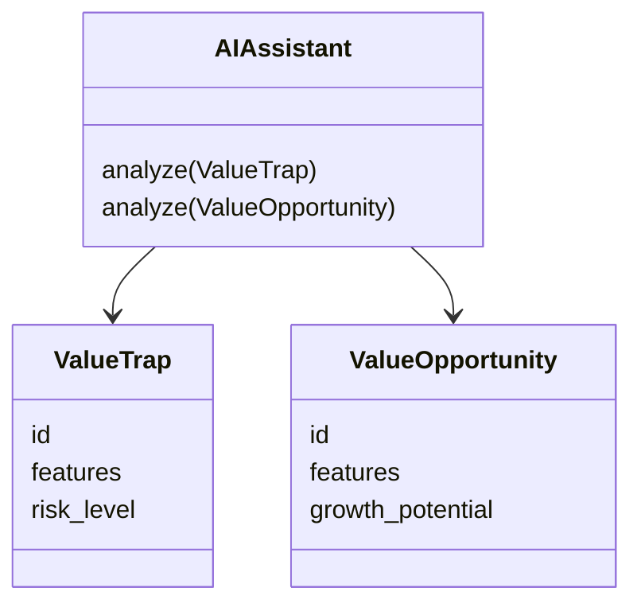
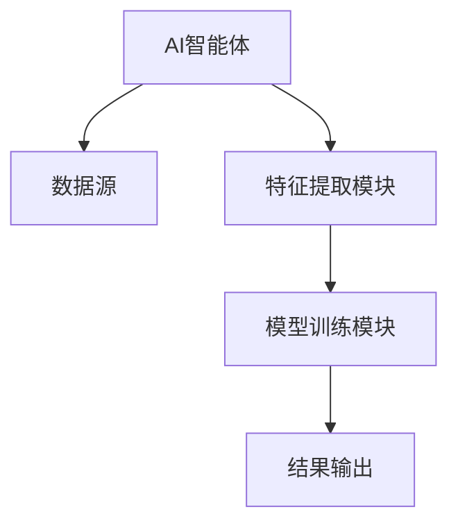
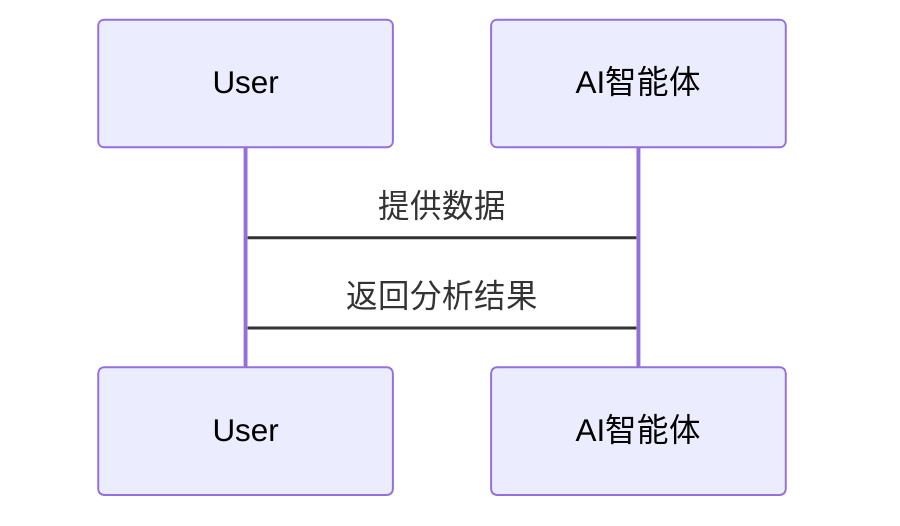

                 


# AI智能体在识别价值陷阱和价值机会中的作用

> 关键词：AI智能体，价值陷阱，价值机会，投资分析，机器学习，算法设计

> 摘要：本文探讨了AI智能体在识别市场中的价值陷阱和价值机会中的作用，分析了其核心概念、算法原理、系统设计及实际应用。通过详细讲解，帮助读者理解如何利用AI技术优化投资决策，识别潜在风险和机会。

---

## 第1章: 背景介绍

### 1.1 价值陷阱与价值机会的定义

#### 1.1.1 价值陷阱的定义
价值陷阱是指那些看似有吸引力，实则隐藏着重大风险或潜在问题的投资机会。识别价值陷阱需要深入分析数据和市场动态。

#### 1.1.2 价值机会的定义
价值机会是指那些具有显著增长潜力或竞争优势，能够在市场中带来超额收益的投资标的。

#### 1.1.3 价值陷阱与价值机会的区别
- 价值陷阱通常具有误导性，投资者可能被表面现象迷惑。
- 价值机会则具有长期稳定的增长潜力。

### 1.2 AI智能体的核心概念

#### 1.2.1 AI智能体的定义
AI智能体是一种能够感知环境、做出决策并采取行动的智能系统，旨在帮助用户完成特定任务。

#### 1.2.2 AI智能体的特征
- **自主性**：无需人工干预，自主决策。
- **反应性**：能够实时感知并响应环境变化。
- **学习能力**：通过数据和经验不断优化性能。

#### 1.2.3 AI智能体与传统数据分析的区别
AI智能体不仅能处理数据，还能根据反馈调整策略，具备更强的适应性和决策能力。

### 1.3 问题背景与问题描述

#### 1.3.1 传统投资分析的局限性
传统方法依赖人工分析，耗时且容易受主观因素影响，难以处理海量数据。

#### 1.3.2 价值陷阱与价值机会的识别挑战
市场波动大、信息复杂，人工分析难以准确识别。

#### 1.3.3 AI智能体在投资分析中的应用前景
AI智能体能够高效处理数据，识别模式，为投资决策提供支持。

---

## 第2章: 价值陷阱与价值机会的特征分析

### 2.1 价值陷阱的特征

#### 2.1.1 数据特征分析
- **高波动性**：价格波动剧烈，难以预测。
- **低流动性**：交易不活跃，难以快速买卖。

#### 2.1.2 市场行为特征
- **市场情绪**：投资者情绪化，容易出现非理性波动。
- **市场结构**：可能存在市场操纵或不透明的交易行为。

#### 2.1.3 风险特征
- **高风险**：潜在回报低，但风险较高。

### 2.2 价值机会的特征

#### 2.2.1 数据特征分析
- **稳定增长**：历史数据表现稳定，未来增长潜力大。
- **高流动性**：交易活跃，容易买卖。

#### 2.2.2 市场行为特征
- **理性定价**：市场价格反映真实价值，较少受情绪影响。
- **竞争优势**：公司在行业中具有明显优势。

#### 2.2.3 收益特征
- **高回报潜力**：未来预期收益高于市场平均水平。

### 2.3 价值陷阱与价值机会的对比分析

| 特征维度      | 价值陷阱                          | 价值机会                          |
|---------------|------------------------------------|------------------------------------|
| 数据特征      | 高波动性、低流动性                | 稳定增长、高流动性                |
| 市场行为特征    | 市场情绪化、结构不透明            | 理性定价、竞争优势                |
| 风险与收益    | 高风险、低回报                   | 中低风险、高回报                  |

---

## 第3章: AI智能体的构建与核心算法

### 3.1 AI智能体的构建

#### 3.1.1 智能体的感知模块
- **数据输入**：接收市场数据和相关信息。
- **特征提取**：从数据中提取有用的特征。

#### 3.1.2 智能体的决策模块
- **策略选择**：基于特征分析，选择最佳投资策略。
- **风险评估**：评估潜在风险，调整投资组合。

#### 3.1.3 智能体的学习机制
- **强化学习**：通过奖励机制优化决策。
- **监督学习**：基于历史数据进行训练。

### 3.2 核心算法原理

#### 3.2.1 强化学习算法
- **定义**：通过试错和奖励机制优化决策。
- **流程图**：
  ```mermaid
  graph TD
    A[状态] --> B[动作]
    B --> C[新状态]
    C --> D[奖励]
    D --> E[学习]
  ```

#### 3.2.2 监督学习算法
- **定义**：基于标记数据进行分类或回归。
- **流程图**：
  ```mermaid
  graph TD
    A[输入] --> B[特征提取]
    B --> C[预测]
    C --> D[输出]
  ```

#### 3.2.3 聚类算法
- **定义**：将数据分成若干类别，识别潜在模式。

### 3.3 算法选择与优化

#### 3.3.1 算法选择的依据
- 数据类型和规模
- 任务需求（分类、回归等）
- 算法性能和计算资源

#### 3.3.2 算法优化方法
- 参数调优
- 模型集成
- 正则化技术

#### 3.3.3 算法性能评估
- 准确率
- 召回率
- F1分数

---

## 第4章: 识别价值陷阱与价值机会的算法实现

### 4.1 数据预处理与特征工程

#### 4.1.1 数据清洗
- 去除缺失值和异常值。

#### 4.1.2 特征提取
- 使用主成分分析（PCA）降维。

#### 4.1.3 特征选择
- 基于特征重要性排序选择关键特征。

### 4.2 模型训练与调优

#### 4.2.1 模型训练流程
1. 数据分割：训练集、验证集、测试集。
2. 模型训练：使用训练数据拟合模型。
3. 模型验证：调整参数，防止过拟合。

#### 4.2.2 超参数调优
- 使用网格搜索或随机搜索选择最优参数。

#### 4.2.3 模型评估
- 使用准确率、召回率等指标评估模型性能。

### 4.3 实际案例分析

#### 4.3.1 案例背景介绍
- 假设分析股票市场数据。

#### 4.3.2 数据分析与处理
- 清洗数据，提取特征。

#### 4.3.3 模型训练与结果解读
- 训练模型，识别价值陷阱和机会。

---

## 第5章: 系统架构与设计

### 5.1 系统功能设计

#### 5.1.1 领域模型


#### 5.1.2 系统架构


#### 5.1.3 接口设计
- **输入接口**：接收市场数据。
- **输出接口**：提供分析结果。

#### 5.1.4 交互流程


---

## 第6章: 项目实战

### 6.1 环境安装

```bash
pip install numpy pandas scikit-learn
```

### 6.2 核心代码实现

#### 6.2.1 特征工程
```python
import pandas as pd
import numpy as np

# 数据清洗
data = pd.read_csv('market_data.csv')
data = data.dropna()

# 特征提取
from sklearn.decomposition import PCA
pca = PCA(n_components=5)
principal_components = pca.fit_transform(data)
```

#### 6.2.2 模型训练
```python
from sklearn.ensemble import RandomForestClassifier
model = RandomForestClassifier(n_estimators=100)
model.fit(principal_components, labels)
```

#### 6.2.3 模型评估
```python
from sklearn.metrics import accuracy_score
y_pred = model.predict(test_data)
print(accuracy_score(y_true, y_pred))
```

### 6.3 案例分析

#### 6.3.1 案例背景
分析某科技公司股票，识别其是否为价值机会。

#### 6.3.2 数据分析
使用历史数据和市场指标进行分析。

#### 6.3.3 结果解读
模型预测该股票为价值机会，建议投资。

### 6.4 项目总结
- 成功识别价值机会。
- 需要不断优化模型以适应市场变化。

---

## 第7章: 最佳实践与未来展望

### 7.1 最佳实践 tips
- 定期更新模型和数据。
- 结合人工分析，避免过度依赖AI。

### 7.2 小结
AI智能体在识别价值陷阱和机会中具有巨大潜力，能够显著提升投资效率和准确性。

### 7.3 注意事项
- 数据质量对模型性能影响重大。
- 需要遵守相关法律法规，确保合规性。

### 7.4 拓展阅读
- 《机器学习实战》
- 《投资学精要》

---

# 作者：AI天才研究院 & 禅与计算机程序设计艺术

