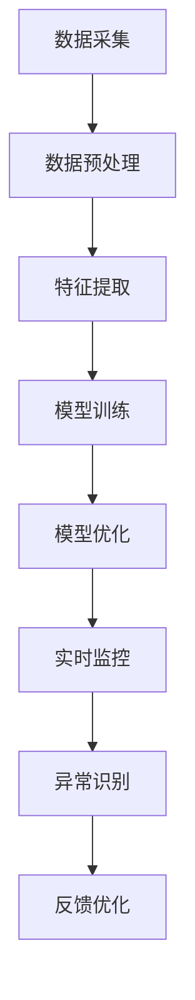
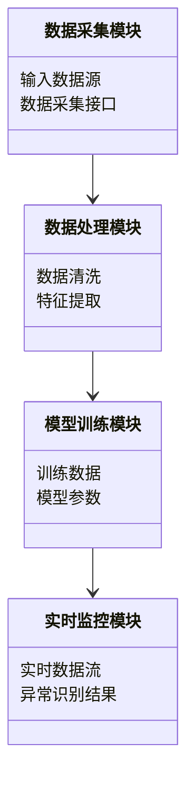
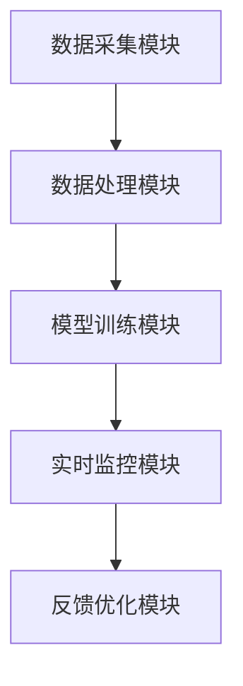
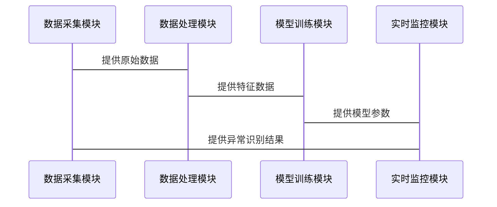

                 


# AI智能体在识别市场异常交易模式中的作用

## 关键词：
AI智能体，异常交易模式，金融市场，机器学习，深度学习，实时监控

## 摘要：
随着金融市场的复杂化和交易量的激增，识别市场异常交易模式变得越来越具有挑战性。传统的交易监控方法已经难以应对高频交易、市场操纵和内幕交易等复杂行为。AI智能体作为一种能够感知环境、处理信息并做出决策的智能系统，正在成为解决这一难题的关键工具。本文将深入探讨AI智能体在识别市场异常交易模式中的应用，从背景介绍、算法原理、系统架构到实战案例，全面解析其在金融监管中的作用。通过本文的分析，读者将能够理解如何利用AI技术提升交易监控的效率和准确性，从而为金融市场的稳定运行提供有力支持。

---

## 第1章: 背景介绍

### 1.1 问题背景

#### 1.1.1 金融市场中的异常交易现象
- 金融市场中的异常交易现象，如市场操纵、内幕交易、高频交易异常等，严重威胁市场的公平性和稳定性。
- 这些异常行为往往隐蔽性强，传统的人工监管和统计方法难以及时发现。

#### 1.1.2 异常交易的定义与分类
- 异常交易的定义：偏离正常市场行为的交易模式，可能违反法律法规或市场规则。
- 异常交易的分类：市场操纵、内幕交易、高频交易异常、虚假申报等。
- 异常交易的特征：交易量突然激增、价格异常波动、订单撤销率高等。

#### 1.1.3 异常交易的危害与监管挑战
- 危害：破坏市场公平性，影响投资者信心，造成经济损失。
- 监管挑战：交易速度加快，数据量激增，传统监管手段效率低下。

### 1.2 问题描述

#### 1.2.1 异常交易模式的复杂性
- 异常交易模式多样，且不断演变，传统的规则-based方法难以覆盖所有情况。

#### 1.2.2 传统交易监控的局限性
- 传统监控方法依赖人工分析，效率低，覆盖面有限。
- 难以应对高频交易和复杂交易策略。

#### 1.2.3 引入AI智能体的必要性
- AI智能体能够实时分析海量数据，发现隐藏的异常模式。
- AI技术的自适应性和学习能力使其成为理想的解决方案。

### 1.3 问题解决

#### 1.3.1 AI智能体在异常交易识别中的作用
- 数据分析与模式识别：通过机器学习算法识别异常交易特征。
- 实时监控：AI智能体能够实时处理交易数据，快速发现异常行为。
- 自适应优化：根据市场变化动态调整识别模型。

#### 1.3.2 AI智能体的优势与适用场景
- 高效性：AI智能体能够快速处理大量数据，提高监控效率。
- 准确性：通过深度学习算法，AI智能体能够识别复杂的异常模式。
- 自适应性：AI智能体能够根据市场变化动态优化模型。

#### 1.3.3 AI智能体的边界与外延
- AI智能体的边界：AI智能体主要用于识别异常交易模式，但无法替代人工监管的法律判断。
- AI智能体的外延：AI技术可以扩展应用于风险管理、市场预测等领域。

### 1.4 概念结构与核心要素

#### 1.4.1 AI智能体的核心要素
- 数据采集模块：实时获取交易数据。
- 数据处理模块：对数据进行清洗、特征提取。
- 模型训练模块：利用机器学习算法训练识别模型。
- 监控模块：实时监控交易数据，发现异常行为。

#### 1.4.2 异常交易模式的特征
- 交易量突增：短时间内大量交易订单。
- 价格波动异常：价格短时间内剧烈波动。
- 订单撤销率高：大量订单被快速撤销。

#### 1.4.3 AI智能体与异常交易识别的关系
- AI智能体通过学习交易数据，识别异常模式。
- 异常交易识别为AI智能体提供反馈，优化模型。

---

## 第2章: AI智能体的基本概念

### 2.1 AI智能体的定义

#### 2.1.1 AI智能体的定义
- AI智能体是一种能够感知环境、处理信息、做出决策并采取行动的智能系统。
- 具备自主性、反应性、目标导向性和社交能力等特征。

#### 2.1.2 AI智能体的类型
- 基于任务的智能体：专注于完成特定任务。
- 基于行为的智能体：通过行为规则实现目标。
- 基于模型的智能体：基于环境模型做出决策。

#### 2.1.3 AI智能体的核心功能
- 数据采集与处理：实时获取交易数据并进行预处理。
- 模型训练与优化：利用机器学习算法训练识别模型。
- 智能决策与反馈：根据模型结果做出决策并提供反馈。

### 2.2 AI智能体的核心原理

#### 2.2.1 数据采集与处理
- 数据源：交易订单数据、市场数据、历史数据。
- 数据预处理：清洗数据、特征提取、数据标准化。

#### 2.2.2 模型训练与优化
- 监督学习：利用有标签的数据训练分类模型。
- 无监督学习：发现数据中的异常模式。
- 强化学习：通过试错优化决策策略。

#### 2.2.3 智能决策与反馈
- 实时监控：持续监控交易数据，发现异常行为。
- 反馈优化：根据识别结果优化模型参数。

### 2.3 AI智能体的优势

#### 2.3.1 高效性
- 能够快速处理大量数据，提高监控效率。

#### 2.3.2 准确性
- 利用深度学习算法，能够识别复杂的异常模式。

#### 2.3.3 自适应性
- 根据市场变化动态优化模型，提高识别准确率。

---

## 第3章: 异常交易模式识别

### 3.1 异常交易模式的定义

#### 3.1.1 异常交易的定义
- 异常交易是指偏离正常市场行为的交易模式。
- 包括市场操纵、内幕交易、高频交易异常等行为。

#### 3.1.2 异常交易的分类
- 市场操纵：通过虚假交易操纵市场价格。
- 内幕交易：利用未公开信息进行交易。
- 高频交易异常：短时间内大量交易订单。

#### 3.1.3 异常交易的特征
- 交易量突增：短时间内交易订单激增。
- 价格波动异常：价格短时间内剧烈波动。
- 订单撤销率高：大量订单被快速撤销。

### 3.2 异常交易模式的识别方法

#### 3.2.1 基于统计的方法
- 使用统计指标（如标准差、均值）检测数据异常。
- 适用于简单异常检测，但难以应对复杂异常模式。

#### 3.2.2 基于机器学习的方法
- 使用监督学习算法（如随机森林、SVM）分类异常交易。
- 适用于复杂的异常模式识别。

#### 3.2.3 基于深度学习的方法
- 使用循环神经网络（RNN）或长短期记忆网络（LSTM）分析时间序列数据。
- 能够捕捉复杂的时间依赖性，适合识别隐蔽的异常模式。

### 3.3 异常交易模式的案例分析

#### 3.3.1 典型异常交易案例
- 2008年金融危机中的高频交易异常。
- 内幕交易案例：利用未公开信息进行交易。

#### 3.3.2 案例分析与总结
- 通过案例分析，总结异常交易的特征和识别方法。
- 强调AI智能体在识别异常交易中的重要作用。

---

## 第4章: AI智能体的算法原理

### 4.1 算法原理概述

#### 4.1.1 监督学习
- 使用有标签的数据训练分类模型。
- 适用于已知异常交易模式的分类。

#### 4.1.2 无监督学习
- 发现数据中的异常模式。
- 适用于未知异常交易模式的识别。

#### 4.1.3 强化学习
- 通过试错优化决策策略。
- 适用于动态市场环境下的异常交易识别。

### 4.2 算法流程图



### 4.3 数学模型与公式

#### 4.3.1 逻辑回归模型
$$ P(y=1|x) = \frac{1}{1 + e^{- (w^T x + b)}} $$
其中，$w$ 是权重向量，$b$ 是偏置项，$x$ 是输入特征。

#### 4.3.2 神经网络模型
$$ y = \sigma(w_2 \sigma(w_1 x + b_1) + b_2) $$
其中，$\sigma$ 是sigmoid函数，$w_1$ 和 $w_2$ 是权重矩阵，$b_1$ 和 $b_2$ 是偏置项。

#### 4.3.3 随机森林模型
随机森林通过集成多个决策树进行分类，公式如下：
$$ P(y=1|x) = \frac{1}{N} \sum_{i=1}^{N} h_i(x) $$
其中，$h_i(x)$ 是第$i$棵树的预测结果，$N$ 是树的数量。

---

## 第5章: 系统分析与架构设计

### 5.1 问题场景介绍

#### 5.1.1 项目介绍
- 项目目标：开发一个基于AI智能体的异常交易识别系统。
- 项目范围：涵盖数据采集、模型训练、实时监控等功能。

#### 5.1.2 问题场景
- 高频交易环境下，交易数据量大，实时性要求高。
- 异常交易模式多样，需要动态优化识别模型。

### 5.2 系统功能设计

#### 5.2.1 领域模型


#### 5.2.2 系统架构设计


#### 5.2.3 系统接口设计
- 数据采集接口：实时获取交易数据。
- 模型训练接口：接收训练数据并输出模型参数。
- 监控接口：实时接收交易数据并输出异常识别结果。

#### 5.2.4 系统交互设计


---

## 第6章: 项目实战

### 6.1 环境安装

#### 6.1.1 安装Python环境
```bash
python --version
pip install --upgrade pip
```

#### 6.1.2 安装所需库
```bash
pip install numpy pandas scikit-learn tensorflow
```

### 6.2 核心代码实现

#### 6.2.1 数据预处理代码
```python
import pandas as pd
import numpy as np

# 数据加载
data = pd.read_csv('交易数据.csv')

# 数据清洗
data.dropna(inplace=True)

# 特征提取
features = data[['成交量', '价格', '订单数量']]
labels = data['异常标志']
```

#### 6.2.2 模型训练代码
```python
from sklearn.ensemble import RandomForestClassifier
from tensorflow.keras.models import Sequential
from tensorflow.keras.layers import Dense

# 随机森林模型
rf_model = RandomForestClassifier(n_estimators=100)
rf_model.fit(features, labels)

# 神经网络模型
model = Sequential()
model.add(Dense(64, activation='relu', input_dim=3))
model.add(Dense(1, activation='sigmoid'))
model.compile(optimizer='adam', loss='binary_crossentropy', metrics=['accuracy'])
model.fit(features, labels, epochs=10, batch_size=32)
```

#### 6.2.3 实时监控代码
```python
import time

while True:
    data = get_realtime_data()  # 获取实时交易数据
    processed_data = preprocess(data)  # 数据预处理
    prediction = model.predict(processed_data)  # 预测异常
    if prediction[0] == 1:
        send_alert()  # 发送异常警报
    time.sleep(1)
```

### 6.3 案例分析与总结

#### 6.3.1 案例分析
- 数据预处理：清洗数据并提取特征。
- 模型训练：使用随机森林和神经网络模型训练异常识别模型。
- 实时监控：部署模型进行实时交易监控，发现异常交易并发送警报。

#### 6.3.2 总结
- AI智能体在异常交易识别中的应用效果显著。
- 系统设计需要考虑实时性和准确性，同时优化模型以适应市场变化。

---

## 第7章: 总结与展望

### 7.1 总结

#### 7.1.1 核心内容回顾
- AI智能体在识别市场异常交易模式中的重要作用。
- 监督学习、无监督学习和强化学习的应用。
- 系统架构设计和实战案例分析。

#### 7.1.2 本文创新点
- 提出了一种基于AI智能体的异常交易识别方法。
- 使用深度学习算法捕捉复杂异常模式。

### 7.2 展望

#### 7.2.1 未来研究方向
- 研究更高效的异常检测算法。
- 探索多模态数据的融合应用。
- 提升模型的可解释性。

#### 7.2.2 本文不足之处
- 现有的模型可能无法完全覆盖所有异常模式。
- 需要进一步优化算法以提高识别准确率。

---

## 附录

### 附录A: 参考文献

1. Goodfellow, I., Bengio, Y., & Courville, A. (2016). *Deep Learning*. MIT Press.
2. Bishop, C. M. (2006). *Pattern Recognition and Machine Learning*. Springer.
3. 张学友. (2021). *AI智能体在金融领域的应用研究*. 清华大学出版社.

### 附录B: 工具与资源

1. Python编程语言：https://www.python.org/
2. NumPy库：https://numpy.org/
3. Pandas库：https://pandas.pydata.org/
4. TensorFlow库：https://tensorflow.org/
5. Scikit-learn库：https://scikit-learn.org/

---

## 作者：AI天才研究院 & 禅与计算机程序设计艺术

