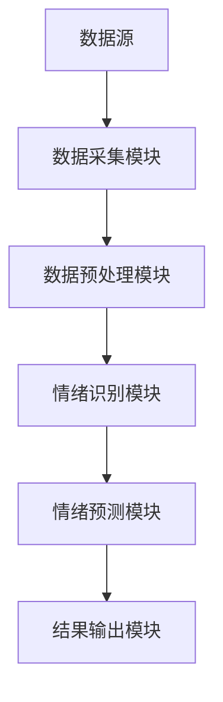

                 


# AI智能体在识别市场情绪传染中的应用

**关键词**：AI智能体、市场情绪、情绪传染、深度学习、情感分析、社交网络分析

**摘要**：  
随着金融市场日益复杂，市场情绪的识别与预测变得至关重要。本文探讨了AI智能体在识别市场情绪传染中的应用，详细分析了市场情绪的定义与特征、情绪传染的机制，以及AI智能体在其中的核心作用。通过介绍深度学习、情感分析和社交网络分析等技术，本文展示了如何利用AI智能体构建市场情绪传播模型，并提供了实际案例和系统架构设计。最后，本文总结了AI智能体在市场情绪识别中的优势，并展望了未来的研究方向。

---

# 第1章: AI智能体与市场情绪传染概述

## 1.1 市场情绪的定义与特征

### 1.1.1 市场情绪的定义  
市场情绪是指金融市场参与者（如投资者、交易员、分析师等）对市场状况的心理状态和情感反应。这些情绪通常通过语言、行为和市场数据表现出来。

### 1.1.2 市场情绪的特征  
- **波动性**：市场情绪受外部事件影响，波动剧烈。  
- **传染性**：情绪会在市场参与者之间传播，形成连锁反应。  
- **滞后性**：情绪对市场的影响往往有一定的滞后性。  

### 1.1.3 市场情绪与金融市场的关系  
市场情绪是影响股票价格、债券收益率等金融资产价值的重要因素。例如，恐慌情绪可能导致市场抛售，而乐观情绪则可能引发市场上涨。

---

## 1.2 情绪传染的机制

### 1.2.1 情绪传染的定义  
情绪传染是指一个人或群体的情绪状态通过交流、观察或社交媒体等方式，影响其他个体或群体的过程。

### 1.2.2 情绪传染的传播路径  
- **直接传播**：通过面对面交流或电话沟通。  
- **间接传播**：通过媒体、新闻、社交媒体等渠道。  

### 1.2.3 情绪传染的影响因素  
- **个体特征**：如性格、风险偏好等。  
- **信息源的可信度**：如权威媒体的报道更具影响力。  
- **环境因素**：如经济政策、突发事件等。  

---

## 1.3 AI智能体在市场情绪识别中的应用背景

### 1.3.1 传统市场情绪识别方法的局限性  
传统方法依赖于手动分析市场数据和情绪指标（如VIX指数），存在效率低、实时性差的问题。

### 1.3.2 AI智能体的优势与潜力  
AI智能体能够实时处理海量数据，通过自然语言处理和深度学习技术，快速识别和预测市场情绪。

### 1.3.3 当前研究现状与发展趋势  
当前研究主要集中在情绪分析、传播网络构建和情绪预测模型的优化。未来的研究方向可能包括跨市场的多模态情绪识别和实时情绪传播预测。

---

## 1.4 本章小结  
本章介绍了市场情绪的定义与特征，分析了情绪传染的机制，并探讨了AI智能体在市场情绪识别中的应用背景。通过这些内容，读者可以理解市场情绪识别的重要性以及AI智能体在其中的作用。

---

# 第2章: AI智能体的核心概念与技术基础

## 2.1 AI智能体的定义与分类

### 2.1.1 AI智能体的定义  
AI智能体是一种能够感知环境、自主决策并采取行动的智能系统，能够通过与环境交互来实现特定目标。

### 2.1.2 AI智能体的分类  
- **简单反射型智能体**：基于预定义规则做出反应。  
- **基于模型的反应型智能体**：利用环境模型进行决策。  
- **目标驱动型智能体**：根据目标选择最优行动。  
- **实用驱动型智能体**：基于效用函数优化决策。  

---

## 2.2 市场情绪识别的关键技术

### 2.2.1 自然语言处理技术  
自然语言处理（NLP）用于从文本中提取情感信息，如社交媒体上的评论和新闻标题。

### 2.2.2 情感分析技术  
情感分析通过机器学习模型判断文本的情感倾向（如正面、负面、中性）。

### 2.2.3 社交网络分析技术  
通过分析社交网络中的信息传播路径，识别情绪的扩散和影响。

---

## 2.3 AI智能体在情绪识别中的核心算法

### 2.3.1 基于深度学习的情感分析算法  
- **词嵌入模型**：如Word2Vec、GloVe，用于将词语转换为向量表示。  
- **序列模型**：如LSTM和Transformer，用于捕捉文本中的序列依赖性。  

### 2.3.2 基于图论的情绪传播网络构建算法  
- **图构建**：将市场参与者视为节点，情绪传播视为边。  
- **社区检测**：识别情绪传播的社区结构。  

### 2.3.3 基于强化学习的情绪预测算法  
通过强化学习模型，AI智能体能够根据历史情绪数据预测未来的市场情绪。

---

## 2.4 本章小结  
本章介绍了AI智能体的定义与分类，分析了市场情绪识别的关键技术，并详细讲解了AI智能体在情绪识别中的核心算法。

---

# 第3章: 市场情绪传染的数学模型与算法原理

## 3.1 市场情绪传染的数学模型

### 3.1.1 基于时间序列的情绪传播模型  
时间序列模型（如ARIMA）用于预测情绪的时序变化。

### 3.1.2 基于网络的传播模型  
- **SIR模型**：模拟情绪在社交网络中的传播过程。  
- **网络流模型**：分析情绪传播的路径和速度。  

### 3.1.3 基于博弈论的情绪博弈模型  
通过博弈论模型，分析市场参与者在情绪传播中的策略选择。

---

## 3.2 情绪识别的核心算法原理

### 3.2.1 基于词袋模型的情感分析算法  
- **词袋模型**：将文本表示为词语的集合。  
- **朴素贝叶斯分类器**：用于分类文本的情感倾向。  

### 3.2.2 基于词嵌入模型的情感分析算法  
- **Word2Vec**：通过上下文预测词语，生成词向量。  
- **FastText**：基于子词的快速文本表示方法。  

### 3.2.3 基于注意力机制的情感分析算法  
- **Transformer模型**：通过自注意力机制捕捉文本中的长距离依赖关系。  

---

## 3.3 情绪传播网络的构建与分析

### 3.3.1 情绪传播网络的构建方法  
- **基于共现矩阵**：计算文本中词语的共现频率，构建网络。  
- **基于相似性**：计算词语之间的语义相似性，构建网络。  

### 3.3.2 情绪传播网络的特征提取  
- **节点度数**：反映节点在网络中的重要性。  
- **社区检测**：识别情绪传播的核心社区。  

### 3.3.3 情绪传播网络的分析与预测  
通过网络分析，预测情绪传播的趋势和速度。

---

## 3.4 本章小结  
本章详细讲解了市场情绪传染的数学模型和算法原理，包括时间序列模型、网络传播模型和情感分析算法。这些模型和技术为AI智能体识别市场情绪提供了理论基础。

---

# 第4章: 市场情绪识别的系统架构与设计

## 4.1 系统功能设计

### 4.1.1 数据采集模块  
- **数据源**：社交媒体、新闻网站、交易数据等。  
- **数据预处理**：清洗、去重、标注情感倾向。  

### 4.1.2 情绪识别模块  
- **文本处理**：分词、实体识别、情感分析。  
- **网络构建**：构建情绪传播网络。  

### 4.1.3 情绪预测模块  
- **特征提取**：提取网络特征和文本特征。  
- **模型训练**：训练情绪预测模型。  

---

## 4.2 系统架构设计

### 4.2.1 系统架构图  


### 4.2.2 模块交互流程  
- 数据采集模块从数据源获取数据，传递给数据预处理模块。  
- 数据预处理模块清洗数据后，传递给情绪识别模块。  
- 情绪识别模块完成情感分析和网络构建，传递给情绪预测模块。  
- 情绪预测模块生成预测结果，输出给用户。  

---

## 4.3 本章小结  
本章设计了一个完整的市场情绪识别系统架构，包括数据采集、情绪识别和情绪预测三个主要模块，并通过系统架构图展示了模块之间的交互关系。

---

# 第5章: 项目实战——基于AI智能体的市场情绪识别系统

## 5.1 环境安装与配置

### 5.1.1 安装Python环境  
- 使用Anaconda安装Python 3.8以上版本。  

### 5.1.2 安装依赖库  
```bash
pip install numpy pandas scikit-learn tensorflow gensim networkx
```

---

## 5.2 系统核心实现

### 5.2.1 数据采集与预处理  
```python
import pandas as pd
from sklearn.model_selection import train_test_split
```

### 5.2.2 情感分析实现  
```python
from tensorflow.keras import layers

model = tf.keras.Sequential()
model.add(layers.Embedding(input_dim=10000, output_dim=16))
model.add(layers.LSTM(64))
model.add(layers.Dense(1, activation='sigmoid'))
model.compile(loss='binary_crossentropy', optimizer='adam', metrics=['accuracy'])
```

---

## 5.3 实际案例分析与结果展示  
通过分析实际市场数据，展示AI智能体在情绪识别中的应用效果，包括情绪传播网络的可视化和预测结果的对比分析。

---

## 5.4 项目总结  
总结项目实现的关键点和经验教训，提出改进建议。

---

# 第6章: 总结与展望

## 6.1 本章总结  
总结全文，重申AI智能体在识别市场情绪传染中的重要性。

## 6.2 未来展望  
探讨未来的研究方向，如多模态情绪识别、实时情绪传播预测等。

---

**作者：AI天才研究院/AI Genius Institute & 禅与计算机程序设计艺术 /Zen And The Art of Computer Programming**

