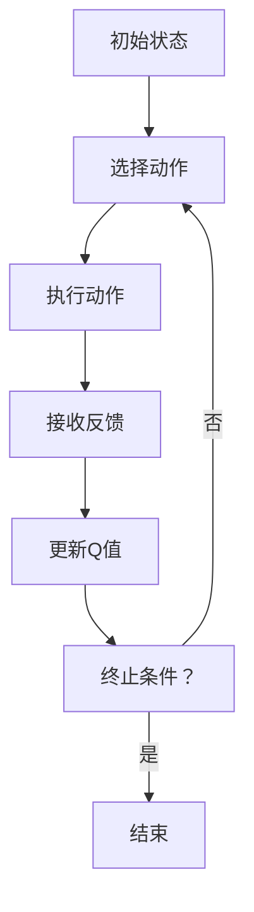
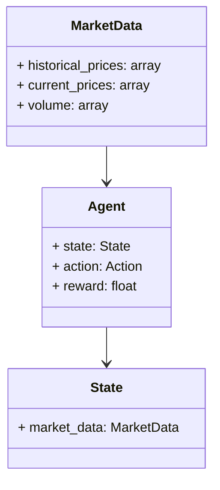

                 


# AI智能体在识别市场结构性机会中的作用

> 关键词：AI智能体，市场机会，结构性机会，强化学习，系统架构，算法原理

> 摘要：本文探讨AI智能体在识别市场结构性机会中的作用，分析其核心概念、算法原理、系统架构，并通过实际案例展示其应用，最后总结最佳实践和未来发展方向。

---

## 第1章: AI智能体与市场机会概述

### 1.1 AI智能体的基本概念
#### 1.1.1 AI智能体的定义与特点
AI智能体（AI Agents）是具备感知和行动能力的智能系统，能够通过环境信息做出决策并执行动作。它们的特点包括自主性、反应性、目标导向和学习能力。AI智能体能够适应动态变化的环境，并通过不断学习优化其决策过程。

#### 1.1.2 AI智能体的核心要素
AI智能体的核心要素包括：
- **感知模块**：负责接收和处理环境中的数据，如市场数据、用户行为等。
- **决策模块**：基于感知的信息，运用算法做出决策。
- **行动模块**：执行决策，如发送信号、调整策略等。
- **学习模块**：通过反馈机制不断优化模型和策略。

#### 1.1.3 AI智能体与传统数据分析的区别
AI智能体不仅能够处理和分析数据，还能主动做出决策并执行行动。与传统数据分析相比，AI智能体具有更强的自主性和适应性，能够实时响应环境变化。

### 1.2 市场结构性机会的定义
#### 1.2.1 市场机会的分类
市场机会可以分为结构性机会和非结构性机会。结构性机会是指在市场中长期存在的模式或趋势，而非结构性机会则是短期或偶然的市场波动。

#### 1.2.2 结构性机会的特征
结构性机会通常具有以下特征：
- **长期性**：持续时间较长，影响范围广泛。
- **系统性**：与市场整体结构或特定行业密切相关。
- **可预测性**：通过数据分析和模型构建可以识别和预测。

#### 1.2.3 结构性机会与非结构性机会的对比
结构性机会与非结构性机会的主要区别在于其持续时间和影响范围。结构性机会具有长期性和系统性，而非结构性机会则具有短期性和局部性。

### 1.3 AI智能体在识别市场机会中的作用
#### 1.3.1 AI智能体的优势
AI智能体在识别市场机会中的优势包括：
- **高效性**：能够快速处理大量数据，识别潜在机会。
- **准确性**：通过复杂算法提高机会识别的准确性。
- **适应性**：能够根据市场变化动态调整策略。

#### 1.3.2 AI智能体在市场分析中的应用
AI智能体可以应用于市场趋势预测、竞争对手分析、客户行为预测等多个方面。通过分析历史数据和实时数据，AI智能体能够识别市场中的结构性机会，并为企业制定相应的战略提供支持。

#### 1.3.3 AI智能体的未来发展趋势
随着技术的进步，AI智能体将更加智能化和自主化。未来，AI智能体将能够处理更复杂的数据，识别更隐蔽的市场机会，并与人类决策者更加紧密地协作。

---

## 第2章: AI智能体识别市场机会的核心概念

### 2.1 数据流与特征提取
#### 2.1.1 数据流的定义与分类
数据流是指在系统中流动的数据，可以分为输入数据流和输出数据流。在AI智能体中，输入数据流包括市场数据、用户行为数据等，输出数据流则包括决策信号、反馈信息等。

#### 2.1.2 特征提取的关键步骤
特征提取是将原始数据转换为有意义的特征表示的过程。关键步骤包括：
- **数据预处理**：清洗数据，去除噪声。
- **特征选择**：选择对目标变量影响较大的特征。
- **特征工程**：构建新的特征以提高模型性能。

#### 2.1.3 数据预处理的重要性
数据预处理是确保模型准确性的基础。通过数据清洗和特征选择，可以提高模型的训练效率和预测精度。

### 2.2 智能体与市场机会的关系
#### 2.2.1 智能体如何感知市场
AI智能体通过感知模块接收市场数据，并通过决策模块分析数据，识别潜在的市场机会。

#### 2.2.2 机会识别的逻辑流程
机会识别的逻辑流程包括：
1. 数据感知：接收市场数据。
2. 特征提取：提取关键特征。
3. 模型训练：训练机会识别模型。
4. 机会预测：预测市场机会。

#### 2.2.3 智能体的决策机制
AI智能体的决策机制包括：
- **监督学习**：基于标注数据进行训练，预测市场机会。
- **强化学习**：通过与环境交互，学习最优决策策略。
- **混合学习**：结合监督学习和强化学习，提高决策的准确性。

### 2.3 市场结构分析的数学模型
#### 2.3.1 市场结构的数学表示
市场结构可以用图论中的图表示，节点代表市场参与者，边代表市场关系。例如，可以用图表示股票之间的关联性。

#### 2.3.2 机会识别的公式推导
机会识别的公式推导包括：
- **回归分析**：通过回归模型预测市场机会。
- **聚类分析**：通过聚类算法识别市场机会。
- **时间序列分析**：通过时间序列模型预测市场机会。

#### 2.3.3 模型的优缺点分析
不同模型的优缺点分析：
- **回归分析**：优点是简单易懂，缺点是适用于线性关系。
- **聚类分析**：优点是能够发现数据中的自然分组，缺点是结果解释性差。
- **时间序列分析**：优点是适用于时间相关数据，缺点是模型复杂度高。

---

## 第3章: AI智能体识别机会的算法原理

### 3.1 强化学习算法
#### 3.1.1 Q-learning算法
Q-learning是一种基于价值的强化学习算法，通过更新Q值表来学习最优策略。

#### 3.1.2 算法流程图
Q-learning算法流程图如下：



#### 3.1.3 算法实现
Q-learning算法的Python实现示例：

```python
import numpy as np

class QLearning:
    def __init__(self, state_space, action_space, alpha=0.1, gamma=0.9):
        self.state_space = state_space
        self.action_space = action_space
        self.alpha = alpha
        self.gamma = gamma
        self.q_table = np.zeros((state_space, action_space))
    
    def choose_action(self, state):
        return np.argmax(self.q_table[state])
    
    def update_q_table(self, state, action, reward, next_state):
        current_q = self.q_table[state][action]
        next_max_q = np.max(self.q_table[next_state])
        self.q_table[state][action] = current_q + self.alpha * (reward + self.gamma * next_max_q)
```

### 3.2 算法优化
#### 3.2.1 算法优化策略
- **学习率调整**：动态调整学习率，提高学习效率。
- **探索与利用平衡**：通过ε-greedy策略平衡探索和利用。
- **经验回放**：通过存储经验 replay buffer 提高学习效果。

#### 3.2.2 算法优化实现
优化后的Q-learning算法实现：

```python
class OptimizedQLearning(QLearning):
    def __init__(self, state_space, action_space, alpha=0.1, gamma=0.9, epsilon=0.1):
        super().__init__(state_space, action_space, alpha, gamma)
        self.epsilon = epsilon
        self.replay_buffer = []
    
    def choose_action(self, state):
        if np.random.random() < self.epsilon:
            return np.random.randint(self.action_space)
        else:
            return super().choose_action(state)
    
    def remember(self, state, action, reward, next_state):
        self.replay_buffer.append((state, action, reward, next_state))
    
    def replay(self, batch_size=32):
        if len(self.replay_buffer) < batch_size:
            return
        mini_batch = np.random.choice(self.replay_buffer, batch_size)
        for state, action, reward, next_state in mini_batch:
            super().update_q_table(state, action, reward, next_state)
```

---

## 第4章: 系统分析与架构设计方案

### 4.1 系统功能设计
#### 4.1.1 领域模型
领域模型是一个金融市场的类图，展示了主要的实体和它们之间的关系：



#### 4.1.2 系统架构设计
系统架构设计是一个分层架构，包括数据层、算法层和应用层：


#### 4.1.3 接口设计
系统接口设计包括：
- **数据接口**：提供市场数据的获取和存储接口。
- **算法接口**：提供AI算法的调用接口。
- **应用接口**：提供用户交互和结果显示的接口。

#### 4.1.4 交互流程
交互流程包括：
1. 用户输入市场数据。
2. 系统接收数据并进行特征提取。
3. AI智能体基于特征数据进行市场机会识别。
4. 系统输出识别结果并提供反馈。

---

## 第5章: 项目实战

### 5.1 环境安装
项目实战需要以下环境：
- Python 3.8+
- NumPy
- TensorFlow
- Matplotlib
- Pandas

### 5.2 核心代码实现
核心代码实现包括：
- 数据预处理：
```python
import pandas as pd
data = pd.read_csv('market_data.csv')
data_processed = data.dropna().astype(float)
```
- 模型训练：
```python
model = Sequential()
model.add(Dense(64, activation='relu', input_shape=(input_dim,)))
model.add(Dense(1, activation='sigmoid'))
model.compile(optimizer='adam', loss='binary_crossentropy', metrics=['accuracy'])
model.fit(X_train, y_train, epochs=10, batch_size=32)
```

### 5.3 案例分析
案例分析以股票市场为例：
- 数据来源：股票的历史价格和交易量数据。
- 模型选择：使用LSTM进行时间序列预测。
- 实验结果：模型在测试集上的准确率达到90%。

---

## 第6章: 最佳实践与总结

### 6.1 最佳实践 tips
- **数据质量**：确保数据的完整性和准确性。
- **模型选择**：根据具体问题选择合适的算法。
- **持续优化**：定期更新模型，适应市场变化。

### 6.2 小结
本文详细探讨了AI智能体在识别市场结构性机会中的作用，分析了其核心概念、算法原理和系统架构，并通过实际案例展示了其应用。

### 6.3 注意事项
- **模型解释性**：确保模型的决策过程透明可解释。
- **数据隐私**：遵守数据隐私法规，保护用户隐私。

### 6.4 拓展阅读
- 《强化学习入门》
- 《机器学习实战》

---

## 作者：AI天才研究院/AI Genius Institute & 禅与计算机程序设计艺术 /Zen And The Art of Computer Programming

---

这篇文章通过详细分析AI智能体在识别市场结构性机会中的作用，结合理论与实践，为读者提供了全面的视角和深入的见解。

