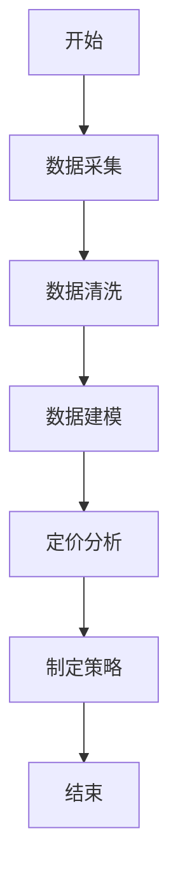
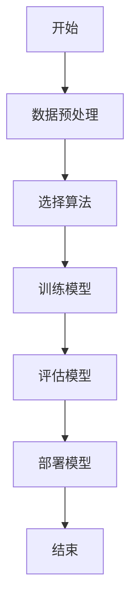
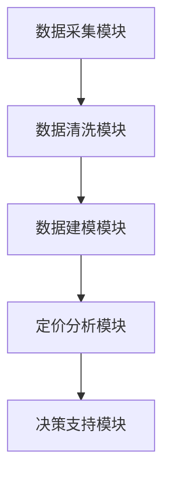
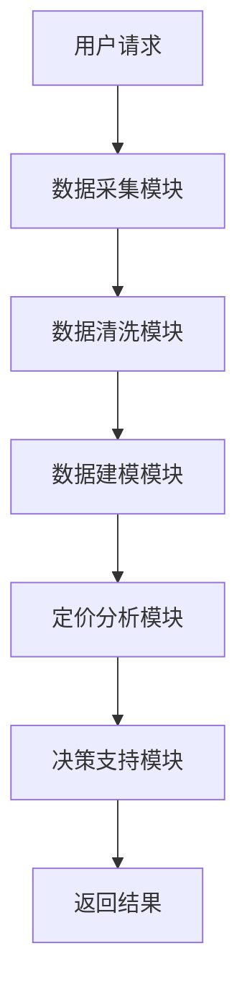

                 


# AI智能体在识别市场错误定价机会中的作用

**关键词：** AI智能体, 市场定价, 错误定价, 机器学习, 自然语言处理, 系统架构设计

**摘要：** 本文深入探讨了AI智能体在识别市场错误定价机会中的作用，从基本概念到系统架构设计，结合实际案例，详细分析了如何利用AI技术提升定价分析的准确性与效率。通过机器学习算法、NLP技术及系统架构设计，展示了AI智能体在市场定价中的应用潜力。

---

## 第一章：AI智能体与市场错误定价概述

### 1.1 AI智能体的定义与核心概念

AI智能体是一种能够感知环境、自主决策并执行任务的智能系统。它结合了机器学习、自然语言处理和大数据分析，能够在复杂市场中识别定价错误，优化资源配置。

#### 1.1.1 AI智能体的基本定义
- **定义：** AI智能体是具备感知、推理、学习和执行能力的智能系统，用于自动化决策和优化。
- **核心特征：**
  - 自主性：无需人工干预，自主执行任务。
  - 反应性：实时感知环境变化，动态调整策略。
  - 学习能力：通过数据训练，不断提升准确性。

#### 1.1.2 市场错误定价的定义与特征
- **定义：** 错误定价指商品或服务的价格与其真实价值不符的情况。
- **特征：**
  - 信息不对称：买方或卖方掌握不完整信息。
  - 市场波动：价格受供需变化影响，易出现短期偏差。
  - 竞争因素：竞争对手策略影响定价合理性。

#### 1.1.3 AI智能体在识别错误定价中的作用
- **数据处理：** 高效处理大量市场数据，识别潜在定价错误。
- **模式识别：** 通过机器学习算法，发现定价中的异常模式。
- **实时监控：** 实时分析市场动态，快速响应定价偏差。

### 1.2 市场错误定价的机会分析

#### 1.2.1 市场定价机制的现状
- **传统定价方法：** 主要依赖经验判断，存在人为误差。
- **数据驱动定价：** 利用数据分析优化定价策略。
- **动态定价：** 根据市场变化实时调整价格。

#### 1.2.2 错误定价的机会来源
- **信息不对称：** 买卖双方信息不匹配，导致价格偏离价值。
- **市场波动：** 短期内供需失衡，出现定价错误。
- **竞争策略：** 竞争对手定价失误，提供市场机会。

#### 1.2.3 AI智能体的优势与应用场景
- **优势：**
  - 高效性：快速处理大量数据，提升分析效率。
  - 准确性：通过机器学习，提高定价分析的准确性。
  - 实时性：实时监控市场动态，及时发现定价错误。
- **应用场景：**
  - 金融投资：识别股票、债券等金融产品的定价错误。
  - 零售业：优化商品定价，提升利润。
  - 供应链管理：优化采购和库存管理，降低成本。

---

## 第二章：AI智能体的核心概念与联系

### 2.1 AI智能体的核心原理

#### 2.1.1 智能体的感知与决策机制
- **感知：** 通过数据采集模块获取市场数据，包括价格、供需、竞争信息等。
- **推理：** 利用机器学习模型分析数据，识别定价错误。
- **决策：** 根据分析结果，制定最优定价策略。

#### 2.1.2 基于数据驱动的定价分析
- **数据采集：** 从多个来源获取市场数据，包括公开数据、交易数据等。
- **数据清洗：** 去除噪声数据，确保分析准确性。
- **数据建模：** 使用机器学习算法建立定价模型，预测价格走势。

### 2.2 核心概念对比分析

#### 2.2.1 AI智能体与传统定价模型的对比
| 特性             | AI智能体                | 传统定价模型           |
|------------------|-------------------------|------------------------|
| 数据依赖         | 高，依赖大数据分析       | 较低，依赖经验判断       |
| 精确性           | 高，基于数据驱动         | 较低，存在人为误差       |
| 反应速度         | 快，实时分析             | 较慢，依赖人工调整       |
| 学习能力         | 强，可自我优化           | 无，固定模型             |

#### 2.2.2 数据驱动与规则驱动的定价方法
- **数据驱动：** 基于大量数据分析，动态调整定价策略。
- **规则驱动：** 根据预设规则，静态调整定价。

### 2.3 实体关系图（ER图）与流程图

#### 使用 Mermaid 绘制 AI 智能体的实体关系图

```mermaid
erDiagram
    actor 用户
    actor 数据源
    actor 竞争对手
    actor 市场监管机构
    database 市场数据
    database 竞争对手数据
    database 历史定价数据
    boundary 定价分析模块
    boundary 决策支持模块
    boundary 数据采集模块
    boundary 数据清洗模块
    boundary 数据建模模块
    用户 --> 数据采集模块
    数据源 --> 数据采集模块
    竞争对手 --> 数据采集模块
    市场监管机构 --> 数据采集模块
    数据采集模块 --> 数据清洗模块
    数据清洗模块 --> 数据建模模块
    数据建模模块 --> 定价分析模块
    定价分析模块 --> 决策支持模块
```

#### 使用 Mermaid 绘制 AI 智能体的流程图



---

## 第三章：AI智能体的算法原理

### 3.1 机器学习算法在定价中的应用

#### 3.1.1 线性回归模型

- **数学模型：**
  $$ y = \beta_0 + \beta_1x_1 + \beta_2x_2 + ... + \beta_nx_n + \epsilon $$
  其中，\( y \) 是目标变量，\( x_i \) 是自变量，\( \beta_i \) 是系数，\( \epsilon \) 是误差项。
  
- **应用场景：** 用于简单线性关系的定价预测，如价格与销售量的关系。

#### 3.1.2 随机森林算法

- **算法特点：**
  - 非线性模型，能够捕捉复杂关系。
  - 具有较强的抗过拟合能力。
  
- **应用场景：** 适用于多变量、非线性关系的定价分析。

#### 3.1.3 神经网络模型

- **数学模型：** 多层感知机（MLP）
  $$ a^{(l)} = \sigma(w^{(l)} a^{(l-1)} + b^{(l)}) $$
  其中，\( a^{(l)} \) 是第 \( l \) 层的激活值，\( w^{(l)} \) 是权重，\( b^{(l)} \) 是偏置，\( \sigma \) 是激活函数。
  
- **应用场景：** 复杂定价模式的识别，如金融衍生品定价。

### 3.2 算法流程图

#### 使用 Mermaid 绘制机器学习算法的流程图



### 3.3 算法实现与代码示例

#### 使用 Python 实现线性回归模型的代码示例

```python
import numpy as np
from sklearn.linear_model import LinearRegression

# 示例数据
X = np.array([[1], [2], [3], [4], [5]])
y = np.array([2, 4, 5, 4, 6])

# 创建线性回归模型
model = LinearRegression()

# 训练模型
model.fit(X, y)

# 预测
new_X = np.array([[6]])
predicted_y = model.predict(new_X)

print("预测值:", predicted_y)
```

#### 使用 Python 实现随机森林算法的代码示例

```python
from sklearn.ensemble import RandomForestRegressor

# 示例数据
X = np.array([[1], [2], [3], [4], [5]])
y = np.array([2, 4, 5, 4, 6])

# 创建随机森林模型
model = RandomForestRegressor(n_estimators=100)

# 训练模型
model.fit(X, y)

# 预测
new_X = np.array([[6]])
predicted_y = model.predict(new_X)

print("预测值:", predicted_y)
```

---

## 第四章：系统分析与架构设计

### 4.1 系统架构设计方案

#### 4.1.1 问题场景介绍

- **问题描述：** 如何构建一个AI智能体，实时监控市场动态，识别错误定价机会。

#### 4.1.2 系统功能设计

| 模块名称         | 功能描述                     |
|------------------|-----------------------------|
| 数据采集模块     | 从多个来源采集市场数据       |
| 数据清洗模块     | 处理数据，去除噪声           |
| 数据建模模块     | 建立定价模型，预测价格走势   |
| 定价分析模块     | 分析定价错误，识别机会       |
| 决策支持模块     | 提供定价优化建议             |

#### 4.1.3 系统架构图



#### 4.1.4 系统接口设计

- **数据接口：** API接口用于数据采集模块与外部系统的交互。
- **用户接口：** �界面对话框，展示分析结果和优化建议。

#### 4.1.5 系统交互流程图



---

## 第五章：项目实战

### 5.1 环境安装与配置

#### 5.1.1 环境安装

- **Python 3.8 或更高版本**
- **安装必要的库：**
  ```bash
  pip install numpy pandas scikit-learn matplotlib
  ```

#### 5.1.2 数据准备

- 数据来源：可以从公开数据集获取市场数据，如股票价格、商品定价等。

### 5.2 系统核心实现

#### 5.2.1 数据采集与处理

```python
import pandas as pd
import requests

# 从网络接口获取数据
def get_data(api_url):
    response = requests.get(api_url)
    data = response.json()
    return data

# 数据清洗
def clean_data(data):
    df = pd.DataFrame(data)
    df = df.dropna()
    return df
```

#### 5.2.2 定价模型实现

```python
from sklearn.linear_model import LinearRegression
from sklearn.ensemble import RandomForestRegressor

# 线性回归模型
def linear_regression_model(X_train, y_train):
    model = LinearRegression()
    model.fit(X_train, y_train)
    return model

# 随机森林模型
def random_forest_model(X_train, y_train):
    model = RandomForestRegressor(n_estimators=100)
    model.fit(X_train, y_train)
    return model
```

#### 5.2.3 结果分析与优化建议

- **分析结果：** 识别出哪些商品存在定价错误。
- **优化建议：** 根据分析结果，调整定价策略，提升利润。

### 5.3 实际案例分析

#### 5.3.1 案例背景

- 某电商平台的商品定价分析，识别是否存在定价错误。

#### 5.3.2 数据分析与建模

- 使用机器学习模型分析商品价格，识别定价错误。

#### 5.3.3 结果展示与策略调整

- 根据分析结果，调整商品价格，优化销售策略。

### 5.4 项目小结

- **项目成果：** 成功识别市场中的定价错误机会，优化了定价策略。
- **经验总结：** 数据质量对模型准确性影响重大，需重视数据清洗和特征工程。

---

## 第六章：最佳实践与注意事项

### 6.1 最佳实践

- **数据质量：** 确保数据的准确性和完整性，避免噪声干扰。
- **模型可解释性：** 选择可解释的模型，便于分析和优化。
- **实时性：** 确保系统具备实时监控能力，快速响应市场变化。

### 6.2 小结

- AI智能体在识别市场错误定价机会中具有显著优势，通过机器学习和大数据分析，能够提升定价策略的准确性和效率。

### 6.3 注意事项

- **数据隐私：** 遵守数据隐私法规，确保数据处理合法合规。
- **模型维护：** 定期更新模型，保持其准确性和适用性。

---

## 附录

### 附录 A：术语表

- **AI智能体：** 具备感知、决策和执行能力的智能系统。
- **定价分析：** 通过数据分析优化商品或服务的价格。

### 附录 B：参考文献

- [1] 《机器学习实战》, 周志华.
- [2] 《Python机器学习》，Andreas Müller, 司维.
- [3] 《深度学习》，Ian Goodfellow 等.

### 附录 C：索引

- AI智能体：第1章，第2章，第3章，第4章，第5章。
- 机器学习：第2章，第3章，第5章。

---

**作者：AI天才研究院/AI Genius Institute & 禅与计算机程序设计艺术 /Zen And The Art of Computer Programming**

---

**声明：** 本文为AI智能体在识别市场错误定价机会中的作用的技术博客文章，版权归作者所有，转载请注明出处。

