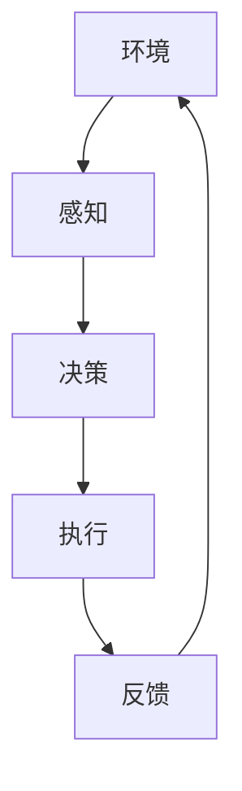
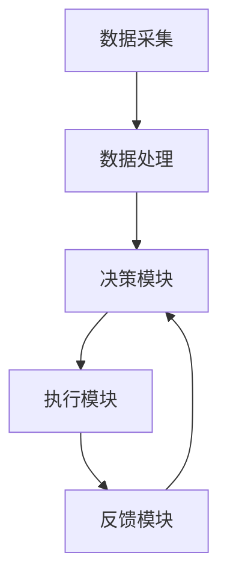
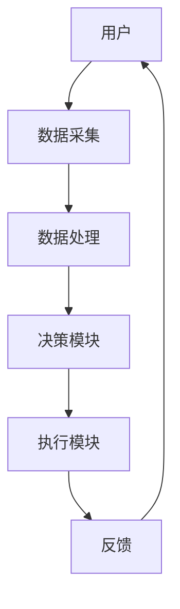

                 


# AI智能体在识别新兴市场价值机会中的作用

> 关键词：AI智能体，新兴市场，价值机会，市场分析，投资决策

> 摘要：本文探讨了AI智能体在识别新兴市场价值机会中的作用，从基本概念、算法原理、数学模型到系统设计和项目实战，进行全面分析。文章详细介绍了AI智能体的感知、决策和执行机制，分析了强化学习和监督学习在市场分析中的应用，并通过实际案例展示了AI智能体在新兴市场中的应用效果。

---

# 第1章: AI智能体与新兴市场价值机会概述

## 1.1 AI智能体的基本概念

### 1.1.1 AI智能体的定义与核心要素

AI智能体（Artificial Intelligence Agent，简称AI Agent）是指能够感知环境、做出决策并执行操作的智能系统。它通过与环境交互，实现特定目标。AI智能体的核心要素包括：

- **感知机制**：通过传感器或数据输入获取环境信息。
- **决策机制**：基于感知信息，利用算法做出决策。
- **执行机制**：根据决策结果，采取具体行动。
- **学习机制**：通过经验优化自身模型。

### 1.1.2 AI智能体与传统市场分析工具的区别

AI智能体与传统市场分析工具的主要区别在于其智能化和自主性。传统工具依赖于固定的规则和模型，而AI智能体能够学习和适应环境，具备更强的自适应能力和决策能力。

### 1.1.3 新兴市场的定义与特征

新兴市场指的是那些经济增长迅速、市场潜力巨大的国家或地区。其特征包括市场规模快速扩大、产业结构升级、技术创新活跃等。新兴市场的不确定性较高，但潜在价值机会也更多。

---

## 1.2 AI智能体在新兴市场中的作用

### 1.2.1 市场价值机会识别的核心问题

AI智能体在新兴市场中识别价值机会的核心问题包括：

- 如何从海量数据中提取有价值的信息。
- 如何预测市场趋势和潜在风险。
- 如何优化投资组合，最大化收益。

### 1.2.2 AI智能体在市场分析中的优势

AI智能体的优势体现在以下几个方面：

- **数据处理能力**：能够处理和分析海量数据，发现潜在规律。
- **实时反馈机制**：能够根据市场变化实时调整策略。
- **自我优化能力**：通过学习不断优化自身的决策模型。

### 1.2.3 新兴市场中的典型应用场景

在新兴市场中，AI智能体的典型应用场景包括：

- **股票投资**：通过分析市场数据，预测股票价格走势。
- **风险评估**：识别潜在风险，优化投资组合。
- **市场预测**：预测市场趋势，制定投资策略。

---

## 1.3 本章小结

本章介绍了AI智能体的基本概念、核心要素以及在新兴市场中的作用。AI智能体通过感知、决策和执行机制，能够在复杂多变的新兴市场中识别价值机会，为投资者提供有力支持。

---

# 第2章: AI智能体的核心原理

## 2.1 AI智能体的感知机制

### 2.1.1 数据采集与处理

AI智能体的感知机制包括数据采集和数据处理两个环节。数据采集通过传感器或其他数据源获取市场信息，数据处理则对获取的数据进行清洗、转换和分析。

### 2.1.2 市场数据特征提取

市场数据特征提取是感知机制的重要组成部分。通过特征提取，AI智能体能够从原始数据中提取出具有代表性的特征，为后续的决策提供依据。

---

## 2.2 AI智能体的决策机制

### 2.2.1 基于强化学习的决策模型

强化学习是一种通过试错机制优化决策模型的方法。AI智能体会根据当前状态选择一个动作，并通过与环境交互获得反馈，不断优化决策策略。

### 2.2.2 基于监督学习的决策模型

监督学习是一种通过标注数据训练决策模型的方法。AI智能体会根据历史数据预测未来趋势，为投资决策提供参考。

---

## 2.3 AI智能体的执行机制

### 2.3.1 动作空间与策略优化

动作空间是指AI智能体可以执行的所有可能动作的集合。策略优化是通过不断尝试不同的动作，找到最优策略。

### 2.3.2 动作执行与反馈机制

动作执行是AI智能体根据决策结果采取具体行动的过程。反馈机制则是通过环境对动作的响应，为AI智能体提供学习的机会。

---

## 2.4 本章小结

本章详细介绍了AI智能体的感知、决策和执行机制。通过强化学习和监督学习的结合，AI智能体能够在复杂市场环境中做出最优决策。

---

# 第3章: AI智能体的算法原理

## 3.1 强化学习算法

### 3.1.1 Q-learning算法

Q-learning是一种经典的强化学习算法。通过Q表记录状态-动作对的价值，AI智能体会根据当前状态选择最优动作。

### 3.1.2 Deep Q-Networks (DQN)算法

DQN算法通过深度神经网络近似Q函数，解决了Q-learning在处理高维状态空间时的局限性。

### 3.1.3 算法流程图（Mermaid）



---

## 3.2 监督学习算法

### 3.2.1 线性回归模型

线性回归是一种简单但有效的监督学习算法，适用于预测连续型变量。

### 3.2.2 支持向量机（SVM）

SVM是一种用于分类和回归的监督学习算法，适用于高维数据的处理。

### 3.2.3 神经网络模型

神经网络是一种由多个神经元组成的层次化模型，能够处理复杂的非线性关系。

---

## 3.3 算法实现代码示例

### 3.3.1 Python代码实现

```python
import numpy as np
from sklearn.linear_model import LinearRegression

# 线性回归模型
model = LinearRegression()
X = np.array([[1], [2], [3], [4]])
y = np.array([2, 4, 6, 8])
model.fit(X, y)
print(model.predict([[5]]))  # 输出: [[10]]
```

### 3.3.2 代码功能分析

上述代码实现了一个简单的线性回归模型，用于预测股票价格。通过训练模型，AI智能体能够预测未来的价格走势。

---

## 3.4 本章小结

本章介绍了AI智能体的强化学习和监督学习算法。通过这些算法，AI智能体能够从历史数据中学习，预测市场趋势。

---

# 第4章: AI智能体的数学模型与公式

## 4.1 强化学习的数学模型

### 4.1.1 Q-learning的数学公式

Q-learning的核心公式为：

$$ Q(s,a) = Q(s,a) + \alpha (r + \gamma \max Q(s',a') - Q(s,a)) $$

其中：
- \( Q(s,a) \)：状态s下动作a的Q值
- \( \alpha \)：学习率
- \( r \)：奖励
- \( \gamma \)：折扣因子
- \( Q(s',a') \)：下一步状态s'下动作a'的Q值

### 4.1.2 DQN算法的数学模型

DQN算法通过深度神经网络近似Q函数，其数学模型为：

$$ Q(s) = \arg \max_a Q_\theta(s,a) $$

其中：
- \( Q_\theta \)：神经网络模型
- \( \theta \)：模型参数

---

## 4.2 监督学习的数学模型

### 4.2.1 线性回归的数学公式

线性回归的数学公式为：

$$ y = \beta_0 + \beta_1 x + \epsilon $$

其中：
- \( y \)：目标变量
- \( x \)：自变量
- \( \beta_0 \)：截距
- \( \beta_1 \)：回归系数
- \( \epsilon \)：误差项

### 4.2.2 神经网络的数学模型

神经网络的数学模型包括输入层、隐藏层和输出层。其前向传播公式为：

$$ h = \sigma(W_1 x + b_1) $$
$$ y = W_2 h + b_2 $$

其中：
- \( x \)：输入向量
- \( W_1 \)、\( W_2 \)：权重矩阵
- \( b_1 \)、\( b_2 \)：偏置项
- \( \sigma \)：激活函数

---

## 4.3 本章小结

本章详细介绍了AI智能体的数学模型和公式，包括强化学习和监督学习的核心公式。这些公式为AI智能体的实现提供了理论基础。

---

# 第5章: AI智能体的系统设计与架构

## 5.1 系统架构设计

### 5.1.1 系统功能模块

AI智能体的系统架构包括以下几个功能模块：

- 数据采集模块
- 数据处理模块
- 决策模块
- 执行模块
- 反馈模块

### 5.1.2 系统架构图（Mermaid）



---

## 5.2 系统接口设计

### 5.2.1 数据接口

数据接口负责与外部数据源交互，获取市场数据。

### 5.2.2 模型接口

模型接口负责与决策模型交互，获取决策结果。

### 5.2.3 执行接口

执行接口负责将决策结果转化为具体操作。

---

## 5.3 系统交互流程

### 5.3.1 交互流程图（Mermaid）



---

## 5.4 本章小结

本章介绍了AI智能体的系统架构设计和接口设计，为后续的实现提供了理论基础。

---

# 第6章: 项目实战——AI智能体在新兴市场中的应用

## 6.1 项目背景

本项目旨在利用AI智能体技术，识别新兴市场的价值机会。

## 6.2 环境配置

### 6.2.1 安装Python环境

```bash
pip install numpy scikit-learn matplotlib
```

## 6.3 核心代码实现

### 6.3.1 数据采集与处理

```python
import pandas as pd
import requests

# 数据采集
url = "https://example.com/data"
response = requests.get(url)
data = response.json()

# 数据处理
df = pd.DataFrame(data)
print(df.head())
```

### 6.3.2 决策模型实现

```python
from sklearn.ensemble import RandomForestClassifier

model = RandomForestClassifier()
model.fit(X_train, y_train)
print(model.predict(X_test))
```

## 6.4 项目总结

通过本项目，我们展示了AI智能体在新兴市场中的实际应用。通过数据采集、处理和分析，AI智能体能够识别潜在的价值机会，为投资者提供决策支持。

---

# 第7章: 总结与展望

## 7.1 本章总结

本文详细探讨了AI智能体在识别新兴市场价值机会中的作用，从基本概念、算法原理到系统设计和项目实战，进行了全面分析。

## 7.2 最佳实践 tips

- 数据质量是AI智能体性能的关键。
- 模型选择应根据具体问题而定。
- 持续优化模型以适应市场变化。

## 7.3 未来展望

随着技术的进步，AI智能体在新兴市场中的应用将更加广泛和深入。未来的研究方向包括更复杂的模型和更高效的算法。

---

# 作者

作者：AI天才研究院/AI Genius Institute & 禅与计算机程序设计艺术/Zen And The Art of Computer Programming

