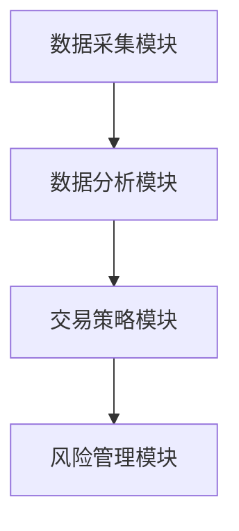
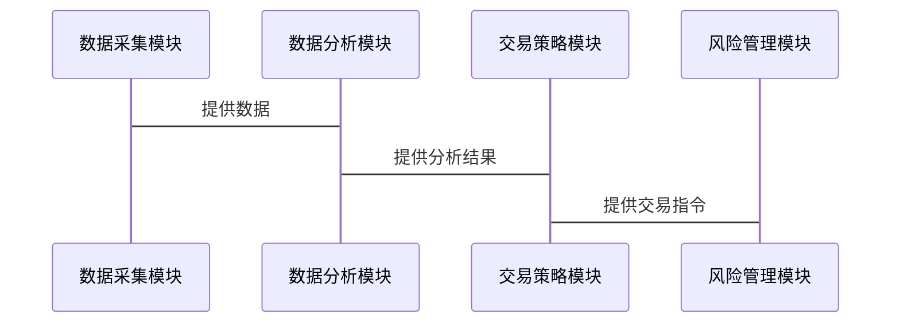

                 


# AI智能体如何识别并利用市场错误定价

> 关键词：AI智能体、市场错误定价、机器学习、算法交易、金融市场

> 摘要：本文详细探讨了AI智能体在识别和利用市场错误定价中的应用。通过分析市场错误定价的定义、原因及类型，结合机器学习算法和系统架构设计，展示了AI智能体如何通过识别定价错误并制定有效的交易策略来实现利润最大化。本文还提供了实际案例分析和代码实现，帮助读者全面理解AI智能体在金融市场中的潜力与应用。

---

## 第1章: AI智能体与市场错误定价的背景

### 1.1 市场错误定价的定义与特征

#### 1.1.1 市场错误定价的定义
市场错误定价是指资产的实际价值与其市场价格之间存在显著偏离的情况。这种偏离可能是由于市场参与者的信息不对称、情绪波动或市场机制的不完善等因素造成的。

#### 1.1.2 市场错误定价的常见类型
市场错误定价可以分为以下几种类型：
- **短期错误定价**：由于市场短期波动或参与者情绪变化导致的价格偏差。
- **结构性错误定价**：由于市场结构或制度缺陷导致的价格偏差。
- **信息不对称错误定价**：由于部分市场参与者掌握更多信息而引起的定价偏差。

#### 1.1.3 错误定价的形成原因与影响
错误定价的形成原因包括信息不对称、市场参与者情绪波动、市场机制不完善等。错误定价对市场参与者的影响包括套利机会、交易策略优化等。

### 1.2 AI智能体的定义与核心能力

#### 1.2.1 AI智能体的基本概念
AI智能体是一种能够感知环境、做出决策并执行操作的智能系统。它具备自主性、反应性、目标导向和学习能力等特征。

#### 1.2.2 AI智能体的核心能力与特征
AI智能体的核心能力包括数据处理能力、学习能力、决策能力和执行能力。其特征包括实时性、适应性和高效性。

#### 1.2.3 AI智能体在金融市场的应用潜力
AI智能体在金融市场中的应用潜力主要体现在价格预测、风险管理和交易策略优化等方面。

### 1.3 AI智能体识别市场错误定价的必要性

#### 1.3.1 传统定价机制的局限性
传统定价机制依赖于市场参与者的主观判断，容易受到情绪和信息不对称的影响。

#### 1.3.2 AI智能体在定价中的优势
AI智能体能够快速处理大量数据，识别定价错误，并制定相应的交易策略。

#### 1.3.3 市场错误定价的识别需求
识别市场错误定价有助于优化资源配置，提高市场效率，并为投资者创造利润。

---

## 第2章: 市场错误定价的识别与分析

### 2.1 市场错误定价的识别方法

#### 2.1.1 基于价格波动的识别方法
通过分析价格波动，识别异常波动可能表明市场错误定价。

#### 2.1.2 基于市场数据的异常检测
利用统计方法或机器学习算法检测市场数据中的异常点。

#### 2.1.3 基于机器学习的错误定价识别
使用监督学习或非监督学习算法识别定价错误。

### 2.2 错误定价的特征分析

#### 2.2.1 价格与价值的偏离分析
通过比较市场价格与内在价值，识别定价错误。

#### 2.2.2 市场参与者行为对定价的影响
分析市场参与者行为，如情绪波动，对定价的影响。

#### 2.2.3 市场结构与错误定价的关系
研究市场结构对错误定价的影响，如流动性不足可能导致错误定价。

### 2.3 错误定价的分类与案例

#### 2.3.1 按市场类型分类
- 股票市场
- 债券市场
- 外汇市场

#### 2.3.2 按资产类别分类
- 股票
- 债券
- 期货

#### 2.3.3 典型案例分析
分析一些典型的市场错误定价案例，如股灾、闪崩等事件。

---

## 第3章: AI智能体识别市场错误定价的核心算法

### 3.1 基于机器学习的错误定价识别算法

#### 3.1.1 监督学习算法
- 线性回归
- 支持向量机
- 随机森林

#### 3.1.2 非监督学习算法
- K-means聚类
- DBSCAN聚类

#### 3.1.3 强化学习算法
- Q-learning
- Deep Q-Networks

### 3.2 算法选择与优化

#### 3.2.1 算法选择的依据
根据数据特征和问题类型选择合适的算法。

#### 3.2.2 算法优化策略
- 参数调优
- 特征选择
- 模型集成

#### 3.2.3 算法性能评估
通过准确率、召回率、F1分数等指标评估算法性能。

### 3.3 错误定价识别的数学模型

#### 3.3.1 线性回归模型
$$ y = \beta_0 + \beta_1x + \epsilon $$

#### 3.3.2 时间序列分析模型
$$ ARIMA(p, d, q) $$

#### 3.3.3 支持向量机模型
$$ SVC $$

---

## 第4章: AI智能体利用市场错误定价的策略

### 4.1 错误定价的利用策略

#### 4.1.1 基于错误定价的套利策略
通过识别定价错误，制定套利策略。

#### 4.1.2 基于错误定价的交易策略
根据定价错误，制定买卖策略。

#### 4.1.3 基于错误定价的风险管理策略
通过识别定价错误，优化风险管理。

### 4.2 策略实现的关键步骤

#### 4.2.1 数据收集与预处理
收集市场数据，清洗和特征提取。

#### 4.2.2 策略模型的设计与实现
设计并实现基于机器学习的交易策略模型。

#### 4.2.3 策略的测试与优化
通过回测和优化，提升策略的盈利能力。

### 4.3 策略的数学模型与实现

#### 4.3.1 套利模型的数学表达
$$ \text{套利收益} = \text{预期价格} - \text{当前价格} $$

#### 4.3.2 交易策略的数学优化
使用优化算法，如遗传算法，优化交易策略。

#### 4.3.3 风险管理模型的实现
通过VaR模型等方法，实现风险管理。

---

## 第5章: 系统架构与实现方案

### 5.1 系统架构设计

#### 5.1.1 系统功能设计
- 数据采集模块
- 数据分析模块
- 交易策略模块
- 风险管理模块

#### 5.1.2 系统架构图


#### 5.1.3 系统交互设计


### 5.2 项目实战

#### 5.2.1 环境安装
安装必要的库，如Python、NumPy、Pandas、Scikit-learn、TensorFlow等。

#### 5.2.2 系统核心实现源代码
```python
import numpy as np
from sklearn.linear_model import LinearRegression

# 示例代码：基于线性回归的错误定价识别
def identify_price_anomalies(prices):
    model = LinearRegression()
    model.fit(np.arange(len(prices)).reshape(-1, 1), prices)
    predicted_prices = model.predict(np.arange(len(prices)).reshape(-1, 1))
    anomalies = np.where(abs(predicted_prices - prices) > 0.1, True, False)
    return anomalies

prices = np.array([100, 105, 110, 108, 115])
anomalies = identify_price_anomalies(prices)
print(anomalies)
```

#### 5.2.3 代码应用解读与分析
通过代码实现错误定价识别，分析哪些价格点存在异常。

#### 5.2.4 案例分析
分析一个具体案例，展示如何通过AI智能体识别并利用市场错误定价。

#### 5.2.5 项目小结
总结项目实现的关键点和经验教训。

---

## 第6章: 总结与展望

### 6.1 本章总结
总结本文的主要内容，强调AI智能体在识别和利用市场错误定价中的潜力。

### 6.2 展望
展望未来的发展方向，如更复杂的算法、多市场应用等。

### 6.3 最佳实践 tips
- 注意市场风险
- 确保数据质量
- 遵守法律法规

### 6.4 小结
重申AI智能体在金融市场中的重要性。

---

## 作者：AI天才研究院/AI Genius Institute & 禅与计算机程序设计艺术 /Zen And The Art of Computer Programming

---

通过以上内容，本文全面探讨了AI智能体如何识别并利用市场错误定价，从理论到实践，为读者提供了深入的分析和实用的指导。

