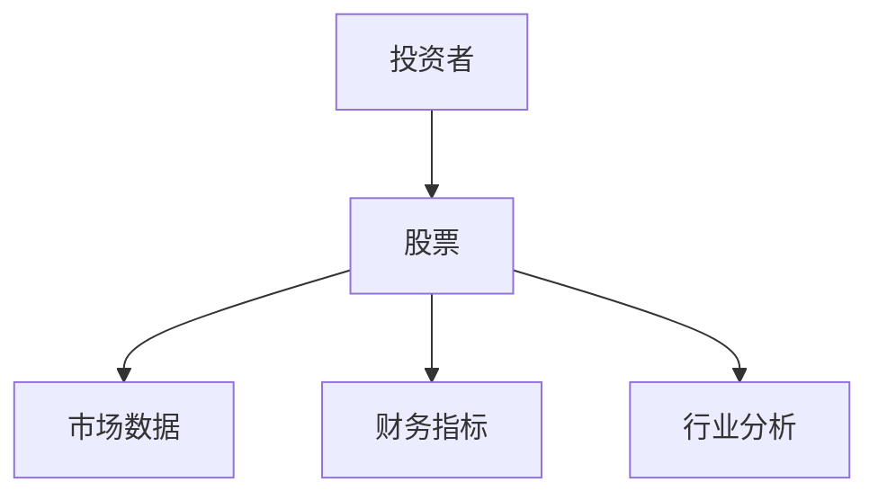
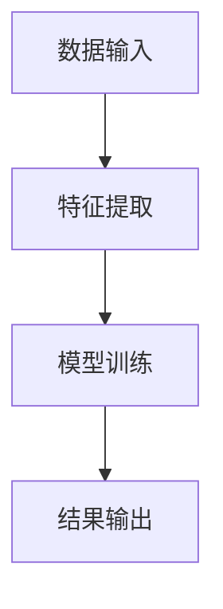
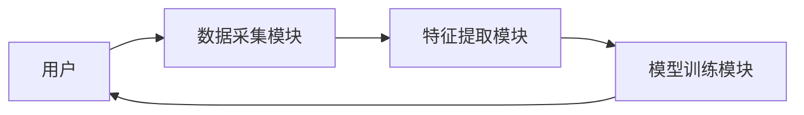

                 


# AI智能体如何识别被低估的价值股

## 关键词：AI智能体、价值股识别、深度学习、金融数据分析、股票投资策略

## 摘要：  
本文深入探讨了AI智能体在识别被低估的价值股中的应用。通过分析价值股的定义、特征以及AI智能体的核心原理，结合深度学习算法和系统架构设计，展示了如何利用AI技术提升价值股识别的准确性和效率。文章内容涵盖背景介绍、核心概念、算法原理、系统设计、项目实战等多个方面，为读者提供了一个全面的技术视角。

---

# 第1章: AI智能体与价值股概述

## 1.1 AI智能体的基本概念  
### 1.1.1 AI智能体的定义与特点  
AI智能体是一种能够感知环境、执行目标决策并采取行动的智能系统。它具有学习能力、自适应性和自主性，能够在复杂环境中优化决策过程。  

### 1.1.2 AI智能体的核心要素  
- **感知能力**：通过数据输入（如市场数据、财务指标）获取信息。  
- **决策能力**：基于数据和模型进行分析，生成投资策略。  
- **行动能力**：根据决策结果执行交易操作或提供投资建议。  

### 1.1.3 AI智能体与传统投资工具的对比  
AI智能体的优势在于其高效性、准确性和自动化能力，能够处理海量数据并快速生成决策结果，而传统工具往往依赖人工分析，效率较低且易受主观因素影响。

---

## 1.2 价值股的定义与特征  
### 1.2.1 价值股的基本定义  
价值股是指市场价格低于其内在价值的股票，通常具有较高的分红率和较低的市盈率。  

### 1.2.2 价值股的关键特征  
- **低市盈率（P/E ratio）**：市盈率低于行业平均水平。  
- **高股息率（Dividend Yield）**：股息收益率较高。  
- **低市净率（P/B ratio）**：净资产价值与市场价格之比低于行业平均水平。  
- **行业地位稳定**：公司通常处于成熟行业，市场占有率高。  

### 1.2.3 价值股的市场周期性  
价值股的表现与市场周期密切相关。在市场低迷期，价值股通常被低估，而在市场繁荣期，价值股可能被高估或回归合理价值。

---

## 1.3 被低估的价值股的识别意义  
### 1.3.1 价值股识别的经济意义  
识别被低估的价值股有助于投资者发现市场中的潜在投资机会，实现超额收益。  

### 1.3.2 被低估价值股的投资机会  
被低估的价值股通常具有较高的上涨潜力，尤其是在市场复苏或行业景气周期中。  

### 1.3.3 AI在价值股识别中的优势  
AI智能体能够通过大数据分析和深度学习，快速识别出那些被市场忽视的潜在价值股，帮助投资者捕捉投资机会。

---

## 1.4 本章小结  
本章介绍了AI智能体的基本概念和价值股的定义与特征，重点分析了AI在识别被低估的价值股中的优势和意义，为后续章节的分析奠定了基础。

---

# 第2章: 价值股识别的核心概念与联系

## 2.1 核心概念原理  
### 2.1.1 价值股识别的数学模型  
价值股识别可以通过回归分析、聚类分析等数学模型实现。例如，利用线性回归模型预测股票的内在价值，并与市场价格进行对比。  

### 2.1.2 AI智能体的特征提取机制  
AI智能体通过自然语言处理（NLP）和时间序列分析等技术，从海量数据中提取与价值股相关的特征。  

### 2.1.3 价值股识别的逻辑框架  
价值股识别的逻辑框架包括数据采集、特征提取、模型训练和结果分析四个阶段。  

---

## 2.2 核心概念属性特征对比表  
以下是价值股与成长股的特征对比：

| 特征维度 | 价值股 | 成长股 |
|----------|--------|--------|
| 市盈率    | 低     | 高     |
| 股息率    | 高     | 低     |
| 市净率    | 低     | 高     |
| 盈利能力  | 稳定   | 快速增长 |
| 风险水平   | 较低   | 较高   |

---

## 2.3 ER实体关系图  
以下是价值股识别的实体关系图：



---

## 2.4 本章小结  
本章通过对比分析，明确了价值股的核心特征及其与成长股的区别，为后续章节的算法设计和系统实现提供了理论基础。

---

# 第3章: AI智能体识别价值股的算法原理

## 3.1 算法原理概述  
### 3.1.1 基于深度学习的特征提取  
深度学习模型（如LSTM和CNN）能够从时间序列数据和文本数据中提取复杂的特征。  

### 3.1.2 基于规则的特征筛选  
通过预设的财务指标和市场指标，筛选出符合条件的股票。  

### 3.1.3 综合分析模型  
将深度学习模型和规则筛选相结合，构建综合分析模型，提高识别准确率。  

---

## 3.2 算法流程图  
以下是算法的流程图：



---

## 3.3 算法数学模型  
### 3.3.1 线性回归模型  
$$ y = \beta_0 + \beta_1x + \epsilon $$  
其中，$y$是目标变量（股票价值），$x$是自变量（财务指标），$\beta_0$和$\beta_1$是模型参数。  

### 3.3.2 神经网络模型  
以下是神经网络模型的结构图：


---

## 3.4 本章小结  
本章详细介绍了AI智能体识别价值股的算法原理，包括特征提取、模型训练和结果输出的流程，为后续章节的系统设计奠定了基础。

---

# 第4章: 价值股识别的系统分析与架构设计

## 4.1 系统功能设计  
### 4.1.1 数据采集模块  
通过API接口获取市场数据、财务数据和行业报告。  

### 4.1.2 特征提取模块  
基于NLP和时间序列分析提取股票特征。  

### 4.1.3 模型训练模块  
利用深度学习模型训练价值股识别模型。  

### 4.1.4 结果输出模块  
将识别结果输出为投资建议或信号。  

---

## 4.2 系统架构设计  
以下是系统的架构图：


---

## 4.3 系统接口设计  
### 4.3.1 数据接口  
- 输入接口：市场数据、财务数据。  
- 输出接口：识别结果、投资建议。  

### 4.3.2 用户接口  
- 输入接口：用户输入投资目标。  
- 输出接口：投资建议、识别结果。  

---

## 4.4 系统交互流程图  
以下是系统的交互流程图：



---

## 4.5 本章小结  
本章详细描述了价值股识别系统的功能设计、架构设计和交互流程，为后续章节的系统实现提供了指导。

---

# 第5章: 项目实战——AI智能体识别被低估的价值股

## 5.1 环境安装  
- 安装Python、TensorFlow、Keras、Pandas、NumPy等工具。  

## 5.2 核心代码实现  
以下是核心代码示例：

```python
import numpy as np
import pandas as pd
from sklearn.metrics import accuracy_score
from tensorflow.keras.models import Sequential
from tensorflow.keras.layers import LSTM, Dense, Dropout

# 数据加载
data = pd.read_csv('stock_data.csv')

# 特征提取
features = data[['PE', 'PB', 'ROE', 'Dividend_Yield']]
labels = data['Undervalued']  # 1表示被低估，0表示未被低估

# 数据预处理
from sklearn.model_selection import train_test_split
X_train, X_test, y_train, y_test = train_test_split(features, labels, test_size=0.2)

# 模型训练
model = Sequential()
model.add(LSTM(64, input_shape=(features.shape[1], 1), return_sequences=False))
model.add(Dropout(0.2))
model.add(Dense(1, activation='sigmoid'))
model.compile(loss='binary_crossentropy', optimizer='adam', metrics=['accuracy'])

model.fit(X_train, y_train, epochs=10, batch_size=32, validation_data=(X_test, y_test))

# 模型评估
y_pred = model.predict(X_test)
print('准确率:', accuracy_score(y_test, np.round(y_pred)))
```

---

## 5.3 代码解读与分析  
- **数据加载**：从CSV文件中加载股票数据。  
- **特征提取**：提取市盈率（PE）、市净率（PB）、净资产收益率（ROE）和股息率（Dividend_Yield）等特征。  
- **模型训练**：使用LSTM网络训练分类模型，识别被低估的股票。  
- **模型评估**：计算模型的准确率，评估模型性能。  

---

## 5.4 案例分析  
假设我们有以下两支股票：  

| 股票代码 | 市盈率 | 市净率 | 净资产收益率 | 股息率 | 被低估（标签） |
|----------|--------|--------|--------------|---------|--------------|
| A        | 10     | 1.5    | 15%          | 5%      | 1            |
| B        | 20     | 2.0    | 10%          | 3%      | 0            |

通过模型训练，AI智能体能够识别出股票A是被低估的价值股，而股票B则未被低估。

---

## 5.5 本章小结  
本章通过实际案例展示了AI智能体识别被低估的价值股的全过程，包括环境安装、代码实现和案例分析，帮助读者更好地理解理论知识。

---

# 第6章: 总结与展望

## 6.1 本章小结  
本文详细探讨了AI智能体识别被低估的价值股的方法和流程，从理论到实践，全面分析了AI在金融领域的应用潜力。  

## 6.2 投资注意事项  
- **数据质量**：确保数据来源可靠，避免因数据错误导致误判。  
- **模型优化**：定期更新模型，适应市场变化。  
- **风险管理**：结合多种指标进行综合分析，降低投资风险。  

## 6.3 最佳实践  
- **数据清洗**：对数据进行预处理，剔除异常值。  
- **模型调参**：通过网格搜索优化模型参数。  
- **多模型对比**：对比不同算法的性能，选择最优模型。  

## 6.4 未来展望  
随着AI技术的不断发展，价值股识别的准确性和效率将进一步提升。未来的研究方向包括多模态数据融合、实时交易策略优化以及个性化投资组合管理。

---

# 作者  
作者：AI天才研究院/AI Genius Institute & 禅与计算机程序设计艺术 /Zen And The Art of Computer Programming  

---

通过本文的详细分析，读者可以深入了解AI智能体在识别被低估的价值股中的应用，掌握从理论到实践的完整流程，为未来的投资决策提供有力支持。

