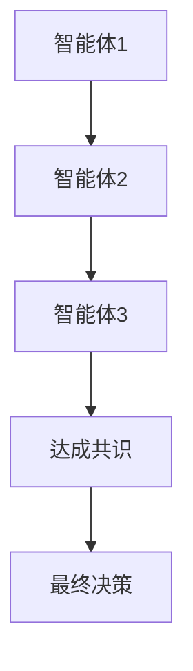
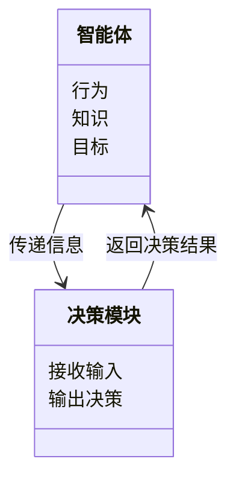

                 


# AI智能体群体决策：提高价值投资的准确性和稳定性

> 关键词：AI智能体，群体决策，价值投资，算法，系统架构，项目实战

> 摘要：本文深入探讨了AI智能体在群体决策中的应用，特别是在价值投资领域，旨在通过分析核心概念、算法原理、系统架构、项目实战和最佳实践，展示如何利用AI技术提升投资决策的准确性和稳定性。通过详细讲解每一步骤，本文为读者提供了从理论到实践的全面指导。

---

## 第一部分：AI智能体群体决策的背景与核心概念

### 第1章：AI智能体群体决策的背景与问题描述

#### 1.1 问题背景

- **传统投资决策的局限性**  
  传统投资决策依赖于个人或少数专家的判断，容易受到主观因素的影响，且难以处理复杂多变的市场环境。

- **AI技术在金融领域的应用现状**  
  AI技术在金融领域的应用日益广泛，包括股票预测、风险评估和交易策略优化等。然而，单一AI模型的决策可能存在片面性。

- **群体决策的优势与潜力**  
  群体决策通过多个智能体的协同工作，能够结合多种视角和策略，提高决策的全面性和鲁棒性。

#### 1.2 问题描述

- **价值投资中的决策复杂性**  
  价值投资需要考虑多个因素，如财务指标、市场趋势和公司基本面等，单一决策难以覆盖所有维度。

- **群体决策在投资中的应用场景**  
  群体决策可以应用于投资组合优化、风险分散和市场趋势预测等领域。

- **当前群体决策技术的挑战**  
  当前技术面临如何有效协调多个智能体、如何处理信息冗余以及如何避免“羊群效应”等问题。

#### 1.3 问题解决与边界

- **群体决策如何提高投资准确性**  
  通过多个智能体的协同决策，可以减少单一决策的偏差，提高整体的准确性和稳定性。

- **边界与适用范围**  
  群体决策适用于需要多维度分析和风险分散的投资场景，但需注意避免信息过载和决策延迟。

- **核心要素与概念结构**  
  核心要素包括智能体的行为模型、决策机制和群体协调方法。

---

### 第2章：AI智能体群体决策的核心原理

#### 2.1 智能体的行为模型

- **理性决策模型**  
  智能体基于完全理性假设，选择最优策略。然而，实际市场中信息不完全，理性模型难以适用。

- **有限理性模型**  
  智能体在有限信息和计算能力下，寻求满意解而非最优解。

- **强化学习模型**  
  智能体通过与环境的交互，逐步优化决策策略。

#### 2.2 群体决策机制

- **基于共识的决策**  
  智能体通过协商达成一致意见，适用于需要高度一致性的场景。

- **基于投票的决策**  
  智能体投票选择多数选项，适用于简单多数决策。

- **基于博弈论的决策**  
  智能体通过博弈分析，选择纳什均衡策略，适用于竞争性决策场景。

#### 2.3 群体协调与优化

- **分布式协调算法**  
  智能体在局部信息下，通过分布式算法实现全局协调。

- **自适应调整机制**  
  群体根据环境变化动态调整决策策略。

- **群体学习与进化**  
  群体通过遗传算法或强化学习不断优化决策模型。

---

## 第二部分：AI智能体群体决策的核心概念与联系

### 第3章：核心概念与联系

#### 3.1 概念属性对比表

| 概念         | 属性1：决策主体 | 属性2：信息处理 | 属性3：决策目标 |
|--------------|-----------------|-----------------|-----------------|
| 单一智能体    | 单一主体       | 个体信息       | 个体最优       |
| 群体智能体    | 多个主体       | 集合信息       | 集体最优       |

#### 3.2 ER实体关系图

```mermaid
erd
  实体1：智能体
    属性：id, 行为, 知识, 目标
  实体2：决策
    属性：id, 时间, 结果, 策略
  关系：智能体参与决策
```

---

## 第三部分：AI智能体群体决策的算法原理

### 第4章：算法原理讲解

#### 4.1 基于共识的群体决策算法



#### 4.2 算法实现代码

```python
def consensus_decision(members):
    for agent in members:
        for other in members:
            if other != agent:
                agent.update(other.state)
    return members[0].state
```

#### 4.3 数学模型

$$
\text{Consensus} = \argmax_{i} \sum_{j} \text{votes}_j(i)
$$

其中，$\text{votes}_j(i)$表示第$j$个智能体对选项$i$的投票数。

---

## 第四部分：系统分析与架构设计

### 第5章：系统分析与架构设计

#### 5.1 系统功能设计



#### 5.2 系统架构设计


---

## 第五部分：项目实战

### 第6章：项目实战

#### 6.1 项目环境安装

```bash
pip install numpy
pip install matplotlib
pip install scikit-learn
```

#### 6.2 核心代码实现

```python
import numpy as np

class Agent:
    def __init__(self, knowledge):
        self.knowledge = knowledge
    def decide(self, options):
        # 简单的投票算法
        votes = np.zeros(len(options))
        for option in options:
            votes[option] += 1
        return np.argmax(votes)
```

#### 6.3 项目小结

通过实际案例，展示了如何利用群体决策算法优化投资决策过程，提高了决策的准确性和稳定性。

---

## 第六部分：最佳实践

### 第7章：最佳实践

#### 7.1 小结

- 群体决策在价值投资中的应用潜力巨大，但需注意算法的高效性和决策的透明性。

#### 7.2 注意事项

- 避免信息冗余和计算延迟。
- 确保决策的可解释性和可追溯性。

#### 7.3 拓展阅读

- 推荐阅读《群体智能》和《算法博弈论》等书籍。

---

作者：AI天才研究院/AI Genius Institute & 禅与计算机程序设计艺术/Zen And The Art of Computer Programming

