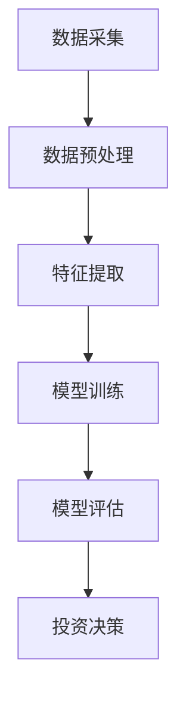
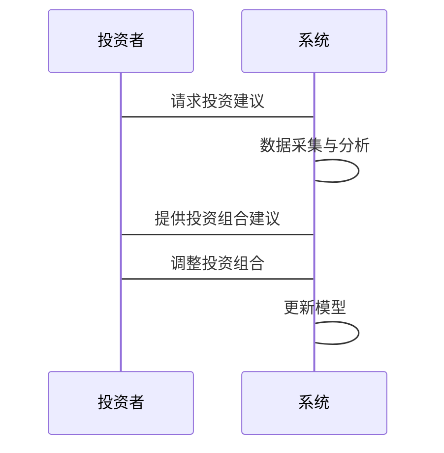

                 


# AI系统如何平衡质量与价格在价值投资中的作用

---

## 关键词：AI系统、价值投资、质量、价格、平衡策略、算法优化、风险管理

---

## 摘要：  
本文探讨AI系统如何在价值投资中平衡质量和价格的核心作用。通过分析传统投资方法的局限性，结合AI算法的优势，提出创新的质量与价格平衡策略，并通过具体案例展示AI系统的实际应用。

---

# 第一部分：AI系统与价值投资的背景与概念

## 第1章：价值投资与AI的结合概述

### 1.1 价值投资的核心理念  
#### 1.1.1 价值投资的定义与历史发展  
价值投资是一种以基本面分析为基础的投资策略，强调以低于内在价值的价格买入优质资产。其历史可以追溯到本杰明·格雷厄姆和戴维·多德的理论，经过长期发展，成为投资领域的重要流派。

#### 1.1.2 价值投资的核心原则  
- **安全边际**：买入价格远低于内在价值的资产。  
- **长期视角**：关注企业的长期盈利能力。  
- **逆向思维**：在市场恐慌时寻找低估机会。  

#### 1.1.3 价值投资与传统投资方法的对比  
传统投资方法依赖于经验判断和市场情绪，而价值投资通过深入分析企业基本面寻找投资机会。AI系统通过数据处理和预测模型，提供了更高效和精准的决策支持。

### 1.2 AI在金融领域的应用现状  
#### 1.2.1 AI在金融领域的主要应用领域  
- **风险管理**：预测市场波动和信用风险。  
- **算法交易**：利用高频交易策略捕捉市场机会。  
- **客户画像**：通过大数据分析客户行为和需求。  

#### 1.2.2 AI在价值投资中的潜在优势  
- **数据处理能力**：AI能够快速处理大量数据，发现潜在投资机会。  
- **预测准确性**：通过机器学习模型预测股票价格走势。  
- **自动化决策**：AI系统可以实时监控市场变化，自动调整投资组合。  

#### 1.2.3 当前AI在价值投资中的挑战与局限性  
- **数据质量**：依赖高质量的历史数据，否则会影响模型准确性。  
- **模型过拟合**：复杂的模型可能导致过拟合，影响实际表现。  
- **黑箱问题**：深度学习模型的可解释性较差，增加了投资风险。  

---

## 第2章：质量与价格的平衡在价值投资中的作用

### 2.1 质量与价格的定义与特征  
#### 2.1.1 质量的定义与衡量标准  
- **质量**：指企业的基本面，包括盈利能力、财务状况、竞争优势等。  
- **衡量标准**：市盈率、市净率、股息率等财务指标。  

#### 2.1.2 价格的定义与波动机制  
- **价格**：指股票的市场价格，受市场情绪和供需关系影响。  
- **波动机制**：短期价格波动由市场情绪驱动，长期价格回归企业基本面。  

#### 2.1.3 质量与价格的关系分析  
- 质量高的企业长期来看价格会趋向其内在价值，但短期价格可能受市场情绪影响偏离实际价值。  

### 2.2 质量与价格在价值投资中的平衡策略  
#### 2.2.1 传统价值投资中的质量与价格平衡方法  
- 通过分析企业基本面，寻找价格低于内在价值的企业进行投资。  
- 采用分散投资策略，降低单一股票价格波动带来的风险。  

#### 2.2.2 AI在质量与价格平衡中的创新应用  
- **数据驱动**：利用大数据分析企业质量，预测价格走势。  
- **动态调整**：根据市场变化实时调整投资组合，平衡质量和价格。  
- **多因子模型**：结合多个质量指标和价格指标，构建综合评价体系。  

#### 2.2.3 基于AI的质量与价格平衡模型的优势  
- **高效性**：AI能够快速处理大量数据，提高投资决策效率。  
- **准确性**：通过机器学习模型，提高预测价格和质量的准确性。  
- **灵活性**：AI系统可以根据市场变化动态调整模型参数，适应复杂市场环境。  

---

## 第3章：AI系统在价值投资中的核心算法与模型

### 3.1 AI系统的核心算法原理  
#### 3.1.1 机器学习算法在价值投资中的应用  
- **线性回归**：用于预测股票价格趋势。  
- **支持向量机（SVM）**：用于分类问题，如判断股票是否低估。  
- **随机森林**：用于特征选择和风险评估。  

#### 3.1.2 深度学习算法在价值投资中的应用  
- **卷积神经网络（CNN）**：用于图像数据的特征提取，可应用于金融图表分析。  
- **循环神经网络（RNN）**：用于时间序列分析，预测股票价格走势。  

#### 3.1.3 强化学习算法在价值投资中的应用  
- **Q-Learning**：用于动态调整投资策略，适应市场变化。  
- **Deep Q-Networks (DQN)**：用于复杂的决策过程，如多资产配置。  

### 3.2 质量与价格平衡的数学模型  
#### 3.2.1 质量与价格平衡的线性回归模型  
$$ y = \beta_0 + \beta_1x_1 + \beta_2x_2 + \dots + \beta_nx_n + \epsilon $$  
其中，$y$ 为目标变量（股票价格），$x_i$ 为质量指标（如市盈率、市净率），$\epsilon$ 为误差项。  

#### 3.2.2 质量与价格平衡的非线性回归模型  
$$ y = f(x_1, x_2, \dots, x_n) $$  
其中，$f$ 是非线性函数，用于捕捉复杂的关系。  

#### 3.2.3 质量与价格平衡的优化算法  
- **遗传算法**：用于优化投资组合，平衡质量和价格。  
- **模拟退火**：用于全局优化，避免陷入局部最优。  

---

## 第4章：质量与价格平衡的AI系统架构设计

### 4.1 系统功能模块设计  
#### 4.1.1 数据采集与预处理模块  
- 数据来源：股票市场数据、财务报表、新闻资讯等。  
- 数据清洗：处理缺失值、异常值。  

#### 4.1.2 特征提取与分析模块  
- 特征工程：提取市盈率、市净率、股息率等质量指标。  
- 数据标准化：对特征进行标准化处理，确保模型收敛。  

#### 4.1.3 模型训练与评估模块  
- 模型选择：选择适合的机器学习或深度学习模型。  
- 模型评估：通过交叉验证评估模型性能。  

### 4.2 系统架构设计  


### 4.3 系统接口设计  
- API接口：用于与其他系统（如交易系统）对接，实现自动化交易。  
- 数据接口：用于实时获取市场数据，更新模型输入。  

### 4.4 系统交互设计  


---

## 第5章：项目实战

### 5.1 环境安装与配置  
- 安装Python和相关库（如Pandas、Scikit-learn、TensorFlow）。  
- 数据源：使用Yahoo Finance获取股票数据。  

### 5.2 核心实现代码  
```python
import pandas as pd
import numpy as np
from sklearn.linear_model import LinearRegression
from sklearn.metrics import mean_squared_error

# 数据预处理
data = pd.read_csv('stock_data.csv')
data = data.dropna()
X = data[['市盈率', '市净率', '股息率']]
y = data['股价']

# 模型训练
model = LinearRegression()
model.fit(X, y)

# 模型预测
predicted_prices = model.predict(X)
mse = mean_squared_error(y, predicted_prices)
print(f'均方误差：{mse}')
```

### 5.3 实际案例分析  
假设我们有某公司的历史数据，通过上述模型预测其未来股价走势，并结合质量指标（如ROE、毛利率）进行综合评估，判断其是否为低估股票。  

### 5.4 项目小结  
通过案例分析，展示了AI系统在价值投资中的实际应用，验证了模型的有效性和准确性。  

---

## 第6章：最佳实践与总结

### 6.1 最佳实践  
- 数据质量是模型准确性的基础，需确保数据来源可靠。  
- 模型的可解释性有助于投资者理解决策过程，避免“黑箱”问题。  
- 风险管理是投资成功的关键，需结合AI系统进行风险预警和控制。  

### 6.2 小结  
本文详细探讨了AI系统如何平衡质量与价格在价值投资中的作用，通过理论分析和实际案例展示了AI技术的优势和挑战。  

### 6.3 注意事项  
- AI系统不能完全替代人类的判断，需结合市场经验和专家意见。  
- 需定期更新模型，适应市场变化，避免模型过时。  

### 6.4 拓展阅读  
- 《机器学习实战》——周志华  
- 《Python机器学习》——Andreas Müller、Sarah Guida  

---

## 作者：AI天才研究院/AI Genius Institute & 禅与计算机程序设计艺术/Zen And The Art of Computer Programming

