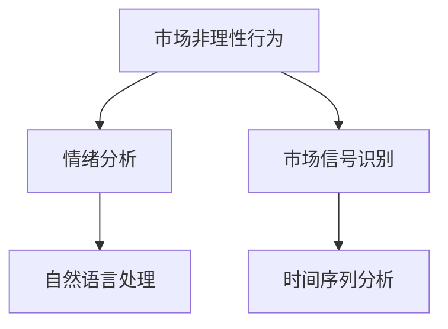
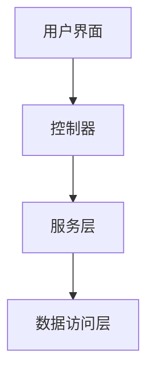
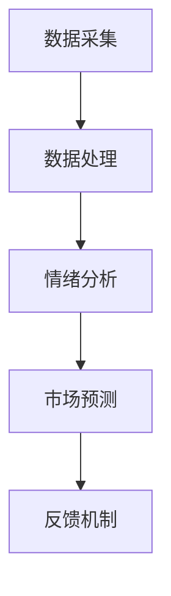

                 

# AI系统如何识别并利用市场非理性行为

**关键词：** AI, 市场非理性行为, 情绪分析, 时间序列分析, 市场预测, 系统架构

**摘要：**  
本文详细探讨了AI系统如何识别和利用市场中的非理性行为。通过分析情绪、市场信号和时间序列数据，结合先进的算法和系统架构设计，AI能够有效捕捉市场波动中的非理性因素，从而提供更精准的预测和投资策略。文章从基本概念、算法原理、系统设计到实际案例，全面解析AI在这一领域的应用，为读者提供深入的理论与实践指导。

---

# 第1章: 市场非理性行为的定义与特征

## 1.1 市场非理性行为的定义  
市场非理性行为指的是投资者在市场波动中基于情绪而非理性决策的行为。这种行为可能导致市场价格偏离其内在价值，常见于恐慌性抛售或过度乐观的市场泡沫中。

### 1.1.1 市场非理性行为的背景  
现代金融市场中，投资者的情绪和行为对市场价格有显著影响。非理性行为通常由信息不对称、过度自信或 herd mentality（从众心理）引发。

### 1.1.2 市场非理性行为的核心特征  
- **情绪驱动**：投资者决策受情绪影响，而非理性行为的核心驱动力。
- **短期波动**：非理性行为往往导致短期价格剧烈波动。
- **可预测性**：通过分析市场信号和情绪数据，非理性行为具有一定的可预测性。

### 1.1.3 非理性行为与市场波动的关系  
非理性行为加剧市场波动，但通过AI技术，可以识别并利用这些波动，从而获得超额收益。

## 1.2 AI在识别市场非理性行为中的作用  
AI通过自然语言处理（NLP）、机器学习和时间序列分析等技术，能够有效识别和预测市场中的非理性行为。

### 1.2.1 AI技术的基本原理  
- **数据采集**：从新闻、社交媒体、交易数据中获取相关信息。
- **特征提取**：提取情绪、关键词和市场信号等特征。
- **模型训练**：基于历史数据训练模型，识别非理性行为模式。

### 1.2.2 AI在市场行为分析中的优势  
- **高效性**：AI能够快速处理海量数据，识别潜在模式。
- **准确性**：通过算法优化，AI能够提高预测的准确性。
- **实时性**：AI系统可以实时监控市场动态，及时捕捉非理性行为。

### 1.2.3 AI识别非理性行为的潜力与挑战  
- **潜力**：通过情绪分析和市场信号识别，AI能够提前预警市场波动。
- **挑战**：数据质量、模型过拟合和市场复杂性是主要挑战。

---

# 第2章: 市场非理性行为的核心概念

## 2.1 情绪分析与市场反应  
情绪分析是识别市场非理性行为的关键技术。

### 2.1.1 情绪分析的基本原理  
情绪分析通过自然语言处理技术，分析文本中的情感倾向，判断市场参与者的情绪状态。

### 2.1.2 情绪分析在市场预测中的应用  
- **新闻分析**：分析财经新闻的情绪，预测市场反应。
- **社交媒体分析**：通过社交媒体数据，实时监控市场情绪。

### 2.1.3 情绪强度与市场波动的关系  
情绪强度与市场波动呈正相关，强度越高，市场波动越大。

## 2.2 市场信号识别与非理性行为  
市场信号是识别非理性行为的重要依据。

### 2.2.1 市场信号的基本类型  
- **价格信号**：如异常波动、成交量突增等。
- **交易信号**：如大额交易、高频交易等。

### 2.2.2 信号强度与非理性行为的关联  
信号强度越大，非理性行为的可能性越高。

### 2.2.3 信号识别的算法原理  
基于机器学习的分类算法，识别市场信号中的异常模式。

## 2.3 概念结构与核心要素  
### 2.3.1 概念结构图  

### 2.3.2 核心要素对比表  
| 核心要素 | 特征 | 描述 |
|----------|------|------|
| 情绪分析 | 情感强度 | 文本中的情感倾向程度 |
| 市场信号 | 异常性 | 信号的异常程度 |
| 时间序列 | 波动性 | 数据的时间依赖性 |

---

# 第3章: 情绪分析算法

## 3.1 情绪分析的基本原理  
情绪分析通过NLP技术，提取文本中的情感特征，判断整体情绪倾向。

### 3.1.1 基于自然语言处理的情绪分析  
- **分词**：将文本分割为词语或短语。
- **词性标注**：标注词语的词性，如名词、动词、形容词。
- **情感分类**：基于训练好的模型，判断文本的情感倾向。

### 3.1.2 基于机器学习的情绪分类  
- **特征提取**：提取文本的特征，如TF-IDF特征。
- **模型训练**：使用SVM、随机森林等算法训练情感分类器。

### 3.1.3 情感强度计算公式  
$$ 情感强度 = \frac{\sum_{i=1}^{n} w_i \cdot s_i}{\sum_{i=1}^{n} w_i} $$
其中，$w_i$是词项权重，$s_i$是情感极性值。

## 3.2 基于时间序列的市场情绪预测  
时间序列分析是预测市场情绪的重要方法。

### 3.2.1 时间序列分析的基本原理  
时间序列分析通过分析数据的时间依赖性，预测未来的市场情绪。

### 3.2.2 基于LSTM的市场情绪预测模型  
- **LSTM网络**：长短期记忆网络，适用于时间序列数据。
- **模型训练**：使用历史情绪数据训练LSTM模型。

### 3.2.3 模型训练与优化  
- **数据预处理**：归一化、滑动窗口分割。
- **超参数调优**：调整学习率、批次大小等参数。

## 3.3 情绪传播与市场波动的关系  
情绪传播是市场非理性行为的重要驱动因素。

### 3.3.1 情绪传播的网络模型  
- **社会网络分析**：分析情绪在社交网络中的传播路径。
- **影响力评估**：评估关键节点的影响力。

### 3.3.2 情绪传播对市场波动的影响  
情绪传播会导致市场波动加剧，从而为AI系统提供套利机会。

### 3.3.3 情绪传播的数学模型  
$$ I(t) = \beta \cdot S(t-1) + (1-\beta) \cdot I(t-1) $$
其中，$I(t)$是当前时刻的感染率，$\beta$是传播率，$S(t-1)$是上一时刻的易感率。

---

# 第4章: 系统分析与架构设计

## 4.1 系统功能设计  
AI系统需要具备数据采集、处理、分析和反馈功能。

### 4.1.1 数据采集模块  
- **数据源**：新闻网站、社交媒体、交易数据。
- **数据格式**：文本、结构化数据。

### 4.1.2 数据处理模块  
- **清洗**：去除噪音数据。
- **转换**：将数据转换为模型可接受的格式。

### 4.1.3 情绪分析模块  
- **情绪分类**：判断数据的情感倾向。
- **情绪强度计算**：计算情绪强度。

### 4.1.4 市场预测模块  
- **预测模型**：基于历史数据预测市场情绪。
- **反馈机制**：根据市场反馈调整模型参数。

## 4.2 系统架构设计  
系统架构设计需要考虑模块之间的交互和数据流。

### 4.2.1 分层架构图  

### 4.2.2 模块交互流程图  

### 4.2.3 系统接口设计  
- **API接口**：提供RESTful API，供外部系统调用。
- **数据接口**：定义数据格式和接口规范。

## 4.3 系统实现  
系统实现需要考虑数据预处理、模型训练和系统集成。

### 4.3.1 数据预处理  
- **清洗数据**：去除噪音数据。
- **特征提取**：提取有用的特征。

### 4.3.2 情绪分析算法实现  
- **Python代码**：实现情绪分析算法。
- **模型训练**：使用训练数据训练模型。

### 4.3.3 市场预测与反馈  
- **预测结果**：输出市场情绪预测结果。
- **反馈机制**：根据市场反馈调整模型参数。

---

# 第5章: 项目实战与案例分析

## 5.1 项目实战  
本节通过一个实际案例，详细讲解AI系统如何识别和利用市场非理性行为。

### 5.1.1 环境安装与配置  
- **Python环境**：安装Python 3.8以上版本。
- **库的安装**：安装numpy、pandas、scikit-learn、tensorflow等库。

### 5.1.2 核心算法实现  
- **情绪分析代码实现**：实现基于NLP的情绪分析算法。
- **市场预测代码实现**：实现基于LSTM的市场情绪预测模型。

### 5.1.3 数据应用与分析  
- **数据来源**：使用社交媒体数据进行情绪分析。
- **案例分析**：分析某次市场波动中的非理性行为。

## 5.2 案例分析  
以某次市场波动为例，详细分析AI系统如何识别和利用市场非理性行为。

### 5.2.1 案例背景  
- **时间范围**：2023年某段时间。
- **市场情况**：某次突发事件引发的市场波动。

### 5.2.2 数据分析  
- **情绪分析结果**：市场情绪的变化趋势。
- **市场预测结果**：AI系统的预测准确性。

### 5.2.3 结果解读  
- **预测准确性**：AI系统在此次事件中的表现。
- **收益分析**：利用非理性行为获得的收益。

## 5.3 最佳实践  
### 5.3.1 数据来源选择  
- **数据质量**：选择高质量的数据源。
- **数据多样性**：结合多种数据源进行分析。

### 5.3.2 模型优化  
- **模型调优**：通过交叉验证优化模型参数。
- **特征工程**：提取更有意义的特征。

### 5.3.3 风险管理  
- **风险管理策略**：制定合理的风险管理计划。
- **回测与验证**：对模型进行回测和验证。

---

# 小结

本文从市场非理性行为的定义、核心概念、算法原理、系统架构到实际案例，全面解析了AI系统如何识别和利用市场非理性行为。通过情绪分析、时间序列分析等技术，AI系统能够有效捕捉市场中的非理性因素，为投资者提供更精准的预测和投资策略。未来，随着AI技术的不断发展，市场非理性行为的识别和利用将更加精准和高效。

---

**作者：AI天才研究院/AI Genius Institute & 禅与计算机程序设计艺术 /Zen And The Art of Computer Programming**

