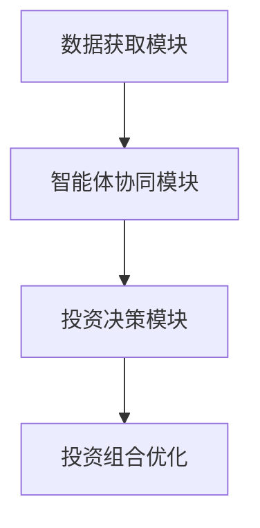

                 


# AI赋能的约翰·伯格指数投资：多智能体优化方案

## 关键词：AI，指数投资，多智能体，约翰·伯格，投资优化

## 摘要：  
本文探讨了如何通过人工智能（AI）技术，特别是多智能体优化方法，赋能约翰·伯格的指数投资理念。通过分析指数投资的核心原理、AI在金融领域的应用潜力，以及多智能体系统的优化策略，本文提出了一种创新的投资优化方案，旨在提高投资决策的效率和准确性。文章详细阐述了多智能体系统的理论基础、算法实现、系统设计与项目实战，并通过具体案例展示了如何将AI技术与约翰·伯格的投资理念相结合，实现指数投资的智能化与优化。

---

# 第一部分: 指数投资与AI的结合

## 第1章: 指数投资的基本概念与AI的应用

### 1.1 指数投资的核心原理  
指数投资是一种被动投资策略，其核心理念是通过跟踪市场指数（如标普500）来进行投资，避免频繁交易和市场择时带来的风险。约翰·伯格是指数投资的代表人物，他提出的“买入并持有”策略强调长期投资、分散投资和低成本运作。  

#### 1.1.1 指数投资的优势  
- **分散风险**：通过投资市场指数中的多只股票，降低单一股票波动带来的风险。  
- **低成本**：指数基金的管理费用通常低于主动管理型基金。  
- **长期收益**：长期来看，指数基金的收益往往能够跑赢大部分主动管理型基金。  

### 1.2 AI在金融投资中的应用  
人工智能技术在金融领域的应用日益广泛，尤其是在数据处理、模式识别和投资决策方面。AI可以通过分析海量数据，发现传统方法难以捕捉的投资机会。  

#### 1.2.1 AI在金融分析中的作用  
- **数据挖掘**：通过机器学习算法分析历史数据，发现市场规律和潜在的投资机会。  
- **风险评估**：利用AI模型预测市场波动和投资组合的风险。  
- **智能投顾**：为投资者提供个性化的投资建议，帮助其优化投资组合。  

#### 1.2.2 多智能体系统在金融投资中的优势  
多智能体系统由多个智能体组成，每个智能体负责不同的任务，通过协同工作实现整体目标。在金融投资中，多智能体系统可以分别负责市场分析、风险评估和投资决策，从而提高投资效率和准确性。  

---

## 第2章: 多智能体系统的理论基础

### 2.1 多智能体系统的核心概念  
多智能体系统（Multi-Agent System, MAS）由多个具有自主决策能力的智能体组成，这些智能体通过交互和协作完成复杂任务。  

#### 2.1.1 多智能体系统的组成与特点  
- **智能体**：具有感知环境、做出决策和执行动作的能力。  
- **通信机制**：智能体之间通过消息传递进行协作。  
- **协调机制**：通过某种规则或协议，确保智能体之间的目标一致性和任务分配的合理性。  

#### 2.1.2 多智能体系统与传统AI的区别  
传统的AI系统通常是一个集中式的决策系统，而多智能体系统则是分布式的，由多个智能体协同完成任务。多智能体系统能够更好地应对复杂环境中的动态变化。  

### 2.2 多智能体优化的数学模型  
在指数投资中，多智能体系统可以通过优化算法来实现投资组合的最优配置。  

#### 2.2.1 投资组合优化的数学表达  
$$\text{目标函数：} \quad \min \sigma^2 \quad \text{在满足} \quad \sum w_i = 1 \text{的条件下}$$  
其中，\( \sigma^2 \) 表示投资组合的方差，\( w_i \) 表示第i只股票的权重。  

#### 2.2.2 状态空间与动作空间的定义  
- **状态空间**：包括市场指数、各股票的价格波动、宏观经济指标等因素。  
- **动作空间**：包括买入、卖出、持有等操作。  

#### 2.2.3 奖励函数的设计与实现  
奖励函数用于衡量智能体的投资决策效果。例如，当投资组合的收益超过市场指数时，智能体获得正奖励；反之则获得负奖励。  

---

## 第3章: 约翰·伯格投资理念的AI化

### 3.1 约翰·伯格的投资哲学  
约翰·伯格的投资理念强调长期投资、分散投资和低成本运作。这些理念与AI技术的高效性和精准性天然契合。  

#### 3.1.1 被动投资策略的核心思想  
- **长期持有**：避免频繁交易，降低交易成本和税务负担。  
- **分散投资**：通过投资指数基金，降低单一资产的风险。  
- **低成本运作**：通过降低管理费用和交易费用，提高长期收益。  

### 3.2 多智能体系统如何实现约翰·伯格的投资理念  
多智能体系统可以通过分工合作，分别负责市场的数据收集、风险评估和投资决策。例如，一个智能体负责分析市场的宏观经济指标，另一个智能体负责评估个股的风险收益比，最后通过协同决策确定最优的投资组合。  

#### 3.2.1 AI在被动投资中的应用  
- **数据驱动决策**：通过分析历史数据，识别市场的长期趋势。  
- **智能风险控制**：利用AI模型预测市场波动，优化投资组合的风险收益比。  

### 3.3 多智能体系统的优化策略  
通过多智能体系统的协同优化，可以进一步提升指数投资的效果。例如，智能体之间可以通过共享信息，动态调整投资组合的权重，以适应市场的变化。  

---

## 第4章: 多智能体优化的算法实现

### 4.1 多智能体优化算法的选择与设计  
在指数投资中，可以选择多种多智能体优化算法，如Q-learning、粒子群优化（PSO）和遗传算法（GA）。  

#### 4.1.1 Q-learning算法  
Q-learning是一种基于强化学习的算法，适用于动态环境下的决策问题。智能体通过与环境交互，逐步优化其策略。  

#### 4.1.2 粒子群优化算法  
粒子群优化算法是一种模拟鸟群觅食行为的优化算法，适用于连续空间的优化问题。  

### 4.2 算法实现的Python代码示例  

#### 4.2.1 Q-learning算法实现  
```python
import numpy as np

class QLearning:
    def __init__(self, state_space, action_space, learning_rate=0.1, discount_factor=0.9):
        self.state_space = state_space
        self.action_space = action_space
        self.learning_rate = learning_rate
        self.discount_factor = discount_factor
        self.q_table = np.zeros((state_space, action_space))
    
    def choose_action(self, state, epsilon=0.1):
        if np.random.random() < epsilon:
            return np.random.randint(self.action_space)
        else:
            return np.argmax(self.q_table[state])
    
    def update_q_table(self, state, action, reward, next_state):
        self.q_table[state][action] = self.q_table[state][action] * (1 - self.learning_rate) + \
                                      reward * self.learning_rate + \
                                      self.discount_factor * np.max(self.q_table[next_state])
```

#### 4.2.2 粒子群优化算法实现  
```python
import numpy as np

class PSO:
    def __init__(self, n_particles, search_space, fitness_func):
        self.n_particles = n_particles
        self.search_space = search_space
        self.fitness_func = fitness_func
        self.particles = np.random.uniform(0, 1, size=(n_particles, search_space))
    
    def optimize(self, max_iterations=100, c1=2, c2=2):
        for _ in range(max_iterations):
            fitness = np.apply_along_axis(self.fitness_func, 1, self.particles)
            best_particle = self.particles[np.argmin(fitness)]
            velocity = np.zeros_like(self.particles)
            for i in range(self.n_particles):
                velocity[i] = c1 * (best_particle - self.particles[i]) + \
                              c2 * (self.particles[i] - np.mean(self.particles, axis=0))
            self.particles += velocity
        return best_particle
```

---

## 第5章: 系统设计与实现

### 5.1 系统架构设计  
在指数投资的多智能体优化系统中，可以将系统划分为以下几个模块：  
- **数据获取模块**：从金融市场获取实时数据。  
- **智能体协同模块**：实现多个智能体之间的通信与协作。  
- **投资决策模块**：根据智能体的分析结果，生成投资决策。  

#### 5.1.1 系统架构图  


### 5.2 系统功能设计  
- **数据预处理**：清洗和标准化金融数据。  
- **智能体协作**：通过消息传递实现智能体之间的信息共享。  
- **投资决策**：基于多智能体的分析结果，生成最优的投资组合。  

---

## 第6章: 项目实战与案例分析

### 6.1 环境搭建与数据准备  
- **工具安装**：安装Python、Pandas、NumPy、Scikit-learn等工具。  
- **数据获取**：从Yahoo Finance获取历史数据。  

#### 6.1.1 数据获取代码  
```python
import pandas_datareader as pdr

data = pdr.get_data_yahoo('SPY', start='2020-01-01', end='2023-12-31')
```

### 6.2 算法实现与优化  
- **模型训练**：使用历史数据训练多智能体优化模型。  
- **投资组合优化**：通过模型生成最优的投资组合。  

#### 6.2.1 投资组合优化代码  
```python
# 训练好的多智能体模型
model = PSO(n_particles=10, search_space=5, fitness_func=fitness_function)
optimal_weights = model.optimize()
```

### 6.3 案例分析与结果解读  
通过实际案例分析，验证多智能体优化方案的有效性。例如，可以通过回测的方式，比较传统指数投资与多智能体优化的投资收益。  

---

## 第7章: 总结与展望

### 7.1 本文总结  
本文通过结合约翰·伯格的指数投资理念与多智能体优化技术，提出了一种创新的投资优化方案。通过AI技术的赋能，可以显著提高投资决策的效率和准确性。  

### 7.2 未来展望  
未来，随着AI技术的不断发展，多智能体系统在金融领域的应用将更加广泛。例如，可以进一步优化智能体的协同机制，提高系统的实时性和适应性。  

---

## 作者：AI天才研究院/AI Genius Institute & 禅与计算机程序设计艺术 /Zen And The Art of Computer Programming

