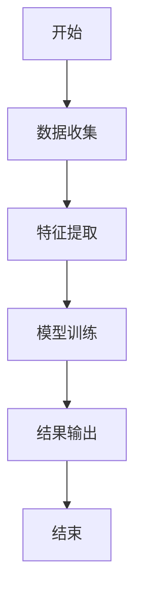
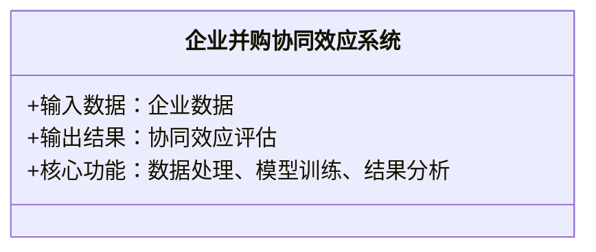
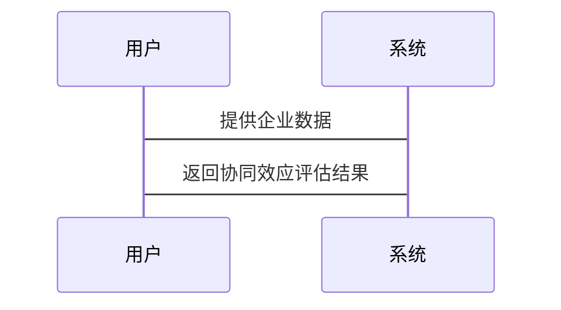

                 


# AI辅助企业并购协同效应实现：整合路径规划与执行

> 关键词：AI技术，企业并购，协同效应，整合路径，算法优化，系统架构，项目实战

> 摘要：本文详细探讨了如何利用人工智能技术辅助企业并购中的协同效应实现。首先介绍了企业并购的基本概念和协同效应的重要性，然后分析了AI技术在协同效应评估和整合路径规划中的应用。通过数学模型、算法优化和系统架构的设计，展示了AI如何提升企业并购的效率和成功率。最后，通过一个具体的项目案例，详细讲解了AI辅助企业并购的实现过程，并提出了未来的研究方向。

---

# 第一部分: AI辅助企业并购协同效应实现的背景与概念

## 第1章: 企业并购与协同效应概述

### 1.1 企业并购的基本概念

#### 1.1.1 企业并购的定义与类型
企业并购是指一家企业通过购买或合并另一家企业，以实现资源优化配置和业务扩展。常见的并购类型包括横向并购、纵向并购和混合并购。

- 横向并购：同一行业内的企业并购，旨在扩大市场份额。
- 纵向并购：产业链上下游的企业并购，以控制生产链条。
- 混合并购：跨行业并购，寻求新的业务增长点。

#### 1.1.2 协同效应的定义与分类
协同效应是指并购后的企业通过资源整合、业务协同和文化融合，实现整体价值超过单独价值之和的现象。

- 财务协同：成本节约、收入增长。
- 业务协同：产品互补、市场扩展。
- 管理协同：优化管理流程、提高效率。

#### 1.1.3 企业并购中的协同效应实现路径
- 资源整合：优化资源配置，降低成本。
- 业务协同：发挥双方优势，提升竞争力。
- 文化融合：促进企业文化的整合与融合。

### 1.2 AI技术在企业并购中的应用背景

#### 1.2.1 传统企业并购中的挑战
- 信息不对称：难以全面评估目标企业价值。
- 整合效率低：资源整合和业务协同耗时长、成本高。
- 风险预测难：难以准确预测整合后的潜在风险。

#### 1.2.2 AI技术如何赋能企业并购
- 数据分析：利用AI技术处理海量数据，挖掘潜在价值。
- 风险评估：通过机器学习模型预测整合风险。
- 过程优化：AI辅助整合路径规划，提高效率。

#### 1.2.3 协同效应实现的智能化趋势
- 智能化协同：AI技术推动协同效应的智能化实现。
- 数据驱动决策：基于数据的协同效应评估和优化。

### 1.3 本章小结
本章介绍了企业并购的基本概念和协同效应的重要性，分析了AI技术在企业并购中的应用背景，为后续章节的深入探讨奠定了基础。

---

# 第二部分: 协同效应实现的核心概念与算法

## 第2章: 协同效应的评估与分析

### 2.1 协同效应的评估指标

#### 2.1.1 财务指标：协同效应的量化
- 成本节约：并购后成本的降低。
- 收入增长：并购后收入的增加。
- 股东价值提升：企业市值的提升。

#### 2.1.2 非财务指标：协同效应的定性评估
- 品牌价值：并购后品牌影响力的提升。
- 客户满意度：客户对并购后企业服务的满意度。
- 员工满意度：员工对并购后企业文化的适应度。

#### 2.1.3 综合评估模型的构建
- 综合评估模型：结合财务和非财务指标，构建协同效应的综合评估模型。

### 2.2 协同效应的实现路径

#### 2.2.1 资源整合：协同效应的基础
- 资源优化配置：合理分配资源，避免浪费。
- 成本控制：通过资源整合降低运营成本。

#### 2.2.2 业务协同：协同效应的核心
- 产品互补：并购双方产品线的互补性。
- 市场扩展：利用双方的市场资源，扩大市场份额。

#### 2.2.3 文化融合：协同效应的保障
- 企业文化的整合：促进双方文化的融合，增强员工归属感。
- 管理风格的协调：统一管理流程，提高管理效率。

### 2.3 协同效应的算法实现

#### 2.3.1 协同效应的数学模型
$$协同效应 = \sum_{i=1}^{n} (R_i + B_i)$$
其中，$R_i$ 表示资源协同效应，$B_i$ 表示业务协同效应。

#### 2.3.2 协同效应的计算流程图


---

## 第3章: 整合路径规划的算法原理

### 3.1 整合路径规划的核心算法

#### 3.1.1 基于图论的最短路径算法
- Dijkstra算法：用于寻找从起点到终点的最短路径。
- A*算法：结合启发式搜索，提高路径优化效率。

#### 3.1.2 基于动态规划的路径优化算法
- 动态规划模型：通过分阶段决策，优化整合路径。

#### 3.1.3 基于机器学习的路径预测模型
- 机器学习模型：利用历史数据，预测最优整合路径。

### 3.2 整合路径规划的实现步骤

#### 3.2.1 数据预处理
- 数据清洗：去除噪声数据，确保数据质量。
- 特征提取：提取关键特征，为模型训练做准备。

#### 3.2.2 模型训练与优化
- 参数调整：通过交叉验证，优化模型参数。
- 模型评估：评估模型的准确性和鲁棒性。

#### 3.2.3 结果分析与调整
- 结果解读：分析模型输出结果，识别潜在问题。
- 模型优化：根据结果反馈，进一步优化模型。

### 3.3 优化算法的数学模型

#### 3.3.1 最短路径算法
$$\text{最小化} \sum_{i=1}^{n} (w_i \times d_i)$$
其中，$w_i$ 表示权重，$d_i$ 表示距离。

#### 3.3.2 动态规划算法
$$\text{最小化} \sum_{i=1}^{n} (w_i \times d_i)$$

---

# 第三部分: 系统架构与项目实战

## 第4章: AI辅助企业并购协同效应实现的系统架构

### 4.1 系统功能设计

#### 4.1.1 领域模型


#### 4.1.2 系统架构图


### 4.2 系统接口设计

#### 4.2.1 API接口
- 数据接口：提供数据输入和输出的接口。
- 模型接口：提供模型训练和预测的接口。

### 4.3 系统交互流程

#### 4.3.1 交互流程图


---

## 第5章: 项目实战

### 5.1 项目介绍

#### 5.1.1 项目背景
- 某企业计划并购另一家企业，希望通过AI技术实现协同效应的评估和整合路径的优化。

### 5.1.2 项目目标
- 评估并购后的协同效应。
- 优化整合路径，降低整合风险。

### 5.2 环境安装

#### 5.2.1 安装Python
```bash
pip install python
```

#### 5.2.2 安装机器学习库
```bash
pip install scikit-learn
```

### 5.3 系统核心实现

#### 5.3.1 数据处理代码
```python
import pandas as pd

# 数据加载
data = pd.read_csv('企业数据.csv')

# 数据清洗
data.dropna(inplace=True)

# 特征提取
features = data[['收入', '成本', '市场份额']]
```

#### 5.3.2 模型训练代码
```python
from sklearn.model_selection import train_test_split
from sklearn.ensemble import RandomForestRegressor

# 数据分割
X_train, X_test, y_train, y_test = train_test_split(features, data['协同效应'], test_size=0.2)

# 模型训练
model = RandomForestRegressor()
model.fit(X_train, y_train)

# 模型预测
y_pred = model.predict(X_test)
```

### 5.4 代码应用解读与分析

#### 5.4.1 数据处理
- 数据加载：读取企业数据，确保数据格式正确。
- 数据清洗：去除缺失值，保证数据完整性。
- 特征提取：提取关键特征，为模型训练做准备。

#### 5.4.2 模型训练
- 数据分割：将数据分为训练集和测试集。
- 模型选择：选择随机森林回归模型进行训练。
- 模型预测：利用训练好的模型进行预测。

### 5.5 实际案例分析

#### 5.5.1 案例分析
- 案例背景：某企业并购案例，目标是评估协同效应并优化整合路径。
- 案例结果：通过AI技术，成功预测了协同效应，并优化了整合路径，降低了整合风险。

### 5.6 项目小结

#### 5.6.1 项目总结
- 成功实现企业并购中的协同效应评估和整合路径优化。
- 提供了可复制的AI辅助企业并购的方法论。

---

# 第四部分: 总结与展望

## 第6章: 总结与展望

### 6.1 本章小结
- 总结了AI技术在企业并购中的应用，重点介绍了协同效应的评估和整合路径的优化。

### 6.2 注意事项
- 数据质量：确保数据的准确性和完整性。
- 模型选择：根据实际情况选择合适的模型。
- 风险控制：重视模型的风险预测和控制。

### 6.3 拓展阅读
- 推荐阅读相关领域的书籍和论文，深入学习AI技术在企业并购中的应用。

---

# 作者：AI天才研究院 & 禅与计算机程序设计艺术

