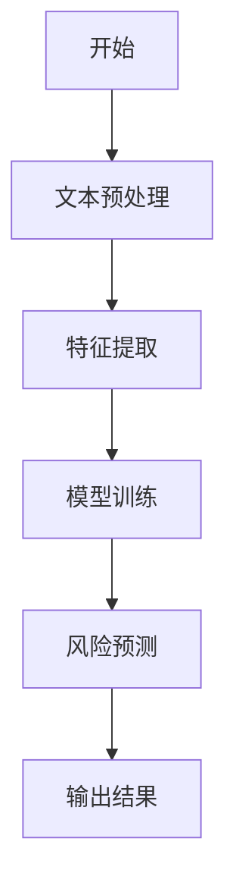
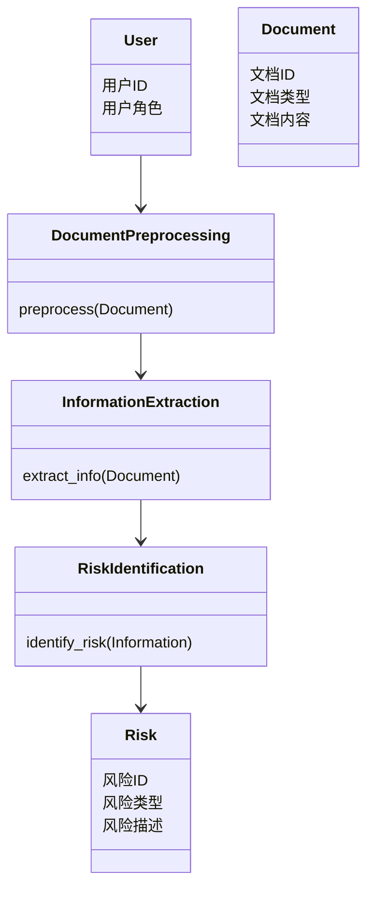
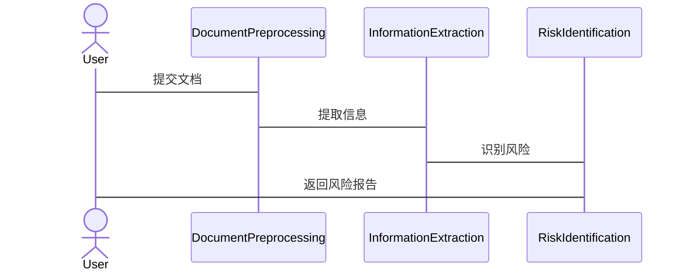

                 


# AI辅助企业并购尽职调查：自动化文档分析与风险识别

## 关键词：AI，企业并购，尽职调查，文档分析，风险识别

## 摘要：  
随着企业并购活动的日益频繁，传统的尽职调查方法面临着效率低下、成本高昂、风险识别不全面等挑战。本文深入探讨了如何利用人工智能技术，特别是自然语言处理和机器学习，来实现企业并购尽职调查的自动化文档分析与风险识别。文章从背景、核心概念、算法原理、系统架构到项目实战，全面分析了AI在这一领域的应用，并提出了具体的解决方案和实践案例，为企业并购提供了高效、智能的工具。

---

# 第一部分：AI辅助企业并购尽职调查的背景与核心概念

## 第1章：AI辅助企业并购尽职调查的背景与问题背景

### 1.1 企业并购与尽职调查的概述

#### 1.1.1 企业并购的基本概念与流程  
企业并购（Mergers and Acquisitions, M&A）是指两个或多个企业之间的合并或收购。这一过程通常包括以下几个关键阶段：  
1. **战略规划**：确定并购目标和战略意图。  
2. **目标筛选**：选择合适的并购目标。  
3. **尽职调查**：对目标企业进行全面的调查和评估。  
4. **估值与谈判**：确定目标企业的价值并进行谈判。  
5. **整合与执行**：完成并购后的业务整合。  

尽职调查是并购过程中最关键且复杂的环节，其结果直接影响并购的成败。

#### 1.1.2 尽职调查的核心目标与意义  
尽职调查的核心目标是全面了解目标企业的财务状况、法律风险、运营模式、资产状况等。其意义在于：  
1. **降低并购风险**：通过识别潜在风险，避免或减少并购后的损失。  
2. **提高决策效率**：通过系统化的分析，快速获取关键信息，辅助决策。  
3. **优化资源配置**：通过分析目标企业的资源和能力，优化并购后的整合方案。  

#### 1.1.3 尽职调查的传统方法与挑战  
传统的尽职调查方法主要包括：  
1. **手动查阅文档**：如财务报表、合同、法律文件等。  
2. **访谈与问卷调查**：通过与目标企业高管和员工沟通，获取信息。  
3. **外部数据查询**：通过第三方数据库获取目标企业的公开信息。  

然而，传统方法存在以下挑战：  
- **效率低下**：手动查阅和分析大量文档耗时耗力。  
- **准确性不足**：人为因素可能导致信息遗漏或误判。  
- **成本高昂**：需要大量专业人员参与，增加了并购成本。  

### 1.2 AI技术在企业并购中的应用背景

#### 1.2.1 AI技术的发展与企业应用场景  
人工智能技术的快速发展为企业并购提供了新的工具和方法。AI技术在企业中的应用主要集中在以下几个方面：  
1. **自然语言处理（NLP）**：用于文本分析、信息提取和情感分析。  
2. **机器学习（ML）**：用于模式识别、预测分析和风险评估。  
3. **大数据分析**：用于海量数据的处理和分析。  

#### 1.2.2 尽职调查中的文档分析与风险识别需求  
在企业并购中，文档分析和风险识别是尽职调查的核心任务。  
1. **文档分析**：需要对目标企业的财务报表、合同、法律文件等进行自动化分析，提取关键信息。  
2. **风险识别**：需要识别目标企业中存在的潜在风险，如法律纠纷、财务造假、管理问题等。  

#### 1.2.3 AI辅助尽职调查的优势与潜力  
AI技术在尽职调查中的应用具有以下优势：  
- **高效性**：AI可以快速处理大量文档，提取关键信息。  
- **准确性**：AI通过算法分析，减少人为误判的可能性。  
- **成本低**：AI可以替代部分人工工作，降低并购成本。  

### 1.3 问题背景与问题描述

#### 1.3.1 传统尽职调查的效率与准确性问题  
传统尽职调查方法的主要问题包括：  
- **效率低下**：手动分析大量文档耗时长。  
- **准确性不足**：人为因素可能导致信息遗漏或误判。  

#### 1.3.2 文档分析与风险识别的复杂性  
文档分析和风险识别的复杂性主要体现在：  
- **文档类型多样**：包括财务报表、合同、法律文件等。  
- **信息分散**：关键信息可能分布在多个文档中。  
- **风险多样性**：目标企业可能面临多种类型的法律、财务或管理风险。  

#### 1.3.3 AI技术如何解决这些问题  
AI技术通过自动化文档分析和智能风险识别，可以有效解决这些问题。  
1. **自动化文档分析**：利用NLP技术快速提取文档中的关键信息。  
2. **智能风险识别**：通过机器学习模型识别潜在风险，并提供风险评估报告。  

## 第2章：AI辅助尽职调查的核心概念与联系

### 2.1 核心概念与定义

#### 2.1.1 AI辅助尽职调查的定义  
AI辅助尽职调查是指利用人工智能技术，包括自然语言处理和机器学习，对目标企业的文档进行自动化分析，并识别潜在风险，辅助决策者制定并购策略。  

#### 2.1.2 自动化文档分析的定义与实现方式  
自动化文档分析是指通过AI技术对文档进行自动化的文本处理和信息提取。其实现方式主要包括：  
1. **文本预处理**：对文档进行分词、去停用词等处理。  
2. **信息提取**：利用NLP技术提取文档中的关键信息，如财务数据、合同条款等。  

#### 2.1.3 风险识别的定义与分类  
风险识别是指通过分析目标企业的内外部信息，识别潜在风险的过程。风险分类主要包括：  
1. **财务风险**：如财务造假、偿债能力不足等。  
2. **法律风险**：如未决诉讼、合同纠纷等。  
3. **管理风险**：如管理层稳定性、内部管理混乱等。  

### 2.2 核心概念之间的关系

#### 2.2.1 AI技术与文档分析的结合  
AI技术通过自然语言处理和机器学习，实现文档的自动化分析和信息提取。  

#### 2.2.2 文档分析与风险识别的逻辑关系  
文档分析为风险识别提供了基础信息，而风险识别则基于这些信息进行分析和判断。  

#### 2.2.3 风险识别与企业并购决策的关系  
风险识别直接影响企业并购的决策，如并购价格、整合方案等。  

### 2.3 核心概念的ER实体关系图

```mermaid
erDiagram
    actor User {
        +string 用户ID
        +string 用户角色
    }
    document Document {
        +string 文档ID
        +string 文档类型
        +string 文档内容
    }
    risk Risk {
        +string 风险ID
        +string 风险类型
        +string 风险描述
    }
    user <<--- document
    document --> risk
```

---

## 第3章：AI辅助尽职调查的算法原理

### 3.1 算法原理概述

#### 3.1.1 自然语言处理（NLP）技术  
NLP技术用于文本分析和信息提取，主要包括：  
1. **分词**：将文本分割成单词或短语。  
2. **实体识别**：识别文本中的实体，如人名、地名、组织名等。  
3. **情感分析**：分析文本的情感倾向。  

#### 3.1.2 机器学习模型  
机器学习模型用于风险识别，主要包括：  
1. **特征提取**：从文档中提取特征，如财务数据、合同条款等。  
2. **模型训练**：利用训练数据训练机器学习模型。  
3. **风险预测**：基于模型预测目标企业的潜在风险。  

### 3.2 算法流程



### 3.3 数学模型与公式

#### 3.3.1 朴素贝叶斯分类器  
朴素贝叶斯分类器是一种常用的文本分类算法，其概率公式如下：  
$$ P(y|x) = \frac{P(x|y)P(y)}{P(x)} $$  
其中，$y$表示类别，$x$表示输入文本。

#### 3.3.2 支持向量机（SVM）  
支持向量机是一种常用的分类算法，其目标是最小化 hinge loss：  
$$ \text{Loss} = \sum_{i=1}^n \max(0, 1 - y_i w \cdot x_i - b) $$  
其中，$y_i$表示标签，$w$表示权重，$x_i$表示特征向量，$b$表示偏置项。  

---

## 第4章：AI辅助尽职调查的系统架构

### 4.1 系统功能设计

#### 4.1.1 文档预处理模块  
文档预处理模块负责对目标企业的文档进行预处理，包括分词、去停用词等。  

#### 4.1.2 信息提取模块  
信息提取模块利用NLP技术提取文档中的关键信息，如财务数据、合同条款等。  

#### 4.1.3 风险识别模块  
风险识别模块利用机器学习模型对提取的信息进行分析，识别潜在风险。  

### 4.2 系统架构设计



### 4.3 系统接口设计

#### 4.3.1 用户接口  
用户可以通过图形界面或API提交文档，并获取风险识别结果。  

#### 4.3.2 API接口  
API接口提供以下功能：  
1. **文档上传**：接收目标企业的文档。  
2. **风险识别**：返回风险识别结果。  

### 4.4 系统交互流程



---

## 第5章：AI辅助尽职调查的项目实战

### 5.1 项目背景与目标

#### 5.1.1 项目背景  
假设我们正在评估一家科技公司的并购目标，需要对其财务报表、合同和法律文件进行分析。  

#### 5.1.2 项目目标  
1. 实现文档的自动化分析。  
2. 识别潜在的财务和法律风险。  

### 5.2 系统实现

#### 5.2.1 环境安装  
- 安装Python 3.8及以上版本。  
- 安装NLP库：`nltk`, `spaCy`。  
- 安装机器学习库：`scikit-learn`, `xgboost`。  

#### 5.2.2 核心代码实现

```python
import nltk
from sklearn.feature_extraction.text import TfidfVectorizer
from sklearn.svm import SVC
from sklearn.pipeline import Pipeline

# 文本预处理
nltk.download('stopwords')
vectorizer = TfidfVectorizer(stop_words='english', max_features=1000)

# 模型训练
model = SVC()
pipeline = Pipeline([('tfidf', vectorizer), ('model', model)])
pipeline.fit(X_train, y_train)

# 风险预测
y_pred = pipeline.predict(X_test)
```

### 5.3 项目小结

#### 5.3.1 项目实现的关键点  
1. 文本预处理：分词、去停用词。  
2. 模型训练：使用SVM进行分类。  
3. 风险预测：基于模型预测潜在风险。  

#### 5.3.2 项目总结  
通过本项目，我们实现了AI辅助尽职调查的自动化文档分析和风险识别，证明了AI技术在企业并购中的应用潜力。

---

## 第6章：AI辅助尽职调查的最佳实践与注意事项

### 6.1 最佳实践

#### 6.1.1 数据质量控制  
确保输入数据的准确性和完整性。  

#### 6.1.2 模型优化  
通过交叉验证和调参优化模型性能。  

#### 6.1.3 结果解释  
对模型的输出结果进行解释，确保决策者理解AI的分析结果。  

### 6.2 注意事项

#### 6.2.1 数据隐私  
在处理敏感数据时，需遵守相关隐私保护法规。  

#### 6.2.2 模型局限性  
AI模型可能存在误判，需结合人工审核。  

#### 6.2.3 持续更新  
定期更新模型和数据，保持系统的准确性。  

---

## 结语

AI技术正在改变企业并购的尽职调查方式，通过自动化文档分析和智能风险识别，AI辅助尽职调查能够显著提高效率和准确性。然而，AI技术的应用仍需结合实际情况，注意数据隐私和模型优化等关键问题。未来，随着AI技术的不断发展，AI在企业并购中的应用前景将更加广阔。

---

## 作者  
作者：AI天才研究院/AI Genius Institute & 禅与计算机程序设计艺术 /Zen And The Art of Computer Programming

