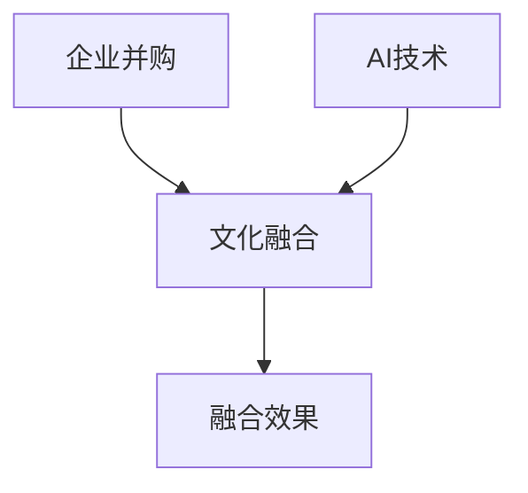

                 

# AI辅助企业并购整合规划：文化融合路径设计与效果监测

**关键词：** AI技术，企业并购，文化融合，路径设计，效果监测

**摘要：**  
随着企业并购活动的频繁进行，文化融合成为决定并购成功与否的关键因素。本文探讨了如何利用人工智能技术辅助企业并购整合中的文化融合路径设计与效果监测。通过分析文化融合的核心概念、AI技术的应用场景，以及具体的路径设计和效果监测方法，本文为企业的文化融合提供了理论支持和实践指导。

---

## 第1章: 企业并购整合与文化融合概述

### 1.1 企业并购整合的背景与挑战

#### 1.1.1 企业并购整合的定义与特点
企业并购整合是指企业在并购后，将双方的业务、资产、人员和文化进行整合的过程。其特点包括复杂性、长期性和系统性。企业并购整合的目标是实现协同效应，提升整体竞争力。

#### 1.1.2 并购整合中的文化融合问题
文化融合是企业并购整合中的核心问题之一。文化冲突可能导致员工不满、效率低下，甚至影响企业战略的实施。文化融合的关键在于找到双方文化的共同点和差异点，并制定有效的融合策略。

#### 1.1.3 AI技术在企业并购整合中的应用前景
人工智能技术可以通过数据分析、模式识别和自然语言处理等手段，帮助企业更好地理解和处理文化融合问题。AI技术能够辅助企业在并购前进行文化评估，在并购中制定融合策略，并在并购后监测融合效果。

### 1.2 文化融合的核心概念与重要性

#### 1.2.1 企业文化的基本构成
企业文化由企业愿景、使命、价值观、规章制度、员工行为规范等构成。文化融合需要考虑双方在这些方面的异同点。

#### 1.2.2 文化融合的定义与目标
文化融合是指将两个或多个不同文化体系中的元素进行整合，形成新的文化体系的过程。其目标是实现文化互补、协同发展。

#### 1.2.3 文化融合在企业并购中的作用
文化融合能够增强企业凝聚力，促进员工协作，提升企业整体效率。成功的文化融合是企业并购成功的重要保障。

### 1.3 AI辅助文化融合的路径与方法

#### 1.3.1 AI技术在文化分析中的应用
AI技术可以通过分析企业文档、员工行为数据等，提取文化特征。例如，自然语言处理技术可以分析企业内部邮件、报告，提取文化关键词。

#### 1.3.2 文化融合的路径设计
文化融合路径设计需要考虑企业并购的阶段，包括并购前的评估、并购中的策略制定、并购后的实施。AI技术可以辅助制定个性化融合路径。

#### 1.3.3 文化融合效果的监测与评估
通过AI技术，企业可以实时监测文化融合的效果，例如员工满意度、团队协作效率等指标。AI还可以通过数据分析，预测文化融合的潜在风险。

---

## 第2章: AI辅助文化融合的核心概念

### 2.1 文化融合的关键要素分析

#### 2.1.1 企业文化的主要维度
企业文化的维度包括企业愿景、价值观、管理风格、员工关系等。这些维度是文化融合的核心要素。

#### 2.1.2 文化融合的关键因素
文化融合的关键因素包括企业规模、行业特点、地理位置、员工构成等。这些因素会影响文化融合的路径和效果。

#### 2.1.3 企业并购中的文化冲突与融合
文化冲突是企业并购中的常见问题，例如管理风格差异、员工价值观冲突等。通过文化融合，可以有效化解文化冲突，实现协同发展。

### 2.2 AI在文化融合中的作用机制

#### 2.2.1 AI技术的基本原理
AI技术包括机器学习、自然语言处理、数据分析等。这些技术可以辅助企业在文化融合中进行数据处理、模式识别和决策支持。

#### 2.2.2 AI在文化分析中的应用场景
AI技术可以应用于企业文化的识别、分析和评估。例如，通过自然语言处理技术分析企业文档，提取文化关键词。

#### 2.2.3 AI辅助文化融合的实现路径
AI辅助文化融合的实现路径包括数据采集、文化分析、路径设计、效果监测等。每一步都需要AI技术的支持。

### 2.3 文化融合与AI技术的结合模型

#### 2.3.1 文化融合的系统模型
文化融合的系统模型包括输入、处理、输出三个部分。输入是企业文化的特征数据，处理是AI技术的分析和决策，输出是文化融合的路径和策略。

#### 2.3.2 AI技术在文化融合中的实体关系图

---

## 第3章: AI辅助文化融合的路径设计

### 3.1 文化融合路径的定义与分类

#### 3.1.1 文化融合路径的分类
文化融合路径可以分为渐进式融合、跨越式融合和混合式融合。每种路径都有其适用场景和优缺点。

#### 3.1.2 不同路径的特点与适用场景
渐进式融合适合规模相近的企业，跨越式融合适合小企业并购大企业，混合式融合适合行业差异较大的企业。

### 3.2 基于AI的文化融合路径设计

#### 3.2.1 数据采集与分析
通过AI技术采集企业文化的特征数据，例如员工满意度、管理风格等。数据分析可以识别文化差异和共同点。

#### 3.2.2 文化冲突的识别与化解
通过自然语言处理技术，识别文化冲突的关键词。AI技术可以提供化解文化冲突的建议。

#### 3.2.3 文化融合策略的制定
基于数据分析结果，制定个性化文化融合策略。例如，制定员工培训计划、调整管理风格等。

---

## 第4章: AI辅助文化融合的效果监测

### 4.1 文化融合效果的评估指标

#### 4.1.1 员工满意度
员工满意度是文化融合效果的重要指标。通过员工满意度调查，可以评估文化融合的效果。

#### 4.1.2 团队协作效率
团队协作效率是文化融合效果的另一个重要指标。通过数据分析，可以评估团队协作效率的变化。

#### 4.1.3 企业绩效
企业绩效是文化融合效果的最终体现。通过对比并购前后的企业绩效，可以评估文化融合的效果。

### 4.2 文化融合效果的监测方法

#### 4.2.1 数据采集与处理
通过AI技术采集员工行为数据、绩效数据等。数据处理包括清洗、转换和分析。

#### 4.2.2 文化融合效果的预测
通过机器学习技术，预测文化融合的潜在风险和效果。AI技术可以提供实时监测和预警。

### 4.3 文化融合效果的优化与调整

#### 4.3.1 文化融合策略的优化
根据监测结果，优化文化融合策略。例如，调整员工培训计划、优化管理流程等。

#### 4.3.2 文化融合路径的调整
根据监测结果，调整文化融合路径。例如，从渐进式融合调整为跨越式融合。

---

## 第5章: 项目实战：AI辅助文化融合的实现

### 5.1 项目背景与目标

#### 5.1.1 项目背景
某企业并购一家小企业，需要进行文化融合。目标是通过AI技术辅助文化融合，提升并购后的协同效应。

#### 5.1.2 项目目标
制定个性化文化融合路径，实时监测文化融合效果，优化文化融合策略。

### 5.2 系统设计与实现

#### 5.2.1 系统功能设计
系统功能包括数据采集、文化分析、路径设计、效果监测等。

#### 5.2.2 系统架构设计
系统架构包括数据层、算法层、应用层。数据层负责数据采集和存储，算法层负责文化分析和预测，应用层负责展示和交互。

#### 5.2.3 系统实现
系统实现包括环境搭建、代码编写、功能测试等。代码实现主要包括数据处理、文化分析、路径设计和效果监测模块。

### 5.3 项目总结与经验分享

#### 5.3.1 项目总结
通过AI技术辅助文化融合，成功实现了企业并购后的文化融合，提升了企业绩效。

#### 5.3.2 经验分享
文化融合需要长期坚持，AI技术可以辅助但不能完全替代人类的判断。文化融合路径的设计需要根据企业实际情况灵活调整。

---

## 第6章: 最佳实践与未来展望

### 6.1 最佳实践

#### 6.1.1 文化融合的关键点
文化融合需要关注企业愿景、价值观、管理风格等关键点。

#### 6.1.2 AI技术的应用建议
AI技术可以辅助文化融合的各个阶段，但需要结合企业实际情况灵活应用。

### 6.2 未来展望

#### 6.2.1 AI技术的发展趋势
AI技术在文化融合中的应用将更加智能化和个性化。例如，AI可以实现文化融合的自动化决策和实时监测。

#### 6.2.2 企业并购中的文化融合趋势
未来，文化融合将更加注重员工参与和文化认同。企业并购中的文化融合将更加注重员工的幸福感和归属感。

---

## 作者：AI天才研究院/AI Genius Institute & 禅与计算机程序设计艺术 /Zen And The Art of Computer Programming

