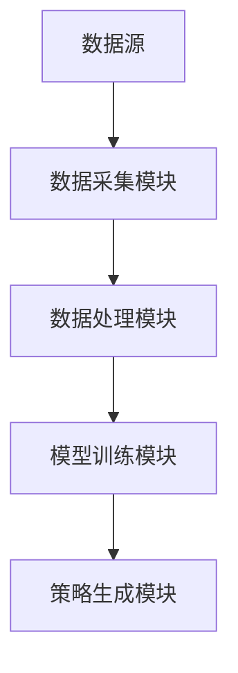

                 


# AI辅助发现新兴市场价值投资标的

> 关键词：AI，价值投资，新兴市场，机器学习，投资策略，金融数据分析

> 摘要：本文将详细介绍如何利用人工智能技术辅助发现新兴市场的价值投资标的。通过结合机器学习、深度学习等技术，分析新兴市场的数据特征，构建投资策略模型，优化投资决策过程。文章从理论基础、算法原理、系统架构到项目实战，全面阐述了AI在价值投资中的应用。

---

## 第1章: AI与价值投资的结合

### 1.1 价值投资的定义与特点

#### 1.1.1 价值投资的定义
价值投资是一种投资策略，强调以低于内在价值的价格买入优质资产。其核心理念是寻找市场中的“价值洼地”，即市场价格低于其真实价值的标的。这种方法强调长期投资和对公司基本面的深入分析。

#### 1.1.2 价值投资的核心原则
- **安全边际**：买入价格低于内在价值，以减少投资风险。
- **长期视角**：关注企业的长期盈利能力，而非短期价格波动。
- **逆向思维**：在市场恐慌时寻找低估资产，在市场乐观时保持谨慎。

#### 1.1.3 价值投资与AI技术的结合
AI技术可以通过大数据分析、模式识别和预测模型，帮助投资者更高效地发现价值洼地。AI能够处理海量数据，挖掘传统方法难以发现的规律，从而辅助投资者做出更明智的决策。

---

### 1.2 AI技术在金融领域的应用背景

#### 1.2.1 AI技术的基本概念
人工智能（AI）是模拟人类智能的计算机系统，包括学习、推理、自适应等能力。在金融领域，AI主要应用于数据分析、风险评估、投资决策等方面。

#### 1.2.2 金融领域的数据特点
金融数据具有以下特点：
- **高频性**：金融市场数据更新速度快。
- **多样性**：包括价格、成交量、新闻、社交媒体等多种数据源。
- **噪声多**：数据中包含大量随机波动和噪声。
- **时间依赖性**：价格走势往往具有时间序列特征。

#### 1.2.3 AI在金融投资中的优势
- **数据处理能力**：AI能够处理海量数据，提取有用信息。
- **模式识别**：AI可以发现数据中的隐含规律。
- **自动化决策**：AI可以快速生成投资策略并执行。

---

## 第2章: AI辅助发现新兴市场的核心原理

### 2.1 新兴市场的定义与特点

#### 2.1.1 新兴市场的定义
新兴市场是指那些经济快速增长、金融市场逐步完善但尚未完全成熟的国家或地区的市场。这些市场通常具有较大的增长潜力，但也伴随着较高的风险。

#### 2.1.2 新兴市场的投资机会
- **增长潜力**：新兴市场的经济基本面较好，具有较高的增长潜力。
- **估值优势**：部分新兴市场资产的估值低于成熟市场，存在价值投资机会。
- **多样化**：新兴市场涵盖多个行业和领域，投资者可以分散风险。

#### 2.1.3 新兴市场的风险与挑战
- **政策风险**：新兴市场政策变化可能较大，影响市场稳定性。
- **流动性风险**：部分新兴市场流动性较差，可能导致交易成本较高。
- **波动性风险**：新兴市场价格波动较大，投资风险较高。

---

### 2.2 AI在新兴市场投资中的应用

#### 2.2.1 数据采集与处理
新兴市场数据的采集和处理需要考虑以下问题：
- **数据来源**：包括股票价格、公司财务数据、行业新闻等。
- **数据清洗**：处理缺失值、异常值等问题。
- **数据标准化**：将不同来源的数据进行标准化处理，便于模型训练。

#### 2.2.2 数据分析与特征提取
- **特征提取**：通过统计分析和机器学习方法，提取对投资决策有影响的特征，如市盈率、市净率、ROE等。
- **数据可视化**：通过图表展示数据分布和特征关系，帮助投资者更好地理解市场。

#### 2.2.3 模型构建与预测
- **模型选择**：根据数据特点选择合适的模型，如线性回归、随机森林、神经网络等。
- **模型训练**：利用历史数据训练模型，评估模型的预测能力。
- **模型优化**：通过调整参数和优化算法，提高模型的预测精度。

---

## 第3章: AI辅助投资的核心算法与模型

### 3.1 机器学习在投资中的应用

#### 3.1.1 监督学习在投资中的应用
- **回归模型**：用于预测股票价格走势。
- **分类模型**：用于判断股票是否为价值股。

#### 3.1.2 非监督学习在投资中的应用
- **聚类分析**：将股票分为不同类别，发现潜在的投资机会。
- **降维分析**：通过主成分分析（PCA）等方法，降低数据维度，提高模型效率。

#### 3.1.3 强化学习在投资中的应用
- **策略优化**：通过强化学习算法，优化投资策略，最大化收益。

---

### 3.2 深度学习在投资中的应用

#### 3.2.1 RNN在时间序列分析中的应用
- **长短时记忆网络（LSTM）**：用于分析股票价格的时间序列数据，捕捉长期依赖关系。

#### 3.2.2 CNN在金融图像分析中的应用
- **卷积神经网络**：用于分析金融市场数据的图像特征，如K线图。

#### 3.2.3 Transformer在金融文本分析中的应用
- **文本到文本模型**：用于分析金融新闻、报告等文本数据，提取情绪指标。

---

## 第4章: 系统架构与数据流设计

### 4.1 系统架构设计

#### 4.1.1 系统功能模块划分
- **数据采集模块**：负责从多种数据源采集数据。
- **数据处理模块**：对数据进行清洗、标准化和特征提取。
- **模型训练模块**：构建和训练机器学习模型。
- **策略生成模块**：根据模型预测结果生成投资策略。

#### 4.1.2 系统数据流设计
1. 数据采集模块从外部数据源获取数据。
2. 数据处理模块对数据进行清洗和预处理。
3. 模型训练模块利用处理后的数据训练模型。
4. 策略生成模块根据模型预测结果生成投资策略。

#### 4.1.3 系统架构图（Mermaid）



---

### 4.2 数据流与处理流程

#### 4.2.1 数据采集流程
- **数据源选择**：确定数据来源，如股票数据库、新闻网站等。
- **数据采集工具**：使用API或爬虫工具获取数据。

#### 4.2.2 数据清洗与预处理
- **数据清洗**：处理缺失值、异常值等问题。
- **数据标准化**：将数据标准化为统一格式。

#### 4.2.3 数据特征提取与建模
- **特征提取**：提取对投资决策有影响的特征。
- **模型训练**：利用训练数据训练模型，评估模型性能。

---

## 第5章: 项目实战与代码实现

### 5.1 环境搭建与数据准备

#### 5.1.1 环境安装与配置
- **Python环境**：安装Python和相关库（如Pandas、Scikit-learn、Keras等）。
- **数据源获取**：从金融数据API获取股票数据。

#### 5.1.2 数据清洗与预处理代码
```python
import pandas as pd
import numpy as np

# 加载数据
data = pd.read_csv('stock_data.csv')

# 处理缺失值
data = data.dropna()

# 标准化处理
from sklearn.preprocessing import StandardScaler
scaler = StandardScaler()
scaled_data = scaler.fit_transform(data)
```

---

### 5.2 特征工程与模型训练

#### 5.2.1 特征提取代码
```python
# 提取特征
features = data[['市盈率', '市净率', 'ROE']]
```

#### 5.2.2 模型训练代码
```python
# 训练随机森林模型
from sklearn.ensemble import RandomForestClassifier
model = RandomForestClassifier(n_estimators=100)
model.fit(features, labels)
```

#### 5.2.3 模型评估与优化
- **评估指标**：准确率、召回率、F1分数等。
- **模型调优**：通过网格搜索（Grid Search）优化模型参数。

---

### 5.3 投资策略生成与回测

#### 5.3.1 策略生成代码
```python
# 根据模型预测结果生成投资策略
predicted_labels = model.predict(new_features)
```

#### 5.3.2 策略回测代码
```python
# 回测策略
def backtest_strategy(data, predicted_labels):
    profits = []
    for i in range(len(predicted_labels)):
        if predicted_labels[i] == 1:
            profits.append(data['收盘价'][i+1] - data['收盘价'][i])
        else:
            profits.append(0)
    return profits

profits = backtest_strategy(data, predicted_labels)
```

---

## 第6章: 最佳实践与注意事项

### 6.1 AI辅助投资的最佳实践
- **数据质量**：确保数据来源可靠，处理得当。
- **模型选择**：根据数据特点选择合适的模型，避免过度拟合。
- **持续优化**：定期更新模型和策略，适应市场变化。

### 6.2 投资中的注意事项
- **风险控制**：设定止损点，控制仓位。
- **市场变化**：关注宏观经济和政策变化，及时调整策略。
- **技术与市场的结合**：将技术分析与基本面分析相结合，提高投资决策的准确性。

---

## 第7章: 未来展望与总结

### 7.1 AI在投资领域的未来发展趋势
- **多模态数据的应用**：结合文本、图像等多种数据源，提高预测精度。
- **自适应模型的发展**：开发能够自适应市场变化的动态模型。

---

作者：AI天才研究院/AI Genius Institute & 禅与计算机程序设计艺术 /Zen And The Art of Computer Programming

