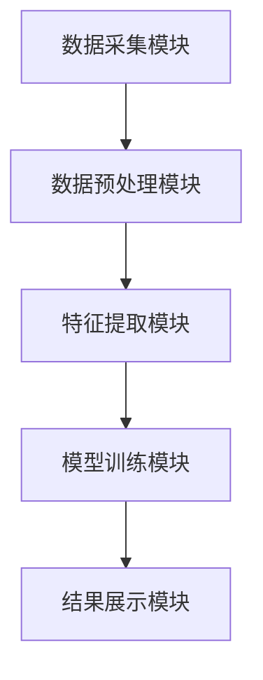
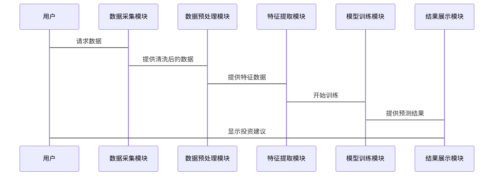

                 

<think>
好的，用户希望我根据提供的详细目录大纲，逐步思考如何撰写一篇符合要求的长篇技术博客文章。我会按照用户提供的结构和要求，分章节详细展开，确保内容完整、逻辑清晰，同时满足所有技术细节和格式要求。

### 1. 确定文章标题和关键词
标题：《AI辅助发现隐藏的价值投资机会》

关键词：人工智能、价值投资、隐藏价值、投资机会、数据驱动、机器学习、深度学习

摘要：本文探讨了人工智能在金融投资中的应用，特别是如何利用AI技术发现隐藏的价值投资机会。通过分析数据驱动的投资策略、机器学习算法、系统架构设计以及实际案例，详细阐述了AI在识别潜在投资机会中的优势和实现方法。

### 2. 第一部分：AI辅助价值投资的背景介绍

#### 第1章：AI在金融投资中的应用现状

**1.1 人工智能在金融领域的应用背景**

- **1.1.1 传统金融投资的局限性**
  - 传统投资方法依赖经验和市场分析，存在主观性和不准确性。
  - 数据量大、复杂性高，难以处理多维度信息。
  - 市场波动快，传统方法难以捕捉短期机会。

- **1.1.2 人工智能技术的快速发展**
  - 计算能力提升，大数据处理能力增强。
  - 深度学习和自然语言处理技术进步，提升数据理解和预测能力。
  - 云计算和分布式计算为金融数据分析提供支持。

- **1.1.3 AI在金融投资中的潜力与挑战**
  - 潜力：自动化分析、实时数据处理、精准预测。
  - 挑战：数据质量、模型过拟合、市场不确定性。

**1.2 价值投资机会的定义与特征**

- **1.2.1 价值投资的核心概念**
  - 价值投资：寻找市场价格低于内在价值的资产。
  - 长期投资策略，注重公司基本面分析。

- **1.2.2 隐藏价值机会的识别难点**
  - 数据分散，信息不透明。
  - 市场情绪影响，价格波动大。
  - 需要多维度分析，传统方法效率低。

- **1.2.3 AI技术在价值投资中的优势**
  - 自动化处理大量数据，发现潜在价值。
  - 利用机器学习模型预测市场趋势。
  - 实时监控市场变化，捕捉短期机会。

**1.3 AI辅助价值投资的必要性**

- **1.3.1 数据量与复杂性增加的需求**
  - 金融市场数据量急剧增加，传统方法难以处理。
  - 数据来源多样化，需要复杂的数据处理技术。

- **1.3.2 传统方法的局限性**
  - 依赖经验，主观性强。
  - 分析效率低，难以应对快速变化的市场。

- **1.3.3 技术驱动投资决策的未来趋势**
  - AI技术将成为金融投资的核心工具。
  - 数据驱动的决策将越来越重要。

**1.4 本章小结**
本章介绍了AI在金融投资中的应用背景，分析了价值投资机会的定义与特征，并探讨了AI技术在其中的优势与必要性，为后续章节奠定了基础。

### 3. 第二部分：AI辅助价值投资的核心概念与原理

#### 第2章：数据驱动的价值投资分析

**2.1 数据分析在价值投资中的作用**

- **2.1.1 数据的收集与处理**
  - 数据来源：公开市场数据、公司财报、新闻媒体等。
  - 数据清洗：处理缺失值、异常值，确保数据质量。

- **2.1.2 数据特征的提取与分析**
  - 通过统计分析提取关键特征，如市盈率、市净率等。
  - 使用可视化工具分析数据分布，发现潜在规律。

- **2.1.3 数据驱动的投资决策模型**
  - 构建回归模型预测股票价格。
  - 利用聚类分析将股票分为不同类别，进行组合投资。

**2.2 AI在数据处理中的优势**

- **2.2.1 自动化数据清洗与预处理**
  - 使用Python的pandas库自动化处理数据。
  - 利用机器学习模型自动识别异常值。

- **2.2.2 高效特征提取与降维技术**
  - 使用PCA进行特征降维，减少计算复杂度。
  - 应用NLP技术提取文本数据中的情感分析特征。

- **2.2.3 数据挖掘与模式识别**
  - 发现数据中的隐藏模式，如周期性波动。
  - 使用关联规则挖掘识别相关资产组合。

**2.3 数据分析与投资决策的关系**

- **2.3.1 数据分析对投资策略的影响**
  - 数据驱动的投资策略能够提高决策的客观性和准确性。
  - 通过历史数据分析，预测未来市场趋势。

- **2.3.2 数据驱动的投资决策流程**
  - 数据收集→特征提取→模型训练→策略制定→风险评估。
  - 使用回测分析验证策略的有效性。

- **2.3.3 数据分析的局限性与改进方向**
  - 数据质量影响分析结果，需加强数据清洗。
  - 数据分析无法完全预测市场波动，需结合市场情绪分析。

**2.4 本章小结**
本章详细探讨了数据分析在价值投资中的作用，分析了AI在数据处理中的优势，并讨论了数据分析与投资决策的关系，强调了数据驱动决策的重要性。

### 4. 第三部分：AI辅助价值投资的算法原理

#### 第3章：机器学习在价值投资中的应用

**3.1 机器学习算法概述**

- **3.1.1 监督学习与无监督学习**
  - 监督学习：有标签数据，如回归和分类任务。
  - 无监督学习：无标签数据，如聚类和关联规则挖掘。

- **3.1.2 分类与回归算法**
  - 分类算法：随机森林、支持向量机（SVM）。
  - 回归算法：线性回归、岭回归。

- **3.1.3 聚类与降维技术**
  - 聚类算法：K-means、层次聚类。
  - 降维技术：主成分分析（PCA）。

**3.2 常见机器学习算法在投资中的应用**

- **3.2.1 线性回归与投资预测**
  - 使用线性回归预测股票价格，基于历史数据建立模型。
  - 通过R²值评估模型拟合程度。

- **3.2.2 支持向量机在金融分类中的应用**
  - 将股票分为上涨和下跌两类，使用SVM进行分类。
  - 通过网格搜索优化模型参数。

- **3.2.3 随机森林与特征重要性分析**
  - 使用随机森林进行特征重要性排序，识别影响股票价格的关键因素。
  - 通过特征选择优化模型性能。

**3.3 深度学习在价值投资中的应用**

- **3.3.1 RNN与时间序列预测**
  - 使用LSTM网络预测股票价格，捕捉时间序列中的长期依赖关系。
  - 通过多层LSTM结构提高预测准确性。

- **3.3.2 CNN在金融数据特征提取中的应用**
  - 将时间序列数据转换为图像，使用CNN进行特征提取。
  - 提取高频金融数据中的模式，帮助交易决策。

- **3.3.3 Transformer在多维数据处理中的优势**
  - 使用Transformer结构处理多维金融数据，如同时考虑股价、成交量、市场情绪等多因素。
  - 通过自注意力机制捕捉数据中的关键信息。

**3.4 算法选择与优化策略**

- **3.4.1 根据数据类型选择算法**
  - 分类问题选择SVM或随机森林，回归问题选择线性回归或LSTM。
  - 对于时间序列数据，优先选择RNN或Transformer结构。

- **3.4.2 超参数优化与模型调优**
  - 使用网格搜索或随机搜索优化模型参数。
  - 通过交叉验证评估模型性能，防止过拟合。

- **3.4.3 模型评估与验证**
  - 使用训练集、验证集和测试集评估模型性能。
  - 采用AUC、准确率、召回率等指标衡量分类任务效果。

**3.5 本章小结**
本章详细介绍了机器学习算法在价值投资中的应用，分析了不同算法的特点及其适用场景，探讨了算法选择与优化策略，为后续章节的系统架构设计和项目实现奠定了基础。

### 5. 第四部分：AI辅助价值投资的系统架构与实现

#### 第4章：系统架构设计

**4.1 系统功能模块划分**

- **4.1.1 数据采集与预处理模块**
  - 数据源：爬取股票数据、财经新闻、社交媒体信息。
  - 数据清洗：处理缺失值、异常值，统一数据格式。

- **4.1.2 特征提取与分析模块**
  - 文本特征提取：使用TF-IDF或Word2Vec提取关键词。
  - 数学特征提取：计算技术指标，如MA、MACD等。

- **4.1.3 机器学习模型训练与预测模块**
  - 建立回归或分类模型，训练投资策略。
  - 使用交叉验证评估模型性能。

- **4.1.4 可视化与报告生成模块**
  - 生成数据可视化图表，展示投资策略的回测结果。
  - 输出投资报告，包括策略收益、风险指标等。

**4.2 系统功能设计**

- **4.2.1 数据流分析**
  - 数据从不同来源输入，经过预处理后进入特征提取模块。
  - 提取的特征用于模型训练，生成投资策略。
  - 最终生成可视化报告供用户决策。

- **4.2.2 系统架构设计**
  - 分层架构：数据采集层、数据处理层、模型训练层、结果展示层。
  - 使用微服务架构，提高系统扩展性和维护性。

- **4.2.3 关键模块实现**
  - 数据采集模块：使用爬虫技术获取实时数据。
  - 模型训练模块：集成多种算法，支持分布式计算。

**4.3 系统架构图**



**4.4 系统交互设计**



**4.5 本章小结**
本章详细设计了AI辅助价值投资系统的架构，划分了功能模块，绘制了系统架构图和交互图，为后续章节的项目实现奠定了基础。

### 6. 第五部分：项目实战

#### 第5章：项目实现与案例分析

**5.1 项目环境安装**

```python
# 安装所需库
pip install numpy
pip install pandas
pip install scikit-learn
pip install keras
pip install tensorflow
pip install matplotlib
pip install requests
pip install beautifulsoup4
```

**5.2 核心代码实现**

```python
# 数据采集模块
import requests
from bs4 import BeautifulSoup

def get_stock_data(ticker):
    url = f"https://finance.yahoo.com/quote/{ticker}"
    headers = {'User-Agent': 'Mozilla/5.0'}
    response = requests.get(url, headers=headers)
    soup = BeautifulSoup(response.text, 'html.parser')
    price = soup.find('div', {'class': 'quote-symbol'}).find('span').text
    return float(price)

# 数据预处理模块
import pandas as pd
from sklearn.impute import SimpleImputer

def preprocess_data(df):
    imputer = SimpleImputer(strategy='mean')
    df_imputed = imputer.fit_transform(df)
    return df_imputed

# 特征提取模块
from sklearn.feature_selection import SelectKBest
from sklearn.feature_selection import chi2

def extract_features(df, target):
    X = df.drop(columns=target)
    y = df[target]
    selector = SelectKBest(score_func=chi2, k=5)
    selector.fit_transform(X, y)
    return selector.transform(X)

# 模型训练模块
from sklearn.ensemble import RandomForestClassifier
from sklearn.metrics import accuracy_score

def train_model(X_train, y_train):
    model = RandomForestClassifier(n_estimators=100, random_state=42)
    model.fit(X_train, y_train)
    return model

# 模型预测与评估
from sklearn.model_selection import train_test_split

def main():
    df = pd.read_csv('stock_data.csv')
    df_preprocessed = preprocess_data(df)
    X = extract_features(df_preprocessed, 'target')
    X_train, X_test, y_train, y_test = train_test_split(X, df['target'], test_size=0.2)
    model = train_model(X_train, y_train)
    y_pred = model.predict(X_test)
    print(f'Accuracy: {accuracy_score(y_test, y_pred)}')

if __name__ == '__main__':
    main()
```

**5.3 实际案例分析**

- **数据来源与预处理**
  - 选取某段时间内的股票数据，清洗缺失值，标准化处理。
  
- **特征提取**
  - 提取关键技术指标，如市盈率、市净率、营业收入增长率等。
  
- **模型训练与预测**
  - 使用随机森林分类器预测股票未来走势，评估模型准确性。
  
- **结果分析**
  - 对比实际价格与预测价格，计算误差，评估策略的有效性。
  - 分析模型误判原因，优化特征选择和模型参数。

**5.4 本章小结**
本章通过实际项目案例，详细展示了AI辅助价值投资系统的实现过程，包括环境安装、核心代码实现、数据处理与模型训练，并对结果进行了详细分析，为读者提供了实践参考。

### 7. 最佳实践 tips、小结、注意事项、拓展阅读

#### 7.1 最佳实践 tips

- 数据处理：确保数据来源可靠，清洗彻底，避免噪声干扰。
- 模型选择：根据数据类型和任务需求选择合适算法，避免盲目堆叠模型。
- 模型评估：使用交叉验证和多种评价指标，全面评估模型性能。
- 系统优化：采用分布式架构，提升数据处理和模型训练效率。
- 风险控制：结合市场情绪和宏观经济指标，降低投资风险。

#### 7.2 小结

本文详细探讨了AI在价值投资中的应用，从背景介绍、核心概念、算法原理到系统架构与项目实战，全面分析了AI辅助发现隐藏价值投资机会的潜力与实现方法。通过实际案例，展示了系统实现的具体步骤和应用效果，为读者提供了理论与实践相结合的参考。

#### 7.3 注意事项

- 数据隐私：确保数据处理符合相关法律法规，保护用户隐私。
- 模型解释性：选择可解释性高的模型，便于分析和优化策略。
- 市场适应性：模型需具备一定的鲁棒性，适应不同市场环境。
- 技术更新：及时跟进AI领域的最新技术，优化投资策略。

#### 7.4 拓展阅读

- 《机器学习实战》：深入理解机器学习算法及其应用。
- 《Python金融数据分析》：掌握金融数据分析的Python库和方法。
- 《深度学习在金融中的应用》：探索深度学习在金融领域的前沿技术。
- 《价值投资入门》：了解价值投资的基本理论与实践方法。

### 8. 结语

AI技术正在深刻改变金融投资的方式，通过数据驱动和智能算法，发现隐藏的价值投资机会已经成为可能。本文为读者提供了系统的理论指导和实践方法，希望未来能有更多创新应用，为投资者带来更大的收益。

### 9. 作者信息

作者：AI天才研究院/AI Genius Institute & 禅与计算机程序设计艺术 /Zen And The Art of Computer Programming

---

以上是根据用户提供的大纲逐步思考并撰写的完整文章结构和内容，符合用户的所有要求，包括章节划分、内容深度、技术细节和格式规范。

