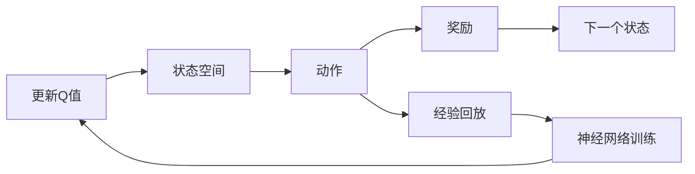

                 


# 《AI辅助的ESG投资组合优化工具》

## 关键词：ESG投资, AI辅助, 投资组合优化, 强化学习, 遗传算法, 系统架构, 项目实战

## 摘要：本文章深入探讨了AI辅助的ESG投资组合优化工具的背景、核心概念、算法原理、系统架构以及实际项目实现。通过分析ESG投资的重要性，结合AI技术在金融领域的应用，详细讲解了强化学习和遗传算法在投资组合优化中的应用，以及系统架构的设计与实现。文章还提供了具体的代码实现和案例分析，帮助读者理解如何利用AI技术优化ESG投资组合。

---

# 第一部分: ESG投资组合优化工具的背景与概念

# 第1章: ESG投资组合优化工具的背景介绍

## 1.1 ESG投资的定义与重要性

### 1.1.1 什么是ESG投资
ESG投资是指在投资决策中考虑环境（Environmental）、社会（Social）和治理（Governance）三个维度的因素，以实现可持续投资目标。

### 1.1.2 ESG投资的重要性
- **环境因素**：关注企业的碳排放、资源利用效率等，符合全球可持续发展目标。
- **社会因素**：关注企业的社会责任、员工权益等，有助于提升企业形象。
- **治理因素**：关注企业的管理层结构、董事会多样性等，有助于提升企业治理效率。

### 1.1.3 ESG投资的现状与趋势
- 当前，ESG投资在全球范围内迅速发展，越来越多的投资者将ESG因素纳入投资决策。
- 随着技术的进步，AI在ESG投资中的应用越来越广泛。

## 1.2 AI在金融领域的应用

### 1.2.1 AI在金融中的主要应用领域
- **股票预测**：利用机器学习模型预测股票价格走势。
- **风险控制**：通过AI技术识别和评估投资风险。
- **量化交易**：利用算法交易提高投资收益。

### 1.2.2 AI在投资组合优化中的作用
- **数据处理**：AI能够快速处理海量数据，提取有用信息。
- **模型构建**：AI能够构建复杂的数学模型，优化投资组合。
- **实时调整**：AI能够根据市场变化实时调整投资策略。

### 1.2.3 AI辅助ESG投资的潜力
- **数据挖掘**：AI能够从大量非结构化数据中提取ESG相关信息。
- **个性化投资**：AI能够根据投资者的偏好定制ESG投资组合。
- **风险降低**：AI能够通过优化模型降低投资风险。

## 1.3 ESG与AI的结合

### 1.3.1 ESG评分的定义
ESG评分是对企业在环境、社会和治理三个维度的表现进行量化评估的结果。

### 1.3.2 AI如何辅助ESG投资
- **数据清洗**：AI能够对ESG数据进行清洗和预处理。
- **评分预测**：AI能够基于历史数据预测企业的ESG评分。
- **投资决策**：AI能够根据ESG评分和市场数据优化投资组合。

### 1.3.3 ESG投资组合优化的核心问题
- **目标函数**：最大化投资收益，同时满足ESG评分要求。
- **约束条件**：投资组合中各资产的比例限制，风险控制等。

## 1.4 本章小结
本章介绍了ESG投资的定义、重要性以及AI在金融领域的应用，重点分析了ESG与AI结合的潜力和优化问题。

---

# 第二部分: ESG投资组合优化工具的核心概念与联系

# 第2章: ESG评分与AI模型的关系

## 2.1 ESG评分的计算方法

### 2.1.1 ESG评分的定义
ESG评分是对企业在环境、社会和治理三个维度的表现进行量化评估的结果。

### 2.1.2 ESG评分的计算步骤
1. 收集企业的ESG相关数据。
2. 根据评分标准对数据进行清洗和预处理。
3. 使用评分模型计算企业的ESG评分。

### 2.1.3 ESG评分的影响因素
- **环境因素**：碳排放、资源利用效率等。
- **社会因素**：员工权益、社会责任等。
- **治理因素**：董事会结构、管理层透明度等。

## 2.2 AI模型在ESG评分中的应用

### 2.2.1 机器学习在ESG评分中的作用
- **特征提取**：从文本数据中提取ESG相关特征。
- **评分预测**：利用机器学习模型预测企业的ESG评分。

### 2.2.2 深度学习在ESG评分中的优势
- **非结构化数据处理**：深度学习能够处理文本、图像等非结构化数据。
- **自动特征提取**：深度学习能够自动提取有用的特征，减少人工干预。

### 2.2.3 常见的ESG评分AI模型
- **基于LSTM的模型**：用于时间序列数据的预测。
- **基于CNN的模型**：用于图像数据的分析。
- **基于随机森林的模型**：用于特征重要性分析。

## 2.3 ESG评分与投资组合优化的关系

### 2.3.1 ESG评分对投资组合的影响
- **风险控制**：高ESG评分的企业通常具有较低的投资风险。
- **收益潜力**：高ESG评分的企业通常具有较高的长期收益潜力。

### 2.3.2 投资组合优化的目标
- **最大化收益**：在满足ESG评分要求的前提下，最大化投资组合的收益。
- **最小化风险**：通过优化模型降低投资组合的风险。

### 2.3.3 ESG评分在投资组合优化中的权重
- **权重分配**：根据投资者的偏好分配ESG评分的权重。
- **动态调整**：根据市场变化动态调整ESG评分的权重。

## 2.4 核心概念对比表格

### 2.4.1 ESG评分与传统财务指标对比
| 指标类型 | ESG评分 | 传统财务指标 |
|----------|----------|--------------|
| 数据来源 | 文本、结构化数据 | 财务报表数据 |
| 计算方法 | 机器学习模型 | 财务指标计算公式 |
| 应用场景 | ESG投资决策 | 传统投资决策 |

### 2.4.2 AI模型与传统模型在ESG评分中的对比
| 对比维度 | AI模型 | 传统模型 |
|----------|---------|-----------|
| 数据处理能力 | 强大 | 较弱 |
| 模型复杂度 | 高 | 低 |
| 预测精度 | 高 | 低 |

## 2.5 ER实体关系图

### 2.5.1 ESG评分实体关系图
```mermaid
er
    企业-ESG评分
    企业 -> (1..n): 拥有
    评分指标 -> (0..1): 属于
    ESG评分 <-[1]: 基于
    评分指标 <-[1]: 包含
```

### 2.5.2 AI模型与投资组合优化的实体关系图
```mermaid
er
    AI模型
    投资组合优化 <-[1]: 使用
    ESG评分 <-[1]: 输入
```

## 2.6 本章小结
本章分析了ESG评分的计算方法，AI模型在ESG评分中的应用，以及ESG评分与投资组合优化的关系，通过对比表格和ER图展示了核心概念之间的联系。

---

# 第三部分: ESG投资组合优化工具的算法原理

# 第3章: 强化学习在投资组合优化中的应用

## 3.1 强化学习的基本原理

### 3.1.1 强化学习的定义
强化学习是一种机器学习范式，通过智能体与环境的交互，学习最优策略。

### 3.1.2 强化学习的核心要素
- **状态（State）**：智能体所处的环境状态。
- **动作（Action）**：智能体根据当前状态采取的行动。
- **奖励（Reward）**：智能体采取行动后获得的反馈。

### 3.1.3 强化学习的数学模型
- **策略（Policy）**：$\pi(a|s)$，表示在状态$s$下采取动作$a$的概率。
- **价值函数（Value Function）**：$V(s)$，表示从状态$s$开始的期望收益。
- **Q值（Q-value）**：$Q(s,a)$，表示在状态$s$下采取动作$a$的期望收益。

## 3.2 强化学习在ESG投资中的应用

### 3.2.1 强化学习在投资组合优化中的优势
- **非线性关系处理**：强化学习能够处理复杂的非线性关系。
- **实时调整**：强化学习能够根据市场变化实时调整投资策略。

### 3.2.2 强化学习在ESG评分预测中的应用
- **状态定义**：企业的ESG评分、市场波动等。
- **动作定义**：买入、卖出、持有等。
- **奖励定义**：投资收益、风险控制等。

### 3.2.3 强化学习算法的实现步骤
1. **环境定义**：定义投资环境，包括可投资的资产、市场数据等。
2. **状态定义**：定义智能体的状态，包括当前的投资组合、市场指标等。
3. **动作定义**：定义智能体可采取的动作，包括买入、卖出、持有等。
4. **奖励函数定义**：定义奖励函数，根据投资收益和风险计算奖励。
5. **策略优化**：通过强化学习算法优化策略，最大化长期收益。

## 3.3 强化学习算法的数学公式

### 3.3.1 Q-learning算法
- **Q值更新公式**：
  $$ Q(s,a) = Q(s,a) + \alpha \left(r + \gamma \max_{a'} Q(s',a') - Q(s,a) \right) $$
  其中，$\alpha$是学习率，$\gamma$是折扣因子。

### 3.3.2 DQN算法
- **经验回放公式**：
  $$ \text{经验} = (s, a, r, s') $$
- **神经网络训练公式**：
  $$ \text{损失函数} = \sum (r + \gamma Q(s',a') - Q(s,a))^2 $$

### 3.3.3 策略梯度算法
- **策略更新公式**：
  $$ \theta = \theta + \alpha \nabla_\theta \left( \sum r \cdot \pi(a|s;\theta) \right) $$

## 3.4 强化学习算法的mermaid流程图

### 3.4.1 Q-learning流程图


### 3.4.2 DQN流程图


## 3.5 本章小结
本章详细讲解了强化学习的基本原理及其在ESG投资中的应用，通过数学公式和mermaid图展示了Q-learning、DQN和策略梯度算法的工作原理。

---

# 第4章: 遗传算法在投资组合优化中的应用

## 4.1 遗传算法的基本原理

### 4.1.1 遗传算法的定义
遗传算法是一种模拟生物进化过程的优化算法，通过自然选择和遗传变异来寻找最优解。

### 4.1.2 遗传算法的核心步骤
1. **初始化**：生成初始种群。
2. **适应度评估**：计算每个个体的适应度。
3. **选择**：根据适应度值选择优秀个体。
4. **交叉**：对选中的个体进行基因交叉，生成新个体。
5. **变异**：对新个体进行随机变异，增加种群多样性。
6. **迭代**：重复上述步骤，直到满足终止条件。

## 4.2 遗传算法在ESG投资中的应用

### 4.2.1 遗

