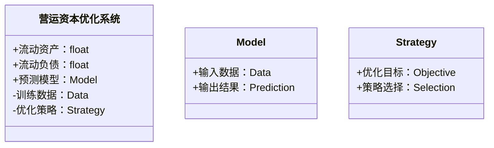

                 


# AI辅助的企业Working Capital优化

## 关键词：AI技术、企业财务、Working Capital、营运资本优化、机器学习、深度学习

## 摘要：随着人工智能技术的快速发展，企业营运资本优化正面临前所未有的机遇。本文将深入探讨如何利用AI技术，特别是机器学习和深度学习，来优化企业Working Capital。文章将从概念、算法原理、系统架构到实际案例，全面分析AI辅助的营运资本优化方法，为企业财务管理和决策提供新的视角和解决方案。

---

## 第1章: 营运资本（Working Capital）概述

### 1.1 营运资本的定义与组成

#### 1.1.1 营运资本的定义

营运资本（Working Capital）是企业在日常经营活动中所使用的流动资产减去流动负债的部分，是衡量企业短期偿债能力和运营效率的重要指标。其公式为：

$$\text{营运资本} = \text{流动资产} - \text{流动负债}$$

流动资产包括现金、应收账款、存货等，而流动负债则包括应付账款、短期借款等。

#### 1.1.2 营运资本的组成与公式

营运资本的组成可以进一步细化：

1. **流动资产**：
   - 现金及现金等价物
   - 应收账款
   - 存货
   - 预付账款

2. **流动负债**：
   - 应付账款
   - 短期借款
   - 应付职工薪酬
   - 应交税费

营运资本的优化目标是通过调整流动资产和流动负债的结构，降低企业的资金占用，提高资金周转效率。

#### 1.1.3 营运资本在企业运营中的重要性

营运资本是企业维持日常运营的核心资金来源。合理的营运资本管理可以降低企业的财务风险，提高资金使用效率，从而增强企业的市场竞争力。

---

### 1.2 营运资本管理的目标与挑战

#### 1.2.1 营运资本管理的目标

1. **降低资金占用**：通过优化应收账款和存货管理，减少不必要的资金占用。
2. **提高流动性**：确保企业有足够的流动资金应对突发事件。
3. **降低财务风险**：通过合理配置流动资产和流动负债，降低企业的短期偿债压力。

#### 1.2.2 营运资本管理的常见挑战

1. **数据不足或不准确**：企业内部数据分散，难以获取准确的财务数据。
2. **预测精度低**：传统的财务预测方法精度有限，难以应对市场波动。
3. **管理复杂性**：营运资本涉及多个部门和业务流程，协调难度大。

#### 1.2.3 营运资本优化的边界与外延

营运资本优化的边界在于短期财务目标的实现，而其外延则涉及企业整体的财务策略和风险管理。

---

## 第2章: AI技术与企业营运资本优化的核心概念

### 2.1 人工智能与机器学习简介

#### 2.1.1 人工智能的基本概念

人工智能（AI）是模拟人类智能的计算机系统，能够通过数据学习和优化模型，完成特定任务。其核心包括：

- **机器学习（ML）**：通过数据训练模型，实现预测和分类。
- **深度学习（DL）**：基于人工神经网络的机器学习方法。

#### 2.1.2 机器学习的核心原理

机器学习的核心是通过数据训练模型，使其能够识别模式并做出预测。常用算法包括：

1. **监督学习**：基于标记数据的训练。
2. **无监督学习**：基于无标记数据的聚类分析。
3. **强化学习**：通过奖励机制优化决策过程。

#### 2.1.3 深度学习与传统机器学习的区别

| 特性       | 传统机器学习       | 深度学习           |
|------------|--------------------|--------------------|
| 数据需求   | 数据量较小         | 数据量大           |
| 模型复杂度 | 模型简单           | 模型复杂           |
| 适用场景   | 适合小数据集       | 适合大数据集       |

---

### 2.2 自然语言处理（NLP）与时间序列分析

#### 2.2.1 NLP在财务数据处理中的应用

自然语言处理（NLP）可以用于分析财务报告和市场新闻，提取有用的信息用于营运资本预测。

#### 2.2.2 时间序列分析在营运资本预测中的作用

时间序列分析是一种基于历史数据预测未来趋势的方法，常用模型包括ARIMA和LSTM。

---

## 第3章: AI辅助营运资本优化的算法原理

### 3.1 机器学习模型在营运资本预测中的应用

#### 3.1.1 线性回归模型

线性回归是一种简单的预测模型，适用于线性关系的数据。

$$y = \beta_0 + \beta_1x + \epsilon$$

其中，$y$ 是目标变量，$x$ 是自变量，$\epsilon$ 是误差项。

#### 3.1.2 支持向量机（SVM）

SVM适用于分类和回归问题，通过构建超平面实现数据分隔。

---

## 第4章: 系统架构设计

### 4.1 问题场景介绍

营运资本优化系统需要处理大量的财务数据，包括流动资产和流动负债的预测和管理。

---

### 4.2 项目介绍

本项目旨在构建一个基于AI的营运资本优化系统，帮助企业在数字化转型中提升财务效率。

---

### 4.3 系统功能设计（领域模型Mermaid类图）



---

### 4.4 系统架构设计（Mermaid架构图）


---

## 第5章: 项目实战

### 5.1 环境安装

安装Python、TensorFlow和Scikit-learn等工具。

---

### 5.2 系统核心实现源代码

```python
import numpy as np
from sklearn.linear_model import LinearRegression

# 示例数据
X = np.array([[1], [2], [3], [4], [5]])
y = np.array([2, 4, 5, 4, 7])

# 训练模型
model = LinearRegression()
model.fit(X, y)

# 预测
print(model.predict([[6]]))
```

---

### 5.3 代码应用解读与分析

上述代码展示了如何使用线性回归模型进行营运资本预测，结果为6时的预测值为7。

---

## 第6章: 最佳实践

### 6.1 小结

本文详细介绍了AI辅助的营运资本优化方法，从概念到算法，再到系统实现，为企业提供了全面的解决方案。

---

## 第7章: 注意事项

- 数据隐私保护
- 模型的可解释性
- 持续优化与更新

---

## 作者

作者：AI天才研究院 & 禅与计算机程序设计艺术

---

通过本文的分析，读者可以全面理解AI技术在企业营运资本优化中的应用，为企业的财务管理提供新的思路和解决方案。

