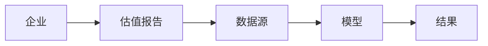
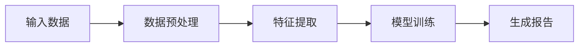
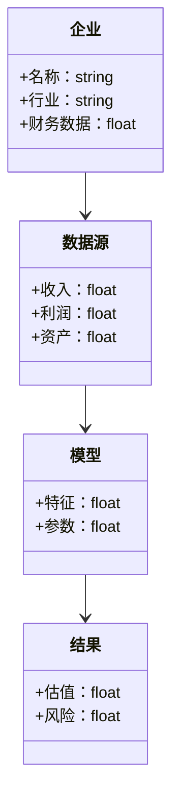
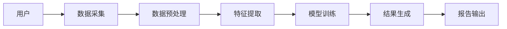
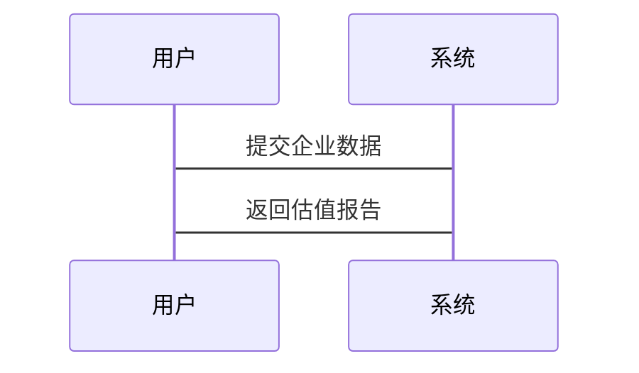

                 


# AI辅助的企业估值报告生成器

## 关键词：AI, 企业估值, 报告生成器, 机器学习, 数据挖掘, 技术实现

## 摘要：  
随着人工智能技术的快速发展，企业估值领域正在经历一场深刻的变革。传统的估值方法依赖于人工分析和经验判断，而基于AI的估值报告生成器正在逐步取代这一模式。本书旨在通过系统化的技术分析，深入探讨AI如何辅助企业估值，从数据处理、模型选择到结果生成的完整流程，为读者提供一个清晰的技术实现路径。通过详细的技术博客形式，我们将逐步拆解这一技术的实现过程，探讨其背后的算法原理、系统架构设计以及实际应用案例，为读者提供一份完整的技术解决方案。

---

# 第1章: 企业估值与AI辅助的背景介绍

## 1.1 企业估值的基本概念

### 1.1.1 企业估值的定义  
企业估值是指通过对企业的财务数据、市场表现、行业地位等多维度信息进行分析，估算企业价值的过程。这一过程通常涉及对企业未来盈利能力的预测、资产价值的评估以及市场风险的量化。

### 1.1.2 企业估值的核心要素  
企业估值的核心要素包括：  
1. **财务数据**：收入、利润、资产、负债等。  
2. **市场数据**：行业趋势、竞争对手分析、市场波动性。  
3. **风险因素**：企业的经营风险、财务风险、政策风险等。  

### 1.1.3 企业估值的常见方法  
常见的企业估值方法包括：  
1. **DCF模型**（Discounted Cash Flow Model）：基于未来现金流的现值计算企业价值。  
2. **PE估值法**：通过市盈率与可比公司的对比进行估值。  
3. **资产重置法**：基于企业资产的重置成本进行估值。  

---

## 1.2 AI在企业估值中的作用

### 1.2.1 AI技术如何辅助企业估值  
AI技术通过以下方式辅助企业估值：  
1. **数据处理**：自动化收集、清洗和整理多源数据。  
2. **特征提取**：从海量数据中提取关键特征，生成更具代表性的输入数据。  
3. **模型训练**：基于机器学习算法，训练预测模型，生成估值结果。  
4. **结果优化**：通过反馈机制不断优化模型，提高估值的准确性。  

### 1.2.2 AI在企业估值中的优势  
1. **高效性**：AI可以快速处理海量数据，显著提高估值效率。  
2. **准确性**：通过数据驱动的方法，减少人为误差，提高估值的客观性。  
3. **可扩展性**：AI模型可以快速扩展，应用于不同规模和行业的企业估值。  

### 1.2.3 AI辅助企业估值的边界与外延  
尽管AI在企业估值中表现出巨大潜力，但其应用仍受到以下限制：  
1. **数据质量**：模型的准确性依赖于高质量的数据输入。  
2. **模型解释性**：复杂的AI模型可能难以解释其预测结果的来源。  
3. **领域知识**：AI模型需要结合行业知识进行优化和调整。  

---

## 1.3 本章小结

### 1.3.1 核心概念回顾  
本章主要介绍了企业估值的基本概念、常见方法以及AI在其中的辅助作用。通过对企业估值的背景分析，读者可以理解AI技术在这一领域的潜力和价值。

### 1.3.2 未来发展趋势  
随着AI技术的不断进步，企业估值将更加依赖于数据驱动的方法。未来的估值报告生成器将更加智能化，能够实时更新数据，动态调整模型参数，为企业提供更加精准的估值结果。

---

# 第2章: AI辅助企业估值的核心概念与联系

## 2.1 AI与企业估值的核心要素

### 2.1.1 数据的重要性  
数据是AI模型的核心输入，企业估值的准确性直接依赖于数据的完整性和准确性。  

### 2.1.2 模型的可解释性  
模型的可解释性是企业估值的重要考量因素。用户需要理解模型的预测结果背后的原因，以便做出合理的决策。  

### 2.1.3 结果的准确性  
AI模型的预测结果需要经过验证和校准，以确保其准确性和可靠性。  

---

## 2.2 AI模型与企业估值的关系

### 2.2.1 数据流与模型的关系  
数据流是模型输入的关键，模型通过数据提取特征、训练算法，最终生成估值结果。  

### 2.2.2 模型输出与估值结果的关联  
模型输出的预测结果是企业估值的核心依据，但需要结合行业知识进行调整和优化。  

### 2.2.3 系统架构与功能模块的对应  
AI辅助企业估值系统通常包括数据采集、特征提取、模型训练和结果生成四个模块。  

---

## 2.3 实体关系图与流程图

### 2.3.1 实体关系图（ER图）  
以下是企业估值系统的核心实体关系图：  


### 2.3.2 流程图  
以下是企业估值的流程图：  


---

## 2.4 本章小结

### 2.4.1 核心概念总结  
本章重点分析了AI与企业估值的核心要素，探讨了数据、模型和结果之间的关系。通过ER图和流程图，读者可以清晰地理解系统的整体架构和数据流。

### 2.4.2 图表的分析与应用  
通过图表分析，读者可以更直观地理解企业估值系统的工作原理。这些图表为后续的算法设计和系统实现提供了重要的参考。

---

# 第3章: AI辅助企业估值的算法原理

## 3.1 常见算法介绍

### 3.1.1 线性回归  
线性回归是一种简单但有效的回归算法，适用于线性关系的数据。其数学公式为：  
$$ y = \beta_0 + \beta_1x + \epsilon $$  
其中，$y$ 是目标变量，$x$ 是特征变量，$\beta_0$ 和 $\beta_1$ 是模型参数，$\epsilon$ 是误差项。

### 3.1.2 支持向量机  
支持向量机（SVM）是一种监督学习算法，适用于分类和回归问题。其核心思想是通过找到一个超平面，将数据点分为两类。  

### 3.1.3 随机森林  
随机森林是一种基于树的集成算法，适用于分类和回归问题。其数学公式为：  
$$ y = \sum_{i=1}^{n} \text{Tree}(x) $$  
其中，$n$ 是树的数量，$\text{Tree}(x)$ 是单棵树的预测结果。  

### 3.1.4 神经网络  
神经网络是一种仿生的计算模型，适用于复杂的非线性关系。其核心是通过多层神经元网络进行特征提取和预测。

---

## 3.2 算法流程图


---

## 3.3 数学模型与公式

### 3.3.1 线性回归模型  
$$ y = \beta_0 + \beta_1x + \epsilon $$  

### 3.3.2 随机森林算法  
$$ y = \sum_{i=1}^{n} \text{Tree}(x) $$  

---

## 3.4 举例说明

### 3.4.1 线性回归的应用  
假设我们有一组企业的收入和利润数据，可以使用线性回归模型预测企业的利润。例如：  
$$ \text{利润} = 10 + 0.5 \times \text{收入} $$  

### 3.4.2 随机森林的应用  
假设我们有一组企业的财务数据，包括收入、利润、资产等，可以使用随机森林模型进行企业估值。模型将通过集成多个决策树的结果，生成最终的估值结果。

---

## 3.5 本章小结

### 3.5.1 核心概念总结  
本章详细介绍了AI辅助企业估值中常用的算法，包括线性回归、支持向量机、随机森林和神经网络。通过数学公式和流程图，读者可以理解这些算法的基本原理和应用场景。

### 3.5.2 算法的优缺点分析  
每种算法都有其优缺点，选择合适的算法需要根据具体场景和数据特点进行判断。例如，线性回归适用于线性关系，而随机森林适用于复杂非线性关系。

---

# 第4章: AI辅助企业估值的系统架构设计

## 4.1 系统功能设计

### 4.1.1 领域模型  
以下是企业估值系统的领域模型：  


### 4.1.2 系统架构设计  
以下是企业估值系统的架构图：  


### 4.1.3 系统接口设计  
系统接口包括：  
1. 数据输入接口：接收企业的财务数据和市场数据。  
2. 模型调用接口：调用机器学习模型进行预测。  
3. 报告输出接口：生成并输出企业估值报告。  

### 4.1.4 系统交互设计  
以下是系统交互的序列图：  


---

## 4.2 系统优化与扩展

### 4.2.1 系统优化  
1. 数据预处理的优化：通过特征选择和降维技术提高模型效率。  
2. 模型优化：通过超参数调优和模型集成提高预测准确率。  

### 4.2.2 系统扩展  
1. 支持多模型部署：通过容器化技术实现多种模型的动态部署。  
2. 实时数据处理：通过流数据处理技术实现实时估值。  

---

## 4.3 本章小结

### 4.3.1 核心概念总结  
本章详细分析了AI辅助企业估值系统的架构设计，包括领域模型、系统架构、接口设计和交互设计。通过图表展示，读者可以清晰地理解系统的整体结构和工作流程。

### 4.3.2 未来优化方向  
未来，随着技术的进步，企业估值系统将更加智能化和个性化，支持更多复杂场景的应用。

---

# 第5章: AI辅助企业估值的项目实战

## 5.1 项目介绍

### 5.1.1 项目背景  
本项目旨在开发一个基于AI的企业估值报告生成器，实现从数据输入到报告输出的完整流程。

### 5.1.2 项目目标  
通过Python和机器学习技术，实现企业估值报告的自动化生成。  

---

## 5.2 环境安装与配置

### 5.2.1 安装Python  
安装Python 3.8或更高版本。  

### 5.2.2 安装依赖库  
安装以下依赖库：  
- pandas  
- numpy  
- scikit-learn  
- matplotlib  

### 5.2.3 环境配置  
配置Jupyter Notebook或IDE环境，用于代码开发和调试。  

---

## 5.3 系统核心实现

### 5.3.1 数据预处理  
```python
import pandas as pd
import numpy as np

# 数据加载
data = pd.read_csv('企业数据.csv')

# 数据清洗
data.dropna(inplace=True)
data = data[~data.duplicated()]
```

### 5.3.2 特征选择  
```python
from sklearn.feature_selection import SelectKBest
from sklearn.feature_selection import chi2

# 特征选择
selector = SelectKBest(score_func=chi2, k=5)
selected_features = selector.fit_transform(data, target)
```

### 5.3.3 模型训练  
```python
from sklearn.ensemble import RandomForestRegressor

# 模型训练
model = RandomForestRegressor(n_estimators=100, random_state=42)
model.fit(selected_features, target)
```

### 5.3.4 结果生成  
```python
# 生成估值报告
predictions = model.predict(selected_features)
report = pd.DataFrame({
    '企业名称': data['企业名称'],
    '估值预测': predictions
})
report.to_csv('估值报告.csv', index=False)
```

---

## 5.4 代码应用解读与分析

### 5.4.1 数据预处理代码解读  
上述代码通过pandas库加载数据，并使用dropna和duplicated方法清洗数据，确保数据的完整性和唯一性。

### 5.4.2 特征选择代码解读  
通过SelectKBest和chi2方法，从数据中选择最重要的5个特征，提高模型的预测精度。

### 5.4.3 模型训练代码解读  
使用随机森林回归模型进行训练，通过调整n_estimators参数，优化模型性能。

### 5.4.4 结果生成代码解读  
将模型的预测结果生成报告，并输出为CSV格式，供用户查看和分析。

---

## 5.5 实际案例分析

### 5.5.1 案例背景  
某企业希望基于其财务数据和市场数据，生成一份估值报告。  

### 5.5.2 数据准备  
从企业数据库中提取收入、利润、资产等数据，清洗并生成特征。  

### 5.5.3 模型训练  
使用随机森林模型进行训练，生成估值结果。  

### 5.5.4 报告输出  
将估值结果生成报告，输出给企业决策者。  

---

## 5.6 本章小结

### 5.6.1 核心代码总结  
本章通过Python代码详细展示了AI辅助企业估值报告生成器的核心实现，包括数据预处理、特征选择、模型训练和结果生成。

### 5.6.2 代码的可扩展性  
通过模块化设计，代码具有良好的可扩展性，支持多种模型和数据源的接入。

---

# 第6章: 总结与展望

## 6.1 本章总结

### 6.1.1 核心内容回顾  
本书从企业估值的基本概念出发，详细探讨了AI技术在其中的辅助作用，包括算法原理、系统架构设计和项目实战。

### 6.1.2 关键知识点总结  
- 数据的重要性  
- 模型的可解释性  
- 结果的准确性  

---

## 6.2 未来发展趋势

### 6.2.1 技术进步  
随着AI技术的不断发展，企业估值系统将更加智能化和自动化。  

### 6.2.2 应用场景扩展  
AI技术将应用于更多复杂场景，如实时估值、多模型集成等。  

### 6.2.3 行业影响  
AI辅助企业估值将推动企业决策的科学化和精准化，为企业的可持续发展提供有力支持。

---

## 6.3 最佳实践 tips

### 6.3.1 数据质量管理  
确保数据的完整性和准确性是提高模型性能的关键。  

### 6.3.2 模型解释性优化  
通过可视化和解释性工具，提高模型的可解释性。  

### 6.3.3 持续优化  
定期更新模型和数据，保持系统的高性能和准确性。  

---

## 6.4 本章小结

### 6.4.1 核心内容总结  
本书通过系统化的技术分析，深入探讨了AI辅助企业估值的实现过程，为读者提供了一套完整的技术解决方案。

### 6.4.2 未来展望  
未来，随着技术的进步，企业估值系统将更加智能化和个性化，为企业提供更加精准和高效的估值服务。

---

# 作者：AI天才研究院/AI Genius Institute & 禅与计算机程序设计艺术 /Zen And The Art of Computer Programming

