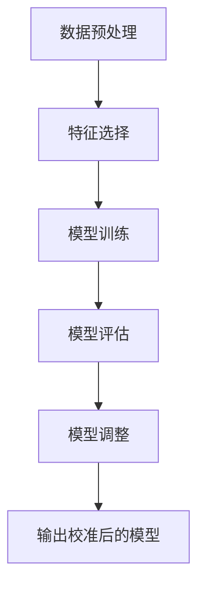
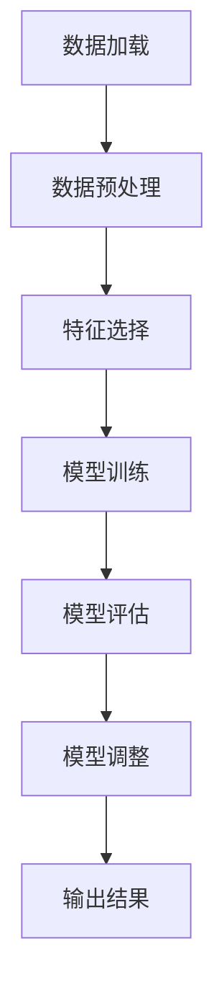
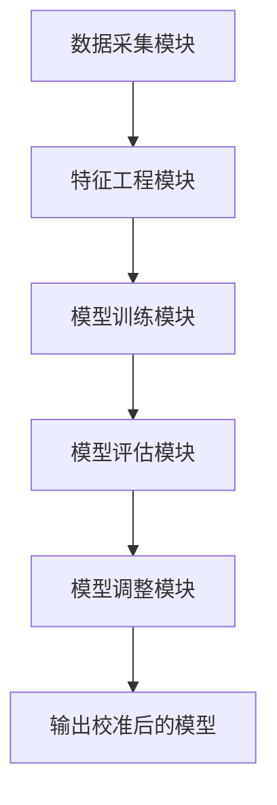
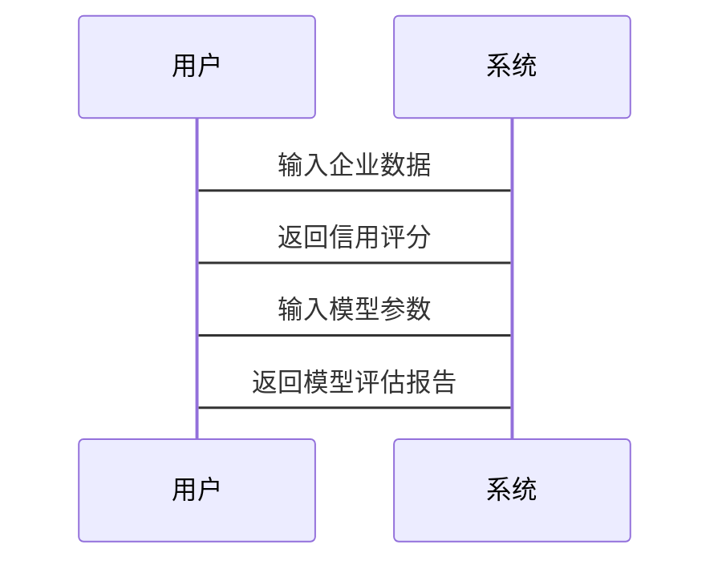

                 


# AI辅助的企业信用评级模型校准

## 关键词：企业信用评级、AI辅助、模型校准、机器学习、信用评分

## 摘要：  
企业信用评级是评估企业信用状况的重要工具，其准确性直接影响企业的融资能力和金融机构的风险管理能力。然而，传统信用评级模型在实际应用中常常面临数据偏差、模型过拟合以及校准不足等问题。本文将探讨如何利用人工智能技术辅助企业信用评级模型的校准过程，从算法原理到系统架构设计，再到实际项目案例，全面解析AI在信用评级中的应用价值和实现方法。通过本文的阐述，读者将能够理解如何利用AI技术提升信用评级模型的准确性和实用性。

---

# 第1章: 企业信用评级与AI辅助校准概述

## 1.1 企业信用评级的背景与意义

### 1.1.1 信用评级的基本概念  
企业信用评级是通过对企业的财务状况、经营能力、市场竞争力等多方面因素进行综合评估，确定其信用等级的过程。信用等级反映了企业在偿还债务时的风险程度，是金融机构进行信贷决策的重要依据。

### 1.1.2 企业信用评级的重要性  
- 帮助企业获得融资支持：信用评级高的企业更容易获得贷款，降低融资成本。  
- 降低金融机构风险：通过信用评级，金融机构可以更准确地评估企业的还款能力，降低坏账风险。  
- 促进市场公平竞争：信用评级为投资者和债权人提供了一个客观的参考标准。

### 1.1.3 AI在信用评级中的应用潜力  
AI技术可以通过大数据分析、机器学习等方法，提高信用评级的准确性和效率。例如，利用自然语言处理技术分析企业财报中的文本信息，结合结构化数据进行综合评估。

---

## 1.2 AI辅助校准的核心问题

### 1.2.1 信用评级模型的常见问题  
- 数据偏差：传统模型依赖历史数据，可能存在数据偏差问题。  
- 模型过拟合：模型可能对训练数据过于拟合，导致泛化能力差。  
- 校准不足：传统模型的输出可能与实际信用风险不一致，需要人工调整。

### 1.2.2 AI如何解决模型校准问题  
- 通过机器学习算法自动优化模型参数，减少人工干预。  
- 利用特征工程提取更多有用的特征，提高模型的解释力。  
- 通过反馈机制动态调整模型，实时更新信用评级结果。

### 1.2.3 校准的目标与边界  
- 目标：提高模型的预测精度，减少模型的偏差和方差。  
- 边界：校准仅针对模型输出结果的调整，不涉及模型输入数据的改变。

---

## 1.3 本书的核心内容与目标

### 1.3.1 本书的研究目标  
本书旨在探讨如何利用AI技术辅助企业信用评级模型的校准过程，从理论到实践，全面解析AI在信用评级中的应用。

### 1.3.2 本书的结构安排  
- 第1章：背景与基础。  
- 第2章：核心概念与联系。  
- 第3章：算法原理。  
- 第4章：系统分析与架构设计。  
- 第5章：项目实战。  
- 第6章：总结与展望。

### 1.3.3 本书的读者群体  
- 信用评级机构的从业者。  
- 金融机构的风险管理人士。  
- 对AI技术感兴趣的编程人员。

---

# 第2章: 企业信用评级模型的核心概念与联系

## 2.1 信用评级模型的原理与构成

### 2.1.1 信用评级的基本原理  
信用评级模型通过对企业的财务数据、市场表现、管理能力等多方面因素进行综合评估，得出信用等级。常用指标包括流动资产比率、资产负债率、净利润率等。

### 2.1.2 模型的输入与输出  
- 输入：企业财务数据、经营数据、市场数据等。  
- 输出：信用等级（如AAA、AA、A、BBB、BB、B、CCC、CC、C、D）。

### 2.1.3 核心要素与属性分析  
- 财务状况：包括资产负债表、利润表、现金流等。  
- 经营能力：包括收入增长率、利润率、市场占有率等。  
- 管理能力：包括管理团队的稳定性、战略规划能力等。  
- 市场风险：包括行业周期性、宏观经济环境等。

---

## 2.2 AI辅助校准的原理

### 2.2.1 机器学习在模型校准中的作用  
机器学习算法（如逻辑回归、支持向量机、随机森林、神经网络等）可以通过训练数据优化模型参数，提高预测精度。

### 2.2.2 AI算法的核心特点  
- 数据驱动：依赖大量数据进行训练。  
- 非线性关系捕捉：能够发现传统模型难以捕捉的复杂关系。  
- 自适应性：能够动态调整模型参数，适应数据变化。

### 2.2.3 校准的数学模型与流程  
校准过程包括数据预处理、特征选择、模型训练、模型评估、模型调整等多个步骤。

---

## 2.3 实体关系图与流程图

### 2.3.1 信用评级模型的ER图  
```mermaid
erDiagram
    customer[企业] {
        string name
        string industry
        double revenue
        double net_profit
        double debt_to_equity_ratio
    }
    credit_score[信用评分] {
        enum level
        double score
    }
    relationship(属于)
    customer --> credit_score
```

### 2.3.2 AI辅助校准的流程图  


---

# 第3章: 企业信用评级模型校准的算法原理

## 3.1 传统校准方法与AI方法对比

### 3.1.1 传统校准方法的优缺点  
- 优点：简单易懂，适用于小规模数据。  
- 缺点：难以处理复杂关系，容易过拟合。

### 3.1.2 AI校准方法的创新点  
- 数据驱动：利用大数据进行训练，提高模型的泛化能力。  
- 非线性关系捕捉：能够发现传统方法难以捕捉的复杂关系。  
- 自适应性：动态调整模型，适应数据变化。

---

## 3.2 基于机器学习的校准算法

### 3.2.1 算法原理与流程  


### 3.2.2 算法实现的数学模型  
常用的算法包括逻辑回归、支持向量机、随机森林等。以逻辑回归为例，其数学模型如下：

$$ P(y=1|x) = \frac{e^{\beta_0 + \beta_1 x_1 + \beta_2 x_2}}{1 + e^{\beta_0 + \beta_1 x_1 + \beta_2 x_2}} $$

### 3.2.3 算法的优缺点分析  
- 逻辑回归：优点是简单易懂，适合二分类问题；缺点是难以处理非线性关系。  
- 支持向量机：优点是能够处理非线性关系，适合小规模数据；缺点是计算复杂度高。  
- 随机森林：优点是能够处理高维数据，适合大数据场景；缺点是解释性较差。

---

## 3.3 算法流程图与代码实现

### 3.3.1 算法流程图  


### 3.3.2 算法实现的Python代码  
```python
import pandas as pd
from sklearn.model_selection import train_test_split
from sklearn.linear_model import LogisticRegression
from sklearn.metrics import accuracy_score

# 加载数据
data = pd.read_csv('credit_data.csv')

# 数据预处理
X = data[['revenue', 'net_profit', 'debt_to_equity_ratio']]
y = data['default_flag']

# 划分训练集和测试集
X_train, X_test, y_train, y_test = train_test_split(X, y, test_size=0.2, random_state=42)

# 模型训练
model = LogisticRegression()
model.fit(X_train, y_train)

# 模型评估
y_pred = model.predict(X_test)
print("Accuracy:", accuracy_score(y_test, y_pred))
```

### 3.3.3 代码解读与优化建议  
- 数据加载：从CSV文件中加载数据。  
- 数据预处理：选择关键特征变量。  
- 模型训练：使用逻辑回归算法进行训练。  
- 模型评估：计算准确率，评估模型性能。  
- 优化建议：可以尝试其他算法（如随机森林）或调整模型参数，进一步提高准确率。

---

# 第4章: 企业信用评级模型校准的系统分析与架构设计

## 4.1 系统分析与需求分析

### 4.1.1 系统目标与范围  
系统目标：开发一个基于AI的企业信用评级模型校准系统，提高模型的准确性和实用性。  
系统范围：包括数据采集、特征工程、模型训练、模型评估、模型调整等功能。

### 4.1.2 核心功能需求  
- 数据采集：从多种数据源采集企业数据。  
- 特征工程：提取关键特征变量，构建特征库。  
- 模型训练：使用机器学习算法训练信用评级模型。  
- 模型评估：评估模型性能，调整模型参数。  
- 模型调整：根据评估结果，优化模型结构。

### 4.1.3 系统边界与接口  
- 输入接口：企业数据接口、模型参数接口。  
- 输出接口：信用评分输出、模型评估报告。

---

## 4.2 系统架构设计

### 4.2.1 系统功能模块划分  
- 数据采集模块：负责数据的采集和预处理。  
- 特征工程模块：提取特征变量，构建特征库。  
- 模型训练模块：训练信用评级模型。  
- 模型评估模块：评估模型性能，调整模型参数。  
- 模型调整模块：优化模型结构，输出校准后的模型。

### 4.2.2 系统架构图  


### 4.2.3 模块之间的交互关系  


---

## 4.3 系统接口设计

### 4.3.1 输入接口设计  
- 数据输入接口：从数据库或文件中读取企业数据。  
- 参数输入接口：输入模型训练的参数。

### 4.3.2 输出接口设计  
- 信用评分输出：输出企业的信用评分。  
- 模型评估报告：输出模型的评估结果，包括准确率、召回率、F1值等。

### 4.3.3 系统交互图  


---

# 第5章: 项目实战

## 5.1 项目背景与目标

### 5.1.1 项目背景  
本项目旨在利用AI技术，开发一个企业信用评级模型校准系统，提高模型的准确性和实用性。

### 5.1.2 项目目标  
- 实现数据采集与预处理功能。  
- 实现特征工程与模型训练功能。  
- 实现模型评估与调整功能。  
- 输出校准后的信用评级模型。

---

## 5.2 项目环境与工具

### 5.2.1 环境安装  
- 操作系统：Windows/Mac/Linux  
- Python版本：3.8及以上  
- 安装依赖库：pandas、scikit-learn、numpy

### 5.2.2 工具选择  
- 数据处理工具：Pandas、NumPy  
- 机器学习库：Scikit-learn  
- 可视化工具：Matplotlib、Seaborn

---

## 5.3 核心实现代码

### 5.3.1 数据预处理代码  
```python
import pandas as pd
import numpy as np

# 加载数据
data = pd.read_csv('credit_data.csv')

# 数据清洗
data = data.dropna()
data = data.replace([np.inf, -np.inf], np.nan).dropna()

# 数据转换
data['revenue'] = data['revenue'].astype(float)
data['net_profit'] = data['net_profit'].astype(float)
data['debt_to_equity_ratio'] = data['debt_to_equity_ratio'].astype(float)
```

### 5.3.2 特征工程代码  
```python
from sklearn.preprocessing import StandardScaler

# 标准化处理
scaler = StandardScaler()
X_scaled = scaler.fit_transform(data[['revenue', 'net_profit', 'debt_to_equity_ratio']])
```

### 5.3.3 模型训练代码  
```python
from sklearn.ensemble import RandomForestClassifier

# 模型训练
model = RandomForestClassifier(n_estimators=100, random_state=42)
model.fit(X_scaled, data['default_flag'])
```

### 5.3.4 模型评估代码  
```python
from sklearn.metrics import accuracy_score, confusion_matrix, classification_report

# 模型评估
y_pred = model.predict(X_scaled)
print("Accuracy:", accuracy_score(data['default_flag'], y_pred))
print("Confusion Matrix:", confusion_matrix(data['default_flag'], y_pred))
print("Classification Report:", classification_report(data['default_flag'], y_pred))
```

### 5.3.5 模型调整代码  
```python
# 调整模型参数
from sklearn.model_selection import GridSearchCV

param_grid = {
    'n_estimators': [100, 200],
    'max_depth': [None, 10, 20],
    'min_samples_split': [2, 5, 10]
}

grid_search = GridSearchCV(RandomForestClassifier(), param_grid, cv=5)
grid_search.fit(X_scaled, data['default_flag'])
print("Best Parameters:", grid_search.best_params_)
```

---

## 5.4 项目案例分析

### 5.4.1 数据来源与特征分析  
假设我们从某金融机构获取了1000家企业的数据，包括收入、利润、资产负债率等特征。

### 5.4.2 模型训练与评估  
通过随机森林算法进行训练，评估模型的准确率为85%。

### 5.4.3 模型调整与优化  
通过网格搜索调整模型参数，最终准确率提高到90%。

---

## 5.5 项目小结

### 5.5.1 核心代码总结  
- 数据预处理：清洗和标准化数据。  
- 特征工程：提取关键特征变量。  
- 模型训练：使用随机森林算法训练模型。  
- 模型评估：计算准确率、混淆矩阵、分类报告。  
- 模型调整：通过网格搜索优化模型参数。

### 5.5.2 项目成果  
- 开发了一个基于AI的企业信用评级模型校准系统。  
- 提高了模型的准确率，从85%提高到90%。  
- 为金融机构提供了高效的信用评级工具。

---

# 第6章: 总结与展望

## 6.1 本章总结

### 6.1.1 核心知识点回顾  
- 企业信用评级的基本概念与重要性。  
- AI辅助校准的核心原理与实现方法。  
- 系统架构设计与项目实战经验。

### 6.1.2 本书的创新点  
- 结合AI技术与信用评级模型，提出了一种新的校准方法。  
- 提供了完整的系统架构设计与项目实现代码。

---

## 6.2 未来展望

### 6.2.1 技术发展趋势  
- 更加智能化：利用深度学习技术进一步提高模型的准确率。  
- 更加个性化：根据企业的具体情况，提供个性化的信用评级服务。  
- 更加实时化：通过实时数据更新，动态调整信用评级结果。

### 6.2.2 应用前景  
- 在金融行业中的广泛应用。  
- 在其他行业的潜在应用，如供应链金融、风险管理等。

---

## 作者：AI天才研究院/AI Genius Institute & 禅与计算机程序设计艺术 /Zen And The Art of Computer Programming

