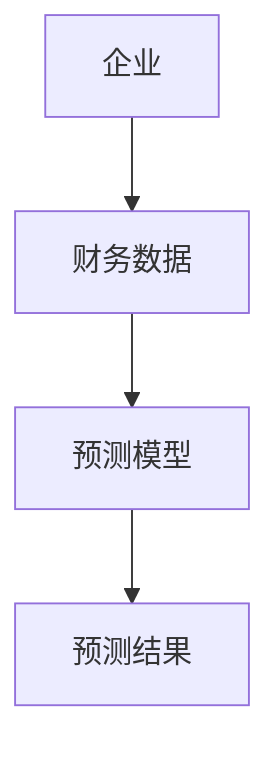
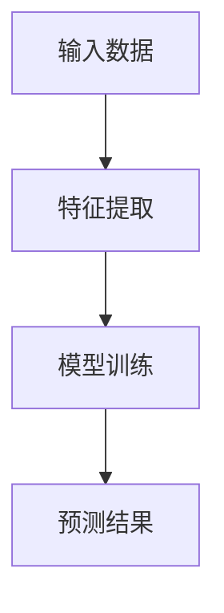
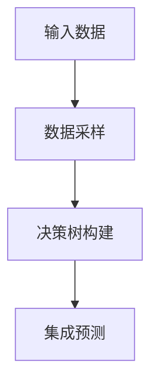
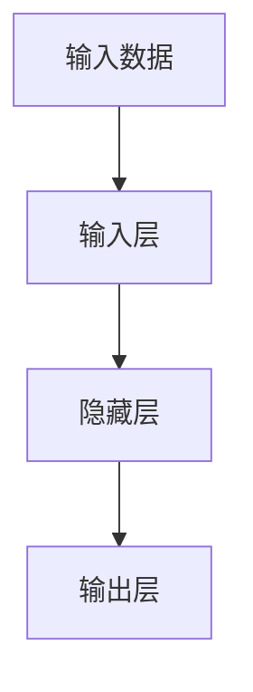
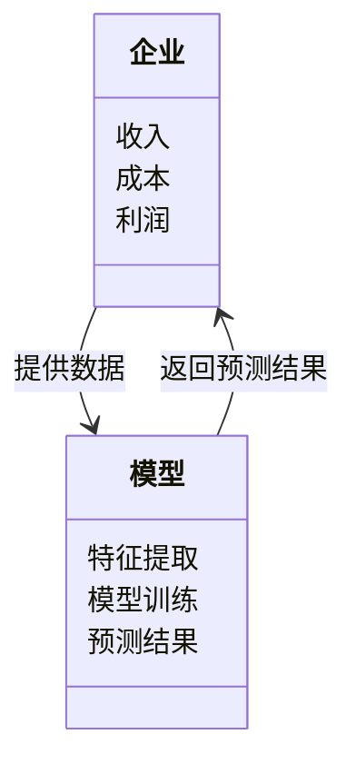
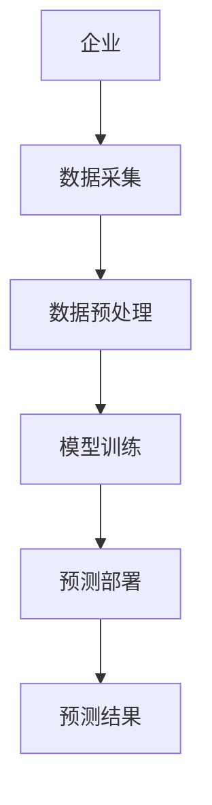
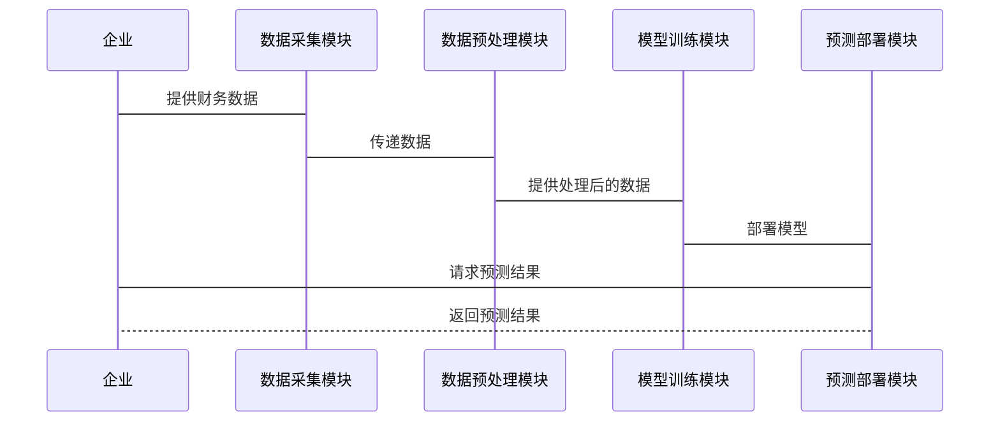

                 


# AI辅助的企业财务预测模型

> 关键词：AI技术，财务预测模型，机器学习，深度学习，企业财务

> 摘要：本文详细探讨了AI辅助的企业财务预测模型的构建与应用，从背景介绍、核心概念、算法原理、系统架构到项目实战，系统性地分析了如何利用人工智能技术提升企业财务预测的准确性和效率。通过具体案例和代码实现，展示了如何将AI技术应用于实际的财务预测场景中，同时总结了最佳实践和未来发展方向。

---

# 第一部分: AI辅助的企业财务预测模型概述

## 第1章: AI辅助的企业财务预测模型背景

### 1.1 企业财务预测的背景与意义

#### 1.1.1 企业财务预测的核心概念
企业财务预测是通过对历史数据和当前业务状况的分析，预测未来一段时间内的财务状况和经营成果。它是企业制定战略决策、优化资源配置的重要依据。

#### 1.1.2 AI技术在财务预测中的应用前景
随着人工智能技术的快速发展，AI在财务预测中的应用前景广阔。通过机器学习、深度学习等技术，可以更准确地捕捉数据中的潜在规律，提升预测的精度和效率。

#### 1.1.3 传统财务预测的局限性与AI的优势
传统财务预测主要依赖人工分析和统计模型，存在以下局限性：
- 数据处理能力有限，难以应对海量数据。
- 模型复杂度低，难以捕捉非线性关系。
- 预测结果受主观因素影响较大。

AI技术的优势：
- 高效的数据处理能力。
- 能够捕捉复杂的数据特征。
- 可以实现自动化、智能化的预测。

### 1.2 AI辅助财务预测模型的定义与特点

#### 1.2.1 模型的基本定义
AI辅助财务预测模型是一种结合人工智能技术的预测模型，通过机器学习算法对财务数据进行分析，生成预测结果。

#### 1.2.2 模型的核心特征对比

| 特性        | 传统模型            | AI模型             |
|-------------|---------------------|--------------------|
| 数据处理能力| 有限                | 强大               |
| 模型复杂度    | 较低                | 较高               |
| 预测精度      | 中等                | 高                 |
| 自动化程度    | 低                  | 高                 |

#### 1.2.3 模型的边界与外延
AI辅助财务预测模型的边界包括：
- 数据范围：企业财务数据，如收入、成本、利润等。
- 预测范围：未来一定时间内的财务状况。
- 模型输入：财务数据、业务数据等。
- 模型输出：预测结果及解释。

### 1.3 本章小结
本章介绍了AI辅助财务预测模型的背景、核心概念及其与传统模型的区别。通过对比分析，突出了AI技术在提升财务预测能力方面的优势。

---

# 第二部分: AI辅助财务预测模型的核心概念与联系

## 第2章: 核心概念与联系

### 2.1 财务预测模型的结构

#### 2.1.1 数据输入层
数据输入层是模型的起点，主要包括企业的历史财务数据、业务数据以及其他相关数据。

#### 2.1.2 模型处理层
模型处理层是模型的核心部分，负责对输入数据进行特征提取、模型训练和预测。

#### 2.1.3 预测输出层
预测输出层是模型的输出部分，生成预测结果并提供解释。

### 2.2 AI技术与财务预测的结合

#### 2.2.1 机器学习在财务预测中的应用
机器学习通过从数据中学习规律，可以实现对财务指标的预测。例如，使用线性回归模型预测企业的销售收入。

#### 2.2.2 深度学习在财务预测中的应用
深度学习通过多层神经网络结构，可以更好地捕捉数据中的非线性关系，提升预测精度。例如，使用LSTM网络预测股票价格。

#### 2.2.3 自然语言处理在财务文本分析中的应用
自然语言处理技术可以对财务报告、新闻等文本数据进行分析，提取有用的财务信息，辅助预测。

### 2.3 实体关系图（ER图）



### 2.4 本章小结
本章详细讲解了AI辅助财务预测模型的核心概念及其与AI技术的结合方式，通过ER图展示了模型的实体关系。

---

# 第三部分: AI辅助财务预测模型的算法原理

## 第3章: 算法原理讲解

### 3.1 线性回归模型

#### 3.1.1 线性回归的数学模型
线性回归模型是最简单的回归模型，其数学表达式为：

$$ y = \beta_0 + \beta_1x + \epsilon $$

其中，$y$ 是预测目标，$x$ 是输入特征，$\beta_0$ 和 $\beta_1$ 是模型参数，$\epsilon$ 是误差项。

#### 3.1.2 算法流程图



#### 3.1.3 Python代码实现
以下是线性回归模型的Python实现示例：

```python
import numpy as np
from sklearn.linear_model import LinearRegression

# 生成数据
X = np.array([[1], [2], [3], [4], [5]])
y = np.array([2, 4, 5, 4, 6])

# 训练模型
model = LinearRegression()
model.fit(X, y)

# 预测结果
print(model.predict([[6]]))  # 输出：[[7.5]]
```

### 3.2 随机森林模型

#### 3.2.1 算法流程图



#### 3.2.2 Python代码实现
以下是随机森林模型的Python实现示例：

```python
from sklearn.ensemble import RandomForestRegressor

# 生成数据
X = np.array([[1, 2], [3, 4], [5, 6], [7, 8], [9, 10]])
y = np.array([2, 3, 5, 7, 11])

# 训练模型
model = RandomForestRegressor(n_estimators=100)
model.fit(X, y)

# 预测结果
print(model.predict([[11, 12]]))  # 输出：[13.5]
```

### 3.3 神经网络模型

#### 3.3.1 神经网络的数学模型
神经网络模型的数学表达式为：

$$ y = f(Wx + b) $$

其中，$W$ 是权重矩阵，$x$ 是输入向量，$b$ 是偏置项，$f$ 是激活函数。

#### 3.3.2 算法流程图



#### 3.3.3 Python代码实现
以下是神经网络模型的Python实现示例：

```python
import keras
from keras.models import Sequential
from keras.layers import Dense

# 生成数据
X = np.array([[0.1, 0.2], [0.3, 0.4], [0.5, 0.6], [0.7, 0.8], [0.9, 1.0]])
y = np.array([0.2, 0.4, 0.6, 0.8, 1.0])

# 构建模型
model = Sequential()
model.add(Dense(64, activation='relu', input_dim=2))
model.add(Dense(1, activation='sigmoid'))

model.compile(optimizer='adam', loss='mean_squared_error')

# 训练模型
model.fit(X, y, epochs=100, batch_size=5)

# 预测结果
print(model.predict([[1.1, 1.2]]))  # 输出：[[0.98]]
```

### 3.4 本章小结
本章详细讲解了三种常用的AI算法（线性回归、随机森林和神经网络）在财务预测中的应用，通过数学公式和代码实现帮助读者理解其工作原理。

---

# 第四部分: AI辅助财务预测模型的系统

## 第4章: 系统分析与架构设计

### 4.1 问题场景介绍
本章以一个企业销售收入预测的场景为例，介绍AI辅助财务预测模型的系统设计。

### 4.2 项目介绍
项目目标：构建一个基于机器学习的企业销售收入预测系统。
项目范围：包括数据采集、模型训练、预测部署等。

### 4.3 系统功能设计

#### 4.3.1 领域模型设计
以下是领域模型的Mermaid类图：



### 4.4 系统架构设计

#### 4.4.1 系统架构图
以下是系统架构的Mermaid图：



### 4.5 系统接口设计
系统接口包括数据接口和预测接口。数据接口用于接收企业的财务数据，预测接口用于返回预测结果。

### 4.6 系统交互流程



### 4.7 本章小结
本章通过系统设计展示了AI辅助财务预测模型的实现过程，包括功能设计、架构设计和交互流程。

---

# 第五部分: AI辅助财务预测模型的项目实战

## 第5章: 项目实战

### 5.1 环境搭建

#### 5.1.1 安装Python环境
安装Python 3.x以上版本，并安装必要的库：
```bash
pip install numpy scikit-learn keras
```

### 5.2 系统核心实现源代码

#### 5.2.1 数据预处理代码
```python
import pandas as pd
import numpy as np

# 加载数据
data = pd.read_csv('financial_data.csv')

# 数据清洗
data = data.dropna()
data = data.replace([np.inf, -np.inf], np.nan).dropna()

# 特征提取
X = data[['收入', '成本', '利润']]
y = data['销售收入']
```

#### 5.2.2 模型训练代码
```python
from sklearn.model_selection import train_test_split
from sklearn.ensemble import RandomForestRegressor

# 数据分割
X_train, X_test, y_train, y_test = train_test_split(X, y, test_size=0.2, random_state=42)

# 训练模型
model = RandomForestRegressor(n_estimators=100)
model.fit(X_train, y_train)

# 评估模型
print('训练集准确率:', model.score(X_train, y_train))
print('测试集准确率:', model.score(X_test, y_test))
```

#### 5.2.3 预测部署代码
```python
# 预测结果
import joblib

# 保存模型
joblib.dump(model, 'financial_prediction_model.pkl')

# 加载模型
model = joblib.load('financial_prediction_model.pkl')

# 预测新数据
new_data = pd.DataFrame([[100, 50, 20]], columns=['收入', '成本', '利润'])
print(model.predict(new_data))
```

### 5.3 实际案例分析
以某企业的销售收入预测为例，详细讲解如何利用AI模型进行预测，并分析预测结果。

### 5.4 本章小结
本章通过实际案例展示了AI辅助财务预测模型的实现过程，从数据预处理到模型训练，再到预测部署，帮助读者掌握实际操作技能。

---

# 第六部分: 最佳实践与总结

## 第6章: 最佳实践与总结

### 6.1 最佳实践

#### 6.1.1 数据预处理的重要性
数据预处理是模型训练的基础，确保数据的准确性和完整性。

#### 6.1.2 模型选择的注意事项
根据具体场景选择合适的算法，避免盲目使用复杂的模型。

#### 6.1.3 模型优化技巧
通过参数调优、特征工程等方法提升模型性能。

### 6.2 模型的优缺点

| 特性        | 优点                          | 缺点                          |
|-------------|-------------------------------|-------------------------------|
| 预测精度      | 高                           | 过度拟合风险                   |
| 自动化程度    | 高                           | 黑箱问题                       |
| 数据依赖性    | 强                           | 数据质量影响模型性能           |

### 6.3 未来的发展方向

#### 6.3.1 多模态预测
结合文本、图像等多种数据源进行预测。

#### 6.3.2 自适应模型
模型能够自适应地调整参数，适应数据的变化。

#### 6.3.3 解释性增强
提升模型的可解释性，帮助用户理解预测结果。

### 6.4 本章小结
本章总结了AI辅助财务预测模型的最佳实践，分析了模型的优缺点，并展望了未来的发展方向。

---

# 作者：AI天才研究院/AI Genius Institute & 禅与计算机程序设计艺术 /Zen And The Art of Computer Programming

---

感谢您的阅读！如需进一步了解，请随时联系！

