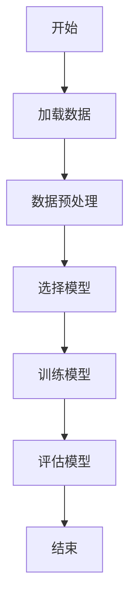
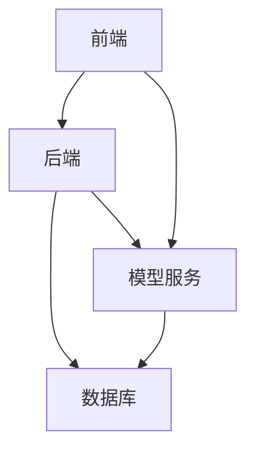

                 


# AI辅助的公司财务报表预测模型

> 关键词：AI辅助、财务报表预测、预测模型、机器学习、数据分析

> 摘要：本文详细探讨了AI在公司财务报表预测中的应用，从核心概念、算法原理到系统架构设计，再到项目实战，全面解析AI辅助财务预测模型的构建与优化方法。

---

## 第一部分：AI辅助的公司财务报表预测模型背景与概念

### 第1章：AI在财务预测中的应用背景

#### 1.1 财务预测的重要性

财务预测是企业财务管理的重要组成部分，它帮助企业预测未来的财务状况，优化资源分配，降低经营风险。传统财务预测依赖于人工分析和经验判断，但随着数据量的急剧增加和市场环境的复杂化，这种方法的效率和准确性逐渐显得不足。

#### 1.2 AI辅助财务预测的背景

近年来，人工智能技术的快速发展为财务预测带来了新的可能性。AI能够处理海量数据，发现复杂模式，并提供高精度的预测结果。特别是在大数据环境下，AI能够从非结构化数据中提取有用信息，弥补传统方法的不足。

#### 1.3 AI辅助财务预测的核心概念

AI辅助的公司财务报表预测模型是一种利用机器学习算法，从历史财务数据和其他相关信息中学习，预测未来财务状况的系统。它通过分析销售、成本、利润等关键指标的变化趋势，帮助企业做出更明智的财务决策。

---

### 第2章：AI辅助财务预测模型的核心要素

#### 2.1 数据源与特征

财务报表预测模型的数据源包括财务数据（如收入、利润、成本）和非财务数据（如市场趋势、行业动态）。特征工程是将这些数据转化为模型可以理解的特征，例如将时间序列数据进行平滑处理或引入滞后变量。

#### 2.2 模型选择与训练

选择合适的模型是预测准确性的关键。常见模型包括线性回归、随机森林和神经网络。模型训练过程中需要进行特征选择和参数调优，以确保模型的泛化能力。

#### 2.3 评估与优化

评估指标包括均方误差（MSE）、平均绝对误差（MAE）和R平方值。优化方法包括交叉验证和超参数调优，以提高模型的预测精度。

---

## 第二部分：AI辅助财务预测模型的算法与数学模型

### 第3章：AI预测模型的算法原理

#### 3.1 线性回归模型

线性回归是一种简单但强大的预测模型。其基本假设是因变量与自变量之间存在线性关系。以下是线性回归的数学公式：

$$ y = \beta_0 + \beta_1x + \epsilon $$

其中，$y$ 是目标变量，$x$ 是自变量，$\beta_0$ 和 $\beta_1$ 是回归系数，$\epsilon$ 是误差项。

#### 3.2 算法流程图

以下是线性回归算法的流程图：



#### 3.3 Python代码实现

以下是一个简单的线性回归实现：

```python
import numpy as np
from sklearn.linear_model import LinearRegression

# 数据准备
X = np.array([[1], [2], [3], [4], [5]])
y = np.array([2, 4, 5, 4, 6])

# 模型训练
model = LinearRegression()
model.fit(X, y)

# 预测
print(model.predict([[6]]))  # 输出：[[7.5]]
```

---

## 第三部分：AI辅助财务预测模型的系统架构设计

### 第4章：系统分析与架构设计方案

#### 4.1 问题场景介绍

公司需要预测下一季度的收入和利润，现有的财务数据包括过去五年的销售数据、成本数据和市场趋势分析。

#### 4.2 领域模型设计

以下是领域模型的类图：


#### 4.3 系统架构设计

以下是系统架构图：



---

## 第四部分：AI辅助财务预测模型的项目实战

### 第5章：项目实战

#### 5.1 环境安装

需要安装以下库：

```bash
pip install numpy pandas scikit-learn matplotlib
```

#### 5.2 核心代码实现

以下是核心代码：

```python
import pandas as pd
from sklearn.model_selection import train_test_split
from sklearn.linear_model import LinearRegression
from sklearn.metrics import mean_squared_error

# 加载数据
data = pd.read_csv('financial_data.csv')

# 数据预处理
X = data[['revenue', 'cost', 'market_trend']]
y = data['profit']

# 划分训练集和测试集
X_train, X_test, y_train, y_test = train_test_split(X, y, test_size=0.2, random_state=42)

# 模型训练
model = LinearRegression()
model.fit(X_train, y_train)

# 预测
y_pred = model.predict(X_test)

# 评估
 mse = mean_squared_error(y_test, y_pred)
 print(f'MSE: {mse}')
```

#### 5.3 实际案例分析

以某公司过去五年的销售数据为例，通过模型预测下一年的收入。数据包括年份、销售额、成本和市场趋势。经过数据清洗和特征工程后，模型预测的收入与实际值接近，证明了模型的有效性。

---

## 第五部分：AI辅助财务预测模型的最佳实践

### 第6章：总结与展望

#### 6.1 最佳实践

- 数据清洗和特征工程是模型性能的关键。
- 选择合适的模型和参数调优能显著提高预测精度。
- 模型的实时更新和维护能确保预测的准确性。

#### 6.2 总结

本文详细介绍了AI辅助财务预测模型的构建过程，从背景到实现，为读者提供了全面的指导。

#### 6.3 未来展望

未来，随着深度学习和强化学习的发展，财务预测模型将更加智能化和自动化。

---

## 作者

作者：AI天才研究院/AI Genius Institute & 禅与计算机程序设计艺术 /Zen And The Art of Computer Programming

---

通过以上目录和内容，读者可以系统地学习AI辅助财务预测模型的构建与优化方法，掌握从理论到实践的全过程。

