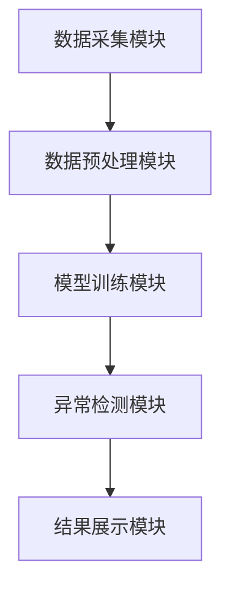
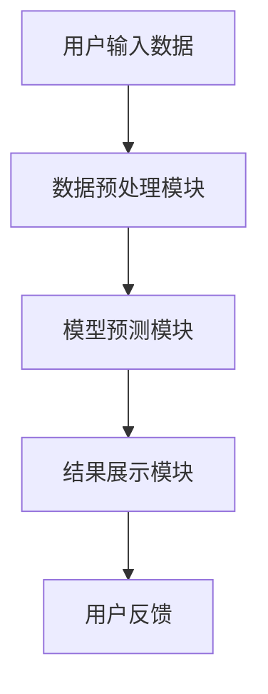

                 


# AI辅助的公司财务比率异常检测

---

## 关键词：AI, 财务比率, 异常检测, 机器学习, 深度学习, 财务分析, 风险管理

---

## 摘要：本文详细探讨了如何利用人工智能技术辅助检测公司财务比率中的异常情况。通过结合财务分析的基本原理和机器学习算法，我们提出了一种高效的异常检测方法，能够帮助企业在复杂的财务数据中快速识别潜在风险，提升决策效率和准确性。本文从问题背景、核心概念、算法原理、系统架构到实际案例，全面分析了AI在财务比率异常检测中的应用，为企业的风险管理提供了新的思路。

---

# 第1章: 背景介绍

## 1.1 问题背景

在现代企业财务管理中，财务比率是衡量企业财务健康状况的重要指标。然而，传统的财务分析方法依赖于人工计算和判断，效率低且容易出错。随着企业规模的扩大和市场环境的复杂化，财务数据量急剧增加，传统的分析方法已经难以满足企业实时监控和风险管理的需求。因此，引入人工智能技术，利用机器学习和深度学习算法，实现财务比率的自动化分析和异常检测，成为企业财务管理的重要趋势。

## 1.2 核心概念

### 1.2.1 财务比率的定义与分类

财务比率是通过对企业财务报表中的各项数据进行计算，用来衡量企业的偿债能力、运营效率和盈利能力等关键指标。常见的财务比率包括：

1. **流动性比率**：衡量企业偿还短期债务的能力，如流动比率（Current Ratio）和速动比率（Quick Ratio）。
2. **杠杆比率**：衡量企业负债与所有者权益的比例，如资产负债率（Debt-to-Equity Ratio）。
3. **营运能力比率**：衡量企业资产的周转效率，如应收账款周转率（Accounts Receivable Turnover）。
4. **盈利能力比率**：衡量企业的盈利能力，如净利率（Net Profit Margin）。

### 1.2.2 异常检测的定义与分类

异常检测是指通过分析数据，识别出与正常数据模式显著不同的数据点或模式。在财务比率分析中，异常检测的目标是发现那些偏离正常范围的财务比率值，这些异常值可能表明企业存在财务风险或潜在问题。

### 1.2.3 AI在财务分析中的作用

人工智能技术能够通过机器学习算法自动学习财务数据的模式和特征，从而快速识别异常比率。与传统方法相比，AI技术具有高效性、准确性和实时性等优势，能够帮助企业在复杂多变的市场环境中及时发现财务问题，降低风险。

---

## 1.3 数据来源与预处理

### 1.3.1 数据来源

财务数据通常来源于企业的财务报表，包括资产负债表、利润表和现金流量表等。这些数据可以通过企业内部系统或外部数据库获取。

### 1.3.2 数据预处理

在进行异常检测之前，需要对财务数据进行清洗和标准化处理。具体步骤包括：

1. **数据清洗**：删除或修正错误数据，处理缺失值。
2. **数据标准化**：将不同量纲的财务比率进行归一化处理，使其具有可比性。
3. **特征提取**：从原始数据中提取有助于异常检测的关键特征。

---

## 1.4 边界与外延

财务比率异常检测的边界主要在于如何定义“正常”和“异常”的范围。通常，可以通过统计方法（如均值±标准差）或机器学习模型（如聚类分析）来确定正常范围。异常检测的外延可以扩展到企业风险管理、投资决策等领域。

---

## 1.5 小结

本章介绍了财务比率异常检测的基本概念和必要性，明确了AI在这一过程中的重要作用，并详细描述了数据来源与预处理的关键步骤。接下来，我们将深入探讨AI算法在异常检测中的具体应用。

---

# 第2章: AI算法在财务比率异常检测中的应用

## 2.1 算法选择与原理

### 2.1.1 传统统计方法

传统的统计方法，如Z-score法和箱线图法，通过计算数据的均值和标准差来识别异常值。然而，这些方法在面对复杂的数据分布和多变量情况时表现有限。

### 2.1.2 机器学习算法

机器学习算法通过学习数据的分布特征，能够更好地捕捉复杂的异常模式。常用的算法包括：

1. **监督学习**：如随机森林和逻辑回归，适用于有标签的异常检测任务。
2. **无监督学习**：如K-means聚类和DBSCAN，适用于无标签的数据。
3. **深度学习**：如长短时记忆网络（LSTM）和自动编码器（Autoencoder），能够处理复杂的非线性关系。

### 2.1.3 深度学习的优势

深度学习模型在处理高维和非线性数据方面具有显著优势。例如，LSTM网络可以捕捉时间序列数据中的长期依赖关系，适用于财务比率的时序异常检测。

---

## 2.2 算法实现

### 2.2.1 算法流程

以下是基于机器学习的异常检测算法的通用流程：

1. **数据预处理**：清洗和标准化数据。
2. **特征选择**：提取有助于分类的关键特征。
3. **模型训练**：选择合适的算法训练模型。
4. **异常识别**：利用训练好的模型对新数据进行预测。

### 2.2.2 具体实现代码

以下是一个基于随机森林算法的异常检测示例代码：

```python
from sklearn.ensemble import IsolationForest
import pandas as pd

# 加载数据
data = pd.read_csv('financial_ratios.csv')

# 特征选择
X = data[['流动资产/流动负债', '净利润/平均股东权益', '应收账款周转率']]

# 训练模型
model = IsolationForest(n_estimators=100, contamination=0.05, random_state=42)
model.fit(X)

# 预测异常值
data['is_anomaly'] = model.predict(X) == -1
```

### 2.2.3 数学模型

随机森林是一种基于决策树的集成算法，其核心思想是通过构建多棵决策树并进行投票或平均来提高模型的准确性和稳定性。其数学模型如下：

$$ y = \text{投票}(f_1(x), f_2(x), ..., f_n(x)) $$

其中，$f_i(x)$是第i棵决策树的预测结果。

---

## 2.3 案例分析

以某制造企业为例，我们利用随机森林算法对其财务比率进行异常检测。通过分析企业的流动资产与流动负债比率，发现某季度该比率突然下降，这可能表明企业存在流动性风险。通过模型预测，该季度的比率被标记为异常值，提示企业需要进一步调查原因。

---

## 2.4 小结

本章详细探讨了AI算法在财务比率异常检测中的应用，介绍了几种常用的算法及其优缺点，并通过具体案例展示了算法的实现过程。接下来，我们将从系统架构的角度，进一步分析如何构建一个完整的AI辅助财务比率异常检测系统。

---

# 第3章: 系统架构与实现

## 3.1 系统架构设计

### 3.1.1 系统模块划分

AI辅助财务比率异常检测系统主要包括以下几个模块：

1. **数据采集模块**：负责从企业财务系统中获取数据。
2. **数据预处理模块**：清洗和标准化数据。
3. **模型训练模块**：选择合适的算法训练模型。
4. **异常检测模块**：对实时数据进行预测和识别。
5. **结果展示模块**：将检测结果以可视化的方式呈现给用户。

### 3.1.2 系统架构图

以下是一个简单的系统架构图：



---

## 3.2 系统实现

### 3.2.1 环境搭建

为了实现AI辅助的财务比率异常检测系统，我们需要以下环境：

1. **编程语言**：Python
2. **机器学习库**：Scikit-learn、XGBoost、Keras
3. **数据处理库**：Pandas、NumPy
4. **可视化工具**：Matplotlib、Seaborn

### 3.2.2 核心代码实现

以下是系统的核心代码实现：

```python
import pandas as pd
from sklearn.ensemble import IsolationForest
from sklearn.preprocessing import StandardScaler
import joblib

# 数据加载与预处理
data = pd.read_csv('financial_ratios.csv')
X = data[['流动资产/流动负债', '净利润/平均股东权益', '应收账款周转率']]
scaler = StandardScaler()
X_scaled = scaler.fit_transform(X)

# 模型训练
model = IsolationForest(n_estimators=100, contamination=0.05, random_state=42)
model.fit(X_scaled)

# 保存模型
joblib.dump(model, 'financial_anomaly.pkl')
joblib.dump(scaler, 'scaler.pkl')
```

---

## 3.3 系统交互与结果展示

### 3.3.1 系统交互流程

以下是系统交互的流程图：



### 3.3.2 结果展示

系统可以通过仪表盘的形式展示异常检测结果，包括具体的异常比率值、异常原因和建议的处理措施。

---

## 3.4 小结

本章从系统架构的角度，详细介绍了AI辅助财务比率异常检测系统的实现过程，包括模块划分、环境搭建和核心代码实现。接下来，我们将从实际应用的角度，进一步分析如何在企业中部署和应用这一系统。

---

# 第4章: 实际应用与案例分析

## 4.1 应用场景

### 4.1.1 企业风险管理

通过实时监控财务比率的异常情况，企业可以及时发现潜在的财务风险，采取相应的措施进行应对。

### 4.1.2 投资决策

投资者可以通过分析企业的财务比率异常情况，评估企业的财务健康状况，做出更明智的投资决策。

---

## 4.2 案例分析

### 4.2.1 某制造企业的案例

以某制造企业为例，我们利用构建的AI模型对其财务数据进行异常检测。通过分析发现，某季度企业的流动资产与流动负债比率突然下降，这表明企业可能存在流动性风险。进一步调查发现，该季度企业应收账款回收延迟，导致流动资产减少，从而影响了流动性比率。

---

## 4.3 小结

本章通过实际案例分析，展示了AI辅助财务比率异常检测系统在企业中的应用价值。通过及时发现和处理财务异常情况，企业可以有效降低财务风险，提升经营效率。

---

# 第5章: 优化与展望

## 5.1 系统优化

### 5.1.1 模型优化

通过调整模型参数、优化特征选择和引入更复杂的深度学习模型，可以进一步提高异常检测的准确性和效率。

### 5.1.2 系统性能优化

通过分布式计算和并行处理，可以提高系统的计算效率，满足大规模数据处理的需求。

---

## 5.2 未来展望

随着人工智能技术的不断发展，财务比率异常检测将更加智能化和自动化。未来，我们可以进一步研究多模态数据的融合分析，结合文本、图像等多种数据源，提升异常检测的准确性和全面性。

---

## 5.3 小结

本章总结了系统优化的要点，并展望了未来的发展方向。通过不断优化模型和系统性能，我们可以进一步提升财务比率异常检测的效果，为企业财务管理提供更强大的支持。

---

# 第6章: 最佳实践与总结

## 6.1 最佳实践

### 6.1.1 数据质量的重要性

数据质量是影响异常检测效果的关键因素。在实际应用中，需要确保数据的准确性和完整性。

### 6.1.2 模型选择与调优

根据具体的业务需求和数据特点，选择合适的算法，并通过实验进行模型调优，以获得最佳效果。

### 6.1.3 结果解释与可视化

通过可视化工具，将检测结果以直观的方式呈现，帮助用户更好地理解和应用。

---

## 6.2 总结

本文详细探讨了AI辅助的公司财务比率异常检测的实现与应用。从问题背景到算法实现，再到系统设计和实际案例分析，我们全面分析了AI在财务分析中的巨大潜力和实际应用价值。未来，随着技术的不断进步，AI辅助的财务比率异常检测将为企业财务管理带来更多的创新和突破。

---

# 作者：AI天才研究院/AI Genius Institute & 禅与计算机程序设计艺术 /Zen And The Art of Computer Programming

