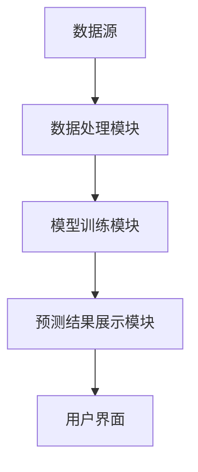
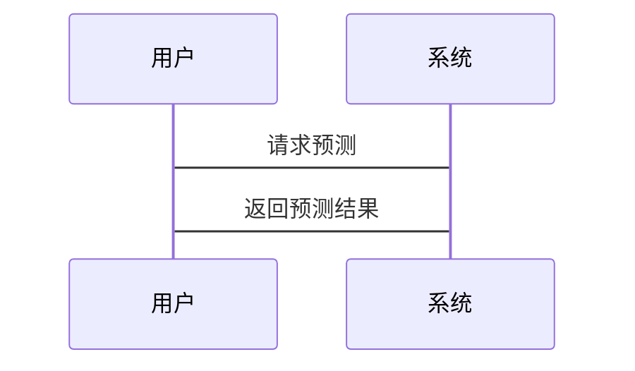

                 


# AI辅助的宏观经济指标预测与情景分析

> 关键词：宏观经济、人工智能、预测模型、情景分析、时间序列、深度学习

> 摘要：本文探讨了人工智能在宏观经济指标预测中的应用，详细介绍了宏观经济指标的基本概念、AI技术的作用、核心算法原理、系统架构设计、项目实战案例以及最佳实践建议。通过理论与实践相结合的方式，展示了如何利用AI技术提升宏观经济预测的准确性和效率，为经济学者和数据科学家提供了有价值的参考。

---

# 正文

## 第1章: 宏观经济指标预测的背景与挑战

### 1.1 宏观经济指标的基本概念

#### 1.1.1 宏观经济指标的定义与分类

宏观经济指标是衡量一个国家或地区经济运行状况的关键数据，通常分为总量指标、结构指标和价格指标三大类。总量指标包括GDP、失业率等，结构指标包括产业构成、消费结构等，价格指标包括CPI、PPI等。这些指标相互关联，共同反映了经济的健康状况。

#### 1.1.2 宏观经济指标的重要性与应用场景

宏观经济指标是政府制定政策、企业做出决策的重要依据。例如，中央银行通过调整利率来应对通货膨胀，企业通过分析市场趋势来制定生产计划。准确的宏观经济预测可以帮助各方做出更明智的决策，从而促进经济的稳定增长。

#### 1.1.3 宏观经济预测的复杂性与挑战

宏观经济预测面临数据噪声大、指标相互影响、外部冲击难以预测等挑战。传统的统计方法在处理复杂关系时显得力不从心，而AI技术的引入为解决这些问题提供了新的可能性。

### 1.2 AI技术在宏观经济分析中的作用

#### 1.2.1 AI技术的基本概念与特点

AI技术通过模拟人类学习和推理能力，能够处理大量非结构化数据，并发现其中的隐含关系。其特点是高效性、自适应性和可扩展性。

#### 1.2.2 AI在宏观经济预测中的优势

AI技术能够处理复杂的数据关系，捕捉非线性模式，并实时更新模型。这些优势使得AI在宏观经济预测中具有显著优势。

#### 1.2.3 当前AI辅助宏观经济分析的现状与趋势

目前，AI在宏观经济预测中的应用逐渐普及，但主要集中在单指标预测，多指标联合预测和实时预测仍有较大提升空间。

### 1.3 宏观经济指标预测的核心问题

#### 1.3.1 数据的获取与处理

数据的准确性和完整性是预测的基础。AI技术能够处理缺失值和噪声数据，但需要结合领域知识进行特征工程。

#### 1.3.2 模型的构建与验证

模型的选择和参数调优是关键。需要结合业务需求选择合适的时间序列模型，并通过交叉验证评估模型的泛化能力。

#### 1.3.3 预测结果的解释与应用

预测结果的可解释性直接影响其应用价值。宏观经济预测需要对结果进行合理的解释，以便政策制定者和企业做出决策。

## 1.4 本章小结

本章介绍了宏观经济指标的基本概念、AI技术在宏观经济分析中的作用，以及宏观经济指标预测的核心问题。这些内容为后续章节的深入分析奠定了基础。

---

## 第2章: 宏观经济指标与AI模型的核心概念

### 2.1 宏观经济指标的结构与属性

#### 2.1.1 主要宏观经济指标的分类

主要宏观经济指标可以分为总量指标、结构指标和价格指标。总量指标包括GDP、失业率等，结构指标包括产业构成、消费结构等，价格指标包括CPI、PPI等。

#### 2.1.2 指标之间的相互关系

指标之间存在复杂的相互关系。例如，GDP增长通常伴随着消费增加和就业率上升。理解这些关系有助于构建更准确的预测模型。

#### 2.1.3 指标的时间序列特征

宏观经济指标通常具有时间序列特征，如趋势性、周期性和随机性。时间序列分析是宏观经济预测的核心方法。

### 2.2 AI模型的核心原理

#### 2.2.1 机器学习的基本概念

机器学习通过数据驱动的方法，学习数据中的模式和关系。常用的机器学习算法包括线性回归、支持向量机和随机森林等。

#### 2.2.2 深度学习的基本概念

深度学习通过多层神经网络，自动提取数据特征。常用的深度学习模型包括卷积神经网络、循环神经网络和变换器等。

#### 2.2.3 时间序列分析的基本原理

时间序列分析通过研究数据的时序特性，预测未来的趋势。常用的方法包括ARIMA、LSTM和Prophet模型。

### 2.3 宏观经济指标预测中的关键问题

#### 2.3.1 数据的缺失性与噪声

宏观经济数据往往存在缺失和噪声。需要通过数据预处理技术进行处理，以提高模型的准确性。

#### 2.3.2 模型的泛化能力

模型的泛化能力直接影响预测的准确性。需要通过交叉验证和调参优化来提高模型的泛化能力。

#### 2.3.3 预测结果的可解释性

预测结果的可解释性是宏观经济预测的重要要求。需要对模型进行解释性分析，以便政策制定者理解和应用。

## 2.4 本章小结

本章介绍了宏观经济指标的结构与属性，以及AI模型的核心原理。这些内容为后续章节的模型构建奠定了理论基础。

---

## 第3章: 基于AI的宏观经济指标预测算法原理

### 3.1 时间序列预测的基本方法

#### 3.1.1 ARIMA模型的原理与实现

ARIMA模型通过自回归和移动平均机制，预测时间序列的趋势和季节性变化。其数学表达式为：

$$ ARIMA(p, d, q) = y_t - y_{t-1}^d = \sum_{i=1}^p \phi_i y_{t-i} + \sum_{j=1}^q \theta_j \epsilon_{t-j} + \epsilon_t $$

其中，p为自回归阶数，d为差分阶数，q为移动平均阶数。

#### 3.1.2 LSTM模型的原理与实现

LSTM模型通过长短期记忆单元，捕捉时间序列的长期依赖关系。其核心公式包括输入门、遗忘门和输出门：

$$
i_t = \sigma(w_i x_t + u_i h_{t-1} + b_i)
$$
$$
f_t = \sigma(w_f x_t + u_f h_{t-1} + b_f)
$$
$$
c_t = f_t c_{t-1} + i_t tanh(w_c x_t + u_c h_{t-1} + b_c)
$$
$$
o_t = \sigma(w_o x_t + u_o h_{t-1} + b_o)
$$
$$
h_t = o_t tanh(c_t)
$$

#### 3.1.3 Prophet模型的原理与实现

Prophet模型通过分解时间序列的非线性关系，预测未来的趋势和周期性变化。其数学表达式为：

$$
y(t) = g(t) + s(t) + \epsilon_t
$$

其中，g(t)是趋势函数，s(t)是季节性函数，ε_t是误差项。

### 3.2 基于深度学习的宏观经济预测

#### 3.2.1 卷积神经网络在时间序列预测中的应用

CNN通过卷积操作提取局部特征，适用于捕捉时间序列的空间依赖关系。

#### 3.2.2 变换器架构在宏观经济预测中的应用

Transformer通过自注意力机制，捕捉时间序列的全局依赖关系。

#### 3.2.3 图神经网络在宏观经济预测中的应用

GNN通过图结构数据，捕捉指标之间的相互关系。

### 3.3 混合模型与集成学习

#### 3.3.1 基于集成学习的宏观经济预测

通过集成多个模型的预测结果，提高预测的准确性和稳定性。

#### 3.3.2 基于混合模型的宏观经济预测

通过结合不同的模型，捕捉数据的多重特征。

#### 3.3.3 混合模型的优势与挑战

混合模型能够充分利用不同模型的优势，但需要解决模型间的信息重叠和计算复杂性问题。

## 3.4 本章小结

本章介绍了基于AI的宏观经济指标预测算法的原理和实现方法，包括ARIMA、LSTM、Prophet、CNN、Transformer和GNN等模型。

---

## 第4章: 宏观经济指标预测的数学模型与公式

### 4.1 时间序列预测的数学模型

#### 4.1.1 ARIMA模型的数学表达式

ARIMA模型的数学表达式为：

$$ ARIMA(p, d, q) = y_t - y_{t-1}^d = \sum_{i=1}^p \phi_i y_{t-i} + \sum_{j=1}^q \theta_j \epsilon_{t-j} + \epsilon_t $$

#### 4.1.2 LSTM模型的数学表达式

LSTM模型的数学表达式包括输入门、遗忘门和输出门：

$$
i_t = \sigma(w_i x_t + u_i h_{t-1} + b_i)
$$
$$
f_t = \sigma(w_f x_t + u_f h_{t-1} + b_f)
$$
$$
c_t = f_t c_{t-1} + i_t tanh(w_c x_t + u_c h_{t-1} + b_c)
$$
$$
o_t = \sigma(w_o x_t + u_o h_{t-1} + b_o)
$$
$$
h_t = o_t tanh(c_t)
$$

#### 4.1.3 Prophet模型的数学表达式

Prophet模型的数学表达式为：

$$
y(t) = g(t) + s(t) + \epsilon_t
$$

其中，g(t)是趋势函数，s(t)是季节性函数，ε_t是误差项。

### 4.2 深度学习模型的数学基础

#### 4.2.1 神经网络的数学基础

神经网络通过多层感知机模型，学习数据的非线性关系。

#### 4.2.2 长短期记忆网络的数学细节

LSTM模型的数学细节包括输入门、遗忘门和输出门的计算公式。

#### 4.2.3 图神经网络的数学基础

GNN通过图结构数据，学习节点之间的关系。

### 4.3 混合模型的数学原理

#### 4.3.1 集成学习的数学原理

集成学习通过组合多个模型的预测结果，提高预测的准确性和稳定性。

#### 4.3.2 基于混合模型的宏观经济预测公式

混合模型的预测公式为：

$$
y_{pred} = \sum_{i=1}^n w_i y_{pred,i}
$$

其中，w_i是模型i的权重，y_{pred,i}是模型i的预测结果。

#### 4.3.3 混合模型的优化方法

混合模型的优化方法包括权重分配、模型选择和参数调优。

## 4.4 本章小结

本章详细介绍了宏观经济指标预测的数学模型与公式，包括ARIMA、LSTM、Prophet、CNN、Transformer和GNN等模型的数学表达式和实现细节。

---

## 第5章: 宏观经济指标预测的系统分析与架构设计

### 5.1 项目背景与目标

#### 5.1.1 项目背景介绍

本项目旨在利用AI技术，构建一个宏观经济指标预测系统，为政策制定者和企业提供决策支持。

#### 5.1.2 项目目标与范围

项目目标包括构建预测模型、实现系统集成和提供可视化界面。项目范围涵盖数据采集、模型训练和结果展示。

#### 5.1.3 项目的关键成功因素

关键成功因素包括数据质量、模型准确性和系统稳定性。

### 5.2 系统功能设计

#### 5.2.1 数据采集与预处理模块

数据采集模块负责从数据库或API获取宏观经济指标数据。预处理模块包括数据清洗、特征工程和数据增强。

#### 5.2.2 模型训练与优化模块

模型训练模块包括选择模型架构、调参优化和模型验证。优化模块包括交叉验证和超参数调优。

#### 5.2.3 预测结果展示与分析模块

结果展示模块提供预测结果的可视化界面。分析模块包括误差分析、趋势预测和情景模拟。

### 5.3 系统架构设计

#### 5.3.1 系统架构图

系统架构图包括数据源、数据处理模块、模型训练模块、预测结果展示模块和用户界面。



#### 5.3.2 系统交互流程图

系统交互流程图描述了用户与系统之间的交互流程。



### 5.4 本章小结

本章介绍了宏观经济指标预测系统的背景与目标，以及系统的功能设计和架构设计。

---

## 第6章: 项目实战与案例分析

### 6.1 环境安装与配置

#### 6.1.1 安装Python环境

安装Python 3.8以上版本，并配置虚拟环境。

#### 6.1.2 安装依赖库

安装必要的依赖库，如pandas、numpy、sklearn、keras、pytorch和prophet。

### 6.2 系统核心实现源代码

#### 6.2.1 数据预处理代码

```python
import pandas as pd
import numpy as np

# 数据加载
data = pd.read_csv('macroeconomic_data.csv')

# 数据清洗
data.dropna(inplace=True)
data = data[~data.index.duplicated(keep='first')]

# 特征工程
from sklearn.preprocessing import StandardScaler
scaler = StandardScaler()
data_scaled = scaler.fit_transform(data)
```

#### 6.2.2 模型训练代码

```python
from sklearn.model_selection import train_test_split
from sklearn.metrics import mean_absolute_error
from tensorflow.keras.models import Sequential
from tensorflow.keras.layers import LSTM, Dense

# 数据分割
X = data_scaled[:-1]
y = data_scaled[1:]
X_train, X_test, y_train, y_test = train_test_split(X, y, test_size=0.2, random_state=42)

# 模型构建
model = Sequential()
model.add(LSTM(50, input_shape=(1, X.shape[1])))
model.add(Dense(1))
model.compile(optimizer='adam', loss='mse')

# 模型训练
model.fit(X_train.reshape(X_train.shape[0], 1, X_train.shape[1]), y_train, epochs=50, batch_size=32, validation_split=0.2)
```

#### 6.2.3 模型预测代码

```python
# 模型预测
y_pred = model.predict(X_test.reshape(X_test.shape[0], 1, X_test.shape[1]))

# 结果评估
mae = mean_absolute_error(y_test, y_pred)
print(f"平均绝对误差: {mae}")
```

### 6.3 实际案例分析与详细解读

#### 6.3.1 案例背景介绍

以预测GDP增长为例，数据包括GDP、失业率、通胀率等指标。

#### 6.3.2 数据预处理与特征工程

数据清洗、标准化和特征选择。

#### 6.3.3 模型训练与优化

选择合适的模型架构，进行参数调优和交叉验证。

#### 6.3.4 预测结果分析

分析预测结果的准确性，讨论误差来源和优化方向。

### 6.4 项目小结

本章通过一个实际案例，详细展示了宏观经济指标预测系统的实现过程，包括环境配置、数据预处理、模型训练和结果分析。

---

## 第7章: 最佳实践、小结、注意事项与拓展阅读

### 7.1 最佳实践

#### 7.1.1 数据质量的重要性

确保数据的准确性和完整性，进行合理的特征工程。

#### 7.1.2 模型选择与调优

根据业务需求选择合适的模型，进行参数调优和交叉验证。

#### 7.1.3 结果解释与应用

对预测结果进行合理的解释，结合业务场景进行应用。

### 7.2 小结

本文详细介绍了AI辅助的宏观经济指标预测与情景分析的核心概念、算法原理、系统架构和项目实战。通过理论与实践相结合的方式，展示了如何利用AI技术提升宏观经济预测的准确性和效率。

### 7.3 注意事项

#### 7.3.1 数据隐私与安全

注意数据的隐私保护和安全存储。

#### 7.3.2 模型的可解释性

确保模型的预测结果具有可解释性，以便政策制定者理解和应用。

#### 7.3.3 模型的实时性

关注模型的实时预测能力，以应对突发的经济事件。

### 7.4 拓展阅读

#### 7.4.1 经济学中的时间序列分析

推荐阅读《Introductory Econometrics: A Modern Approach》。

#### 7.4.2 深度学习在宏观经济预测中的应用

推荐阅读《Deep Learning for Time Series Forecasting》。

#### 7.4.3 多模型集成与优化

推荐阅读《Ensemble Methods in Machine Learning》。

---

## 作者

作者：AI天才研究院/AI Genius Institute & 禅与计算机程序设计艺术 /Zen And The Art of Computer Programming

---

以上是《AI辅助的宏观经济指标预测与情景分析》的技术博客文章的详细目录大纲和部分内容。如果需要完整的文章，可以按照这个结构进一步扩展每一部分的内容。

