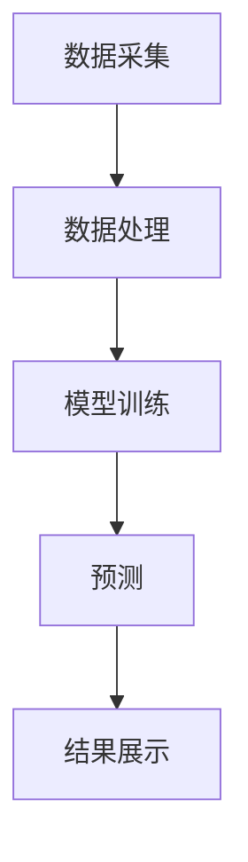
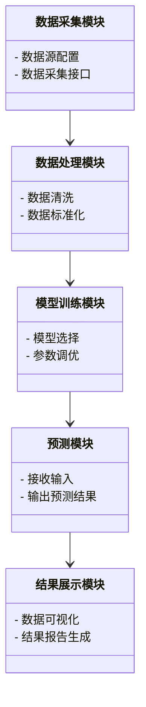
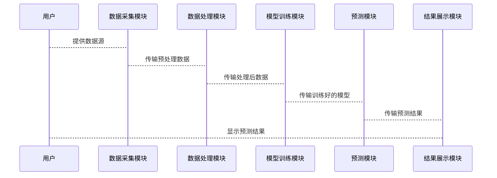

                 


# AI辅助的宏观经济指标预测模型

---

## 关键词  
AI, 宏观经济指标, 时间序列分析, 机器学习, 深度学习, 宏观经济预测

---

## 摘要  
随着人工智能技术的飞速发展，宏观经济指标预测逐渐成为AI技术的重要应用场景。本文将从宏观经济指标的基本概念出发，结合时间序列分析、机器学习和深度学习等技术，详细探讨如何构建AI辅助的宏观经济指标预测模型。文章内容涵盖模型的理论基础、算法实现、系统设计以及实际案例分析，旨在为读者提供一个系统性的指导，帮助其理解和应用AI技术在宏观经济预测中的潜力。

---

## 第一部分: AI辅助的宏观经济指标预测模型概述

### 第1章: 宏观经济指标与AI预测的背景

#### 1.1 宏观经济指标的定义与作用  
宏观经济指标是反映一个国家或地区经济运行状态的关键数据，包括GDP（国内生产总值）、CPI（消费者价格指数）、失业率等。这些指标能够帮助政策制定者、企业和个人做出更明智的经济决策。  

**1.1.1 宏观经济指标的核心概念**  
- **GDP**: 衡量一个国家或地区的经济规模和增长情况。  
- **CPI**: 衡量通货膨胀水平，反映居民生活成本的变化。  
- **失业率**: 衡量劳动力市场的健康状况。  

**1.1.2 宏观经济指标在经济分析中的作用**  
- 评估经济政策的效果。  
- 预测未来的经济走势。  
- 支持企业和个人的决策。  

**1.1.3 宏观经济指标的分类与特点**  
- **总量指标**: 如GDP、工业总产值。  
- **结构指标**: 如产业构成比例。  
- **价格指标**: 如CPI、PPI（生产者价格指数）。  

#### 1.2 AI在宏观经济预测中的应用背景  

**1.2.1 传统宏观经济预测方法的局限性**  
传统预测方法依赖于统计模型和经济学理论，但存在以下问题：  
1. 模型假设过于简化，难以捕捉复杂经济关系。  
2. 数据依赖性强，预测精度有限。  
3. 需要大量人工干预，效率较低。  

**1.2.2 AI技术在经济预测中的优势**  
1. **数据处理能力**: AI能够处理海量数据，发现传统方法难以察觉的模式。  
2. **非线性建模**: AI技术（如深度学习）能够捕捉复杂的非线性关系。  
3. **自动化特征工程**: AI可以自动提取特征，减少人工干预。  

**1.2.3 当前AI辅助宏观经济预测的发展现状**  
- AI技术已经在金融、经济领域得到广泛应用。  
- 学术界和产业界都在积极探索更高效的预测模型。  

#### 1.3 宏观经济指标预测的挑战与机遇  

**1.3.1 数据特征与预测难点**  
1. 数据的复杂性：宏观经济指标受多种因素影响，如政策、市场行为等。  
2. 数据的稀疏性：某些指标的数据获取难度较大。  
3. 数据的动态性：经济环境不断变化，模型需要动态调整。  

**1.3.2 AI技术带来的新可能性**  
1. **实时预测**: 基于流数据的实时预测能力。  
2. **多维度分析**: 结合多种指标进行综合预测。  
3. **自适应学习**: 模型能够自动适应经济环境的变化。  

**1.3.3 未来研究方向与应用前景**  
1. 结合强化学习优化预测策略。  
2. 探索多模态数据（如文本、图像）的预测应用。  
3. 提高模型的可解释性，便于政策制定者理解和应用。  

#### 1.4 本章小结  
本章介绍了宏观经济指标的基本概念、AI技术在预测中的优势以及面临的挑战和未来发展方向。接下来将深入探讨AI辅助预测的理论基础，包括时间序列分析和机器学习算法。

---

## 第二部分: AI辅助宏观经济预测的理论基础

### 第2章: 时间序列分析与宏观经济预测

#### 2.1 时间序列分析的基本概念  

**2.1.1 时间序列的定义与特征**  
时间序列是指按照时间顺序排列的数据，具有以下特征：  
1. **趋势**: 数据的长期走向。  
2. **季节性**: 数据在特定周期内的规律性变化。  
3. **随机性**: 数据中的不可预测部分。  

**2.1.2 时间序列分析的常见方法**  
1. **描述性分析**: 使用统计指标（如均值、方差）描述数据特征。  
2. **预测性分析**: 基于历史数据预测未来趋势。  

#### 2.2 经典时间序列预测模型  

**2.2.1 ARIMA模型**  
ARIMA（自回归积分滑动平均模型）是一种广泛应用于时间序列预测的经典模型。其基本结构如下：  

$$ ARIMA(p, d, q) $$  

其中，$p$ 表示自回归阶数，$d$ 表示差分阶数，$q$ 表示滑动平均阶数。  

**2.2.2 指数平滑法**  
指数平滑法是一种简单的时间序列预测方法，适用于数据波动较大的情况。其公式为：  

$$ S_t = \alpha \cdot Y_{t} + (1 - \alpha) \cdot S_{t-1} $$  

其中，$\alpha$ 是平滑系数，取值范围为 $0 < \alpha < 1$。  

**2.2.3 其他经典时间序列模型**  
- ** Holt-Winters 方法**: 适用于具有趋势性和季节性的数据。  
- **Prophet模型**: Facebook开源的时间序列预测工具，基于ARIMA和泰勒展开。  

#### 2.3 时间序列分析的数学基础  

**2.3.1 时间序列的分解模型**  
时间序列可以分解为趋势、季节性、周期性和随机性四部分：  

$$ Y_t = T_t + S_t + C_t + R_t $$  

其中，$Y_t$ 表示观测值，$T_t$ 表示趋势，$S_t$ 表示季节性，$C_t$ 表示周期性，$R_t$ 表示随机性。  

**2.3.2 自回归与移动平均过程**  
自回归过程（AR）和滑动平均过程（MA）是ARIMA模型的核心组成部分。  

**2.3.3 时间序列预测的数学公式**  
以ARIMA模型为例，预测未来一步的值：  

$$ \hat{Y}_{t+1} = \phi_1 Y_t + \phi_2 Y_{t-1} + \dots + \phi_p Y_{t-p} + \theta_1 e_t + \theta_2 e_{t-1} + \dots + \theta_q e_{t-q} $$  

其中，$\phi_i$ 和 $\theta_j$ 是模型参数，$e_t$ 是残差项。  

#### 2.4 本章小结  
本章介绍了时间序列分析的基本概念和经典模型，为后续基于机器学习的预测模型奠定了基础。

---

### 第3章: 机器学习基础与宏观经济预测

#### 3.1 机器学习的基本概念  

**3.1.1 机器学习的定义与分类**  
机器学习是一种通过数据学习规律的技术，主要分为监督学习、无监督学习和强化学习三类。  

**3.1.2 监督学习、无监督学习与强化学习**  
1. **监督学习**: 基于标记数据进行学习，适用于回归和分类任务。  
2. **无监督学习**: 在无标记数据上发现隐含结构，常用于聚类任务。  
3. **强化学习**: 通过与环境交互学习策略，适用于动态决策任务。  

**3.1.3 机器学习在经济预测中的应用**  
1. **回归分析**: 预测连续型经济指标（如GDP增长率）。  
2. **分类分析**: 判断经济状态（如经济上行或下行）。  

#### 3.2 常见机器学习算法及其特点  

**3.2.1 线性回归与逻辑回归**  
- **线性回归**: 用于预测连续型变量。  
- **逻辑回归**: 用于分类任务，输出概率值。  

**3.2.2 支持向量机（SVM）**  
SVM通过构建超平面将数据分为不同类别，适用于分类和回归任务。  

**3.2.3 随机森林与梯度提升树**  
- **随机森林**: 基于决策树的集成方法，具有高准确性和鲁棒性。  
- **梯度提升树**: 通过多次迭代提升模型性能。  

#### 3.3 基于机器学习的宏观经济预测模型  

**3.3.1 数据特征提取与选择**  
1. **特征提取**: 从原始数据中提取有意义的特征（如历史数据、经济指标）。  
2. **特征选择**: 使用特征重要性评估方法筛选关键特征。  

**3.3.2 模型训练与评估**  
1. **训练过程**: 使用训练数据拟合模型。  
2. **评估指标**: 常用均方误差（MSE）、R平方值（R²）等指标评估模型性能。  

**3.3.3 模型优化与调参**  
1. **超参数调优**: 使用网格搜索（Grid Search）或随机搜索（Random Search）优化模型参数。  
2. **交叉验证**: 通过交叉验证评估模型的泛化能力。  

#### 3.4 本章小结  
本章介绍了机器学习的基本概念和常见算法，并探讨了其在宏观经济预测中的应用。接下来将重点介绍基于深度学习的宏观经济预测模型。

---

## 第三部分: 深度学习与宏观经济预测

### 第4章: 基于深度学习的宏观经济预测模型

#### 4.1 深度学习的基本概念  

**4.1.1 深度学习的定义与特点**  
深度学习是一种基于人工神经网络的机器学习方法，具有以下特点：  
1. **非线性建模**: 能够捕捉复杂的数据模式。  
2. **自动特征提取**: 可以从数据中自动提取特征。  
3. **高维度处理**: 适用于高维数据的分析。  

#### 4.2 常见深度学习模型及其特点  

**4.2.1 LSTM（长短期记忆网络）**  
LSTM通过引入记忆单元（Memory Cell）和遗忘门（Forget Gate）解决传统RNN无法捕捉长期依赖的问题。  

**4.2.2 Transformer模型**  
Transformer基于自注意力机制（Self-Attention），在序列建模任务中表现出色。  

**4.2.3 CNN（卷积神经网络）**  
CNN常用于图像处理，但在时间序列数据上也有应用。  

#### 4.3 深度学习模型在宏观经济预测中的应用  

**4.3.1 基于LSTM的宏观经济预测模型**  
LSTM适合处理时间序列数据，能够捕捉经济指标的长期依赖关系。  

**4.3.2 基于Transformer的宏观经济预测模型**  
Transformer在自然语言处理领域表现出色，其自注意力机制适用于多变量时间序列预测。  

**4.3.3 深度学习与其他技术的结合**  
1. **集成学习**: 结合不同模型的优势。  
2. **强化学习**: 用于动态经济环境下的决策优化。  

#### 4.4 本章小结  
本章介绍了深度学习的基本概念和常见模型，并探讨了其在宏观经济预测中的应用。

---

## 第四部分: 模型的实现与优化

### 第5章: 数据预处理与特征工程

#### 5.1 数据预处理方法  

**5.1.1 数据清洗**  
1. **处理缺失值**: 使用均值、中位数或插值法填充缺失值。  
2. **处理异常值**: 通过统计方法或模型检测异常值。  

**5.1.2 数据标准化与归一化**  
1. **标准化**: 将数据转化为均值为0，标准差为1的分布。  
2. **归一化**: 将数据缩放到0到1的范围。  

#### 5.2 特征工程  

**5.2.1 特征提取**  
1. **历史数据特征**: 包括过去一段时间的指标值。  
2. **外部因素特征**: 包括政策变化、国际市场波动等。  

**5.2.2 特征选择**  
1. **基于统计的方法**: 如皮尔逊相关系数。  
2. **基于模型的方法**: 如LASSO回归和随机森林特征重要性。  

### 第6章: 模型训练与优化

#### 6.1 模型训练过程  

**6.1.1 模型选择**  
根据数据特点选择合适的模型（如LSTM、ARIMA）。  

**6.1.2 训练策略**  
1. **分批次训练**: 使用小批量数据更新模型参数。  
2. **学习率调整**: 使用学习率衰减策略。  

#### 6.2 模型调优与优化  

**6.2.1 超参数调优**  
1. **网格搜索**: 系统地搜索最优超参数组合。  
2. **随机搜索**: 在超参数空间中随机采样，寻找最优解。  

**6.2.2 正则化技术**  
1. **L1正则化**: 用于特征选择。  
2. **L2正则化**: 用于防止过拟合。  

### 第7章: 结果分析与评估

#### 7.1 结果分析方法  

**7.1.1 模型预测结果的可视化**  
1. **实际值与预测值对比**: 通过折线图展示预测结果。  
2. **残差分析**: 分析预测误差的分布情况。  

**7.1.2 模型性能评估**  
1. **均方误差（MSE）**: 衡量预测值与实际值的差异。  
2. **平均绝对误差（MAE）**: 衡量预测值与实际值的绝对差异。  
3. **R平方值（R²）**: 衡量模型的拟合优度。  

#### 7.2 模型优化与改进  

**7.2.1 模型融合**: 将多个模型的预测结果进行融合，提高预测精度。  
**7.2.2 动态模型更新**: 根据实时数据动态调整模型参数。  

---

## 第五部分: 系统架构设计

### 第8章: 宏观经济预测系统的架构设计

#### 8.1 项目介绍  

**8.1.1 项目目标**  
构建一个基于AI的宏观经济指标预测系统，实现对GDP增长率、CPI等指标的预测。  

**8.1.2 项目范围**  
- 数据收集与预处理。  
- 模型开发与训练。  
- 系统部署与应用。  

#### 8.2 系统功能设计  

**8.2.1 系统功能模块**  
1. **数据采集模块**: 从数据库或API获取宏观经济指标数据。  
2. **数据处理模块**: 进行数据清洗、标准化等预处理。  
3. **模型训练模块**: 训练并保存预测模型。  
4. **预测模块**: 接收输入数据，输出预测结果。  
5. **结果展示模块**: 可视化预测结果。  

**8.2.2 系统功能流程图**  


#### 8.3 系统架构设计  

**8.3.1 系统架构图**  


#### 8.4 系统交互设计  

**8.4.1 系统交互流程图**  


---

## 第六部分: 项目实战

### 第9章: 基于Python的宏观经济指标预测系统实现

#### 9.1 环境搭建  

**9.1.1 安装必要的库**  
```bash
pip install numpy pandas scikit-learn keras tensorflow matplotlib
```

#### 9.2 数据集准备  

**9.2.1 数据获取**  
从公开数据源（如国家统计局网站）获取宏观经济指标数据。  

**9.2.2 数据预处理**  
编写Python代码进行数据清洗和标准化。  

```python
import pandas as pd
import numpy as np

# 数据加载
data = pd.read_csv('macroeconomic_data.csv')

# 数据清洗
data.dropna(inplace=True)
data = data.drop_duplicates()

# 数据标准化
from sklearn.preprocessing import StandardScaler
scaler = StandardScaler()
scaled_data = scaler.fit_transform(data[['GDP', 'CPI', 'unemployment_rate']])
```

#### 9.3 模型实现  

**9.3.1 LSTM模型实现**  
```python
from tensorflow.keras.models import Sequential
from tensorflow.keras.layers import LSTM, Dense

# 模型定义
model = Sequential()
model.add(LSTM(50, input_shape=(timesteps, features)))
model.add(Dense(1))
model.compile(loss='mean_squared_error', optimizer='adam')

# 模型训练
model.fit(X_train, y_train, epochs=100, batch_size=32)
```

#### 9.4 结果展示  

**9.4.1 预测结果可视化**  
```python
import matplotlib.pyplot as plt

# 预测值与实际值对比
plt.plot(y_test, label='Actual')
plt.plot(y_pred, label='Predicted')
plt.legend()
plt.show()
```

---

## 第七部分: 拓展与优化

### 第10章: 模型的可解释性与鲁棒性优化

#### 10.1 模型的可解释性分析  

**10.1.1 特征重要性分析**  
通过SHAP值（Shapley Additive exPlanations）分析模型的特征重要性。  

**10.1.2 模型解释工具**  
使用LIME（Local Interpretable Model-agnostic Explanations）等工具解释模型预测结果。  

#### 10.2 模型的鲁棒性优化  

**10.2.1 数据增强**  
通过增加数据多样性提高模型的鲁棒性。  
例如：  
1. 数据平滑：对历史数据进行平滑处理。  
2. 噪声添加：在数据中添加少量噪声，测试模型的鲁棒性。  

**10.2.2 模型集成**  
通过集成学习（如投票法、加权平均）提高模型的预测精度和鲁棒性。  

### 第11章: 未来研究方向与应用展望

#### 11.1 未来研究方向  

**11.1.1 可解释性增强**  
开发更透明的模型，帮助政策制定者理解和信任预测结果。  

**11.1.2 多模态数据预测**  
结合文本、图像等多种数据源进行宏观经济预测。  

**11.1.3 动态模型优化**  
研究动态环境下模型的自适应优化方法。  

#### 11.2 应用展望  

**11.2.1 政策制定支持**  
利用AI预测模型辅助政府制定更精准的经济政策。  

**11.2.2 金融市场应用**  
帮助投资者做出更明智的投资决策。  

**11.2.3 企业战略规划**  
为企业提供基于AI的市场趋势预测服务。  

---

## 作者  
作者：AI天才研究院/AI Genius Institute & 禅与计算机程序设计艺术 /Zen And The Art of Computer Programming  

--- 

**注**：以上内容仅为目录和部分章节内容，完整文章需要根据实际需求进行详细展开和补充。

