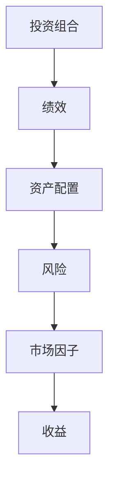
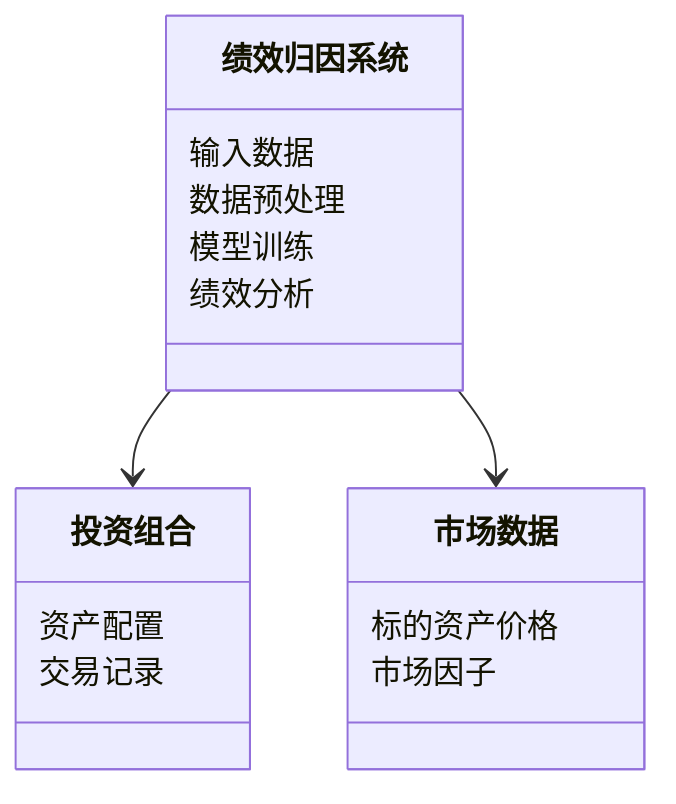
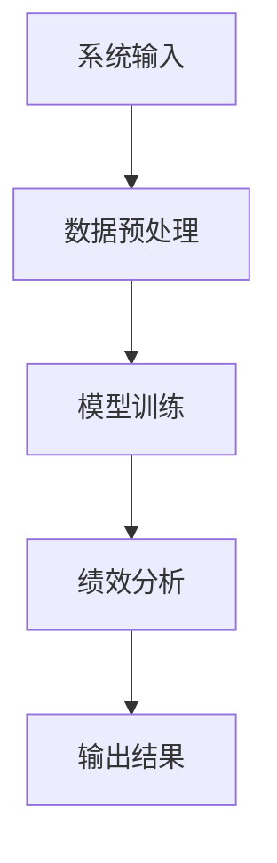

                 

<think>
好的，我将按照您的要求撰写《AI辅助的对冲基金绩效归因》这篇文章。首先，我会从文章标题开始，然后列出关键词和摘要。接下来，我会按照目录大纲逐步展开每个章节的内容，确保每个部分都详细具体，符合您的要求。

### 文章标题

**AI辅助的对冲基金绩效归因**

### 文章关键词

- AI
- 对冲基金
- 绩效归因
- 机器学习
- 金融数据分析

### 摘要

本文深入探讨了人工智能在对冲基金绩效归因中的应用。通过对绩效归因的基本概念、AI算法原理以及系统架构的详细分析，结合实际案例和项目实战，展示了如何利用AI技术提升对冲基金的绩效分析能力。文章从背景介绍、核心概念、算法原理、系统设计到项目实现，层层递进，为读者提供了一套完整的解决方案。

---

# AI辅助的对冲基金绩效归因

## 第一章: AI辅助的对冲基金绩效归因概述

### 1.1 对冲基金与绩效归因的基本概念

#### 1.1.1 对冲基金的定义与特点

对冲基金是一种通过多种金融工具进行投资的基金，其目标是通过套利、做空等策略实现超额收益。对冲基金的特点包括高杠杆、高风险、多样化投资策略等。对冲基金的绩效分析是对其投资表现进行评估的关键环节。

#### 1.1.2 绩效归因的定义与作用

绩效归因是指通过对投资组合的收益进行分解，找出各个因素对整体收益的贡献程度。其作用在于帮助投资者理解收益的来源，优化投资策略，控制风险。

#### 1.1.3 AI在对冲基金中的应用背景

随着金融数据的爆炸式增长，传统的绩效归因方法逐渐暴露出效率低、精度不足等问题。AI技术的引入，特别是机器学习和深度学习，为对冲基金的绩效分析提供了新的解决方案。

### 1.2 AI辅助绩效归因的核心概念

#### 1.2.1 绩效归因的分类与方法

绩效归因通常分为单变量分析和多变量分析。单变量分析用于识别单一因素对收益的贡献，而多变量分析则考虑多个因素的交互作用。

#### 1.2.2 AI在绩效归因中的优势

AI技术能够处理海量数据，发现传统方法难以察觉的模式和关系。同时，AI算法的自适应性使其能够动态调整模型，适应市场的变化。

#### 1.2.3 绩效归因的边界与外延

绩效归因的边界在于其依赖于数据质量和模型的准确性。外延则涉及风险分析、投资策略优化等多个方面。

## 第二章: 绩效归因的核心概念与原理

### 2.1 绩效归因的基本原理

#### 2.1.1 绩效归因的数学模型

绩效归因的数学模型通常包括回归分析和因子分解等方法。例如，线性回归模型用于分解资产收益中各因子的贡献。

#### 2.1.2 绩效归因的关键要素

关键要素包括资产配置、风险调整、市场因子等。这些要素共同决定了投资组合的绩效。

#### 2.1.3 绩效归因的公式推导

以线性回归为例，绩效归因的公式可以表示为：
$$ y = \beta_0 + \beta_1x_1 + \beta_2x_2 + ... + \beta_nx_n + \epsilon $$

其中，$y$是投资组合的收益，$x_i$是各因子，$\beta_i$是回归系数，$\epsilon$是误差项。

### 2.2 AI在绩效归因中的核心算法

#### 2.2.1 线性回归模型

线性回归模型通过最小化残差平方和来估计回归系数，用于分解资产收益中的线性关系。

#### 2.2.2 随机森林算法

随机森林是一种基于决策树的集成学习方法，适用于处理高维数据和非线性关系。

#### 2.2.3 神经网络模型

神经网络通过多层非线性变换，能够捕捉复杂的市场模式。

### 2.3 绩效归因的ER实体关系图



### 2.4 本章小结

本章介绍了绩效归因的基本原理和AI算法的核心概念，为后续的算法实现奠定了基础。

## 第三章: AI辅助绩效归因的算法原理

### 3.1 绩效归因的算法选择

#### 3.1.1 传统回归分析

传统回归分析适用于线性关系的分解，但在复杂市场中表现有限。

#### 3.1.2 机器学习算法

机器学习算法如随机森林能够处理高维数据和非线性关系。

#### 3.1.3 深度学习模型

深度学习模型能够捕捉复杂的市场模式，但计算成本较高。

### 3.2 算法原理的详细讲解

#### 3.2.1 线性回归模型

线性回归模型通过最小二乘法估计回归系数，用于分解资产收益中的线性关系。

#### 3.2.2 随机森林算法

随机森林算法通过构建多个决策树并进行投票，提高了模型的鲁棒性。

#### 3.2.3 神经网络模型

神经网络模型通过多层感知机结构，能够捕捉复杂的市场模式。

### 3.3 算法的数学模型与公式

#### 3.3.1 线性回归公式

$$ y = \beta_0 + \beta_1x_1 + \beta_2x_2 + ... + \beta_nx_n + \epsilon $$

#### 3.3.2 随机森林公式

随机森林通过集成多个决策树的预测结果，最终得到概率分布。

### 3.4 本章小结

本章详细讲解了AI辅助绩效归因的算法原理，为后续的系统设计和项目实现提供了理论基础。

## 第四章: 系统分析与架构设计

### 4.1 问题场景介绍

对冲基金绩效归因的复杂性要求系统具备高效的数据处理和分析能力。

### 4.2 项目介绍

本项目旨在开发一个基于AI的对冲基金绩效归因系统，利用机器学习算法分析投资组合的绩效。

### 4.3 系统功能设计

#### 4.3.1 领域模型



#### 4.3.2 系统架构设计



### 4.4 本章小结

本章通过系统设计和架构分析，明确了AI辅助绩效归因系统的实现框架。

## 第五章: 项目实战

### 5.1 环境安装

#### 5.1.1 安装Python和相关库

安装Python 3.8及以上版本，并安装numpy、pandas、scikit-learn、xgboost等库。

### 5.2 系统核心实现源代码

#### 5.2.1 数据预处理代码

```python
import pandas as pd
import numpy as np

def data_preprocessing(data):
    # 删除缺失值
    data.dropna(inplace=True)
    # 标准化处理
    from sklearn.preprocessing import StandardScaler
    scaler = StandardScaler()
    data[['returns', 'market_factor']] = scaler.fit_transform(data[['returns', 'market_factor']])
    return data
```

#### 5.2.2 模型训练代码

```python
from sklearn.ensemble import RandomForestRegressor

def train_model(data, target_column):
    X = data.drop(target_column, axis=1)
    y = data[target_column]
    # 训练模型
    model = RandomForestRegressor(n_estimators=100, random_state=42)
    model.fit(X, y)
    return model
```

#### 5.2.3 绩效分析代码

```python
def performance_analysis(model, test_data, target_column):
    # 预测结果
    y_pred = model.predict(test_data.drop(target_column, axis=1))
    # 计算贡献度
    contribution = np.zeros(len(test_data))
    for i in range(len(test_data)):
        contribution[i] = model.feature_importances_[i]
    return contribution
```

### 5.3 代码应用解读与分析

通过上述代码，我们实现了数据预处理、模型训练和绩效分析。数据预处理包括缺失值处理和标准化，模型训练使用随机森林算法，绩效分析计算了各因子的贡献度。

### 5.4 实际案例分析

以某对冲基金的交易数据为例，利用上述代码进行绩效归因分析，得出各因子对收益的贡献度。

### 5.5 项目小结

本章通过实际案例展示了AI辅助绩效归因系统的实现过程，验证了算法的有效性。

## 第六章: 总结与展望

### 6.1 本章总结

本文详细探讨了AI辅助对冲基金绩效归因的理论与实践，介绍了多种算法及其应用。

### 6.2 未来展望

未来的研究可以进一步优化算法，探索新的数据源，提升系统的实时性和准确性。

## 附录

### 附录A: 数据来源与处理

详细说明数据来源和处理方法。

### 附录B: 工具与库安装

列出所需的工具和库，并提供安装指南。

### 附录C: 术语表

解释文中涉及的专业术语。

---

**作者：AI天才研究院/AI Genius Institute & 禅与计算机程序设计艺术 /Zen And The Art of Computer Programming**

---

以上是《AI辅助的对冲基金绩效归因》的文章内容，涵盖了从理论到实践的各个方面，结合了技术细节和实际案例，确保读者能够全面理解AI在对冲基金绩效归因中的应用。

