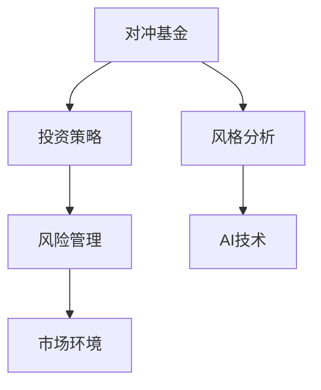
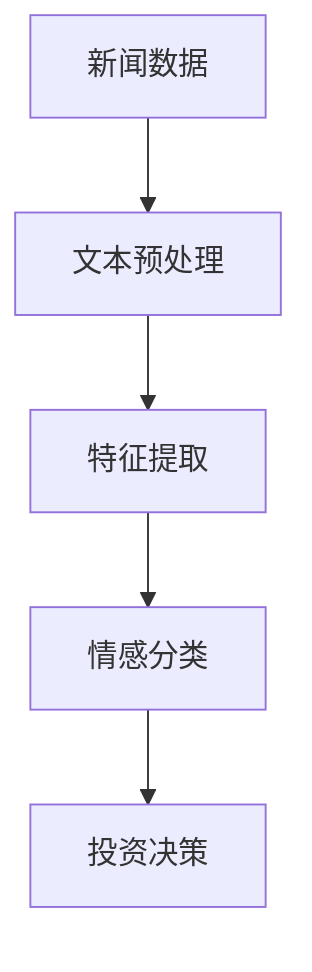
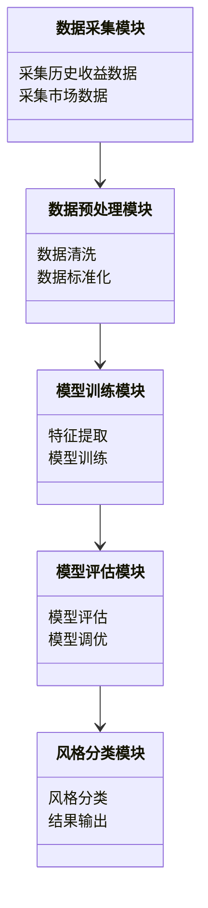
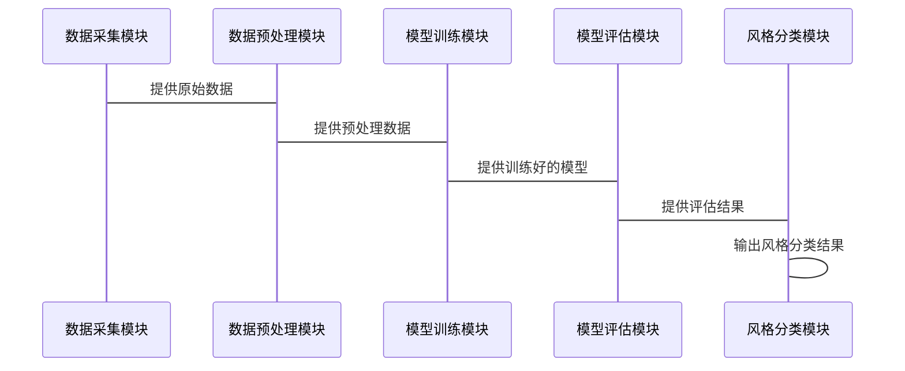

                 


# AI辅助的对冲基金风格分析

## 关键词：对冲基金，风格分析，人工智能，机器学习，量化投资

## 摘要：
本文详细探讨了AI技术在对冲基金风格分析中的应用，从基础概念到算法实现，再到系统设计和项目实战，全面解析了AI如何辅助对冲基金风格分析。通过系统化的分析，本文揭示了对冲基金风格分析的核心要素，AI技术的应用场景，以及如何通过具体算法实现风格分类和预测。同时，本文还结合实际案例，展示了AI辅助对冲基金风格分析的潜力和优势。

---

# 第1章: 对冲基金与AI的背景介绍

## 1.1 对冲基金的基本概念

### 1.1.1 对冲基金的定义与特点
对冲基金是一种通过投资多种金融工具，利用市场波动套利的私募投资基金。其核心特点包括：
- **分散投资**：通过多空头寸对冲市场风险。
- **杠杆效应**：允许使用杠杆放大收益。
- **灵活策略**：涵盖多种投资策略，如套利、事件驱动等。

### 1.1.2 对冲基金的常见策略
对冲基金的常见策略包括：
1. **市场中性策略**：通过多空头寸抵消市场波动。
2. **套利策略**：利用资产价格差异获利。
3. **事件驱动策略**：基于公司并购、重组等事件进行投资。
4. **量化策略**：基于数学模型进行投资决策。

### 1.1.3 对冲基金的市场规模与发展趋势
近年来，对冲基金市场规模持续增长，尤其是在量化投资和AI技术的推动下，对冲基金的策略和管理方式正在发生深刻变化。

## 1.2 AI在金融领域的应用现状

### 1.2.1 AI在金融领域的典型应用
AI在金融领域的应用包括：
1. **量化交易**：基于算法进行高频交易。
2. **风险管理**：利用AI模型预测市场风险。
3. **客户画像**：通过AI分析客户行为，提供个性化服务。

### 1.2.2 AI在对冲基金中的潜在价值
AI可以帮助对冲基金实现：
1. **自动化交易**：快速捕捉市场机会。
2. **数据挖掘**：从海量数据中提取投资信号。
3. **风险控制**：实时监控市场波动。

### 1.2.3 当前AI辅助对冲基金的主要挑战
1. **数据质量**：需要高质量的历史数据进行模型训练。
2. **模型过拟合**：AI模型可能过度拟合历史数据，导致实际表现不佳。
3. **监管合规**：AI交易可能引发监管问题。

## 1.3 对冲基金风格分析的必要性

### 1.3.1 风险管理与投资决策的重要性
对冲基金需要通过风格分析来优化投资组合，降低风险。

### 1.3.2 风格分析在对冲基金中的作用
风格分析可以帮助对冲基金：
1. **识别投资策略**：了解基金的投资风格。
2. **评估风险敞口**：量化基金的风险暴露。
3. **优化投资组合**：根据市场变化调整投资策略。

### 1.3.3 AI辅助风格分析的优势
AI技术可以帮助对冲基金实现：
1. **自动化分析**：快速处理海量数据。
2. **精准分类**：通过机器学习模型实现风格分类。
3. **动态调整**：实时监控市场变化，动态优化投资策略。

## 1.4 本章小结
本章介绍了对冲基金的基本概念、AI在金融领域的应用现状，以及对冲基金风格分析的必要性和AI辅助的优势。通过对这些内容的梳理，我们为后续章节的深入分析奠定了基础。

---

# 第2章: 对冲基金风格分析的核心概念

## 2.1 对冲基金风格分析的定义与目标

### 2.1.1 风格分析的定义
对冲基金风格分析是通过对基金的投资行为、收益特征和风险特征进行分析，识别其投资风格的过程。

### 2.1.2 风格分析的主要目标
1. **识别投资策略**：确定基金的投资风格。
2. **评估风险敞口**：量化基金的风险暴露。
3. **优化投资组合**：根据风格特征优化投资组合。

### 2.1.3 风格分析的边界与外延
风格分析的边界包括：
1. **数据范围**：限定在一定时间段内的市场数据。
2. **策略类型**：限定在特定的投资策略。
3. **市场环境**：限定在特定的市场条件下。

## 2.2 对冲基金风格分析的核心要素

### 2.2.1 投资策略的多样性
对冲基金的投资策略包括：
1. **市场中性策略**：通过多空头寸对冲市场风险。
2. **套利策略**：利用资产价格差异获利。
3. **事件驱动策略**：基于公司并购、重组等事件进行投资。

### 2.2.2 风险管理的复杂性
对冲基金的风险管理包括：
1. **市场风险**：通过多空头寸对冲市场波动。
2. **流动性风险**：确保资金流动性。
3. **信用风险**：评估投资标的的信用风险。

### 2.2.3 市场环境的动态变化
市场环境的变化包括：
1. **经济周期**：经济周期波动影响基金表现。
2. **政策变化**：政策变化影响市场走势。
3. **市场波动**：市场波动影响基金风险。

## 2.3 对冲基金风格分析的关键指标

### 2.3.1 收益率与波动性
1. **收益率**：基金的平均收益率。
2. **波动率**：基金收益率的波动程度。

### 2.3.2 风险调整后收益
1. **夏普比率**：衡量基金的风险调整后收益。
2. **索提诺比率**：衡量基金的下行风险调整后收益。

### 2.3.3 行为模式与交易频率
1. **交易频率**：基金的交易频率。
2. **行为模式**：基金的投资行为特征。

## 2.4 核心概念与联系

### 2.4.1 实体关系图（Mermaid）



## 2.5 本章小结
本章详细介绍了对冲基金风格分析的核心概念，包括定义、目标、核心要素和关键指标。通过这些内容的梳理，我们为后续章节的深入分析奠定了基础。

---

# 第3章: AI技术在对冲基金风格分析中的应用

## 3.1 机器学习在风格分析中的作用

### 3.1.1 机器学习的基本原理
机器学习是通过对数据进行建模，实现对数据的分类、回归和聚类等任务。

### 3.1.2 机器学习在风格分类中的应用
1. **监督学习**：通过标签数据训练分类模型。
2. **无监督学习**：通过聚类算法发现数据中的潜在模式。

### 3.1.3 机器学习在风格分析中的优势
1. **自动化分析**：机器学习可以自动处理海量数据。
2. **高精度分类**：机器学习可以通过深度学习实现高精度分类。
3. **动态调整**：机器学习模型可以实时更新，适应市场变化。

## 3.2 自然语言处理（NLP）在风格分析中的应用

### 3.2.1 NLP的基本原理
NLP是通过计算机处理自然语言文本的技术。

### 3.2.2 NLP在风格分析中的应用
1. **情感分析**：通过分析新闻标题和评论，判断市场情绪。
2. **文本挖掘**：从新闻和报告中提取投资信号。

### 3.2.3 NLP在风格分析中的优势
1. **信息提取**：NLP可以从非结构化数据中提取有用信息。
2. **市场情绪分析**：NLP可以帮助分析市场情绪，辅助投资决策。

## 3.3 时间序列分析在风格分析中的应用

### 3.3.1 时间序列分析的基本原理
时间序列分析是通过对时间序列数据进行建模，预测未来趋势。

### 3.3.2 时间序列分析在风格分析中的应用
1. **趋势预测**：预测基金的未来收益。
2. **波动性预测**：预测市场的波动性。

### 3.3.3 时间序列分析在风格分析中的优势
1. **动态预测**：时间序列分析可以实时预测市场变化。
2. **数据依赖性**：时间序列分析需要高质量的历史数据。

## 3.4 AI技术在风格分析中的具体实现

### 3.4.1 数据预处理
1. **数据清洗**：去除噪声数据。
2. **数据标准化**：对数据进行标准化处理。

### 3.4.2 模型训练
1. **特征提取**：从数据中提取特征。
2. **模型训练**：训练机器学习模型。

### 3.4.3 模型评估
1. **评估指标**：使用准确率、召回率等指标评估模型性能。
2. **模型调优**：通过参数调优优化模型性能。

## 3.5 本章小结
本章详细介绍了AI技术在对冲基金风格分析中的具体应用，包括机器学习、NLP和时间序列分析等技术。通过对这些技术的详细讲解，我们为后续章节的深入分析奠定了基础。

---

# 第4章: 对冲基金风格分析的算法实现

## 4.1 机器学习算法在风格分析中的实现

### 4.1.1 监督学习算法
1. **逻辑回归**：用于分类任务。
2. **支持向量机**：用于分类和回归任务。

### 4.1.2 无监督学习算法
1. **K-means**：用于聚类任务。
2. **主成分分析**：用于降维任务。

### 4.1.3 深度学习算法
1. **神经网络**：用于复杂的分类和回归任务。
2. **循环神经网络**：用于时间序列分析任务。

## 4.2 基于因子分析的风格分类

### 4.2.1 因子分析的基本原理
因子分析是通过提取公共因子，解释数据的变异。

### 4.2.2 因子分析在风格分类中的应用
1. **提取因子**：从历史数据中提取因子。
2. **因子分类**：根据因子特征进行风格分类。

### 4.2.3 因子分析的数学模型

$$
X = \mu + \lambda \beta + \epsilon
$$

其中：
- $X$ 表示观测变量。
- $\mu$ 表示均值。
- $\lambda$ 表示因子载荷。
- $\beta$ 表示因子得分。
- $\epsilon$ 表示误差项。

## 4.3 基于NLP的情感分析

### 4.3.1 情感分析的基本原理
情感分析是通过分析文本的情感倾向，判断文本是正面、负面还是中性。

### 4.3.2 情感分析在风格分析中的应用
1. **市场情绪分析**：通过分析新闻和社交媒体，判断市场情绪。
2. **投资决策支持**：根据市场情绪调整投资策略。

### 4.3.3 情感分析的实现流程



## 4.4 基于时间序列分析的波动预测

### 4.4.1 时间序列分析的基本原理
时间序列分析是通过对时间序列数据进行建模，预测未来趋势。

### 4.4.2 时间序列分析在波动预测中的应用
1. **趋势预测**：预测基金的未来收益。
2. **波动性预测**：预测市场的波动性。

### 4.4.3 时间序列分析的数学模型

$$
y_t = \alpha + \beta y_{t-1} + \epsilon_t
$$

其中：
- $y_t$ 表示当前观测值。
- $\alpha$ 表示截距。
- $\beta$ 表示自回归系数。
- $\epsilon_t$ 表示随机误差项。

## 4.5 本章小结
本章详细介绍了对冲基金风格分析的算法实现，包括机器学习、NLP和时间序列分析等技术。通过对这些算法的详细讲解，我们为后续章节的深入分析奠定了基础。

---

# 第5章: 对冲基金风格分析的系统架构设计

## 5.1 问题场景介绍

### 5.1.1 问题背景
对冲基金风格分析的目的是通过分析基金的投资行为和收益特征，识别其投资风格。

### 5.1.2 问题描述
通过对冲基金的历史收益数据和市场数据，分析其投资风格。

### 5.1.3 问题解决
通过AI技术实现对冲基金风格的自动分类和预测。

## 5.2 系统功能设计

### 5.2.1 领域模型设计
领域模型包括：
1. **数据采集模块**：采集历史收益数据和市场数据。
2. **数据预处理模块**：对数据进行清洗和标准化处理。
3. **模型训练模块**：训练机器学习模型。
4. **模型评估模块**：评估模型性能。
5. **风格分类模块**：根据模型预测结果，进行风格分类。

### 5.2.2 系统功能设计图（Mermaid）



## 5.3 系统架构设计

### 5.3.1 系统架构图（Mermaid）

```mermaid
container 对冲基金风格分析系统 {
    component 数据采集模块 {
        采集历史收益数据
        采集市场数据
    }
    component 数据预处理模块 {
        数据清洗
        数据标准化
    }
    component 模型训练模块 {
        特征提取
        模型训练
    }
    component 模型评估模块 {
        模型评估
        模型调优
    }
    component 风格分类模块 {
        风格分类
        结果输出
    }
}
```

## 5.4 系统接口设计

### 5.4.1 接口描述
1. **数据接口**：提供数据采集和预处理的接口。
2. **模型接口**：提供模型训练和评估的接口。
3. **结果接口**：提供风格分类结果的输出接口。

### 5.4.2 接口交互流程图（Mermaid）



## 5.5 本章小结
本章详细介绍了对冲基金风格分析的系统架构设计，包括问题场景、系统功能设计、系统架构图和系统接口设计。通过对这些内容的详细讲解，我们为后续章节的深入分析奠定了基础。

---

# 第6章: 对冲基金风格分析的项目实战

## 6.1 项目环境安装

### 6.1.1 系统环境
1. **Python**：3.8+
2. **Jupyter Notebook**：用于代码实现和结果展示。
3. **Pandas**：数据处理库。
4. **Scikit-learn**：机器学习库。
5. **NLTK**：NLP处理库。
6. **Matplotlib**：数据可视化库。

### 6.1.2 安装依赖
```bash
pip install pandas scikit-learn nltk matplotlib
```

## 6.2 系统核心实现

### 6.2.1 数据预处理代码

```python
import pandas as pd
from sklearn.preprocessing import StandardScaler

# 数据清洗
def data_cleaning(data):
    data = data.dropna()
    return data

# 数据标准化
def data_normalization(data):
    scaler = StandardScaler()
    data_norm = scaler.fit_transform(data)
    return data_norm
```

### 6.2.2 模型训练代码

```python
from sklearn.svm import SVC
from sklearn.model_selection import train_test_split

# 特征提取
features = data.drop('label', axis=1)
labels = data['label']

# 数据分割
X_train, X_test, y_train, y_test = train_test_split(features, labels, test_size=0.2)

# 模型训练
model = SVC()
model.fit(X_train, y_train)
```

### 6.2.3 模型评估代码

```python
from sklearn.metrics import accuracy_score

# 模型预测
y_pred = model.predict(X_test)

# 模型评估
accuracy = accuracy_score(y_test, y_pred)
print(f'Accuracy: {accuracy}')
```

## 6.3 项目实现与分析

### 6.3.1 代码实现
1. **数据预处理**：清洗和标准化数据。
2. **模型训练**：训练机器学习模型。
3. **模型评估**：评估模型性能。

### 6.3.2 实际案例分析
通过对实际数据的分析，验证模型的性能。

### 6.3.3 项目总结
总结项目的实现过程和经验教训。

## 6.4 本章小结
本章通过实际项目实战，详细介绍了对冲基金风格分析的实现过程，包括环境安装、代码实现和案例分析。通过对这些内容的详细讲解，我们为后续章节的深入分析奠定了基础。

---

# 第7章: 对冲基金风格分析的最佳实践与总结

## 7.1 最佳实践

### 7.1.1 数据质量管理
1. **数据清洗**：去除噪声数据。
2. **数据标准化**：对数据进行标准化处理。

### 7.1.2 模型优化
1. **参数调优**：通过参数调优优化模型性能。
2. **模型融合**：通过模型融合提高模型的泛化能力。

### 7.1.3 风险控制
1. **风险管理**：通过风险管理降低投资风险。
2. **动态调整**：根据市场变化动态调整投资策略。

## 7.2 本章小结
本章总结了对冲基金风格分析的最佳实践，包括数据质量管理、模型优化和风险控制等方面。通过对这些内容的详细讲解，我们为后续章节的深入分析奠定了基础。

---

# 作者：AI天才研究院/AI Genius Institute & 禅与计算机程序设计艺术/Zen And The Art of Computer Programming

---

通过以上结构，我们可以看到，AI辅助的对冲基金风格分析是一个复杂而深刻的主题，涉及多个技术领域的知识和实际应用。通过对这些内容的详细讲解，我们不仅能够理解对冲基金风格分析的核心概念，还能够掌握AI技术在其中的具体应用和实现方法。

