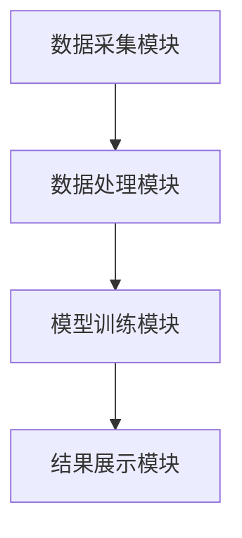
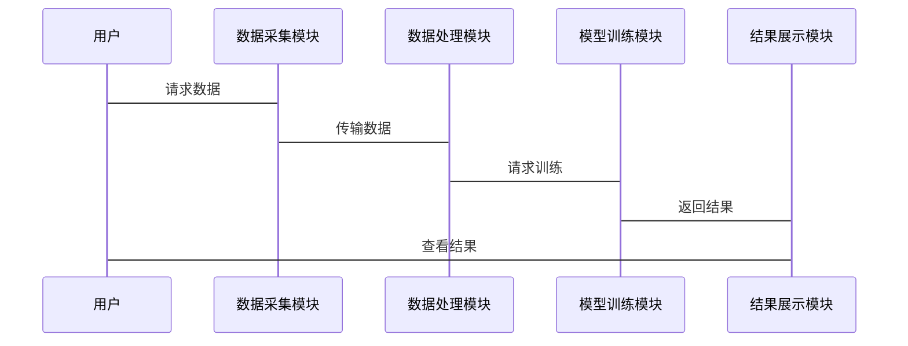

                 


# AI辅助的并购交易估值

> 关键词：AI, 并购估值, 机器学习, 自然语言处理, 金融分析

> 摘要：随着人工智能技术的快速发展，AI在金融领域的应用越来越广泛。并购交易估值作为金融领域的重要组成部分，传统的估值方法存在诸多局限性。本文将详细探讨如何利用AI技术，特别是机器学习和自然语言处理，来提升并购交易估值的准确性和效率。文章从并购交易估值的基本概念出发，分析了AI在并购估值中的作用，详细讲解了相关的技术原理，并通过实际案例展示了AI辅助并购估值的实现过程和应用效果。

---

## 第1章: 并购交易估值概述

### 1.1 并购交易的基本概念

#### 1.1.1 并购的定义与分类
并购（Mergers and Acquisitions，简称M&A）是指一家企业与其他企业（被并购方）合并或收购其资产或股权的行为。并购可以分为两类：
- **合并（Merger）**：两家或更多企业合并成一家新公司。
- **收购（Acquisition）**：一家企业收购另一家企业的全部或部分股权。

并购交易的核心目的是通过整合资源、优化资产配置或扩大市场占有率，实现企业价值的最大化。

#### 1.1.2 并购交易估值的重要性
并购交易的估值是整个交易过程中最为关键的环节之一。准确的估值能够帮助交易双方确定合理的交易价格，避免因估值偏差导致的财务损失或利益分配不均。

传统的并购估值方法主要包括：
- **资产基础法（Asset-Based Valuation）**：基于被并购方的资产负债表进行估值。
- **收益法（Income Approach）**：基于未来现金流的折现值进行估值。
- **市场法（Market Multiple Method）**：基于可比公司的市场交易倍数进行估值。

然而，这些方法在实际应用中存在数据获取难度大、主观性较强、难以量化非财务因素等局限性。

#### 1.1.3 AI在并购估值中的优势
人工智能技术的快速发展为并购估值提供了新的解决方案。AI可以通过以下方式提升并购估值的效率和准确性：
1. **自动化数据处理**：AI能够快速处理海量数据，提取关键特征。
2. **模式识别**：通过机器学习算法识别数据中的潜在规律。
3. **实时更新**：AI系统可以实时跟踪市场动态，提供实时估值。
4. **多维度分析**：结合文本数据、财务数据和市场数据，进行多维度分析。

### 1.2 并购交易估值的核心要素

#### 1.2.1 企业价值评估的关键指标
企业价值（Enterprise Value，EV）是并购估值的核心指标，通常包括以下几个方面：
- **资产与负债**：企业的资产总额和负债总额。
- **息税折旧摊销前利润（EBITDA）**：企业经营的核心利润指标。
- **市盈率（P/E）**：企业股价与每股收益的比率。
- **市净率（P/B）**：企业股价与每股净资产的比率。

#### 1.2.2 市场环境与行业分析
市场环境和行业趋势是影响企业估值的重要因素。AI可以通过以下方式进行分析：
1. **宏观经济数据**：GDP增长率、利率、通货膨胀率等。
2. **行业趋势**：行业市场规模、增长率、竞争格局等。
3. **市场情绪**：通过新闻、社交媒体等文本数据，分析市场情绪对估值的影响。

#### 1.2.3 财务数据与风险评估
财务数据是并购估值的基础，但传统方法难以量化风险因素。AI可以通过以下方式解决这一问题：
1. **风险量化**：通过机器学习模型量化企业的财务风险、市场风险等。
2. **财务预测**：基于历史财务数据，预测未来的财务表现。

---

## 第2章: AI辅助并购交易估值的技术基础

### 2.1 机器学习与深度学习简介

#### 2.1.1 机器学习的基本概念
机器学习是一种通过数据训练模型，使其能够从数据中学习规律的技术。常见的机器学习算法包括：
- **监督学习**：基于标记数据进行训练，例如线性回归、支持向量机（SVM）。
- **无监督学习**：基于未标记数据进行训练，例如聚类分析、主题模型。

#### 2.1.2 深度学习的核心原理
深度学习是一种基于人工神经网络的机器学习技术。其核心是通过多层神经网络提取数据的高层次特征。深度学习在自然语言处理、图像识别等领域表现出色。

#### 2.1.3 神经网络在金融分析中的应用
神经网络在金融分析中的应用主要体现在以下方面：
- **时间序列预测**：用于股票价格预测、汇率预测等。
- **风险评估**：用于信用评分、欺诈检测等。

---

### 2.2 自然语言处理在并购分析中的应用

#### 2.2.1 NLP的基本原理
自然语言处理（NLP）是计算机科学、人工智能、语言学的交叉学科。其目标是让计算机能够理解、处理和生成人类语言。

#### 2.2.2 文本数据的特征提取
文本数据的特征提取是NLP的核心任务之一。常见的特征提取方法包括：
- **词袋模型（Bag-of-Words）**：将文本表示为词汇的集合。
- **TF-IDF**：基于词频-逆文档频率的特征提取。
- **词嵌入（Word Embedding）**：通过神经网络学习词向量，例如Word2Vec、GloVe。

#### 2.2.3 并购公告与新闻分析的NLP实现
并购公告和新闻中的文本数据可以通过NLP技术进行情感分析和主题提取。例如：
- **情感分析**：判断文本的情感倾向（正面、负面、中性）。
- **主题建模**：提取文本的主要主题，例如“市场波动”、“行业趋势”等。

---

### 2.3 数据预处理与特征工程

#### 2.3.1 数据清洗与标准化
数据清洗是数据预处理的重要步骤，主要包括：
- **去重**：去除重复数据。
- **去噪**：去除噪声数据，例如异常值。
- **标准化**：将数据转换为统一的格式，例如将日期格式统一。

#### 2.3.2 特征选择与降维
特征选择是通过选择重要特征来减少数据维度。常见的特征选择方法包括：
- **基于统计的方法**：例如卡方检验。
- **基于模型的方法**：例如LASSO回归。
- **基于树模型的方法**：例如随机森林。

#### 2.3.3 时间序列数据的处理
时间序列数据的处理是并购估值中的重要任务。常见的处理方法包括：
- **滑动窗口**：将时间序列数据划分为多个窗口，每个窗口包含固定数量的历史数据。
- **差分**：通过差分消除时间序列的趋势和季节性。

---

## 第3章: AI辅助并购估值的核心技术

### 3.1 回归分析与估值模型

#### 3.1.1 线性回归的基本原理
线性回归是一种简单而有效的回归算法，适用于线性关系的场景。其数学模型可以表示为：
$$ y = \beta_0 + \beta_1 x + \epsilon $$
其中，$y$ 是目标变量，$x$ 是特征变量，$\beta_0$ 和 $\beta_1$ 是回归系数，$\epsilon$ 是误差项。

#### 3.1.2 逻辑回归在分类问题中的应用
逻辑回归适用于二分类问题，其数学模型可以表示为：
$$ P(y=1|x) = \frac{e^{\beta_0 + \beta_1 x}}{1 + e^{\beta_0 + \beta_1 x}} $$

#### 3.1.3 线性回归在并购估值中的实现
在并购估值中，线性回归可以用于预测企业的市场价值。例如：
- **目标变量**：企业价值（EV）。
- **特征变量**：EBITDA、市盈率、市净率等。

---

### 3.2 聚类分析与市场分割

#### 3.2.1 聚类分析的基本概念
聚类分析是一种无监督学习技术，旨在将数据划分为若干个簇，使得簇内的数据点相似，簇间的数据点差异较大。

#### 3.2.2 K-means算法的实现
K-means算法是一种常见的聚类算法，其核心步骤如下：
1. 初始化：随机选择K个质心。
2. 赋类：将每个数据点分配到距离最近的质心所在的簇。
3. 更新：计算每个簇的新质心。
4. 重复步骤2和3，直到质心不再变化。

#### 3.2.3 聚类在并购市场中的应用
在并购市场中，聚类分析可以用于市场分割。例如：
- **客户细分**：根据企业的财务数据和市场数据，将企业分为不同的类别。
- **市场趋势分析**：通过聚类分析，发现市场中的潜在趋势。

---

### 3.3 自然语言处理与文本挖掘

#### 3.3.1 文本向量化方法
文本向量化方法是NLP的核心技术之一，常见的方法包括：
- **词袋模型**：将文本表示为词汇的集合。
- **TF-IDF**：基于词频-逆文档频率的特征提取。
- **词嵌入**：通过神经网络学习词向量，例如Word2Vec、GloVe。

#### 3.3.2 基于NLP的情感分析
情感分析是NLP的重要应用之一，可以用于分析并购公告的情感倾向。例如：
- **正面情感**：公告内容积极，可能预示着高估值。
- **负面情感**：公告内容消极，可能预示着低估值。

#### 3.3.3 并购公告的情感分析与估值
通过情感分析，可以将并购公告的情感倾向与估值结果进行关联分析。例如：
- **情感得分**：将情感倾向量化为一个得分，例如-1（负面）到1（正面）。
- **情感与估值的关系**：分析情感得分与企业价值（EV）之间的相关性。

---

## 第4章: 系统设计与架构方案

### 4.1 系统功能设计

#### 4.1.1 数据采集模块
数据采集模块负责从多种数据源获取数据，例如：
- **财务数据**：企业财务报表、并购公告等。
- **文本数据**：新闻、社交媒体等。
- **市场数据**：股价、指数等。

#### 4.1.2 数据处理与特征工程模块
数据处理模块负责对数据进行清洗、转换和特征提取。例如：
- **数据清洗**：去除重复数据、处理缺失值。
- **特征提取**：从文本数据中提取关键词、情感得分等。

#### 4.1.3 模型训练与预测模块
模型训练模块负责训练机器学习模型，并进行预测。例如：
- **回归模型**：用于预测企业价值。
- **聚类模型**：用于市场分割。

#### 4.1.4 结果展示与可视化模块
结果展示模块负责将模型的输出结果进行可视化展示。例如：
- **图表展示**：柱状图、折线图等。
- **交互式界面**：用户可以通过界面查看实时估值结果。

### 4.2 系统架构设计

#### 4.2.1 系统功能模块的交互流程
系统功能模块的交互流程如下：
1. 数据采集模块获取数据。
2. 数据处理模块对数据进行清洗和特征提取。
3. 模型训练模块训练模型并进行预测。
4. 结果展示模块将结果展示给用户。

#### 4.2.2 系统架构的Mermaid图


#### 4.2.3 系统交互的Mermaid序列图


---

## 第5章: 项目实战

### 5.1 环境配置与安装

#### 5.1.1 Python环境的安装与配置
建议使用Anaconda作为Python环境管理工具。安装步骤如下：
1. 下载并安装Anaconda：https://www.anaconda.com/
2. 创建虚拟环境：`conda create -n ai_mergers python=3.8`

#### 5.1.2 依赖库的安装
安装常用的机器学习库和NLP库：
- `pip install numpy`
- `pip install pandas`
- `pip install scikit-learn`
- `pip install nltk`
- `pip install gensim`

---

### 5.2 核心代码实现

#### 5.2.1 数据预处理代码
```python
import pandas as pd
import numpy as np

# 读取数据
df = pd.read_csv('data.csv')

# 数据清洗
df = df.dropna()
df = df.drop_duplicates()

# 特征提取
from sklearn.preprocessing import StandardScaler
scaler = StandardScaler()
scaled_features = scaler.fit_transform(df[['revenue', 'profit']])
```

#### 5.2.2 机器学习模型实现
```python
from sklearn.linear_model import LinearRegression
from sklearn.metrics import mean_squared_error

# 训练模型
model = LinearRegression()
model.fit(scaled_features, df['value'])

# 预测结果
y_pred = model.predict(scaled_features)
print(mean_squared_error(df['value'], y_pred))
```

---

## 第6章: 案例分析与扩展

### 6.1 真实案例分析

#### 6.1.1 案例背景
某企业计划并购一家科技公司，目标是通过AI技术提升估值的准确性。

#### 6.1.2 数据收集与处理
收集目标公司的财务数据、市场数据和新闻数据，进行清洗和特征提取。

#### 6.1.3 模型训练与预测
使用线性回归模型进行估值，预测结果与实际估值进行对比分析。

### 6.2 未来趋势与扩展

#### 6.2.1 强化学习的应用
强化学习在金融领域的应用前景广阔，例如在交易策略优化、风险管理等方面。

#### 6.2.2 可解释性AI的发展
可解释性AI（XAI）是未来的重要发展方向，能够帮助用户更好地理解模型的决策过程。

---

## 第7章: 注意事项与最佳实践

### 7.1 数据隐私与安全
在处理并购数据时，必须注意数据隐私和安全问题，确保数据不被泄露或滥用。

### 7.2 模型解释性与可验证性
模型的解释性和可验证性是AI辅助并购估值的重要指标，用户需要能够理解模型的决策过程。

### 7.3 持续学习与模型更新
并购市场是一个动态变化的市场，模型需要不断更新，以适应新的市场环境。

---

## 附录

### 附录A: 数据集参考
- 数据来源：公开的财务数据、新闻数据等。
- 数据格式：CSV格式。

### 附录B: 核心代码参考
```python
import numpy as np
import pandas as pd
from sklearn.linear_model import LinearRegression
from sklearn.metrics import mean_squared_error

# 数据预处理
df = pd.read_csv('data.csv')
df = df.dropna()
scaled_features = StandardScaler().fit_transform(df[['revenue', 'profit']])

# 模型训练
model = LinearRegression()
model.fit(scaled_features, df['value'])

# 预测与评估
y_pred = model.predict(scaled_features)
print(mean_squared_error(df['value'], y_pred))
```

---

## 作者：AI天才研究院 & 禅与计算机程序设计艺术

---

以上是《AI辅助的并购交易估值》的技术博客文章的完整内容，涵盖了从基础概念到实际应用的各个方面，详细介绍了AI在并购估值中的技术实现和实际案例。

