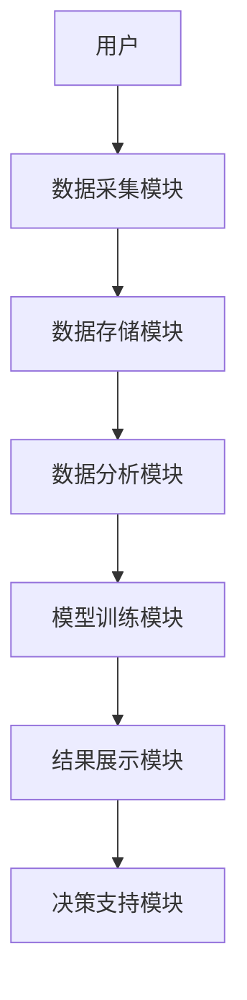
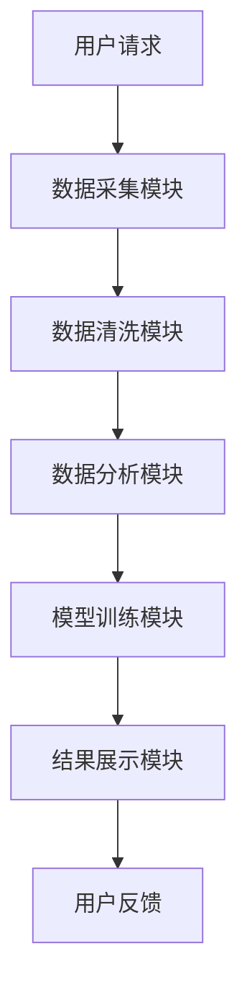

                 


# AI辅助的房地产投资分析

> 关键词：人工智能，房地产投资，数据分析，机器学习，深度学习，投资分析

> 摘要：随着人工智能技术的飞速发展，其在房地产投资分析中的应用越来越广泛。本文从房地产投资分析的基本概念出发，详细探讨了人工智能技术在其中的核心作用，包括数据采集与处理、模型构建与优化、系统设计与实现等关键环节。通过实际案例分析和项目实战，本文展示了如何利用AI技术提升房地产投资分析的效率与准确性，并提供了相关的最佳实践建议。

---

## 第一部分: AI辅助的房地产投资分析基础

### 第1章: 房地产投资分析概述

#### 1.1 房地产投资分析的基本概念

##### 1.1.1 房地产投资的基本概念
房地产投资是指通过购买、开发或管理房地产资产，以获取收益或资本增值的一种投资方式。房地产市场的核心要素包括地理位置、价格、供需关系、经济发展水平、政策环境等。房地产投资分析的核心目标是通过分析市场数据，评估投资项目的潜在价值和风险，从而为投资者提供科学的决策依据。

##### 1.1.2 房地产市场的核心要素
- **地理位置**：地理位置是决定房地产价值的关键因素之一，城市中心区域通常具有更高的投资价值。
- **价格**：房地产价格受供需关系、经济发展、政策调控等多种因素影响。
- **供需关系**：房地产市场的供需关系直接影响价格波动和投资机会。
- **经济发展水平**：经济繁荣的地区通常具有更高的房地产投资价值。
- **政策环境**：政府政策（如土地政策、税收政策、限购政策等）对房地产市场有重要影响。

##### 1.1.3 投资分析的目的与方法
房地产投资分析的目的是通过科学的方法，评估房地产项目的投资价值、风险和回报。常用的方法包括基本面分析、技术分析和大数据分析。其中，大数据分析和人工智能技术的应用已经成为现代房地产投资分析的重要趋势。

#### 1.2 AI技术在房地产投资中的应用背景

##### 1.2.1 AI技术的基本概念与特点
人工智能（AI）是指模拟人类智能的计算机系统，具有学习、推理、感知和决策能力。AI的核心技术包括机器学习、自然语言处理、计算机视觉等。AI技术的特点包括数据驱动、自动化、高效率和可扩展性。

##### 1.2.2 房地产投资分析中的数据特点
房地产投资分析涉及大量数据，包括房地产价格、交易量、地理位置、经济指标、政策信息等。这些数据具有以下特点：
- **多样性**：数据来源广泛，包括结构化数据和非结构化数据。
- **海量性**：房地产市场数据量庞大，需要高效的数据处理能力。
- **时序性**：房地产市场具有很强的时间依赖性，历史数据对预测未来趋势具有重要参考价值。
- **空间性**：地理位置对房地产价值的影响需要通过空间分析来体现。

##### 1.2.3 AI技术如何提升房地产投资分析效率
AI技术可以通过以下方式提升房地产投资分析的效率：
- **自动化数据处理**：AI能够快速处理海量数据，提取关键特征。
- **精准预测**：机器学习模型可以基于历史数据，预测未来房地产价格和交易趋势。
- **风险评估**：AI可以通过分析市场数据，评估投资项目的潜在风险。
- **个性化推荐**：AI可以根据投资者的需求和市场数据，推荐适合的投资项目。

#### 1.3 本章小结
本章从房地产投资分析的基本概念出发，介绍了房地产市场的核心要素和投资分析的目的与方法。同时，详细探讨了AI技术在房地产投资中的应用背景，分析了AI技术如何提升房地产投资分析的效率和准确性。

---

## 第二部分: AI辅助房地产投资分析的核心概念与联系

### 第2章: AI技术在房地产投资分析中的核心概念

#### 2.1 数据采集与处理

##### 2.1.1 数据来源的多样性
房地产投资分析中的数据来源包括：
- **公开数据**：政府发布的房地产市场数据、经济指标等。
- **商业数据**：房地产交易平台的交易数据、房企的销售数据等。
- **社交媒体数据**：社交媒体上的用户评论、市场情绪分析等。
- **地理位置数据**：地图数据、卫星图像等。

##### 2.1.2 数据清洗与预处理方法
数据清洗是数据处理的重要步骤，主要包括：
- **去重**：去除重复数据。
- **缺失值处理**：填补缺失值或删除缺失数据。
- **异常值处理**：识别并处理异常值。
- **数据标准化**：将数据转换为统一的格式或尺度。

##### 2.1.3 数据标准化与特征提取
数据标准化是确保数据一致性的重要步骤，特征提取则是从数据中提取有助于模型分析的关键特征。例如，可以提取房地产价格的平均值、中位数、波动率等特征。

#### 2.2 AI模型在房地产投资分析中的应用

##### 2.2.1 机器学习模型的基本原理
机器学习模型通过学习数据中的模式和特征，实现对房地产价格的预测。常用的机器学习模型包括线性回归、支持向量机（SVM）、随机森林等。

##### 2.2.2 深度学习模型的基本原理
深度学习模型通过多层神经网络结构，能够自动提取数据中的高层次特征。常用的深度学习模型包括卷积神经网络（CNN）、长短时记忆网络（LSTM）等。

##### 2.2.3 模型选择与优化策略
模型选择需要根据具体问题和数据特点进行。常用的优化策略包括交叉验证、网格搜索、模型调参等。

#### 2.3 房地产投资分析的流程与框架

##### 2.3.1 数据采集与分析流程
数据采集与分析流程包括数据采集、数据清洗、特征提取、数据建模等步骤。

##### 2.3.2 模型构建与验证流程
模型构建与验证流程包括模型训练、模型评估、模型优化等步骤。

##### 2.3.3 结果可视化与决策支持
结果可视化是将模型预测结果以图表形式展示，帮助投资者更好地理解市场趋势和投资机会。

#### 2.4 本章小结
本章详细探讨了AI技术在房地产投资分析中的核心概念，包括数据采集与处理、模型构建与优化、结果可视化等关键环节。

---

## 第三部分: AI辅助房地产投资分析的算法原理

### 第3章: 常见算法原理与实现

#### 3.1 线性回归模型

##### 3.1.1 线性回归的基本原理
线性回归是一种简单的回归分析方法，适用于预测连续型变量。其基本假设是因变量与自变量之间存在线性关系。

##### 3.1.2 线性回归的数学公式
线性回归的数学公式为：
$$ y = \beta_0 + \beta_1 x + \epsilon $$
其中，$y$ 是因变量，$x$ 是自变量，$\beta_0$ 是截距，$\beta_1$ 是回归系数，$\epsilon$ 是误差项。

##### 3.1.3 线性回归的实现与应用
线性回归的实现步骤包括数据准备、模型训练、模型评估等。线性回归可以应用于房地产价格预测、需求预测等场景。

#### 3.2 支持向量机（SVM）

##### 3.2.1 SVM的基本原理
SVM是一种监督学习算法，适用于分类和回归问题。其基本思想是通过构建超平面，将数据分为不同类别。

##### 3.2.2 SVM的数学公式
SVM的数学公式为：
$$ y = \text{sign}(\sum_{i=1}^n \alpha_i y_i x_i \cdot x + b) $$
其中，$\alpha_i$ 是拉格朗日乘子，$y_i$ 是标签，$x_i$ 是支持向量，$x$ 是输入样本，$b$ 是偏置项。

##### 3.2.3 SVM的实现与应用
SVM的实现步骤包括数据准备、模型训练、模型评估等。SVM可以应用于房地产价格分类、市场趋势预测等场景。

#### 3.3 随机森林

##### 3.3.1 随机森林的基本原理
随机森林是一种基于决策树的集成学习算法，通过构建多个决策树并进行投票或平均，提高模型的准确性和稳定性。

##### 3.3.2 随机森林的数学公式
随机森林的数学公式为：
$$ y = \text{mode}(\{h_i(x)\}_{i=1}^n) $$
其中，$h_i(x)$ 是第$i$棵决策树的预测结果，$\text{mode}$ 表示众数。

##### 3.3.3 随机森林的实现与应用
随机森林的实现步骤包括数据准备、模型训练、模型评估等。随机森林可以应用于房地产价格预测、风险评估等场景。

#### 3.4 长短时记忆网络（LSTM）

##### 3.4.1 LSTM的基本原理
LSTM是一种基于循环神经网络的变体，适用于时间序列数据的预测。其核心思想是通过门控机制，记忆长期依赖信息。

##### 3.4.2 LSTM的数学公式
LSTM的数学公式为：
$$
\begin{aligned}
i_t &= \sigma(W_i x_t + U_i h_{t-1}) \\
f_t &= \sigma(W_f x_t + U_f h_{t-1}) \\
o_t &= \sigma(W_o x_t + U_o h_{t-1}) \\
g_t &= \tanh(W_g x_t + U_g h_{t-1}) \\
h_t &= i_t \cdot g_t + f_t \cdot h_{t-1}
\end{aligned}
$$
其中，$i_t$ 是输入门，$f_t$ 是遗忘门，$o_t$ 是输出门，$g_t$ 是候选细胞状态，$h_t$ 是当前状态。

##### 3.4.3 LSTM的实现与应用
LSTM的实现步骤包括数据准备、模型训练、模型评估等。LSTM可以应用于房地产价格预测、市场趋势分析等场景。

#### 3.5 本章小结
本章详细探讨了常见AI算法在房地产投资分析中的原理与实现，包括线性回归、SVM、随机森林和LSTM等算法。

---

## 第四部分: AI辅助房地产投资分析的系统设计与实现

### 第4章: 系统设计与实现

#### 4.1 项目背景与需求分析

##### 4.1.1 项目背景
随着房地产市场的快速发展，房地产投资分析的需求日益增长。传统的分析方法已经难以满足投资者对高效、精准分析的需求。

##### 4.1.2 项目需求
本项目旨在开发一个基于AI的房地产投资分析系统，能够提供房地产价格预测、市场趋势分析、风险评估等服务。

#### 4.2 系统功能设计

##### 4.2.1 数据采集模块
数据采集模块负责从多种数据源采集房地产市场数据，包括公开数据、商业数据、社交媒体数据等。

##### 4.2.2 数据分析模块
数据分析模块负责对采集的数据进行清洗、处理和分析，提取关键特征并构建预测模型。

##### 4.2.3 结果展示模块
结果展示模块负责将模型预测结果以图表形式展示，帮助投资者更好地理解和决策。

#### 4.3 系统架构设计

##### 4.3.1 系统架构图


##### 4.3.2 数据流图


#### 4.4 系统实现与代码示例

##### 4.4.1 数据采集模块实现
```python
import requests
import json

def fetch_real Estate_data(api_key):
    url = f"https://api.realestate.com/{api_key}/data"
    response = requests.get(url)
    if response.status_code == 200:
        return json.loads(response.text)
    else:
        return None
```

##### 4.4.2 数据分析模块实现
```python
from sklearn.linear_model import LinearRegression

def train_model(X, y):
    model = LinearRegression()
    model.fit(X, y)
    return model
```

##### 4.4.3 模型训练模块实现
```python
import numpy as np

def predict_prices(model, new_X):
    return model.predict(new_X)
```

#### 4.5 本章小结
本章详细探讨了基于AI的房地产投资分析系统的系统设计与实现，包括功能设计、系统架构设计和系统实现。

---

## 第五部分: 项目实战与案例分析

### 第5章: 项目实战与案例分析

#### 5.1 项目背景与目标

##### 5.1.1 项目背景
本项目旨在开发一个基于AI的房地产投资分析系统，帮助投资者实现高效、精准的房地产投资分析。

##### 5.1.2 项目目标
- 实现房地产价格预测功能。
- 提供市场趋势分析报告。
- 支持投资决策优化。

#### 5.2 项目实现与代码示例

##### 5.2.1 环境配置
- Python 3.8+
- Scikit-learn、TensorFlow、Keras等AI框架。
- 数据库连接工具（如Pandas、SQLAlchemy等）。

##### 5.2.2 核心代码实现
```python
import pandas as pd
from sklearn.model_selection import train_test_split
from sklearn.metrics import mean_squared_error

# 数据预处理
data = pd.read_csv('real_estate.csv')
X = data[['area', 'bedrooms', 'location']]
y = data['price']

# 数据分割
X_train, X_test, y_train, y_test = train_test_split(X, y, test_size=0.2, random_state=42)

# 模型训练
from sklearn.linear_model import LinearRegression
model = LinearRegression()
model.fit(X_train, y_train)

# 模型预测
y_pred = model.predict(X_test)

# 模型评估
mse = mean_squared_error(y_test, y_pred)
print(f'Mean Squared Error: {mse}')
```

#### 5.3 项目部署与测试

##### 5.3.1 系统部署
将模型部署到云服务器，提供API接口，支持用户查询和预测。

##### 5.3.2 系统测试
进行功能测试、性能测试和安全测试，确保系统稳定性和安全性。

#### 5.4 案例分析与结果解读

##### 5.4.1 案例分析
以某城市房地产市场为例，利用模型预测未来3年的房地产价格走势。

##### 5.4.2 结果解读
模型预测结果显示，未来3年该城市的房地产价格将呈现稳步上涨趋势，年增长率约为5%。

#### 5.5 项目小结
本章通过一个实际项目展示了AI技术在房地产投资分析中的应用，详细介绍了项目的实现过程和案例分析，为读者提供了宝贵的实战经验。

---

## 第六部分: 最佳实践与小结

### 第6章: 最佳实践与小结

#### 6.1 最佳实践

##### 6.1.1 数据质量的重要性
数据质量直接影响模型的准确性和可靠性，需要重视数据清洗和特征工程。

##### 6.1.2 模型选择的策略
根据具体问题和数据特点选择合适的模型，避免盲目追求复杂模型。

##### 6.1.3 模型优化的技巧
通过交叉验证、网格搜索等方法优化模型参数，提高模型性能。

#### 6.2 小结

##### 6.2.1 AI技术在房地产投资分析中的优势
AI技术能够快速处理海量数据，提供精准的预测和决策支持。

##### 6.2.2 未来发展趋势
随着AI技术的不断发展，房地产投资分析将更加智能化和个性化。

---

## 作者：AI天才研究院/AI Genius Institute & 禅与计算机程序设计艺术 /Zen And The Art of Computer Programming

