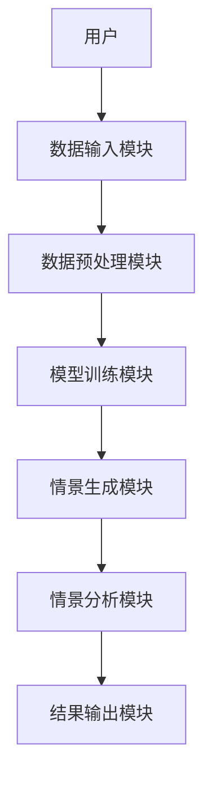
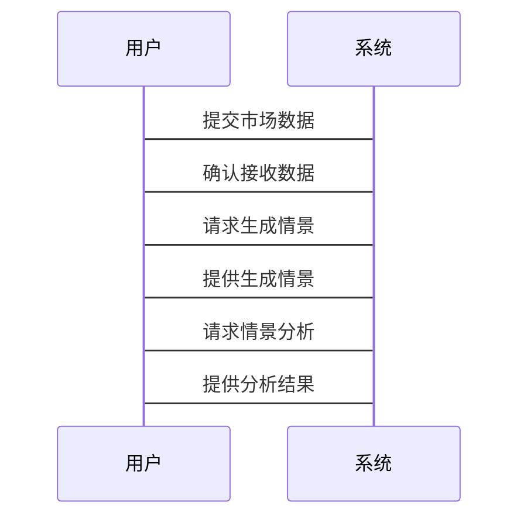

                 


```markdown
# AI辅助的投资组合压力测试情景生成

> 关键词：AI辅助，投资组合，压力测试，情景生成，金融风险管理

> 摘要：本文将详细探讨如何利用人工智能技术辅助投资组合压力测试情景的生成。通过分析压力测试的核心概念、生成模型的算法原理以及系统设计，结合实际案例，展示如何利用AI提升金融风险管理的效率和准确性。

---

# 第一部分: AI辅助的投资组合压力测试情景生成概述

## 第1章: 投资组合压力测试概述

### 1.1 投资组合压力测试的定义与作用

#### 1.1.1 投资组合压力测试的定义
投资组合压力测试是一种金融风险管理方法，用于评估投资组合在极端市场条件下的表现。通过模拟不同的情景，压力测试可以帮助机构识别潜在风险，并制定应对策略。

#### 1.1.2 压力测试在金融风险管理中的作用
压力测试的主要作用包括：
1. **风险识别**：发现投资组合在极端情况下的潜在损失。
2. **风险量化**：评估不同情景对投资组合的影响程度。
3. **策略制定**：基于测试结果优化投资组合结构，制定风险对冲策略。

#### 1.1.3 压力测试的常见应用场景
- 金融机构的内部风险管理
- 投资组合优化与调整
- 金融监管机构的合规要求

### 1.2 AI辅助的必要性与优势

#### 1.2.1 传统压力测试的局限性
传统压力测试依赖于历史数据和假设情景，存在以下问题：
- 情景覆盖有限：难以涵盖所有可能的极端情况。
- 计算复杂：手工模拟情景耗时耗力。
- 结果依赖假设：假设情景可能与实际情况不符。

#### 1.2.2 AI在压力测试中的应用潜力
人工智能技术，特别是生成模型（如GAN和VAE），可以自动生成多样化的市场情景，弥补传统方法的不足。

#### 1.2.3 AI辅助的优势与挑战
优势：
- 自动化生成情景，提高效率。
- 情景多样性高，覆盖更多极端情况。
- 可实时更新市场数据，保持情景的动态性。

挑战：
- 模型训练需要大量高质量数据。
- 模型的准确性依赖于训练数据的质量。
- 需要专业团队进行模型调优和维护。

### 1.3 本书的核心目标与结构

#### 1.3.1 本书的核心目标
通过介绍AI技术在投资组合压力测试中的应用，帮助读者理解如何利用生成模型优化情景生成过程。

#### 1.3.2 本书的章节结构
- **第1章**：介绍压力测试的基本概念和AI辅助的必要性。
- **第2章**：讲解压力测试情景生成的核心概念。
- **第3章**：分析基于GAN的金融数据生成。
- **第4章**：探讨基于VAE的压力测试情景生成。
- **第5章**：设计压力测试系统架构。
- **第6章**：提供项目实战与代码实现。
- **第7章**：总结与展望。

---

# 第二部分: AI辅助的投资组合压力测试情景生成的核心概念

## 第2章: 压力测试情景生成的原理

### 2.1 概率模型与金融数据特征

#### 2.1.1 概率模型的定义与分类
概率模型用于描述数据的分布特性。常见的概率模型包括正态分布、t分布和混合分布等。

#### 2.1.2 金融数据的特征分析
金融数据通常具有以下特征：
- **波动性**：价格波动频繁且幅度大。
- **非线性**：市场行为复杂，难以用线性模型描述。
- **尾部风险**：极端事件发生的概率高于正态分布预测。

#### 2.1.3 数据特征对情景生成的影响
- 数据的波动性要求生成模型能够捕捉市场剧烈波动的情景。
- 非线性特征需要生成模型具备复杂的表达能力。
- 尾部风险要求生成的情景中包含极端事件。

### 2.2 生成模型与金融数据生成

#### 2.2.1 生成模型的定义与分类
生成模型包括生成对抗网络（GAN）和变分自编码器（VAE）等。

#### 2.2.2 GAN与VAE在金融数据生成中的应用
- **GAN**：通过生成器和判别器的对抗训练生成多样化的情景。
- **VAE**：通过压缩数据到 latent space，再解码生成新的数据。

#### 2.2.3 生成模型的优缺点分析
- **优点**：生成多样化的数据，捕捉市场复杂性。
- **缺点**：模型训练不稳定，生成数据的质量依赖于训练数据。

### 2.3 压力测试情景生成的流程

#### 2.3.1 情景生成的基本流程
1. 数据预处理：清洗、标准化。
2. 模型训练：利用历史数据训练生成模型。
3. 情景生成：生成多样化的极端情景。
4. 情景分析：评估情景对投资组合的影响。

#### 2.3.2 数据预处理与特征提取
- 数据清洗：处理缺失值、异常值。
- 特征提取：选择影响投资组合的关键特征。

#### 2.3.3 模型训练与优化
- 参数调整：优化生成模型的超参数。
- 模型评估：使用验证集评估生成数据的质量。

---

## 第3章: 基于GAN的金融数据生成

### 3.1 GAN的基本原理

#### 3.1.1 GAN的架构
GAN由生成器（Generator）和判别器（Discriminator）组成，通过对抗训练优化模型。

#### 3.1.2 GAN的训练过程
1. 判别器学习区分真实数据和生成数据。
2. 生成器学习生成逼真的数据，欺骗判别器。

#### 3.1.3 GAN的数学模型
生成器的损失函数：
$$ L_G = -\log(D(G(z))) $$
判别器的损失函数：
$$ L_D = -[\log(D(x)) + \log(1 - D(G(z)))] $$

### 3.2 基于GAN的金融数据生成

#### 3.2.1 金融数据的GAN生成流程
1. 数据预处理：标准化、归一化。
2. 模型设计：定义生成器和判别器的网络结构。
3. 模型训练：使用真实金融数据训练GAN。
4. 情景生成：利用训练好的GAN生成市场情景。

#### 3.2.2 GAN在金融数据生成中的应用
- 生成极端市场波动的情景。
- 模拟不同经济周期下的市场表现。

### 3.3 基于GAN的压力测试情景生成

#### 3.3.1 GAN生成情景的特点
- 多样性：生成多种极端情景。
- 真实性：生成的情景接近实际市场数据。

#### 3.3.2 基于GAN的压力测试流程
1. 数据准备：收集历史市场数据。
2. 模型训练：训练GAN生成器。
3. 情景生成：生成极端市场情景。
4. 情景分析：评估投资组合在这些情景下的表现。

---

## 第4章: 基于VAE的压力测试情景生成

### 4.1 VAE的基本原理

#### 4.1.1 VAE的架构
VAE由编码器（Encoder）和解码器（Decoder）组成，通过压缩数据到 latent space 进行生成。

#### 4.1.2 VAE的训练过程
1. 编码器将输入数据压缩到 latent space。
2. 解码器将 latent space 数据解码为生成数据。

#### 4.1.3 VAE的数学模型
编码器的损失函数：
$$ L_{KL} = \text{KL}(q(z|x) || p(z)) $$
解码器的损失函数：
$$ L_{recon} = \mathbb{E}_{x}[||x - G(z)||^2] $$

### 4.2 基于VAE的金融数据生成

#### 4.2.1 VAE在金融数据生成中的应用
- 生成多样化的市场情景。
- 捕捉金融数据的复杂特征。

#### 4.2.2 VAE生成情景的特点
- 可控性：通过调整 latent space 参数生成不同情景。
- 稳定性：生成数据的质量较为稳定。

### 4.3 基于VAE的压力测试情景生成

#### 4.3.1 VAE生成情景的特点
- 情景多样性：生成多种极端市场情景。
- 情景连贯性：生成的情景具有合理的市场演变过程。

#### 4.3.2 基于VAE的压力测试流程
1. 数据准备：收集历史市场数据。
2. 模型训练：训练VAE生成器。
3. 情景生成：生成极端市场情景。
4. 情景分析：评估投资组合在这些情景下的表现。

---

## 第5章: 压力测试系统架构设计

### 5.1 系统功能设计

#### 5.1.1 系统模块划分
- 数据输入模块：接收市场数据。
- 模型训练模块：训练生成模型。
- 情景生成模块：生成市场情景。
- 情景分析模块：评估投资组合表现。

#### 5.1.2 系统功能流程
1. 数据输入：接收市场数据。
2. 模型训练：训练生成模型。
3. 情景生成：生成极端市场情景。
4. 情景分析：评估投资组合在这些情景下的表现。

### 5.2 系统架构设计

#### 5.2.1 系统架构图


#### 5.2.2 系统接口设计
- 数据输入接口：接收市场数据。
- 模型训练接口：训练生成模型。
- 情景生成接口：生成极端市场情景。
- 情景分析接口：评估投资组合表现。

### 5.3 系统交互设计

#### 5.3.1 系统交互流程图


---

## 第6章: 项目实战与代码实现

### 6.1 环境安装

#### 6.1.1 安装Python
```bash
python --version
```

#### 6.1.2 安装TensorFlow
```bash
pip install tensorflow
```

#### 6.1.3 安装Keras
```bash
pip install keras
```

### 6.2 核心代码实现

#### 6.2.1 数据加载
```python
import numpy as np
import pandas as pd

# 加载数据
data = pd.read_csv('market_data.csv')
```

#### 6.2.2 模型定义
```python
from tensorflow.keras.layers import Dense, Input, ReLU, Dropout
from tensorflow.keras.models import Model

# 定义生成器
def build_generator(input_dim, output_dim):
    inputs = Input(shape=(input_dim,))
    x = Dense(128, activation='relu')(inputs)
    x = Dropout(0.2)(x)
    outputs = Dense(output_dim, activation='sigmoid')(x)
    return Model(inputs=inputs, outputs=outputs)
```

#### 6.2.3 模型训练
```python
# 训练生成器
generator = build_generator(input_dim, output_dim)
generator.compile(loss='binary_crossentropy', optimizer='adam')
generator.fit(X_train, y_train, epochs=100, batch_size=32)
```

#### 6.2.4 情景生成
```python
# 生成新的市场情景
noise = np.random.normal(0, 1, (100, input_dim))
generated_data = generator.predict(noise)
```

### 6.3 代码应用解读与分析

#### 6.3.1 数据加载
- 加载市场数据，通常包括股票价格、指数等。

#### 6.3.2 模型定义
- 定义生成器网络结构，包括输入层、隐藏层和输出层。

#### 6.3.3 模型训练
- 使用训练数据训练生成器，优化模型参数。

#### 6.3.4 情景生成
- 使用训练好的生成器生成新的市场情景。

### 6.4 实际案例分析和详细讲解

#### 6.4.1 案例分析
- 使用生成的情景评估投资组合在极端市场条件下的表现。

#### 6.4.2 详细讲解
- 解释生成的情景对投资组合的影响，提出风险管理策略。

### 6.5 项目小结
通过实际案例分析，验证了基于GAN的生成模型在压力测试情景生成中的有效性。

---

## 第7章: 总结与展望

### 7.1 本书小结
总结本书的核心内容，强调AI在投资组合压力测试中的应用价值。

### 7.2 最佳实践 tips
- 数据质量是生成模型的关键，需确保数据的完整性和准确性。
- 模型调优是生成模型成功的关键，需反复试验和优化。
- 结合领域知识，选择合适的生成模型和参数设置。

### 7.3 未来展望
- 更复杂的生成模型，如Transformer和扩散模型的应用。
- 结合实时数据，动态生成市场情景。
- 多模态数据的利用，提升生成情景的准确性。

---

# 作者：AI天才研究院/AI Genius Institute & 禅与计算机程序设计艺术 /Zen And The Art of Computer Programming
```

