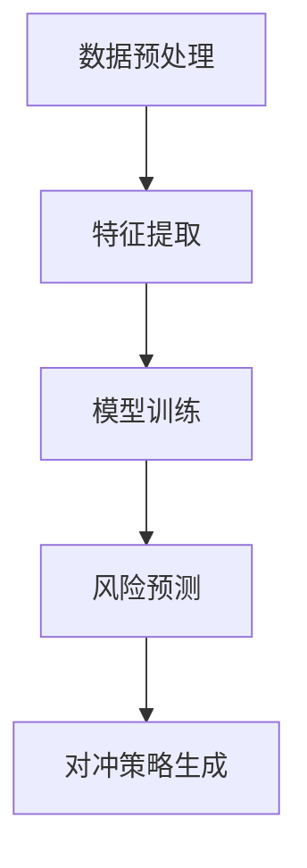
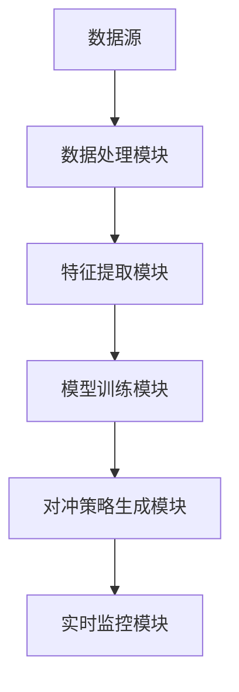
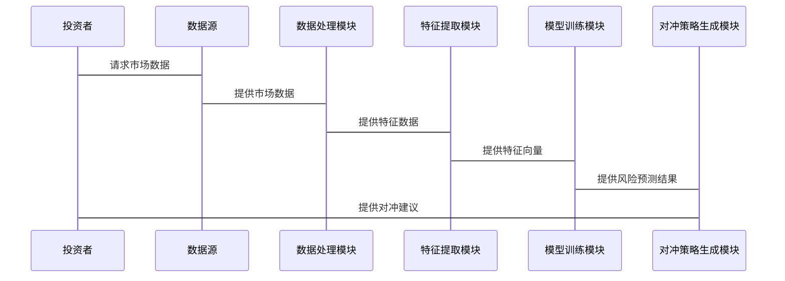

                 


# AI辅助的投资组合尾部风险对冲策略

## 关键词：AI、投资组合、尾部风险、对冲策略、风险管理

## 摘要：  
本文探讨了如何利用人工智能技术辅助投资组合的尾部风险对冲策略。通过分析尾部风险的特殊性及其对投资组合的影响，结合AI在金融领域的应用前景，提出了一种基于机器学习和强化学习的对冲算法。文章详细介绍了AI对冲的核心概念、算法原理、系统架构，并通过实际案例分析展示了AI在尾部风险对冲中的应用效果。本文还提供了Python代码实现和数学模型，帮助读者深入理解AI辅助对冲的实现细节。

---

# 第一部分: AI辅助的投资组合尾部风险对冲策略概述

## 第1章: 投资组合尾部风险与AI辅助对冲的背景介绍

### 1.1 问题背景与描述

#### 1.1.1 投资组合风险的定义与分类  
投资组合风险是指由于市场波动、经济周期变化等因素导致投资组合价值下降的可能性。根据风险的影响程度和发生概率，可以将风险分为系统性风险和非系统性风险。尾部风险属于非系统性风险，其特点是低概率、高损失。

#### 1.1.2 尾部风险的特殊性与危害  
尾部风险是指在市场正常波动之外的极端事件，如黑天鹅事件或灰犀牛事件。这些事件发生概率低，但一旦发生，可能导致投资组合的重大损失。传统的风险管理方法难以有效识别和对冲这种风险。

#### 1.1.3 传统对冲方法的局限性  
传统的对冲方法依赖于统计套利、对冲基金等手段，但这些方法在面对尾部风险时往往表现不佳。例如，统计套利依赖于市场的正常波动，而尾部风险往往超出了统计套利的假设范围。

### 1.2 AI技术在金融领域的应用前景  

#### 1.2.1 AI在金融风险管理中的潜力  
AI技术能够处理海量数据，识别复杂模式，并实时更新模型。这使得AI在金融风险管理中具有巨大潜力，特别是在尾部风险识别和对冲方面。

#### 1.2.2 大数据分析与AI对投资决策的影响  
随着大数据技术的发展，金融数据的规模和复杂性不断增加。AI技术能够从这些数据中提取有价值的信息，帮助投资者做出更明智的决策。

#### 1.2.3 尾部风险对冲的AI解决方案  
AI可以通过机器学习模型预测尾部风险的发生概率，并提出相应的对冲策略。例如，使用强化学习算法优化投资组合，以降低尾部风险的影响。

### 1.3 问题解决与边界定义  

#### 1.3.1 AI辅助对冲的核心目标  
AI辅助对冲的核心目标是通过实时数据处理和模型优化，识别潜在的尾部风险，并提出有效的对冲策略。

#### 1.3.2 解决方案的边界与外延  
本解决方案专注于尾部风险的对冲，不涉及系统性风险或其他类型的风险管理。同时，解决方案的边界包括数据收集、模型训练和对冲策略生成。

#### 1.3.3 核心要素与组成结构  
AI辅助对冲系统的核心要素包括数据源、机器学习模型、对冲策略生成模块和实时监控模块。这些模块共同作用，实现尾部风险的对冲。

---

## 第2章: AI辅助投资组合尾部风险对冲的核心概念  

### 2.1 核心概念与原理  

#### 2.1.1 尾部风险的数学模型  
尾部风险可以用概率分布模型来描述。例如，使用柯西分布或幂律分布来建模极端事件的发生概率。

#### 2.1.2 AI在风险预测中的应用原理  
机器学习模型（如随机森林、支持向量机）可以用来预测尾部风险的发生概率。模型通过分析历史数据，识别潜在的极端事件特征。

#### 2.1.3 对冲策略的优化机制  
对冲策略的优化机制基于强化学习，通过模拟市场环境，优化投资组合的调整策略，以最小化尾部风险的影响。

### 2.2 核心概念的属性特征对比  

| 概念       | 特性1：数据驱动性 | 特性2：实时性 | 特性3：自适应性 |
|------------|------------------|--------------|----------------|
| 尾部风险    | 低               | 高            | 低              |
| AI对冲模型  | 高               | 高            | 高              |

### 2.3 ER实体关系图  

```mermaid
erDiagram
    投资者 --> 对冲模型 : 提供资产配置
    市场数据 --> 对冲模型 : 提供市场数据
    对冲模型 --> 投资者 : 提供对冲建议
```

### 2.4 本章小结  
本章介绍了AI辅助对冲的核心概念，包括尾部风险的数学模型、AI在风险预测中的应用原理以及对冲策略的优化机制。

---

## 第3章: AI辅助对冲的算法原理与数学模型  

### 3.1 算法原理  

#### 3.1.1 基于机器学习的风险预测算法  
使用随机森林算法预测尾部风险的发生概率。算法通过特征提取和模型训练，识别潜在的极端事件特征。

#### 3.1.2 基于强化学习的对冲策略生成  
使用强化学习算法优化对冲策略。通过模拟市场环境，模型学习最优的投资组合调整策略。

#### 3.1.3 算法流程图  



### 3.2 数学模型  

#### 3.2.1 马科维茨的有效前沿模型  
马科维茨的有效前沿模型用于优化投资组合的收益与风险。公式为：  
$$ \min_{w} \frac{1}{2} w^T \Sigma w \quad \text{subject to} \quad \mu^T w \geq \mu_{target}, \quad \sum_{i=1}^n w_i = 1 $$  

#### 3.2.2 风险预测模型  
使用机器学习模型预测尾部风险。例如，使用随机森林模型预测极端事件的发生概率。

### 3.3 本章小结  
本章详细介绍了AI辅助对冲的算法原理，包括机器学习和强化学习的应用，以及相关的数学模型。

---

## 第4章: 系统分析与架构设计方案  

### 4.1 系统架构设计  



### 4.2 系统功能设计  

#### 4.2.1 数据源  
包括股票价格、债券收益率等市场数据。

#### 4.2.2 数据处理模块  
负责清洗和预处理数据，提取特征。

#### 4.2.3 模型训练模块  
使用机器学习算法训练风险预测模型。

#### 4.2.4 对冲策略生成模块  
基于模型输出生成对冲策略。

### 4.3 系统交互设计  



### 4.4 本章小结  
本章描述了AI辅助对冲系统的架构设计和功能模块，展示了系统的整体结构和交互流程。

---

## 第5章: 项目实战  

### 5.1 环境安装  

```bash
pip install numpy pandas scikit-learn matplotlib
```

### 5.2 核心代码实现  

```python
import numpy as np
import pandas as pd
from sklearn.ensemble import RandomForestClassifier
from sklearn.metrics import accuracy_score

# 数据加载
data = pd.read_csv('market_data.csv')

# 特征提取
features = data[['stock_price', 'bond_yield', 'volatility']]
target = data['risk_flag']

# 模型训练
model = RandomForestClassifier()
model.fit(features, target)

# 预测
new_data = pd.read_csv('new_market_data.csv')
new_features = new_data[['stock_price', 'bond_yield', 'volatility']]
predicted_risk = model.predict(new_features)

# 对冲策略生成
if predicted_risk[0] == 1:
    print("建议增加对冲头寸")
else:
    print("建议保持当前投资组合")
```

### 5.3 案例分析  

假设我们有一个包含股票和债券的投资组合，市场数据如下：

| 股票价格 | 债券收益率 | 波动率 | 风险标志 |
|----------|------------|--------|----------|
| 100      | 5%         | 20%    | 0        |
| 95       | 6%         | 30%    | 0        |
| 110      | 4%         | 15%    | 1        |

通过上述代码，模型预测新的市场数据的风险标志为1，建议增加对冲头寸以降低尾部风险的影响。

### 5.4 本章小结  
本章通过实际案例展示了AI辅助对冲策略的实现过程，包括数据处理、模型训练和策略生成。

---

## 第6章: 总结与展望  

### 6.1 最佳实践  

- 数据来源：确保数据的准确性和及时性。
- 模型选择：根据具体情况选择合适的机器学习模型。
- 策略调整：定期更新模型，适应市场变化。

### 6.2 小结  
本文详细探讨了AI辅助投资组合尾部风险对冲策略，从理论到实践，展示了如何利用AI技术优化风险管理。

### 6.3 注意事项  
- 尾部风险具有低概率、高损失的特点，需要特别关注。
- 对冲策略需要实时调整，以应对市场变化。

### 6.4 拓展阅读  
建议进一步研究强化学习在金融风险管理中的应用，以及如何结合其他AI技术提升对冲效果。

---

## 作者：AI天才研究院 & 禅与计算机程序设计艺术

