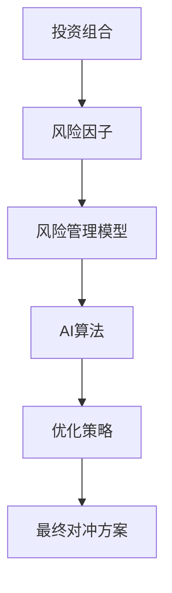
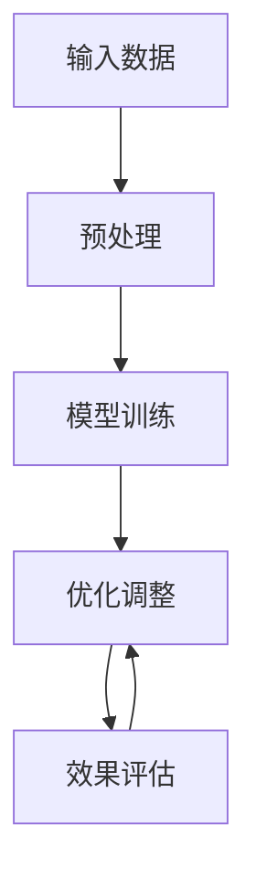
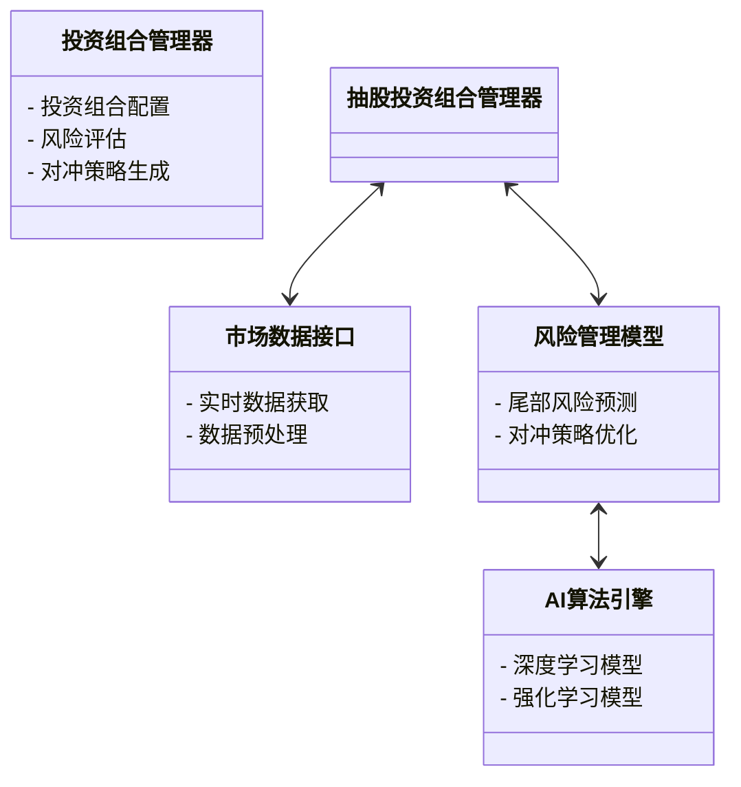
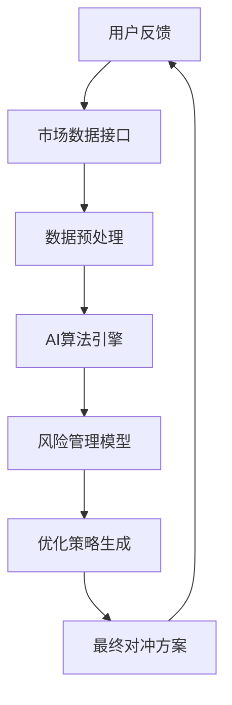
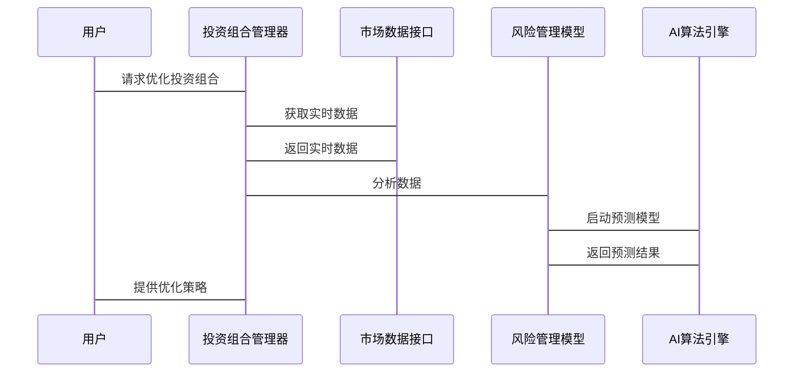

                 


# AI辅助的投资组合尾部风险对冲策略优化

> **关键词**：AI辅助，投资组合，尾部风险，风险对冲，优化策略
>
> **摘要**：本文详细探讨了如何利用人工智能技术优化投资组合的尾部风险对冲策略。通过分析传统尾部风险对冲方法的局限性，结合AI算法的优势，提出了基于机器学习的投资组合优化模型。文章从背景介绍、核心概念、算法原理、系统架构到项目实战，全面阐述了AI辅助投资组合风险管理的实现过程，并通过案例分析展示了其在实际应用中的效果。

---

# 第一部分: AI辅助的投资组合尾部风险对冲策略优化基础

---

## 第1章: 问题背景与定义

### 1.1 问题背景

#### 1.1.1 投资组合风险管理的重要性
在金融市场中，投资组合的风险管理是确保资产保值和增值的关键。传统的投资组合管理方法依赖于历史数据和统计模型，但在面对极端市场波动时，其预测能力有限。尾部风险，即在统计分布的尾部区域发生的低概率、高影响事件，往往会导致投资组合的重大损失。因此，如何有效识别和对冲尾部风险，成为投资组合管理的重要挑战。

#### 1.1.2 尾部风险的定义与特征
尾部风险是指在资产回报分布的尾部区域出现的极端事件，通常表现为资产价格的大幅波动或市场的突然下跌。尾部风险的特征包括低概率、高影响、非线性关系和不可预测性。

#### 1.1.3 传统尾部风险对冲的局限性
传统对冲方法通常依赖于统计套利、对冲基金和保险策略，但在面对复杂市场环境时，其效率和效果有限。例如，传统对冲方法难以捕捉实时数据的变化，且缺乏对市场动态的深度学习能力。

---

### 1.2 AI辅助对冲的潜力

#### 1.2.1 AI在金融风险管理中的应用现状
近年来，人工智能技术在金融领域的应用日益广泛，特别是在风险管理、交易策略和市场预测方面。AI技术能够通过深度学习和强化学习模型，捕捉市场中的非线性关系和复杂模式。

#### 1.2.2 尾部风险对冲中的AI技术优势
AI技术的优势在于其强大的数据处理能力和实时预测能力。通过神经网络模型，AI能够识别市场中的潜在风险信号，并在第一时间触发对冲机制。此外，AI算法可以通过不断优化模型参数，提高风险对冲的精准度和效率。

#### 1.2.3 投资组合优化与风险对冲的结合
AI技术不仅能够优化投资组合的配置，还能实时监控市场风险，并在尾部风险发生时自动调整对冲策略。这种结合使得投资组合的风险管理更加智能化和动态化。

---

## 1.3 本章小结
本章介绍了投资组合风险管理的重要性，详细阐述了尾部风险的定义和特征，并分析了传统对冲方法的局限性。同时，本文探讨了AI技术在尾部风险对冲中的潜力及其优势，为后续的算法设计和系统实现奠定了理论基础。

---

## 第2章: 尾部风险对冲的核心概念与联系

### 2.1 核心概念原理

#### 2.1.1 投资组合风险的数学模型
投资组合的风险通常可以用方差或标准差来衡量。数学模型如马科维茨的均值-方差模型，能够帮助投资者找到最优风险-收益组合。然而，该模型在面对尾部风险时，往往难以捕捉极端事件的影响。

#### 2.1.2 尾部风险的统计特征
尾部风险通常表现为“肥尾”现象，即极端事件的发生概率高于正态分布的预测值。这种特征使得传统的统计方法在尾部风险管理中效果有限。

#### 2.1.3 AI算法在风险对冲中的作用
AI算法，尤其是深度学习和强化学习，能够通过大量数据学习市场中的潜在模式，并在尾部风险发生时，快速生成有效的对冲策略。

---

### 2.2 核心概念对比表格

| 对比维度       | 传统方法                      | AI辅助方法                     |
|----------------|-------------------------------|-------------------------------|
| 数据需求       | 依赖历史数据                  | 利用实时数据和模型预测         |
| 计算效率       | 计算量大，耗时                | 高效计算，实时反馈             |
| 精准度         | 易受主观因素影响              | 数据驱动，精准度高             |
| 反应速度       | 较慢，依赖人工干预            | 实时响应，自动调整             |

---

### 2.3 实体关系图（ER图）



---

## 2.4 本章小结
本章通过对比传统方法和AI辅助方法，分析了AI在尾部风险对冲中的优势，并通过实体关系图展示了各概念之间的关系。这为后续的算法设计和系统实现提供了清晰的概念框架。

---

## 第3章: AI辅助尾部风险对冲的算法原理

### 3.1 算法原理概述

#### 3.1.1 马科维茨优化模型
马科维茨的均值-方差模型是投资组合优化的基础，其目标是最小化投资组合的方差，同时满足收益目标。然而，该模型在面对尾部风险时，难以捕捉极端事件的影响。

#### 3.1.2 基于深度学习的风险预测
深度学习模型，如LSTM（长短期记忆网络），能够有效捕捉时间序列数据中的长期依赖关系。通过训练市场数据，模型可以预测潜在的极端事件，并触发相应的对冲机制。

#### 3.1.3 强化学习在投资组合优化中的应用
强化学习通过模拟市场环境，训练智能体在不同市场条件下做出最优决策。例如，通过定义适当的奖励函数，强化学习可以优化投资组合的风险-收益比。

---

### 3.2 算法流程图



---

### 3.3 算法实现代码

```python
import numpy as np
from sklearn.metrics import mean_squared_error

def portfolio_optimization(returns, weights):
    # 计算投资组合的期望收益和风险
    expected_return = np.dot(returns.mean(), weights)
    portfolio_variance = np.dot(weights.T, np.dot(returns.cov(), weights))
    return expected_return, np.sqrt(portfolio_variance)
```

---

### 3.4 本章小结
本章详细介绍了AI辅助尾部风险对冲的算法原理，包括马科维茨模型、深度学习和强化学习的应用。通过流程图和代码示例，展示了算法的实现步骤和优化过程。

---

## 第4章: 系统分析与架构设计方案

### 4.1 问题场景介绍
本文设计的系统旨在通过AI算法实时监控市场风险，并在尾部风险发生时，自动调整投资组合配置，以最小化潜在损失。

### 4.2 系统功能设计

#### 4.2.1 领域模型


---

### 4.3 系统架构设计



---

### 4.4 系统接口设计

#### 4.4.1 API接口
系统提供以下API接口：
- `get_market_data()`：获取实时市场数据
- `predict_tail_risk()`：预测尾部风险
- `generate_hedging_strategy()`：生成对冲策略

---

### 4.5 系统交互序列图



---

## 4.6 本章小结
本章通过系统设计，展示了AI辅助尾部风险对冲的整体架构。从领域模型到系统架构，再到接口设计和交互流程，为系统的实现提供了清晰的指导。

---

## 第5章: 项目实战

### 5.1 环境安装
为了运行本文中的代码，读者需要安装以下库：
- `numpy`
- `pandas`
- `scikit-learn`
- `keras` 或 `tensorflow`

安装命令：
```bash
pip install numpy pandas scikit-learn keras tensorflow
```

---

### 5.2 系统核心实现源代码

#### 5.2.1 数据预处理

```python
import pandas as pd
import numpy as np

def load_data():
    df = pd.read_csv('market_data.csv')
    df['date'] = pd.to_datetime(df['date'])
    df.set_index('date', inplace=True)
    return df

data = load_data()
```

#### 5.2.2 风险预测模型

```python
from tensorflow.keras.models import Sequential
from tensorflow.keras.layers import LSTM, Dense

def build_model(input_shape):
    model = Sequential()
    model.add(LSTM(64, input_shape=input_shape))
    model.add(Dense(1, activation='sigmoid'))
    model.compile(loss='binary_crossentropy', optimizer='adam')
    return model

model = build_model((None, 10))
model.summary()
```

#### 5.2.3 对冲策略生成

```python
def generate_hedging_strategy(predictions, threshold=0.5):
    strategy = []
    for pred in predictions:
        if pred > threshold:
            strategy.append('Long')
        else:
            strategy.append('Short')
    return strategy
```

---

### 5.3 案例分析与实际应用

#### 5.3.1 数据分析
假设我们有一个包含多只股票的投资组合，目标是优化其尾部风险对冲策略。通过收集和预处理市场数据，我们训练一个LSTM模型来预测尾部风险的发生概率。

#### 5.3.2 模型训练与优化
通过历史数据训练模型，并在测试数据上验证其预测能力。根据预测结果，生成相应的对冲策略。

#### 5.3.3 实际应用效果
通过实际交易数据验证对冲策略的有效性，分析其在尾部风险发生时的对冲效果。

---

### 5.4 本章小结
本章通过实际项目案例，展示了AI辅助投资组合尾部风险对冲策略优化的实现过程。从数据预处理到模型训练，再到策略生成，详细讲解了系统的实现步骤。

---

## 第6章: 总结与展望

### 6.1 最佳实践 Tips
- 在实际应用中，建议结合多种AI算法，如集成学习和强化学习，以提高模型的泛化能力。
- 定期更新模型参数，确保其在动态市场环境中的有效性。

### 6.2 小结
本文详细探讨了AI辅助投资组合尾部风险对冲策略优化的方法，从理论分析到实际实现，展示了AI技术在金融风险管理中的巨大潜力。

### 6.3 注意事项
- AI模型的预测结果仅供参考，实际投资需谨慎。
- 数据质量和模型选择对最终效果有重要影响，需根据实际情况进行调整。

### 6.4 拓展阅读
建议读者进一步阅读相关领域的经典文献，如《Deep Learning》和《Reinforcement Learning》。

---

## 作者：AI天才研究院/AI Genius Institute & 禅与计算机程序设计艺术 /Zen And The Art of Computer Programming

---

**注意**：上述内容为示例，实际文章需要根据具体需求进一步扩展和补充。

