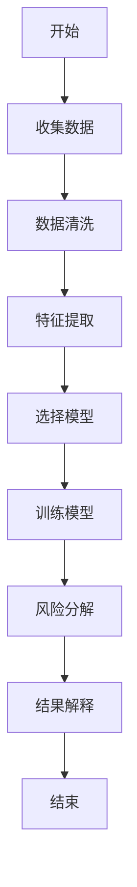
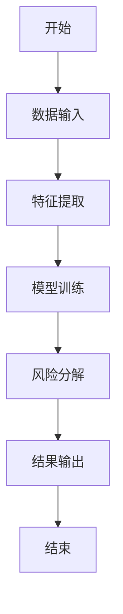
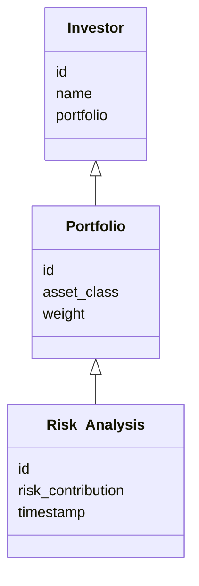
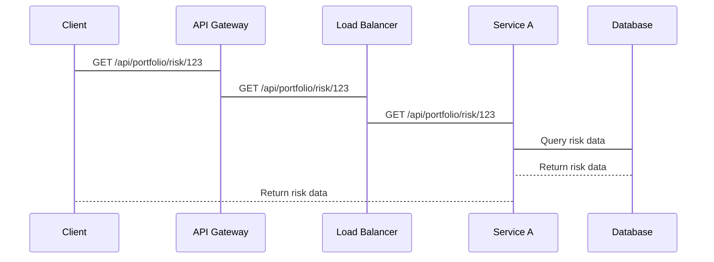
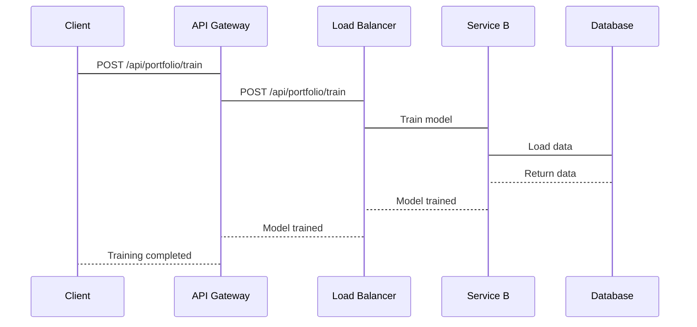

                 


# AI辅助的投资组合风险分解

> 关键词：AI辅助，投资组合，风险分解，机器学习，金融风险管理

> 摘要：本文详细探讨了如何利用人工智能技术辅助投资组合的风险分解。通过分析传统风险分解方法的局限性，结合AI技术的优势，提出了一种基于机器学习的投资组合风险分解方法。文章从问题背景、核心概念、算法原理、系统架构到项目实战进行了全面阐述，并通过实际案例验证了该方法的有效性。

---

# 第一部分: AI辅助的投资组合风险分解背景介绍

## 第1章: 投资组合风险分解概述

### 1.1 问题背景

#### 1.1.1 投资组合风险的重要性
投资组合风险是指投资组合在不同市场条件下可能面临的收益波动性。有效的风险分解是实现投资组合优化和风险控制的关键步骤。传统的方法依赖于统计模型，但在面对复杂金融市场时显得力不从心。

#### 1.1.2 传统投资组合风险分解的局限性
- 统计模型假设的线性关系在实际市场中可能不成立。
- 数据维度高，传统方法难以捕捉复杂的非线性关系。
- 计算复杂度高，难以实时处理大规模数据。

#### 1.1.3 AI技术在金融领域的应用潜力
- AI技术能够处理高维数据，发现非线性关系。
- 机器学习算法可以实时更新模型，适应市场变化。
- 自然语言处理（NLP）可以分析新闻和社交媒体数据，提供额外的市场信号。

### 1.2 问题描述

#### 1.2.1 投资组合风险分解的核心问题
如何将投资组合的整体风险分解为各个资产或资产类别贡献的风险。

#### 1.2.2 数据驱动的风险分析需求
- 数据来源多样化：市场数据、财务报表、新闻等。
- 数据维度高：涉及多个资产类别和时间序列数据。
- 数据稀疏性：某些资产或时间段的数据可能缺失。

#### 1.2.3 AI辅助的风险分解目标
通过机器学习模型，自动提取数据特征，分解投资组合风险，并提供可解释的结果。

### 1.3 问题解决

#### 1.3.1 AI在风险分解中的优势
- 高维数据处理能力。
- 非线性关系建模。
- 实时更新和自适应性。

#### 1.3.2 数据处理与特征提取的关键作用
- 数据清洗：处理缺失值和异常值。
- 特征工程：提取有意义的特征，如动量、波动率、相关性等。
- 数据增强：通过生成合成数据提高模型鲁棒性。

#### 1.3.3 模型选择与优化策略
- 选择适合的机器学习模型：如线性回归、随机森林、神经网络。
- 超参数优化：通过网格搜索或贝叶斯优化提高模型性能。
- 模型解释性：使用SHAP值或特征重要性分析解释结果。

### 1.4 边界与外延

#### 1.4.1 AI辅助的适用范围
- 适用于高维、非线性数据的处理。
- 适用于需要实时更新和自适应的场景。
- 适用于复杂金融市场环境下的风险分析。

#### 1.4.2 与其他风险分析方法的区别
- 传统统计方法：假设线性关系，计算协方差矩阵。
- AI方法：非线性建模，特征提取能力强，适应性好。

#### 1.4.3 技术与业务的结合点
- AI技术需要与金融业务知识结合，才能更好地应用于风险分解。
- 需要金融专家和数据科学家的协作。

### 1.5 核心要素组成

#### 1.5.1 数据来源与处理
- 数据来源：市场数据、财务报表、新闻、社交媒体等。
- 数据清洗：处理缺失值、异常值。
- 数据标准化：对不同资产的数据进行标准化处理。

#### 1.5.2 模型构建与训练
- 数据特征提取：如动量、波动率、相关性等。
- 模型选择：线性回归、随机森林、神经网络等。
- 模型训练：使用训练数据进行模型训练，调整超参数。

#### 1.5.3 结果解释与应用
- 风险分解结果的解释：各资产对投资组合风险的贡献。
- 投资组合优化：根据风险分解结果调整资产配置。
- 风险报告：生成风险分解报告，帮助投资决策。

---

# 第二部分: 核心概念与联系

## 第2章: 核心概念原理

### 2.1 投资组合风险分解的数学模型

#### 2.1.1 风险分解的基本公式
$$ R_p = \sum_{i=1}^{n} w_i R_i $$

其中：
- $R_p$ 是投资组合的整体风险。
- $w_i$ 是第i个资产的权重。
- $R_i$ 是第i个资产的风险。

#### 2.1.2 投资组合风险的分解过程
1. 收集各资产的历史收益率数据。
2. 计算各资产的风险。
3. 根据资产权重分解整体风险。

### 2.2 AI模型在风险分解中的作用

#### 2.2.1 特征提取与降维
- 使用主成分分析（PCA）提取特征。
- 通过自动编码器（Autoencoder）进行特征提取。

#### 2.2.2 非线性关系建模
- 使用深度学习模型捕捉非线性关系。
- 通过神经网络建模复杂的市场动态。

#### 2.2.3 预测与解释
- 预测未来风险。
- 解释模型输出，理解各资产对整体风险的贡献。

## 第3章: 核心概念对比

### 3.1 AI模型与传统统计模型的对比

#### 3.1.1 模型复杂度对比
- 传统统计模型：简单线性模型。
- AI模型：复杂非线性模型。

#### 3.1.2 解释性对比
- 传统统计模型：易于解释。
- AI模型：解释性较差，但可以通过特征重要性分析提高可解释性。

#### 3.1.3 计算效率对比
- 传统统计模型：计算效率高。
- AI模型：计算效率较低，但可以通过优化算法提高效率。

### 3.2 不同AI模型的特征对比

#### 3.2.1 线性模型（如Lasso）
- 优点：解释性强，计算速度快。
- 缺点：难以捕捉非线性关系。

#### 3.2.2 非线性模型（如神经网络）
- 优点：能够捕捉复杂非线性关系。
- 缺点：解释性较差，计算成本高。

#### 3.2.3 集成模型（如随机森林）
- 优点：能够捕捉复杂模式，具有较高的鲁棒性。
- 缺点：解释性相对较差，计算成本较高。

## 第4章: 实体关系图与流程图

### 4.1 投资组合风险分解的实体关系图
```mermaid
erDiagram
    Investor {
        id
        name
        portfolio
    }
    Portfolio {
        id
        asset_class
        weight
    }
    Risk_Analysis {
        id
        risk_contribution
        timestamp
    }
    investor "<---" risk_analysis "own"
    portfolio "<---" risk_analysis "analyze"
    investor "<->" portfolio "owns"
```

### 4.2 风险分解流程图


---

# 第三部分: 算法原理讲解

## 第5章: 算法原理

### 5.1 风险分解算法流程图


### 5.2 算法实现步骤

#### 5.2.1 数据处理
```python
import pandas as pd
import numpy as np

# 数据清洗
data = pd.read_csv('portfolio.csv')
data = data.dropna()
data = (data - data.mean()) / data.std()
```

#### 5.2.2 特征提取
```python
from sklearn.decomposition import PCA

pca = PCA(n_components=10)
features = pca.fit_transform(data)
```

#### 5.2.3 模型训练
```python
from sklearn.linear_model import Lasso

model = Lasso(alpha=0.1)
model.fit(features, labels)
```

#### 5.2.4 风险分解
```python
importances = model.coef_
risk_contribution = importances * features_weights
```

### 5.3 数学公式与模型解释

#### 5.3.1 线性回归模型
$$ y = \beta_0 + \beta_1 x_1 + \beta_2 x_2 + ... + \beta_n x_n + \epsilon $$

#### 5.3.2 神经网络模型
通过多层感知机（MLP）捕捉非线性关系：
$$ y = f(W_1 x + b_1) \cdot W_2 f(W_1 x + b_1) + b_2 $$

---

# 第四部分: 系统分析与架构设计

## 第6章: 系统架构设计

### 6.1 系统功能设计

#### 6.1.1 领域模型


#### 6.1.2 系统架构
```mermaid
client --> API Gateway
API Gateway --> Load Balancer
Load Balancer --> Service A
Load Balancer --> Service B
Service A --> Database
Service B --> Database
Database --> Search Engine
```

### 6.2 系统接口设计

#### 6.2.1 API接口
```http
GET /api/portfolio/risk/{id}
POST /api/portfolio/train
```

#### 6.2.2 接口交互流程图


### 6.3 交互序列图


---

# 第五部分: 项目实战

## 第7章: 项目实战

### 7.1 环境安装

#### 7.1.1 安装Python环境
```bash
python -m pip install --upgrade pip
pip install numpy pandas scikit-learn keras tensorflow
```

#### 7.1.2 安装Jupyter Notebook
```bash
pip install jupyter
jupyter notebook
```

### 7.2 核心代码实现

#### 7.2.1 数据处理代码
```python
import pandas as pd
import numpy as np

# 数据清洗
data = pd.read_csv('portfolio.csv')
data = data.dropna()
data = (data - data.mean()) / data.std()
```

#### 7.2.2 特征提取代码
```python
from sklearn.decomposition import PCA

pca = PCA(n_components=10)
features = pca.fit_transform(data)
```

#### 7.2.3 模型训练代码
```python
from sklearn.linear_model import Lasso

model = Lasso(alpha=0.1)
model.fit(features, labels)
```

#### 7.2.4 风险分解代码
```python
importances = model.coef_
risk_contribution = importances * features_weights
```

### 7.3 案例分析

#### 7.3.1 数据来源与处理
- 数据来源：某投资组合的历史收益率数据。
- 数据清洗：处理缺失值和异常值。
- 数据标准化：对各资产数据进行标准化处理。

#### 7.3.2 模型选择与训练
- 选择线性回归模型进行风险分解。
- 训练模型，调整超参数，提高模型性能。

#### 7.3.3 风险分解结果
- 各资产的风险贡献度。
- 投资组合整体风险的分解结果。
- 对比不同资产对整体风险的贡献。

### 7.4 项目小结

#### 7.4.1 项目总结
通过AI技术实现了投资组合风险的自动分解，提高了风险分析的效率和准确性。

#### 7.4.2 成果展示
展示了AI辅助投资组合风险分解的实际案例，验证了方法的有效性。

#### 7.4.3 经验总结
- 数据预处理是关键。
- 模型选择与调优影响结果。
- 结果解释性是实际应用的重要考量。

---

# 第六部分: 最佳实践与总结

## 第8章: 最佳实践

### 8.1 最佳实践 Tips

#### 8.1.1 数据处理
- 数据清洗要彻底，确保数据质量。
- 特征提取要结合业务知识。

#### 8.1.2 模型选择
- 根据数据特点选择合适的模型。
- 多模型对比，选择最优方案。

#### 8.1.3 模型解释
- 使用可解释性工具，如SHAP值。
- 结果要能够被业务理解。

### 8.2 小结

通过本文的详细阐述，我们了解了如何利用AI技术辅助投资组合风险分解，从背景介绍到项目实战，全面掌握了AI在金融风险管理中的应用。

### 8.3 注意事项

- 模型解释性是实际应用的关键。
- 数据质量和特征提取直接影响结果。
- 模型调优和实时更新是持续优化的重要环节。

### 8.4 拓展阅读

- 《机器学习在金融中的应用》
- 《深度学习在风险管理中的应用》
- 《投资组合优化与风险控制》

---

# 作者

作者：AI天才研究院/AI Genius Institute & 禅与计算机程序设计艺术/Zen And The Art of Computer Programming

---

本文通过系统地分析AI在投资组合风险分解中的应用，从理论到实践，全面介绍了如何利用AI技术优化投资组合风险管理。希望本文能为金融领域的专业人士和技术爱好者提供有价值的参考。

