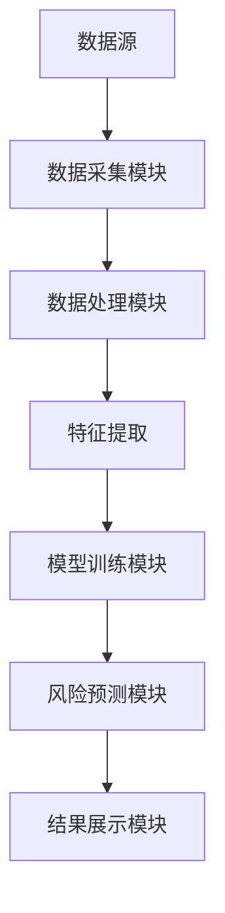
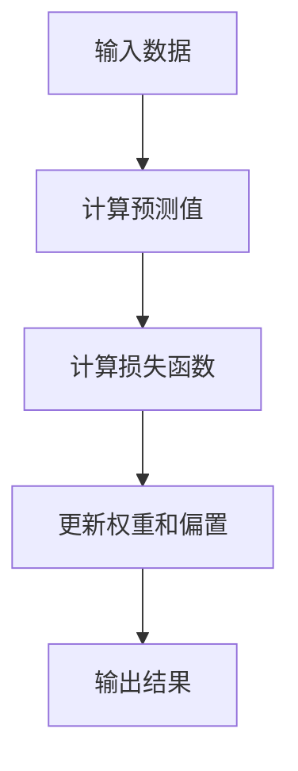
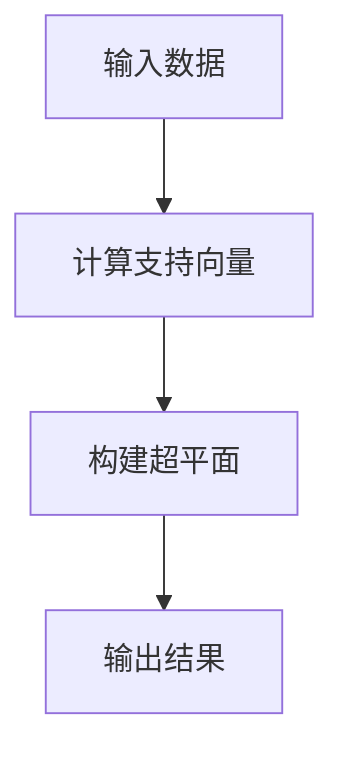
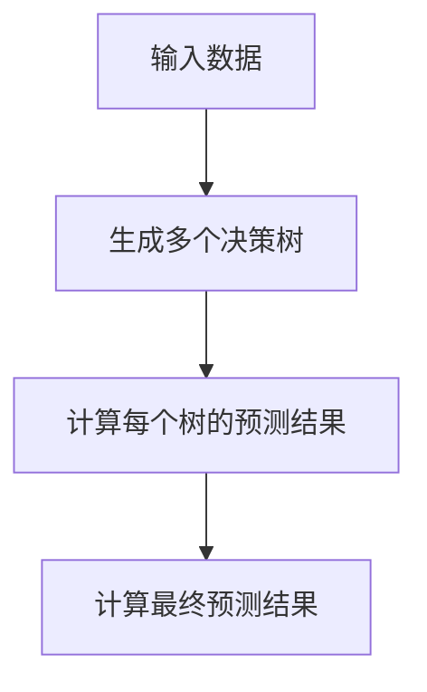
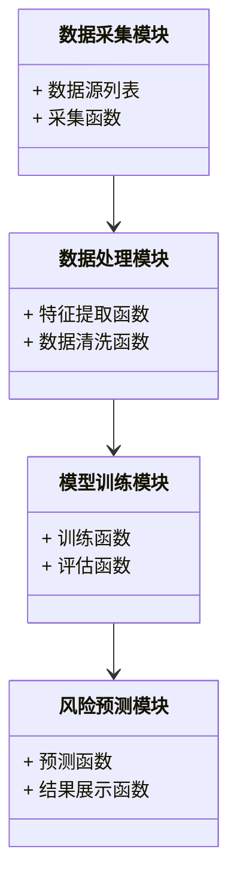
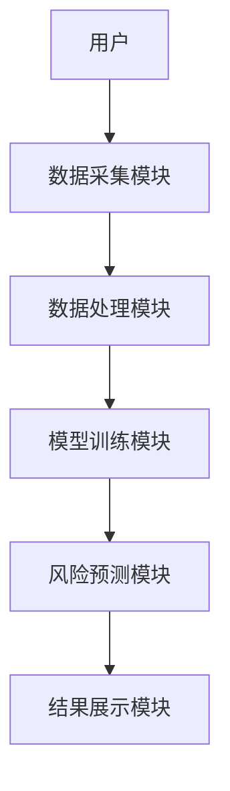

                 


# AI辅助的金融风险评估系统设计

**关键词**：AI、金融风险、机器学习、系统设计、风险评估、数据驱动、智能化

**摘要**：  
本文深入探讨了AI技术在金融风险评估中的应用，从系统设计、算法原理到实际案例，全面解析如何利用AI技术提升金融风险评估的准确性和效率。文章首先介绍了金融风险评估的背景与挑战，接着详细阐述了AI辅助评估的核心概念与系统架构，随后重点分析了常用机器学习算法及其在风险评估中的应用，最后通过实际案例展示了系统的实现与优化。通过本文的讲解，读者将能够理解AI在金融风险评估中的重要作用，并掌握相关系统的构建方法。

---

# 第一部分：AI辅助的金融风险评估系统背景与基础

## 第1章：金融风险评估的背景与挑战

### 1.1 金融风险评估的背景

#### 1.1.1 金融风险的定义与类型
金融风险是指在金融活动中，由于不确定因素导致资金损失的可能性。常见的金融风险类型包括市场风险、信用风险、流动性风险和操作风险。

#### 1.1.2 问题背景与描述
传统金融风险评估方法依赖于统计分析和专家经验，但在面对海量数据和复杂市场环境时，存在效率低、精度差的问题。例如，传统方法难以及时捕捉市场波动中的非线性关系，也无法有效处理多维度数据之间的关联性。

#### 1.1.3 AI技术在金融风险评估中的作用
AI技术通过机器学习、自然语言处理和图神经网络等技术，能够从海量数据中提取特征，发现隐藏的规律，并实时更新模型，从而显著提升风险评估的效率和准确性。

#### 1.1.4 系统的边界与外延
AI辅助的金融风险评估系统通常包括数据采集、特征提取、模型训练、风险预测和结果展示五个核心模块。

### 1.2 核心概念与术语说明

#### 1.2.1 核心概念
- **数据驱动**：基于大量数据进行建模和分析，而非依赖传统经验法则。
- **AI辅助**：利用人工智能技术提升金融风险评估的效率和准确性。
- **实时性**：系统能够实时更新数据并快速输出评估结果。

#### 1.2.2 问题解决
AI辅助系统通过自动化数据处理和模型优化，解决了传统方法在数据量大、维度高时的效率问题。

#### 1.2.3 概念结构与核心要素
| 核心要素 | 定义 | 示例 |
|----------|------|------|
| 数据源   | 输入数据的来源 | 历史交易数据、市场数据、新闻数据 |
| 特征提取 | 从数据中提取关键特征 | 市场波动率、信用评分、交易频率 |
| 模型选择 | 选择合适的机器学习模型 | 支持向量机、随机森林、神经网络 |
| 风险预测 | 输出风险评估结果 | 风险等级、概率值、预警信号 |

---

## 第2章：AI辅助金融风险评估的核心概念

### 2.1 金融风险评估的定义与特点

#### 2.1.1 金融风险评估的定义
金融风险评估是对金融资产或交易可能面临的损失进行量化和预测的过程。

#### 2.1.2 AI辅助的特点
- **自动化**：AI系统能够自动处理数据和模型训练。
- **高精度**：通过机器学习算法，AI可以提高预测的准确性。
- **实时性**：系统能够实时更新数据并输出结果。

### 2.2 AI技术在金融风险评估中的应用

#### 2.2.1 数据处理与特征工程
- 数据清洗：去除噪声数据，处理缺失值。
- 特征提取：从原始数据中提取有意义的特征，如市场波动率、交易量等。

#### 2.2.2 模型选择与优化
- 选择合适的机器学习模型，如随机森林、支持向量机。
- 通过交叉验证优化模型参数。

#### 2.2.3 可视化与解释性
- 使用图表展示风险评估结果。
- 提供模型的可解释性，帮助用户理解预测结果。

---

## 第3章：AI辅助金融风险评估的系统架构

### 3.1 系统架构概述

#### 3.1.1 系统功能模块
- 数据采集模块：负责收集市场数据、交易数据等。
- 数据处理模块：清洗数据并提取特征。
- 模型训练模块：训练机器学习模型。
- 风险预测模块：输出风险评估结果。
- 结果展示模块：以可视化形式呈现预测结果。

#### 3.1.2 系统架构图


### 3.2 数据流与交互流程

#### 3.2.1 数据采集流程
1. 从数据库或API获取原始数据。
2. 数据清洗，处理缺失值和异常值。
3. 提取特征，如市场指数、交易量等。

#### 3.2.2 模型训练流程
1. 选择合适的机器学习算法。
2. 进行数据分割，划分训练集和测试集。
3. 训练模型并进行交叉验证。

#### 3.2.3 用户交互流程
1. 用户输入查询条件。
2. 系统输出风险评估结果。
3. 用户查看可视化报告。

---

# 第二部分：AI辅助金融风险评估的核心算法与数学模型

## 第4章：常见机器学习算法及其在金融风险评估中的应用

### 4.1 线性回归模型

#### 4.1.1 线性回归的数学模型
$$ y = wx + b $$

#### 4.1.2 算法流程（Mermaid）


#### 4.1.3 代码实现示例
```python
import numpy as np
from sklearn.linear_model import LinearRegression

# 示例数据
X = np.array([[1], [2], [3], [4]])
y = np.array([2, 4, 6, 8])

# 训练模型
model = LinearRegression()
model.fit(X, y)

# 预测结果
print(model.predict([[5]]))  # 输出：[[10]]
```

### 4.2 支持向量机（SVM）

#### 4.2.1 SVM的数学模型
$$ \text{max} \frac{1}{2}w^2 - C\sum_{i=1}^n \xi_i $$
$$ \text{subject to} \ y_i(w \cdot x_i + b) \geq 1 - \xi_i $$

#### 4.2.2 算法流程（Mermaid）


#### 4.2.3 代码实现示例
```python
from sklearn import svm

# 示例数据
X = [[0, 0], [1, 1], [2, 2], [3, 3], [4, 4]]
y = [0, 1, 1, 1, 0]

# 训练模型
model = svm.SVC()
model.fit(X, y)

# 预测结果
print(model.predict([[2.5, 2.5]]))  # 输出：[1]
```

### 4.3 随机森林

#### 4.3.1 随机森林的算法流程（Mermaid）


#### 4.3.2 代码实现示例
```python
from sklearn.ensemble import RandomForestClassifier

# 示例数据
X = [[0, 0], [1, 1], [2, 2], [3, 3], [4, 4]]
y = [0, 1, 1, 1, 0]

# 训练模型
model = RandomForestClassifier(n_estimators=100)
model.fit(X, y)

# 预测结果
print(model.predict([[2.5, 2.5]]))  # 输出：[1]
```

---

## 第5章：神经网络与深度学习在金融风险评估中的应用

### 5.1 神经网络的基础概念

#### 5.1.1 神经网络的数学模型
$$ y = \sigma(w x + b) $$
其中，$\sigma$ 是激活函数，如ReLU或sigmoid。

#### 5.1.2 神经网络的结构
- 输入层
- 隐藏层
- 输出层

### 5.2 深度学习在金融风险评估中的应用

#### 5.2.1 卷积神经网络（CNN）
- 适用于图像数据的处理，但在金融时间序列数据中的应用有限。

#### 5.2.2 循环神经网络（RNN）
- 适用于时间序列数据，如股票价格预测。

#### 5.2.3 长短期记忆网络（LSTM）
- 适合处理时间序列数据中的长距离依赖关系。

---

## 第6章：数学模型与公式详解

### 6.1 线性回归模型的公式推导

#### 6.1.1 最小二乘法
$$ \text{最小化} \sum_{i=1}^n (y_i - (wx_i + b))^2 $$

#### 6.1.2 正则化
$$ \text{损失函数} = \sum_{i=1}^n (y_i - (wx_i + b))^2 + \lambda \sum_{j=1}^m w_j^2 $$

### 6.2 支持向量机的对偶形式

#### 6.2.1 对偶优化
$$ \text{最大化} \sum_{i=1}^n \alpha_i y_i $$
$$ \text{subject to} \ 0 \leq \alpha_i \leq C $$

---

# 第三部分：AI辅助金融风险评估系统的实现

## 第7章：系统分析与架构设计

### 7.1 问题场景介绍

#### 7.1.1 系统目标
- 实时监控金融市场的风险。
- 提供准确的风险评估结果。

#### 7.1.2 系统功能
- 数据采集：从多个数据源获取实时数据。
- 特征提取：从数据中提取关键特征。
- 模型训练：训练机器学习模型。
- 风险预测：输出风险评估结果。
- 结果展示：以可视化形式展示预测结果。

### 7.2 系统功能设计

#### 7.2.1 领域模型类图（Mermaid）


### 7.3 系统架构设计

#### 7.3.1 系统架构图（Mermaid）


---

## 第8章：项目实战与案例分析

### 8.1 环境安装与配置

#### 8.1.1 Python环境
- 安装Python 3.8及以上版本。
- 安装必要的库：numpy、pandas、scikit-learn、matplotlib。

### 8.2 核心代码实现

#### 8.2.1 数据采集与预处理
```python
import pandas as pd
import requests

# 从API获取数据
url = "https://api.example.com/financial_data"
response = requests.get(url)
data = response.json()

# 转换为DataFrame
df = pd.DataFrame(data)
```

#### 8.2.2 特征提取与建模
```python
from sklearn.model_selection import train_test_split
from sklearn.ensemble import RandomForestClassifier

# 数据分割
X_train, X_test, y_train, y_test = train_test_split(df.drop('target', axis=1), df['target'], test_size=0.2)

# 训练模型
model = RandomForestClassifier()
model.fit(X_train, y_train)

# 预测结果
y_pred = model.predict(X_test)
```

---

## 第9章：总结与展望

### 9.1 总结

#### 9.1.1 核心内容回顾
- 介绍了AI辅助金融风险评估的背景与挑战。
- 详细讲解了常用机器学习算法及其应用。
- 展示了系统的架构设计与实现过程。

### 9.2 展望

#### 9.2.1 未来发展方向
- 更加智能化的模型，如深度学习和强化学习。
- 更加高效的数据处理方法，如分布式计算。
- 更加个性化的风险评估服务。

---

**作者：AI天才研究院/AI Genius Institute & 禅与计算机程序设计艺术 /Zen And The Art of Computer Programming**

