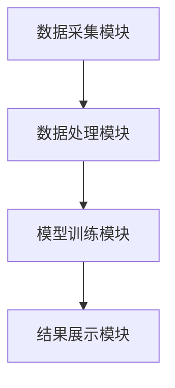

                 


# AI辅助识别市场结构性变化机会

## 关键词：AI，市场分析，结构性变化，机器学习，时间序列分析

## 摘要：  
本文探讨了如何利用人工智能技术辅助识别市场结构性变化的机会。通过分析市场数据，运用机器学习算法，特别是时间序列分析，来预测和识别市场趋势。文章从背景、核心概念、算法原理、系统架构到项目实战，全面阐述了AI在市场分析中的应用，旨在为读者提供从理论到实践的完整指南。

---

# 1. 背景介绍

## 1.1 市场结构性变化的定义  
结构性变化是指市场中由于内部或外部因素导致的长期趋势变化，例如行业整合、技术革新或政策变化。这种变化通常会影响市场格局，为企业带来新的机会或挑战。

## 1.2 为什么AI在市场分析中重要  
AI能够处理海量数据，识别复杂模式，帮助企业在早期发现市场变化，做出更明智的决策。

## 1.3 数据驱动的市场分析  
通过收集和分析市场数据，AI能够提取有用的特征，预测未来趋势，识别潜在机会。

---

# 2. 核心概念与联系

## 2.1 数据预处理  
- 数据清洗：去除噪声和异常值。
- 数据标准化：统一数据格式，便于模型处理。
- 数据增强：通过生成新数据提升模型泛化能力。

## 2.2 特征提取  
- 时间序列特征：如均值、方差、周期性等。
- 文本特征：如情感分析、关键词提取。
- 图结构特征：如网络中的节点度和中心性。

## 2.3 模型选择与训练  
- 监督学习：用于分类和回归任务。
- 无监督学习：用于聚类和异常检测。
- 深度学习：如LSTM网络用于时间序列预测。

---

# 3. 算法原理讲解

## 3.1 时间序列分析算法

### 3.1.1 ARIMA模型  
ARIMA（自回归积分滑动平均模型）用于预测时间序列数据。模型公式：  
$$ ARIMA(p, d, q) $$  
其中，p为自回归阶数，d为差分阶数，q为滑动平均阶数。

### 3.1.2 LSTM网络  
LSTM（长短期记忆网络）擅长处理长期依赖关系。网络结构包括输入门、遗忘门和输出门。

代码示例：  
```python
import numpy as np
from keras import layers

model = layers.SimpleRNN(units=64, input_shape=(None, 1))
model.compile(optimizer='adam', loss='mse')
```

## 3.2 分类与聚类算法  
- 分类：如随机森林用于市场趋势分类。
- 聚类：如K-means用于客户群体划分。

---

# 4. 系统分析与架构设计

## 4.1 系统功能设计  
- 数据采集：从API获取市场数据。
- 数据处理：清洗和转换数据。
- 模型训练：训练预测模型。
- 结果展示：可视化分析结果。

## 4.2 系统架构设计  


## 4.3 接口设计  
- 数据接口：REST API用于数据传输。
- 模型接口：提供预测结果API。

---

# 5. 项目实战

## 5.1 环境安装  
安装必要的库：`numpy`, `pandas`, `keras`, `matplotlib`。

## 5.2 核心代码实现  
```python
import pandas as pd
import numpy as np
from keras.models import Sequential
from keras.layers import LSTM, Dense

# 数据加载
data = pd.read_csv('market_data.csv')

# 数据分割
train_data = data.iloc[:700]
test_data = data.iloc[700:]

# 模型构建
model = Sequential()
model.add(LSTM(50, input_shape=(None, 1)))
model.add(Dense(1))
model.compile(optimizer='adam', loss='mse')

# 训练
model.fit(train_data.values, epochs=100, batch_size=32)
```

## 5.3 案例分析  
以某行业为例，展示如何通过LSTM预测市场趋势，并解读结果。

---

# 6. 最佳实践与小结

## 6.1 实用建议  
- 选择可靠的数据源。
- 定期更新模型。
- 处理数据噪声。

## 6.2 注意事项  
- 模型选择要考虑业务场景。
- 结果解释需结合市场知识。

## 6.3 未来趋势  
AI在市场分析中的应用将更加智能化和自动化。

---

# 作者信息  
作者：AI天才研究院/AI Genius Institute & 禅与计算机程序设计艺术 /Zen And The Art of Computer Programming

