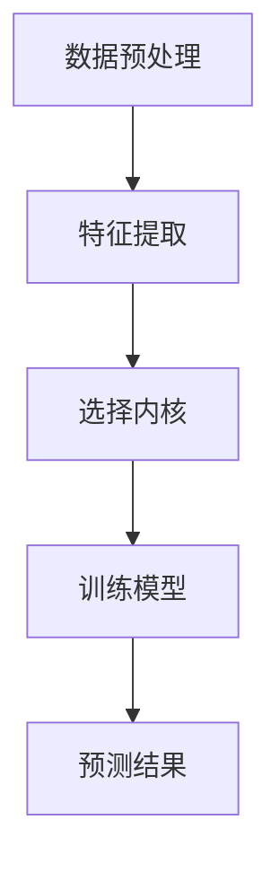
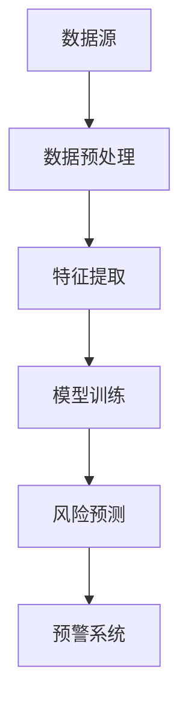

                 


# AI辅助识别隐藏的财务风险

> 关键词：AI技术、财务风险管理、隐藏风险、机器学习、自然语言处理

> 摘要：本文详细探讨了人工智能技术在识别隐藏财务风险中的应用，通过分析机器学习、自然语言处理等技术的核心原理，结合实际案例，展示了如何利用AI技术构建有效的财务风险预警系统，帮助企业和投资者规避潜在风险。

---

## 第1章: AI与财务风险管理概述

### 1.1 财务风险管理的基本概念

#### 1.1.1 财务风险管理的定义
财务风险管理是指通过识别、评估和应对可能影响企业财务状况的各种风险，以降低损失、保障资金安全的过程。常见的财务风险包括市场风险、信用风险、操作风险和流动性风险等。

#### 1.1.2 隐藏财务风险的特征与表现
隐藏财务风险是指那些不易被传统方法察觉，但可能对企业财务状况造成重大影响的风险。其主要特征包括：隐蔽性、滞后性、复杂性和传染性。

---

### 1.2 AI技术在财务风险管理中的作用

#### 1.2.1 AI技术的基本概念
人工智能（AI）是模拟人类智能的计算机系统，通过机器学习、自然语言处理、计算机视觉等技术，能够从大量数据中发现模式、进行预测和决策。

#### 1.2.2 AI在财务风险管理中的优势
AI技术能够快速处理海量数据，发现隐藏的财务风险，提供实时预警。与传统方法相比，AI在以下方面具有显著优势：
- **高效性**：自动化处理大量数据。
- **准确性**：通过机器学习模型提高风险识别的精度。
- **实时性**：能够实时监控财务数据，及时发现异常。

---

## 第2章: 隐藏财务风险识别的核心概念

### 2.1 隐藏财务风险的定义与分类

#### 2.1.1 隐藏财务风险的定义
隐藏财务风险是指那些尚未被发现或被忽视，但可能对企业财务状况造成严重影响的风险。

#### 2.1.2 隐藏财务风险的主要分类
- **财务报表隐藏风险**：通过财务报表 manipulation隐藏的风险。
- **关联交易隐藏风险**：通过关联交易转移风险。
- **资产质量隐藏风险**：资产质量下降但未被及时发现的风险。

---

### 2.2 隐藏财务风险识别的关键技术

#### 2.2.1 数据挖掘技术
数据挖掘技术通过对历史数据的分析，发现隐藏的模式和趋势，识别潜在风险。

#### 2.2.2 机器学习技术
机器学习技术通过训练模型，识别隐藏的财务风险。常用算法包括支持向量机（SVM）、随机森林（Random Forest）和神经网络（Neural Networks）。

#### 2.2.3 自然语言处理技术
自然语言处理（NLP）技术用于分析财务报告、新闻等文本数据，识别隐藏的风险信号。

---

## 第3章: AI辅助隐藏财务风险识别的核心算法

### 3.1 机器学习算法在隐藏财务风险识别中的应用

#### 3.1.1 支持向量机（SVM）

##### 支持向量机的基本原理
支持向量机是一种监督学习算法，通过构建超平面将数据点分为两类。在财务风险管理中，SVM可以用于分类隐藏风险。

##### SVM的数学模型
$$
\text{目标函数：} \quad \min_{w, b} \frac{1}{2}||w||^2 + C \sum_{i=1}^n \xi_i
$$

##### SVM的流程图


---

### 3.2 自然语言处理（NLP）算法在隐藏财务风险识别中的应用

#### 3.2.1 词袋模型（Bag of Words）

##### 词袋模型的基本原理
词袋模型将文本表示为单词的集合，不考虑单词的顺序。

##### 词袋模型的实现代码
```python
from sklearn.feature_extraction.text import CountVectorizer

vectorizer = CountVectorizer()
text = ["This is an example text.", "Another example text."]
X = vectorizer.fit_transform(text)
print(X.toarray())
```

---

## 第4章: 系统分析与架构设计

### 4.1 系统功能设计

#### 4.1.1 领域模型类图
```mermaid
classDiagram
    class DataPreprocessing {
        +input_data
        +processed_data
        -process_data()
    }
    class FeatureExtraction {
        +features
        -extract_features()
    }
    class ModelTraining {
        +model
        -train_model()
    }
    class RiskPrediction {
        +predictions
        -predict_risk()
    }
    DataPreprocessing -> FeatureExtraction
    FeatureExtraction -> ModelTraining
    ModelTraining -> RiskPrediction
```

---

### 4.2 系统架构设计

#### 4.2.1 系统架构图


---

## 第5章: 项目实战

### 5.1 项目背景

#### 5.1.1 项目介绍
本项目旨在利用AI技术构建一个隐藏财务风险识别系统，帮助企业在财务决策中规避潜在风险。

---

### 5.2 核心代码实现

#### 5.2.1 环境安装
```bash
pip install scikit-learn
pip install pandas
pip install numpy
```

#### 5.2.2 核心代码
```python
import pandas as pd
from sklearn.svm import SVC
from sklearn.metrics import accuracy_score

# 数据加载
data = pd.read_csv('financial_data.csv')

# 特征提取
X = data.drop('risk', axis=1)
y = data['risk']

# 模型训练
model = SVC()
model.fit(X, y)

# 模型预测
y_pred = model.predict(X)
print("Accuracy:", accuracy_score(y, y_pred))
```

---

## 第6章: 最佳实践与小结

### 6.1 最佳实践

#### 6.1.1 模型选择
在选择模型时，应根据数据特点和业务需求选择合适的算法。

#### 6.1.2 数据预处理
数据预处理是模型训练的关键步骤，需确保数据的完整性和准确性。

---

### 6.2 小结

通过本文的介绍，我们可以看到AI技术在识别隐藏财务风险中的巨大潜力。未来，随着技术的不断发展，AI将在财务风险管理中发挥更加重要的作用。

---

## 作者信息

作者：AI天才研究院/AI Genius Institute  
禅与计算机程序设计艺术/Zen And The Art of Computer Programming

