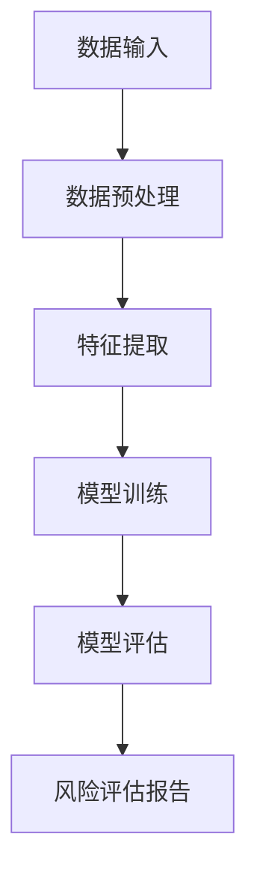
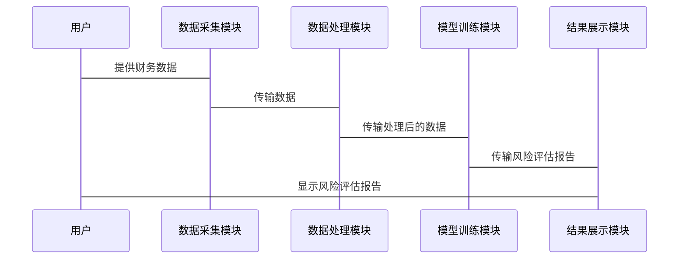

                 

# AI驱动的个人财务stress testing系统设计与实现

## 关键词：AI，财务，stress testing，系统设计，风险管理

## 摘要：  
本文探讨了AI技术在个人财务风险管理中的应用，重点介绍了一种基于AI的个人财务stress testing系统的设计与实现。通过结合机器学习和大数据分析，该系统能够高效地识别和评估潜在的财务风险，并提供个性化的风险管理策略。文章详细分析了系统的核心算法、架构设计、功能模块，并通过实际案例展示了系统的应用价值。本文为个人财务管理的智能化转型提供了新的思路和实践参考。

---

# 第一部分: AI驱动的个人财务stress testing系统背景与基础

## 第1章: 财务stress testing的背景与定义

### 1.1 问题背景
#### 1.1.1 个人财务风险管理的重要性
在现代社会，个人财务风险管理变得越来越复杂。经济波动、市场变化和个人财务状况的不确定性使得传统的财务风险管理方法难以应对复杂的挑战。个人可能面临多种风险，例如投资损失、债务违约、通货膨胀等，这些风险可能导致财务状况的不稳定甚至崩溃。

#### 1.1.2 现有财务风险管理的局限性
传统的财务风险管理方法依赖于人工分析和简单的财务模型，这种方法存在以下问题：
- 数据处理能力有限，难以应对海量数据。
- 风险评估的准确性较低，依赖于经验丰富的财务人员。
- 对极端情况的预测能力不足，难以应对突发事件。

#### 1.1.3 AI技术在财务风险管理中的潜力
AI技术（人工智能）通过机器学习、自然语言处理和大数据分析等技术，能够显著提升财务风险管理的效率和准确性。AI可以实时分析海量数据，识别潜在风险，并提供个性化的风险管理策略。

### 1.2 财务stress testing的定义与特点
#### 1.2.1 财务stress testing的定义
财务stress testing是一种通过模拟极端市场条件或假设情景，评估财务系统在这些条件下的表现和风险的技术。它能够帮助个人或机构提前识别和应对潜在的财务危机。

#### 1.2.2 财务stress testing的核心特点
- **极端情景模拟**：通过假设极端市场条件（如经济衰退、市场崩盘）来测试财务系统的稳健性。
- **数据驱动**：依赖于大量历史数据和实时数据，确保测试结果的准确性。
- **动态调整**：根据测试结果动态调整财务策略，以应对潜在风险。

#### 1.2.3 财务stress testing与传统财务分析的区别
传统的财务分析依赖于历史数据和静态模型，而财务stress testing则通过动态模拟和预测，帮助财务管理者更好地应对未来可能出现的极端情况。

### 1.3 AI驱动的财务stress testing的优势
#### 1.3.1 数据处理能力的提升
AI技术能够处理海量数据，包括结构化数据（如财务报表）和非结构化数据（如新闻、社交媒体信息），从而提供更全面的财务分析。

#### 1.3.2 模型复杂度的增强
AI驱动的模型（如深度学习模型）能够捕捉复杂的财务关系，提供更精准的风险评估和预测。

#### 1.3.3 实时分析的可能性
通过实时数据分析，AI驱动的系统能够快速响应市场变化，提供实时的财务风险评估和建议。

---

## 第2章: AI技术在财务领域的应用基础

### 2.1 机器学习在财务分析中的应用
#### 2.1.1 监督学习在财务预测中的应用
监督学习是一种常见的机器学习方法，广泛应用于财务预测。例如，可以通过监督学习模型预测股票价格走势或预测公司的财务状况。

##### 示例：线性回归模型
线性回归是一种简单的监督学习模型，适用于预测连续型变量。例如，可以使用线性回归模型预测公司的收入增长。

$$y = \beta_0 + \beta_1x + \epsilon$$

其中，$y$ 是目标变量（如收入增长），$x$ 是自变量（如广告支出），$\beta_0$ 和 $\beta_1$ 是模型参数，$\epsilon$ 是误差项。

#### 2.1.2 非监督学习在财务数据聚类中的应用
非监督学习用于处理无标签数据，常用于财务数据聚类。例如，可以通过聚类分析将客户分为不同的风险等级。

##### 示例：K-means聚类算法
K-means是一种常见的非监督学习算法，适用于将数据点划分为K个簇。在财务领域，可以使用K-means算法将客户分为不同的信用风险等级。

$$\text{目标函数：} \sum_{i=1}^{K} \sum_{j=1}^{n_i} \|x_j - c_i\|^2$$

其中，$K$ 是簇的数量，$n_i$ 是第$i$个簇中的数据点数量，$x_j$ 是数据点，$c_i$ 是第$i$个簇的中心。

#### 2.1.3 强化学习在财务决策中的应用
强化学习是一种通过试错机制优化决策的方法，适用于复杂的财务决策问题。例如，可以使用强化学习算法优化投资组合。

##### 示例：Q-learning算法
Q-learning是一种强化学习算法，适用于离散动作空间的决策问题。在财务领域，可以使用Q-learning算法优化投资组合。

$$Q(s, a) = Q(s, a) + \alpha \left[r + \max_{a'} Q(s', a') - Q(s, a)\right]$$

其中，$s$ 是当前状态，$a$ 是当前动作，$r$ 是奖励，$\alpha$ 是学习率，$s'$ 是下一状态。

### 2.2 大数据分析技术在财务领域的应用
#### 2.2.1 数据挖掘技术在财务数据处理中的应用
数据挖掘技术用于从海量数据中提取有价值的信息。例如，可以通过数据挖掘技术识别财务欺诈行为。

#### 2.2.2 数据可视化在财务分析中的作用
数据可视化能够将复杂的数据关系直观地呈现出来，帮助财务管理者更好地理解和分析数据。

#### 2.2.3 分布式计算在大规模财务数据处理中的应用
分布式计算技术（如Hadoop、Spark）能够高效处理大规模数据，适用于实时财务分析和预测。

### 2.3 AI驱动的财务系统的发展趋势
#### 2.3.1 智能化财务分析工具的兴起
随着AI技术的发展，智能化财务分析工具越来越普及，能够帮助财务人员提高工作效率。

#### 2.3.2 自动化财务决策系统的普及
自动化决策系统能够根据实时数据和AI模型自动做出财务决策，显著提高决策效率。

#### 2.3.3 财务风险管理的智能化转型
通过AI技术，财务风险管理正在从传统的被动防御转向主动预测和应对，显著提升了风险管理的效率和准确性。

---

## 第3章: AI驱动的个人财务stress testing系统核心概念与算法原理

### 3.1 核心概念介绍
#### 3.1.1 系统目标
本系统的目标是通过AI技术实现个人财务的实时风险评估和应对策略优化。

#### 3.1.2 系统输入
系统输入包括：
- 个人财务数据（如银行账户、投资组合、债务信息）
- 市场数据（如股票价格、经济指标）
- 事件数据（如市场新闻、政策变化）

#### 3.1.3 系统输出
系统输出包括：
- 风险评估报告
- 应对策略建议
- 风险预警信息

### 3.2 核心算法原理
#### 3.2.1 机器学习模型选择
在本系统中，我们选择了随机森林和长短期记忆网络（LSTM）作为核心算法。

##### 3.2.1.1 随机森林
随机森林是一种基于决策树的集成学习算法，适用于分类和回归问题。在财务stress testing中，随机森林可以用于风险分类。

##### 3.2.1.2 LSTM
LSTM是一种时间序列模型，适用于处理具有时间依赖性的数据。在财务stress testing中，LSTM可以用于预测市场趋势。

#### 3.2.2 数据特征工程
数据特征工程是机器学习模型训练的关键步骤。我们需要从原始数据中提取有用的特征，并进行适当的特征变换。

##### 3.2.2.1 特征选择
通过统计分析和模型解释，选择对风险评估影响最大的特征。

##### 3.2.2.2 特征变换
对特征进行标准化或归一化处理，确保模型训练的稳定性和准确性。

#### 3.2.3 模型训练与优化
通过交叉验证和网格搜索等方法，优化模型的超参数，提高模型的性能。

### 3.3 算法流程
以下是AI驱动的个人财务stress testing系统的算法流程图：

---

## 第4章: 系统架构设计与实现

### 4.1 系统架构设计
以下是系统架构设计图：

### 4.2 功能模块设计
#### 4.2.1 数据采集模块
负责采集个人财务数据和市场数据。

#### 4.2.2 数据处理模块
对数据进行清洗、转换和特征工程。

#### 4.2.3 模型训练模块
训练机器学习模型，并生成风险评估报告。

#### 4.2.4 结果展示模块
以可视化方式展示风险评估结果和应对策略建议。

### 4.3 系统接口设计
系统接口包括：
- 数据接口：与数据源对接，获取实时数据。
- 模型接口：与第三方AI模型服务对接，获取预测结果。
- 用户接口：提供用户友好的交互界面，展示系统结果。

### 4.4 系统交互流程
以下是系统交互流程图：

---

## 第5章: 项目实战与案例分析

### 5.1 项目实战
#### 5.1.1 环境搭建
需要安装以下工具和库：
- Python
- NumPy
- Pandas
- Scikit-learn
- Keras
- Matplotlib

#### 5.1.2 数据准备
收集个人财务数据和市场数据，进行数据清洗和特征工程。

#### 5.1.3 模型训练
训练随机森林和LSTM模型，评估模型性能。

#### 5.1.4 系统实现
实现系统各个模块的功能，集成AI模型，完成系统测试。

#### 5.1.5 测试与验证
通过实际数据测试系统性能，验证系统的效果。

### 5.2 案例分析
#### 5.2.1 需求分析
某客户希望评估其投资组合在市场崩盘情况下的表现。

#### 5.2.2 系统实现
通过系统模拟极端市场条件，评估投资组合的风险。

#### 5.2.3 结果分析
系统生成风险评估报告，提出应对策略建议。

---

## 第6章: 总结与展望

### 6.1 总结
本文介绍了AI驱动的个人财务stress testing系统的设计与实现，详细分析了系统的背景、核心算法、架构设计和实现过程。通过实际案例展示了系统的应用价值。

### 6.2 展望
未来，随着AI技术的不断发展，个人财务stress testing系统将更加智能化和个性化。我们可以期待更多创新技术的应用，如多模态数据的利用、实时分析能力的提升等。

---

## 作者：AI天才研究院 & 禅与计算机程序设计艺术

