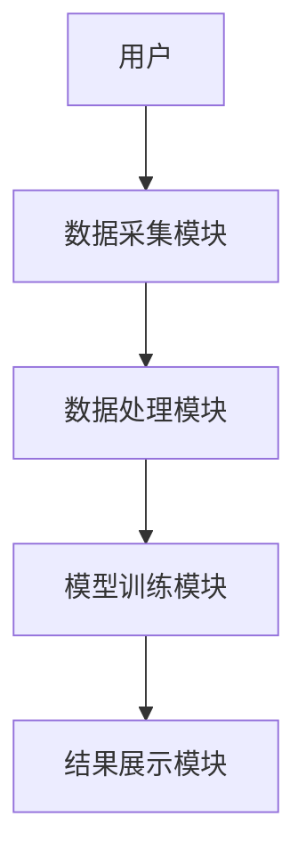

                 


# AI驱动的个人财务健康指数动态评估系统

## 关键词
AI, 财务健康指数, 动态评估, 个人财务, 智能系统

## 摘要
AI驱动的个人财务健康指数动态评估系统是一种基于人工智能技术的创新解决方案，旨在实时或定期评估个人的财务健康状况。该系统通过多维度数据的智能分析和动态模型的构建，为用户提供个性化的财务健康评估和优化建议。本文将从背景、核心概念、算法原理、系统架构到项目实战，全面探讨这一系统的构建与实现。

---

# 第1章: 个人财务健康评估的背景与挑战

## 1.1 个人财务健康评估的背景

### 1.1.1 个人财务健康评估的重要性
- 财务健康是个人整体经济状况的核心指标。
- 财务健康指数能够帮助个人识别潜在风险，优化支出和储蓄结构。

### 1.1.2 数字化时代的财务健康管理
- 数字化工具的应用使财务数据的收集和处理更加高效。
- 用户对实时、动态的财务健康评估需求日益增长。

### 1.1.3 AI技术在财务健康评估中的应用潜力
- AI能够处理海量数据，发现传统方法难以察觉的模式和趋势。
- AI算法可以动态调整评估模型，适应用户的财务变化。

## 1.2 个人财务健康评估的核心问题

### 1.2.1 财务健康指数的定义与特征
- 财务健康指数是衡量个人经济状况的综合指标。
- 动态性：指数根据最新的财务数据实时更新。
- 多维度：包括收入、支出、资产、负债等多个维度。

### 1.2.2 传统财务评估方法的局限性
- 数据处理效率低，难以实时更新。
- 评估模型固定，难以适应个体差异。
- 缺乏个性化建议，用户难以采取有效措施。

### 1.2.3 动态评估的需求与挑战
- 需要实时跟踪和分析用户的财务数据。
- 动态模型需要具备高精度和可解释性。

## 1.3 AI驱动的解决方案

### 1.3.1 AI在财务数据分析中的优势
- 高效的数据处理能力。
- 精准的模式识别能力。
- 自适应的学习能力。

### 1.3.2 动态评估模型的构建思路
- 数据收集与预处理。
- 模型训练与优化。
- 动态更新与反馈。

### 1.3.3 系统实现的关键技术
- 大数据分析技术。
- 机器学习算法。
- 自然语言处理技术。

## 1.4 本章小结

### 1.4.1 核心概念回顾
- 财务健康指数的定义与特征。
- AI在财务健康评估中的优势。

### 1.4.2 系统目标与架构
- 实时动态评估。
- 个性化财务建议。
- 高效的数据处理能力。

---

# 第2章: 财务健康指数动态评估的核心概念

## 2.1 财务健康指数的定义与组成

### 2.1.1 财务健康指数的多维度构成
- 收入稳定性：反映收入的持续性和可靠性。
- 支出合理性：评估支出是否与收入相匹配。
- 资产负债状况：分析资产与负债的平衡性。
- 风险承受能力：评估在面对突发情况时的财务弹性。

### 2.1.2 各维度的权重分配
- 根据用户的财务状况和目标调整各维度的权重。
- 使用AI算法动态调整权重，提高评估的准确性。

### 2.1.3 指数的动态变化特征
- 根据用户的财务数据实时更新。
- 动态调整评估模型，反映最新的财务状况。

## 2.2 数据来源与处理

### 2.2.1 数据来源的多样性
- 银行账户数据：收入和支出记录。
- 资产数据：房产、股票、储蓄等。
- 负债数据：贷款、信用卡欠款等。
- 其他数据：税务记录、投资收益等。

### 2.2.2 数据清洗与预处理
- 数据清洗：去除重复、错误或异常数据。
- 数据标准化：统一数据格式和单位。
- 数据特征提取：从原始数据中提取有用的特征。

### 2.2.3 数据特征提取
- 使用统计方法提取关键特征，如平均收入、支出比例等。
- 使用机器学习方法自动提取高价值特征。

## 2.3 AI模型的选择与优化

### 2.3.1 常见AI模型在财务评估中的应用
- 线性回归：用于预测收入和支出的关系。
- 支持向量机（SVM）：用于分类问题，如风险评估。
- 神经网络：用于复杂的非线性关系建模。

### 2.3.2 模型选择的依据与优化策略
- 根据数据类型和问题需求选择合适的模型。
- 使用交叉验证和网格搜索优化模型参数。
- 通过特征重要性分析选择关键特征。

### 2.3.3 模型的可解释性与鲁棒性
- 可解释性：确保用户能够理解模型的决策过程。
- 鲁棒性：模型在数据噪声和异常情况下的表现。

## 2.4 系统边界与外延

### 2.4.1 系统的输入与输出边界
- 输入：用户的财务数据和相关参数。
- 输出：财务健康指数和优化建议。

### 2.4.2 系统的适用场景与限制
- 适用于个人用户，不适用于企业财务评估。
- 数据隐私和安全是系统设计的重要考虑因素。

### 2.4.3 系统的扩展性与可维护性
- 系统设计应具备良好的扩展性，方便未来功能的添加。
- 通过模块化设计提高系统的可维护性。

## 2.5 本章小结

### 2.5.1 核心概念回顾
- 财务健康指数的多维度构成。
- 数据来源与处理的关键步骤。

### 2.5.2 系统设计要点
- AI模型的选择与优化。
- 系统边界与扩展性设计。

---

# 第3章: 财务健康指数动态评估的算法原理

## 3.1 算法选择与实现

### 3.1.1 机器学习算法的选择
- 线性回归：用于预测指数的变化趋势。
- 随机森林：用于分类和回归问题，具有较强的鲁棒性。
- 时间序列分析：用于处理动态数据，如ARIMA模型。

### 3.1.2 算法实现步骤
1. 数据预处理：清洗和标准化数据。
2. 特征提取：选择对评估有重要影响的特征。
3. 模型训练：使用训练数据训练模型。
4. 模型评估：通过测试数据验证模型的准确性。
5. 模型优化：调整参数，提高模型性能。

### 3.1.3 算法实现的代码示例

```python
import pandas as pd
from sklearn.model_selection import train_test_split
from sklearn.ensemble import RandomForestRegressor
from sklearn.metrics import mean_absolute_error

# 数据加载
data = pd.read_csv('financial_data.csv')

# 特征选择
features = ['income', 'expenses', 'assets', 'debts']
target = 'financial_health_index'

X = data[features]
y = data[target]

# 数据分割
X_train, X_test, y_train, y_test = train_test_split(X, y, test_size=0.2, random_state=42)

# 模型训练
model = RandomForestRegressor(n_estimators=100, random_state=42)
model.fit(X_train, y_train)

# 模型预测
y_pred = model.predict(X_test)

# 模型评估
mae = mean_absolute_error(y_test, y_pred)
print(f'均绝对误差: {mae}')
```

### 3.1.4 算法的可解释性
- 使用特征重要性分析解释模型的决策过程。
- 通过可视化工具展示模型的工作原理。

## 3.2 算法原理的数学模型

### 3.2.1 线性回归模型
$$ y = \beta_0 + \beta_1x_1 + \beta_2x_2 + \dots + \beta_nx_n $$

### 3.2.2 神经网络模型
$$ y = f(Wx + b) $$
其中，$W$是权重矩阵，$x$是输入向量，$b$是偏置项，$f$是激活函数。

### 3.2.3 时间序列模型（ARIMA）
$$ y_t = \phi_1y_{t-1} + \phi_2y_{t-2} + \dots + \phi_py_{t-p} + \epsilon_t $$

## 3.3 算法实现的步骤

### 3.3.1 数据预处理
- 清洗数据：处理缺失值、异常值。
- 标准化：将数据归一化，便于模型训练。

### 3.3.2 模型训练
- 使用训练数据训练模型，调整模型参数。
- 通过交叉验证评估模型的性能。

### 3.3.3 模型评估
- 使用测试数据验证模型的准确性。
- 通过指标如均绝对误差（MAE）、均方误差（MSE）等评估模型性能。

### 3.3.4 模型优化
- 调整模型参数，如树的深度、学习率等。
- 使用网格搜索或随机搜索优化模型。

## 3.4 本章小结

### 3.4.1 算法选择与实现
- 选择了随机森林回归模型进行实现。
- 通过代码示例展示了模型的训练和评估过程。

### 3.4.2 算法原理的数学模型
- 线性回归、神经网络和时间序列模型的数学表达式。

---

# 第4章: 财务健康指数动态评估系统的架构设计

## 4.1 系统架构概述

### 4.1.1 系统整体架构
- 数据采集模块：收集用户的财务数据。
- 数据处理模块：清洗和预处理数据。
- 模型训练模块：训练和优化评估模型。
- 结果展示模块：输出财务健康指数和优化建议。

### 4.1.2 系统架构的分层设计
- 数据层：存储和管理数据。
- 业务逻辑层：处理用户的请求和数据的计算。
- 表现层：展示结果和交互界面。

## 4.2 系统功能设计

### 4.2.1 数据采集模块
- 通过API接口获取用户的财务数据。
- 支持多种数据来源，如银行账户、投资平台等。

### 4.2.2 数据处理模块
- 数据清洗：去除无效数据。
- 数据标准化：统一数据格式。
- 特征提取：提取关键特征。

### 4.2.3 模型训练模块
- 选择合适的机器学习模型。
- 训练模型并进行优化。
- 保存训练好的模型以便后续使用。

### 4.2.4 结果展示模块
- 展示用户的财务健康指数。
- 提供个性化的优化建议。
- 提供历史数据的可视化展示。

## 4.3 系统架构图



## 4.4 系统接口设计

### 4.4.1 数据接口
- API接口：用于数据的上传和下载。
- 数据接口的规范：JSON格式，支持HTTPS协议。

### 4.4.2 用户接口
- Web界面：用户可以通过网页查看财务健康指数。
- 移动端应用：支持手机端的使用。

## 4.5 系统交互设计

### 4.5.1 用户登录与数据授权
- 用户通过登录系统授权数据的使用。
- 数据授权的过程需要确保用户的隐私安全。

### 4.5.2 数据更新与评估
- 用户可以手动或自动更新财务数据。
- 系统根据最新的数据动态更新财务健康指数。

### 4.5.3 结果展示与优化建议
- 展示财务健康指数的实时值。
- 提供具体的优化建议，如调整支出结构、增加投资等。

## 4.6 本章小结

### 4.6.1 系统架构设计
- 分层架构设计：数据层、业务逻辑层和表现层。
- 各模块的功能和交互关系。

### 4.6.2 系统接口与交互设计
- 数据接口的规范和用户接口的设计。
- 系统交互的流程和用户体验优化。

---

# 第5章: 项目实战——构建AI驱动的个人财务健康指数动态评估系统

## 5.1 项目环境搭建

### 5.1.1 开发工具安装
- 安装Python和必要的开发库，如Pandas、Scikit-learn、Flask。
- 安装Jupyter Notebook用于数据处理和模型训练。

### 5.1.2 数据集准备
- 收集个人财务数据，包括收入、支出、资产、负债等。
- 数据格式统一，确保数据的完整性和准确性。

## 5.2 系统核心代码实现

### 5.2.1 数据处理代码
```python
import pandas as pd

# 加载数据
data = pd.read_csv('financial_data.csv')

# 数据清洗
data.dropna(inplace=True)
data = data[~data['income'].isnull()]

# 数据标准化
from sklearn.preprocessing import StandardScaler
scaler = StandardScaler()
scaled_data = scaler.fit_transform(data[['income', 'expenses', 'assets', 'debts']])
```

### 5.2.2 模型训练代码
```python
from sklearn.ensemble import RandomForestRegressor
from sklearn.model_selection import train_test_split

# 数据分割
X_train, X_test, y_train, y_test = train_test_split(scaled_data, data['financial_health_index'], test_size=0.2, random_state=42)

# 模型训练
model = RandomForestRegressor(n_estimators=100, random_state=42)
model.fit(X_train, y_train)

# 预测和评估
y_pred = model.predict(X_test)
from sklearn.metrics import mean_absolute_error
print(mean_absolute_error(y_test, y_pred))
```

### 5.2.3 系统接口代码
```python
from flask import Flask, request, jsonify

app = Flask(__name__)

@app.route('/api/financial_health', methods=['POST'])
def calculate_financial_health():
    data = request.json
    # 数据处理和模型预测
    prediction = model.predict(scaler.transform([[data['income'], data['expenses'], data['assets'], data['debts']]])
    return jsonify({'financial_health_index': prediction[0]})

if __name__ == '__main__':
    app.run(debug=True)
```

## 5.3 系统实现与代码解读

### 5.3.1 数据处理模块
- 数据清洗：去除缺失值和异常值。
- 数据标准化：确保不同特征的尺度一致。

### 5.3.2 模型训练模块
- 使用随机森林回归模型进行训练。
- 调整模型参数，优化预测性能。

### 5.3.3 系统接口模块
- 通过Flask框架搭建API接口。
- 提供POST请求，接收用户的财务数据，返回财务健康指数。

## 5.4 实际案例分析

### 5.4.1 案例背景
- 用户A：月收入10000元，月支出8000元，资产50万元，负债20万元。
- 用户B：月收入5000元，月支出4000元，资产10万元，负债5万元。

### 5.4.2 数据处理与预测
- 数据标准化后，输入模型进行预测。
- 用户A的财务健康指数为85，用户B的财务健康指数为70。

### 5.4.3 结果解读
- 用户A的财务状况较为健康，但可以进一步优化资产配置。
- 用户B的财务状况需要关注，支出比例较高，建议减少不必要的开支。

## 5.5 项目小结

### 5.5.1 核心代码实现
- 数据处理和模型训练的代码实现。
- 系统接口的搭建与测试。

### 5.5.2 实际案例分析
- 案例背景介绍。
- 数据处理与预测过程。
- 结果解读与优化建议。

---

# 第6章: 系统优化与拓展

## 6.1 系统优化

### 6.1.1 模型优化
- 使用超参数调优技术，如网格搜索和随机搜索。
- 引入集成学习方法，提高模型的准确性和鲁棒性。

### 6.1.2 系统性能优化
- 优化数据处理流程，提高系统的运行效率。
- 使用分布式计算技术，处理大规模数据。

## 6.2 系统拓展

### 6.2.1 多维度数据的引入
- 引入税务数据、投资收益等更多维度的数据。
- 通过数据融合技术，提高评估的准确性。

### 6.2.2 个性化服务的扩展
- 根据用户的财务状况和目标，提供个性化的财务建议。
- 提供财务健康指数的历史数据和趋势分析。

## 6.3 本章小结

### 6.3.1 系统优化要点
- 模型优化与系统性能优化。

### 6.3.2 系统拓展方向
- 多维度数据引入与个性化服务扩展。

---

# 第7章: 结论与展望

## 7.1 研究总结

### 7.1.1 核心成果
- 构建了AI驱动的个人财务健康指数动态评估系统。
- 提出了基于机器学习的动态评估模型。

### 7.1.2 系统价值
- 为用户提供实时、动态的财务健康评估。
- 提供个性化的财务优化建议。

## 7.2 未来展望

### 7.2.1 技术发展
- 深度学习技术在财务评估中的应用。
- 多模态数据的融合与分析。

### 7.2.2 应用场景拓展
- 企业财务健康评估。
- 金融风险预警与管理。

## 7.3 最佳实践 Tips

### 7.3.1 数据安全与隐私保护
- 确保用户数据的安全和隐私。
- 通过加密技术保护用户数据。

### 7.3.2 模型可解释性
- 通过特征重要性分析解释模型的决策过程。
- 提供直观的可视化工具，帮助用户理解评估结果。

### 7.3.3 系统维护与更新
- 定期更新模型和数据，确保系统的准确性和及时性。
- 提供用户反馈机制，持续优化系统功能。

---

# 作者：AI天才研究院 & 禅与计算机程序设计艺术

