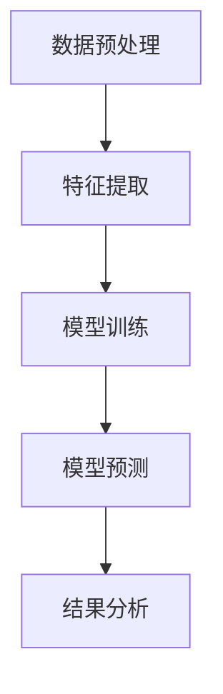

                 


```markdown
# AI驱动的个人财务健康指数计算与监控系统

## 关键词：AI驱动，个人财务健康指数，计算与监控系统，机器学习，系统架构设计

## 摘要：
本文详细探讨了如何利用人工智能技术构建个人财务健康指数的计算与监控系统。通过分析个人财务数据，结合机器学习算法，系统能够实时评估财务健康状况，并提供智能化的监控与预警。文章从背景介绍、核心概念、算法原理、系统架构设计、项目实战等方面展开，全面阐述了该系统的实现方法与应用价值。

## 第1章：背景介绍

### 1.1 问题背景
个人财务管理在现代生活中至关重要，但传统方法往往依赖人工分析，效率低下且容易出错。随着AI技术的发展，通过自动化和智能化的方式评估财务健康指数成为可能。

### 1.2 概念结构
财务健康指数是一个综合指标，反映个人财务状况的健康程度。通过分析收入、支出、资产、负债等多维度数据，结合时间序列分析和机器学习模型，系统能够动态调整指数计算。

### 1.3 核心要素
- **数据采集**：收集收入、支出、资产、负债等数据。
- **特征提取**：提取关键特征，如收支比、资产负债比。
- **模型训练**：利用机器学习模型预测财务健康状况。
- **监控预警**：实时监控财务变化，及时预警。

### 1.4 边界与外延
系统仅关注个人财务数据，不涉及企业财务。未来可能扩展至家庭财务或投资组合管理。

## 第2章：核心概念与联系

### 2.1 核心概念
- **数据采集**：通过API接口获取银行、支付宝等平台的交易记录。
- **特征提取**：提取收入波动、支出分布等特征。
- **模型训练**：使用机器学习模型预测财务健康指数。

### 2.2 传统方法与AI对比
| 对比维度 | 传统方法 | AI驱动方法 |
|----------|----------|------------|
| 效率     | 低效     | 高效       |
| 准确性   | 较低     | 高         |
| 及时性   | 滞后     | 实时       |

### 2.3 实体关系图
```mermaid
erd
    title 实体关系图
    User {
        id
        username
        password
    }
    Transaction {
        id
        amount
        datetime
        user_id
    }
    Model {
        id
        name
        description
    }
    User --> Transaction: 发起交易
    Model --> Transaction: 分析交易
```

## 第3章：算法原理

### 3.1 算法选择
使用线性回归模型预测财务健康指数。

### 3.2 算法流程


### 3.3 数学模型
线性回归模型：
$$ y = \beta_0 + \beta_1x_1 + \beta_2x_2 + \ldots + \beta_nx_n + \epsilon $$

### 3.4 代码实现
```python
import pandas as pd
from sklearn.linear_model import LinearRegression

# 数据预处理
data = pd.read_csv('financial_data.csv')
X = data[['income', 'expenses', 'assets', ' liabilities']]
y = data['health_index']

# 模型训练
model = LinearRegression()
model.fit(X, y)

# 预测
predictions = model.predict(X)
print('预测值:', predictions)
```

## 第4章：系统分析与架构设计

### 4.1 功能模块
- **数据采集模块**：收集用户财务数据。
- **指数计算模块**：计算财务健康指数。
- **监控预警模块**：实时监控并预警。

### 4.2 系统架构


### 4.3 系统交互
```mermaid
sequenceDiagram
    participant User
    participant System
    User -> System: 提供财务数据
    System -> User: 返回健康指数
    User -> System: 设置预警阈值
    when 偏差超过阈值:
        System -> User: 发出预警
```

## 第5章：项目实战

### 5.1 环境搭建
安装必要的库：
```bash
pip install pandas numpy scikit-learn
```

### 5.2 核心实现
```python
import pandas as pd
from sklearn.model_selection import train_test_split
from sklearn.metrics import mean_squared_error

# 数据加载
data = pd.read_csv('financial_data.csv')

# 数据分割
X = data[['income', 'expenses', 'assets', ' liabilities']]
y = data['health_index']

X_train, X_test, y_train, y_test = train_test_split(X, y, test_size=0.2)

# 模型训练
model = LinearRegression()
model.fit(X_train, y_train)

# 模型评估
y_pred = model.predict(X_test)
print('均方误差:', mean_squared_error(y_test, y_pred))
```

### 5.3 案例分析
通过实际数据，展示模型如何计算健康指数并触发预警。

## 第6章：优化与未来展望

### 6.1 系统优化
- 提高模型的泛化能力。
- 优化数据处理速度。

### 6.2 未来展望
- 引入区块链技术保障数据安全。
- 结合边缘计算提升实时性。

## 附录

### 术语表
- 财务健康指数：衡量个人财务状况的综合指标。
- 机器学习：通过数据训练模型进行预测的技术。

### 参考文献
[1] 刘洋, 《机器学习实战》, 人民邮电出版社, 2020年。

### 索引
按字母顺序排列文章中的关键词和术语。

## 作者
作者：AI天才研究院 & 禅与计算机程序设计艺术
```

