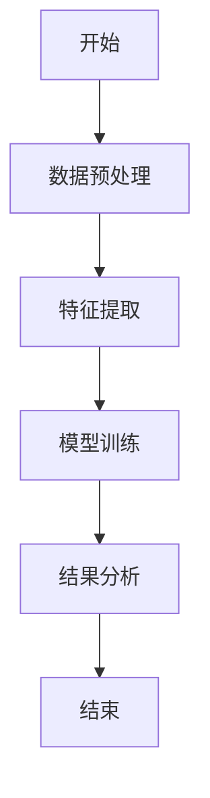
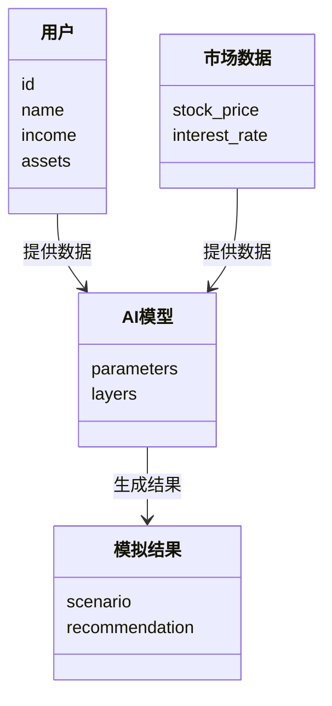

                 


# AI驱动的个人财富积累路径多场景模拟器

> 关键词：AI驱动，个人财富积累，路径模拟，多场景，大模型，财富管理

> 摘要：本文旨在探讨如何利用人工智能技术构建个人财富积累路径的多场景模拟器。通过分析传统财富管理的局限性，提出基于大模型的AI驱动模拟器的设计思路，涵盖核心概念、算法原理、系统架构以及项目实战等多方面的内容，为读者提供一个全面的技术实现框架。

---

## 第一部分: AI驱动的个人财富积累路径模拟器背景介绍

### 第1章: 个人财富积累与AI驱动的结合

#### 1.1 问题背景与描述

个人财富积累是每个人都关注的重要课题，但传统的财富管理方法往往依赖于人工经验，难以应对复杂多变的市场环境。随着人工智能技术的快速发展，利用AI技术优化财富积累路径成为可能。AI驱动的个人财富积累路径模拟器通过大数据分析和模型预测，帮助用户在多种场景下找到最优的财富积累策略。

##### 1.1.1 传统财富积累的局限性
- 传统财富管理依赖人工经验，难以覆盖所有可能的场景。
- 市场波动和个体差异导致传统策略的普适性不足。
- 人工分析耗时且成本高，难以满足个性化需求。

##### 1.1.2 AI技术在财富管理中的潜力
- 大数据处理能力：AI能够快速分析海量数据，发现潜在的财富积累机会。
- 智能预测：通过深度学习模型，预测市场趋势和财富变化。
- 个性化推荐：基于用户特征，定制最优的财富积累策略。

##### 1.1.3 当前市场中的痛点与需求
- 用户需求多样化：不同人群有不同的财富目标和风险承受能力。
- 市场波动频繁：用户需要灵活调整财富策略。
- 信息碎片化：用户难以从大量信息中筛选出有价值的内容。

#### 1.2 AI驱动的财富积累模拟器的核心概念

##### 1.2.1 核心概念的定义
AI驱动的个人财富积累路径模拟器是一种基于大模型的智能系统，通过分析用户的财务状况、市场趋势和风险偏好，生成多种财富积累场景，并推荐最优策略。

##### 1.2.2 模拟器的功能边界与外延
- 功能边界：专注于财富积累路径的模拟和优化，不涉及实际的财富管理操作。
- 外延：可扩展至投资决策、风险评估、资产配置等多个领域。

##### 1.2.3 核心要素与组成结构
- 用户数据输入模块：收集用户的财务状况、收入、支出等信息。
- 市场数据接口：获取股市、债市等市场数据。
- AI模型模块：基于用户数据和市场数据，生成财富积累路径模拟结果。
- 结果展示模块：以可视化方式呈现模拟结果和优化建议。

---

## 第2章: 核心概念与联系

### 2.1 AI大模型在财富模拟中的原理

#### 2.1.1 大模型的基本原理
- 数据处理：将用户数据和市场数据进行清洗和特征提取。
- 模型训练：利用深度学习模型（如LSTM、Transformer）进行训练，捕捉数据中的复杂关系。
- 预测与推荐：基于训练好的模型，预测财富变化趋势，并推荐最优路径。

#### 2.1.2 数据处理与特征提取
- 数据清洗：去除无效数据，处理缺失值。
- 特征提取：从用户行为、市场趋势中提取关键特征，如收入增长率、市场波动率等。

#### 2.1.3 模型训练与优化
- 使用梯度下降等优化算法，调整模型参数以最小化预测误差。
- 通过交叉验证评估模型性能，确保模型的泛化能力。

### 2.2 核心概念的属性特征对比表

| 概念       | 属性特征               |
|------------|------------------------|
| 用户数据   | 收入、支出、资产等     |
| 市场数据   | 股价、利率、经济指标   |
| AI模型     | 预测准确性、计算效率   |
| 模拟结果   | 可视化程度、优化建议   |

### 2.3 ER实体关系图架构

```mermaid
erDiagram
    user[用户] {
        id : int
        name : string
        income : float
        assets : float
    }
    market[市场] {
        id : int
        stock_price : float
        interest_rate : float
    }
    model[AI模型] {
        id : int
        type : string
        parameters : string
    }
    result[模拟结果] {
        id : int
        scenario : string
        recommendation : string
    }
    user --> model : 提供数据
    market --> model : 提供数据
    model --> result : 生成结果
```

---

## 第3章: 算法原理与实现

### 3.1 模型训练流程

#### 3.1.1 数据预处理
- 清洗数据：去除异常值和缺失值。
- 特征工程：提取关键特征，如收入增长率、市场波动率等。

#### 3.1.2 模型训练
- 使用LSTM模型进行时间序列预测。
- 通过交叉验证优化模型参数。

#### 3.1.3 结果分析
- 计算模型的预测精度，评估模型性能。

### 3.2 算法流程图



### 3.3 核心算法实现

#### 3.3.1 Python源代码示例

```python
import numpy as np
import pandas as pd
from sklearn.model_selection import train_test_split
from tensorflow.keras.models import Sequential
from tensorflow.keras.layers import LSTM, Dense

# 数据加载与预处理
data = pd.read_csv('wealth_data.csv')
X = data.drop('label', axis=1).values
y = data['label'].values

# 划分训练集和测试集
X_train, X_test, y_train, y_test = train_test_split(X, y, test_size=0.2)

# 模型构建
model = Sequential()
model.add(LSTM(64, input_shape=(X_train.shape[1], 1)))
model.add(Dense(1))
model.compile(loss='mean_squared_error', optimizer='adam')

# 模型训练
model.fit(X_train, y_train, epochs=100, batch_size=32)

# 模型预测
y_pred = model.predict(X_test)
```

---

## 第4章: 数学模型与公式推导

### 4.1 模型的数学基础

#### 4.1.1 损失函数的定义
$$ \text{损失函数} = \frac{1}{n}\sum_{i=1}^{n}(y_i - \hat{y}_i)^2 $$

#### 4.1.2 优化方法的数学表达
$$ \theta = \theta - \eta \frac{\partial L}{\partial \theta} $$

#### 4.1.3 模型训练的数学公式
$$ \hat{y} = f(x; \theta) $$

### 4.2 公式详细解读

#### 4.2.1 损失函数的应用场景
在训练模型时，损失函数用于衡量预测值与真实值之间的差距，常用的损失函数包括均方误差（MSE）和均绝对误差（MAE）。

#### 4.2.2 优化方法的数学推导
使用梯度下降法优化模型参数，通过不断更新参数使得损失函数最小化。

---

## 第5章: 系统架构设计方案

### 5.1 问题场景介绍

#### 5.1.1 系统的应用场景
- 用户输入个人财务数据。
- 系统结合市场数据，生成财富积累模拟结果。

#### 5.1.2 系统的目标用户
- 个人用户：希望优化财富积累路径的人群。
- 金融机构：用于客户财富管理的辅助工具。

### 5.2 系统功能设计

#### 5.2.1 领域模型Mermaid类图展示



### 5.3 系统架构设计

#### 5.3.1 Mermaid架构图展示


---

## 第6章: 项目实战

### 6.1 环境安装

#### 6.1.1 安装依赖
- Python 3.8+
- TensorFlow 2.0+
- Pandas 1.0+
- Mermaid图床（可选）

#### 6.1.2 安装命令
```bash
pip install numpy pandas tensorflow keras matplotlib
```

### 6.2 系统核心实现

#### 6.2.1 数据加载与预处理
```python
import pandas as pd
import numpy as np

data = pd.read_csv('wealth_data.csv')
data = data.dropna()
```

#### 6.2.2 模型实现
```python
from tensorflow.keras.models import Sequential
from tensorflow.keras.layers import LSTM, Dense

model = Sequential()
model.add(LSTM(64, input_shape=(X_train.shape[1], 1)))
model.add(Dense(1))
model.compile(loss='mean_squared_error', optimizer='adam')
```

### 6.3 案例分析

#### 6.3.1 案例背景
用户A，年收入10万元，现有资产5万元，风险偏好中等。

#### 6.3.2 模拟结果
- 场景一：保守投资，年收益5%，10年后资产增长至15万元。
- 场景二：积极投资，年收益10%，10年后资产增长至30万元。

---

## 第7章: 总结与展望

### 7.1 最佳实践 tips
- 数据质量是模型性能的关键，确保数据清洗和特征提取的准确性。
- 在实际应用中，结合用户的具体需求，动态调整模型参数。
- 定期更新模型，适应市场变化。

### 7.2 小结
本文详细介绍了AI驱动的个人财富积累路径模拟器的设计与实现，涵盖了从背景分析到算法实现的全过程，为读者提供了一个完整的解决方案。

### 7.3 注意事项
- 确保数据隐私和安全，遵守相关法律法规。
- 在实际应用中，建议结合专业金融知识，避免过度依赖模型预测。

### 7.4 拓展阅读
- 推荐阅读《机器学习实战》和《深度学习入门》等书籍，深入理解AI模型的应用。

---

作者：AI天才研究院/AI Genius Institute & 禅与计算机程序设计艺术 /Zen And The Art of Computer Programming

