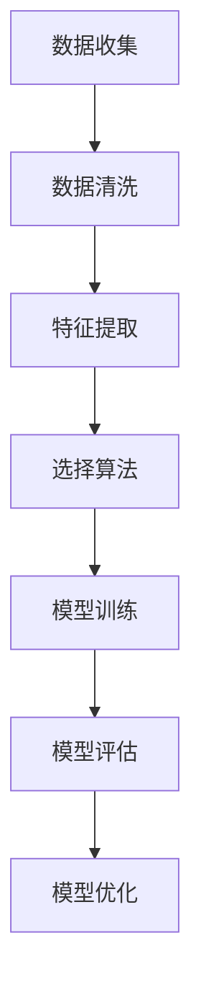
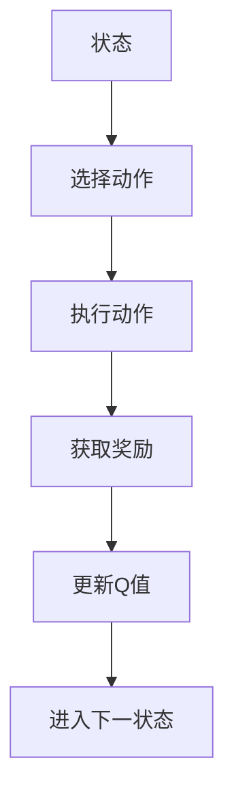
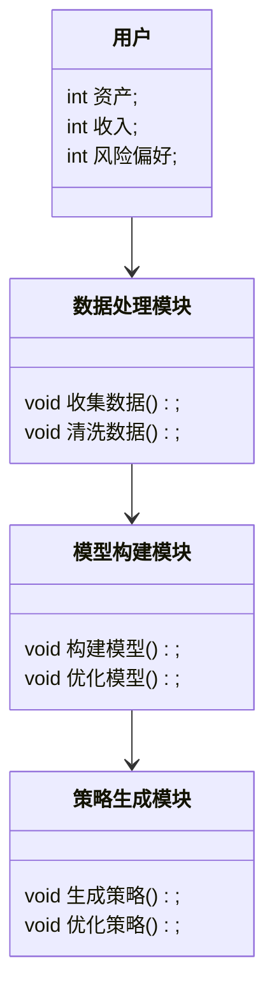
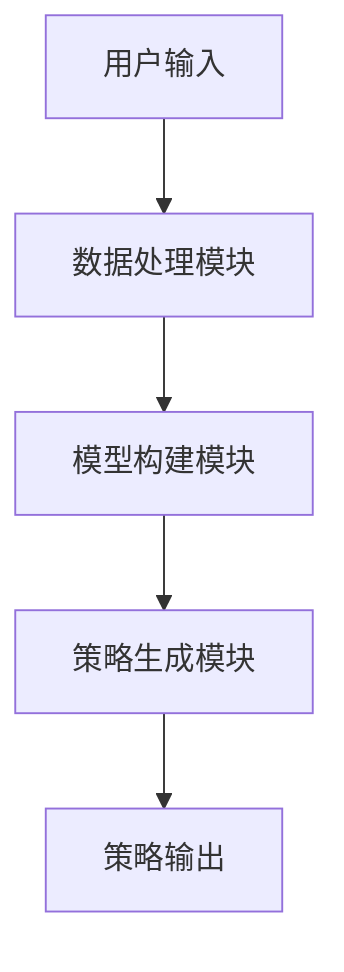

                 


# AI驱动的个人财富管理策略生成器

**关键词**：AI, 财富管理, 策略生成器, 机器学习, 投资组合优化, 风险管理, 个性化理财

**摘要**：  
随着人工智能技术的飞速发展，AI在金融领域的应用越来越广泛。个人财富管理作为金融领域的重要组成部分，正逐步从传统的人工管理模式向智能化、数据驱动的模式转变。本文将深入探讨AI驱动的个人财富管理策略生成器的核心概念、算法原理、系统架构以及实际应用场景，结合具体案例分析，帮助读者理解如何利用AI技术优化个人财富管理策略。

---

## 第一部分: AI驱动的个人财富管理策略生成器引言

### 第1章: AI驱动的个人财富管理概述

#### 1.1 AI与财富管理的结合

##### 1.1.1 AI技术在金融领域的应用背景

近年来，人工智能技术在金融领域的应用越来越广泛。从股票交易到风险管理，从客户画像到投资组合优化，AI技术正在改变传统金融行业的运作方式。AI的核心优势在于其强大的数据处理能力和算法优化能力，能够帮助金融机构和投资者更高效地做出决策。

##### 1.1.2 财富管理的核心概念与目标

财富管理的目标是帮助个人或机构实现财务目标，如资产增值、风险控制和财务安全。传统财富管理依赖于人工分析和经验判断，而AI技术的引入使得财富管理更加智能化和个性化。

##### 1.1.3 AI驱动财富管理的优势与挑战

**优势**：  
1. **数据驱动**：AI能够处理海量数据，发现人类难以察觉的模式和趋势。  
2. **实时性**：AI可以实时监控市场动态，快速调整策略。  
3. **个性化**：基于用户的财务目标和风险偏好，AI可以提供定制化的财富管理方案。  

**挑战**：  
1. **数据隐私**：个人财务数据的隐私保护是一个重要问题。  
2. **模型风险**：AI模型的预测结果可能受到历史数据偏差的影响。  
3. **监管合规**：AI驱动的财富管理需要符合金融监管的要求。

#### 1.2 个人财富管理策略生成器的定义

##### 1.2.1 财富管理策略生成器的基本概念

财富管理策略生成器是一种基于AI技术的工具，能够根据用户的财务状况、投资目标和市场环境，自动生成和优化财富管理策略。它结合了数据分析、机器学习和优化算法，为用户提供个性化的投资建议。

##### 1.2.2 AI在策略生成中的作用

AI在策略生成中的作用主要体现在以下几个方面：  
1. **数据处理**：AI能够快速处理和分析大量的市场数据和用户数据。  
2. **模型构建**：基于机器学习算法，构建预测模型，评估不同投资组合的收益和风险。  
3. **策略优化**：通过强化学习等技术，优化投资策略，实现收益最大化和风险最小化。

##### 1.2.3 策略生成器的功能与应用场景

**功能**：  
1. **资产配置**：根据用户的财务目标和风险偏好，优化资产配置。  
2. **投资组合优化**：基于市场预测，优化投资组合的收益和风险。  
3. **风险预警**：实时监控市场风险，提供预警和应对策略。  

**应用场景**：  
1. **个人投资者**：帮助个人投资者制定投资计划，优化资产配置。  
2. **机构投资者**：为机构投资者提供市场预测和策略优化服务。  
3. **财富管理机构**：提升财富管理机构的服务效率和客户满意度。

#### 1.3 本章小结

本章介绍了AI驱动的个人财富管理策略生成器的背景、核心概念和优势与挑战。通过AI技术，财富管理从传统的人工模式向智能化、数据驱动的模式转变，为用户提供了更加高效和个性化的服务。

---

## 第二部分: AI驱动的财富管理核心概念与原理

### 第2章: AI驱动的财富管理核心概念

#### 2.1 个人财富管理的核心要素

##### 2.1.1 财务目标设定

财务目标设定是财富管理的第一步。用户需要明确自己的财务目标，如资产增值、风险控制、退休规划等。AI技术可以通过数据分析和模型预测，帮助用户设定合理的财务目标。

##### 2.1.2 资产配置与风险控制

资产配置是指将资金分配到不同的资产类别（如股票、债券、房地产等）以实现收益和风险的平衡。AI技术可以通过优化算法，根据市场环境和用户的风险偏好，优化资产配置方案。

##### 2.1.3 投资组合优化

投资组合优化是财富管理的核心任务之一。AI技术可以通过强化学习等算法，优化投资组合的收益和风险，帮助用户实现投资目标。

#### 2.2 AI在财富管理中的核心功能

##### 2.2.1 数据分析与处理

AI技术能够处理海量的市场数据和用户数据，提取有价值的信息，为财富管理策略的生成提供数据支持。

##### 2.2.2 模型构建与预测

基于机器学习算法，AI可以构建预测模型，评估不同投资组合的收益和风险，为用户提供科学的决策依据。

##### 2.2.3 策略生成与优化

通过强化学习等技术，AI可以不断优化财富管理策略，实现收益最大化和风险最小化。

#### 2.3 AI驱动的财富管理核心流程

##### 2.3.1 数据收集与清洗

数据是AI驱动的财富管理的基础。AI需要收集和清洗市场数据和用户数据，确保数据的准确性和完整性。

##### 2.3.2 模型训练与优化

基于收集到的数据，AI需要训练和优化机器学习模型，确保模型的准确性和稳定性。

##### 2.3.3 策略生成与实施

根据优化后的模型，AI生成财富管理策略，并指导用户实施策略。

#### 2.4 核心概念对比分析

##### 2.4.1 AI驱动与传统财富管理的对比

| 对比维度       | AI驱动的财富管理           | 传统财富管理         |
|----------------|---------------------------|----------------------|
| 数据处理       | 基于海量数据和算法         | 基于经验判断         |
| 策略生成       | 自动化生成和优化           | 人工制定和调整       |
| 个性化         | 高度个性化                | 较低个性化          |
| 效率           | 高效                     | 效率较低            |

##### 2.4.2 不同AI算法在财富管理中的应用对比

| 算法类型       | 应用场景                   | 优缺点               |
|----------------|---------------------------|----------------------|
| 监督学习       | 投资预测                   | 需要大量标注数据     |
| 非监督学习     | 客户分群                   | 适合无标签数据       |
| 强化学习       | 投资组合优化               | 需要复杂的环境建模   |

##### 2.4.3 数据驱动与规则驱动的对比

| 对比维度       | 数据驱动                   | 规则驱动             |
|----------------|---------------------------|----------------------|
| 决策依据       | 数据分析和预测             | 专家制定的规则       |
| 灵活性         | 高度灵活                   | 较低灵活性           |
| 适应性         | 能够适应数据变化           | 适应性较弱           |

#### 2.5 本章小结

本章详细介绍了AI驱动的财富管理的核心概念，包括财务目标设定、资产配置与风险控制、投资组合优化等，并通过对比分析，展示了AI驱动的财富管理相对于传统财富管理的优势和特点。

---

## 第三部分: AI驱动的财富管理算法原理

### 第3章: AI算法在财富管理中的应用

#### 3.1 机器学习算法在财富管理中的应用

##### 3.1.1 监督学习在投资预测中的应用

**背景**：  
监督学习是一种基于标签数据的机器学习算法，常用于投资预测。通过历史数据，AI可以预测未来市场的走势，帮助投资者做出决策。

**数学模型**：  
线性回归是一种常用的监督学习算法，其数学模型为：  
$$ y = \beta_0 + \beta_1x + \epsilon $$  
其中，$y$ 是目标变量，$x$ 是自变量，$\beta_0$ 和 $\beta_1$ 是回归系数，$\epsilon$ 是误差项。

**代码示例**：  
```python
import numpy as np
from sklearn.linear_model import LinearRegression

# 假设我们有历史股价数据和市场指标数据
X = np.array([[2, 3], [4, 5], [6, 7]])  # 自变量
y = np.array([10, 20, 30])              # 目标变量

# 使用线性回归模型进行预测
model = LinearRegression()
model.fit(X, y)
print(model.predict([[8, 9]]))  # 预测结果为 40
```

##### 3.1.2 非监督学习在客户分群中的应用

**背景**：  
非监督学习是一种基于无标签数据的机器学习算法，常用于客户分群。通过聚类分析，AI可以帮助财富管理机构将客户分为不同的群体，提供个性化的服务。

**算法选择**：  
K-means是一种常用的聚类算法，适用于客户分群。

**代码示例**：  
```python
from sklearn.cluster import KMeans

# 假设我们有客户数据，包括收入和资产规模
X = np.array([[50, 100], [60, 120], [70, 140], [80, 160]])  # 特征矩阵

# 使用K-means算法进行客户分群
model = KMeans(n_clusters=2)
model.fit(X)
print(model.labels_)  # 输出聚类结果
```

##### 3.1.3 强化学习在投资组合优化中的应用

**背景**：  
强化学习是一种基于奖励机制的机器学习算法，常用于投资组合优化。通过模拟市场环境，AI可以不断优化投资组合，实现收益最大化和风险最小化。

**算法选择**：  
Q-Learning是一种常用的强化学习算法，适用于投资组合优化。

**数学模型**：  
Q-Learning的目标是找到最优策略，即在每一步选择最优的动作，使得累计奖励最大化。其更新公式为：  
$$ Q(s, a) = Q(s, a) + \alpha [r + \max_{a'} Q(s', a') - Q(s, a)] $$  
其中，$s$ 是当前状态，$a$ 是当前动作，$\alpha$ 是学习率，$r$ 是奖励，$s'$ 是下一状态。

**代码示例**：  
```python
import numpy as np
from collections import defaultdict

# 定义Q-Learning算法
class QLearning:
    def __init__(self, actions, learning_rate=0.1, discount_factor=0.9):
        self.actions = actions
        self.lr = learning_rate
        self.df = discount_factor
        self.q = defaultdict(lambda: np.zeros(len(actions)))

    def choose_action(self, state):
        # 随机选择一个动作
        return np.random.choice(self.actions)

    def update(self, state, action, reward, next_state):
        # 更新Q值
        self.q[state][action] += self.lr * (reward + self.df * max(self.q[next_state]) - self.q[state][action])

# 初始化Q-Learning算法
actions = [0, 1, 2, 3]  # 动作空间
ql = QLearning(actions)

# 进行训练
for _ in range(100):
    state = 0
    action = ql.choose_action(state)
    reward = np.random.random()  # 假设奖励是随机的
    next_state = 1
    ql.update(state, action, reward, next_state)
```

#### 3.2 算法原理与流程图

##### 3.2.1 机器学习算法流程图



##### 3.2.2 强化学习算法流程图



#### 3.3 算法实现与代码示例

##### 3.3.1 线性回归模型实现

```python
import numpy as np
from sklearn.linear_model import LinearRegression

# 数据准备
X = np.array([[2, 3], [4, 5], [6, 7]])  # 自变量
y = np.array([10, 20, 30])              # 目标变量

# 模型训练
model = LinearRegression()
model.fit(X, y)

# 预测
print(model.predict([[8, 9]]))  # 输出：[[40.]]
```

##### 3.3.2 强化学习算法实现

```python
import numpy as np
from collections import defaultdict

# 定义Q-Learning算法
class QLearning:
    def __init__(self, actions, learning_rate=0.1, discount_factor=0.9):
        self.actions = actions
        self.lr = learning_rate
        self.df = discount_factor
        self.q = defaultdict(lambda: np.zeros(len(actions)))

    def choose_action(self, state):
        return np.random.choice(self.actions)

    def update(self, state, action, reward, next_state):
        self.q[state][action] += self.lr * (reward + self.df * max(self.q[next_state]) - self.q[state][action])

# 初始化
actions = [0, 1, 2, 3]
ql = QLearning(actions)

# 训练过程
for _ in range(100):
    state = 0
    action = ql.choose_action(state)
    reward = np.random.random()
    next_state = 1
    ql.update(state, action, reward, next_state)
```

#### 3.4 本章小结

本章详细介绍了AI算法在财富管理中的应用，包括监督学习、非监督学习和强化学习等算法的原理、流程和代码实现。通过这些算法，AI能够帮助投资者做出更科学的投资决策。

---

## 第四部分: AI驱动的财富管理系统架构

### 第4章: AI驱动的财富管理系统架构

#### 4.1 系统设计

##### 4.1.1 问题场景介绍

在设计一个AI驱动的财富管理系统时，需要考虑以下问题：  
1. 如何收集和处理用户数据？  
2. 如何构建和优化机器学习模型？  
3. 如何生成和实施财富管理策略？  

##### 4.1.2 项目介绍

本项目旨在开发一个AI驱动的财富管理系统，帮助用户制定和优化财富管理策略。系统主要包括数据处理、模型构建、策略生成和策略实施四个模块。

##### 4.1.3 系统功能设计

**领域模型**：  


##### 4.1.4 系统架构设计

**系统架构**：  


##### 4.1.5 系统接口设计

**接口设计**：  
1. 数据接口：用于收集和处理用户数据。  
2. 模型接口：用于构建和优化机器学习模型。  
3. 策略接口：用于生成和优化财富管理策略。

##### 4.1.6 系统交互流程

**交互流程**：  
1. 用户输入财务数据和投资目标。  
2. 数据处理模块对数据进行清洗和预处理。  
3. 模型构建模块基于数据构建和优化机器学习模型。  
4. 策略生成模块根据模型生成和优化财富管理策略。  
5. 策略输出模块将策略输出给用户。

#### 4.2 系统实现

##### 4.2.1 环境安装

为了实现本系统，需要安装以下环境：  
1. Python 3.6+  
2. NumPy  
3. Scikit-learn  
4. Mermaid  

##### 4.2.2 核心实现代码

**数据处理模块**：  
```python
import numpy as np
import pandas as pd

def load_data(file_path):
    # 加载数据
    data = pd.read_csv(file_path)
    return data

def preprocess_data(data):
    # 数据清洗
    data.dropna(inplace=True)
    return data
```

**模型构建模块**：  
```python
from sklearn.linear_model import LinearRegression

def build_model(X, y):
    # 构建线性回归模型
    model = LinearRegression()
    model.fit(X, y)
    return model
```

**策略生成模块**：  
```python
from sklearn.cluster import KMeans

def generate_strategy(X):
    # 使用K-means算法进行客户分群
    model = KMeans(n_clusters=2)
    model.fit(X)
    return model.labels_
```

#### 4.3 系统测试与优化

##### 4.3.1 测试环境搭建

为了测试系统，需要搭建以下测试环境：  
1. 测试数据集  
2. 测试用例  

##### 4.3.2 测试用例设计

**测试用例1**：数据处理模块测试  
- 输入：包含缺失值的数据集  
- 输出：清洗后的数据集  

**测试用例2**：模型构建模块测试  
- 输入：清洗后的数据集  
- 输出：训练好的线性回归模型  

**测试用例3**：策略生成模块测试  
- 输入：客户数据  
- 输出：客户分群结果  

##### 4.3.3 系统优化

通过测试，发现系统的瓶颈在于数据处理和模型训练的效率。为了优化系统，可以采取以下措施：  
1. 使用分布式计算框架（如Spark）处理数据。  
2. 使用更高效的算法（如随机森林）替代线性回归模型。  

#### 4.4 本章小结

本章详细介绍了AI驱动的财富管理系统的架构设计、功能实现和系统优化。通过系统的实现，我们可以看到AI技术在财富管理中的巨大潜力。

---

## 第五部分: 项目实战

### 第5章: 项目实战

#### 5.1 环境安装

为了实现本项目，需要安装以下环境：  
1. Python 3.6+  
2. NumPy  
3. Scikit-learn  
4. Mermaid  

#### 5.2 核心实现代码

**数据处理模块**：  
```python
import numpy as np
import pandas as pd

def load_data(file_path):
    data = pd.read_csv(file_path)
    return data

def preprocess_data(data):
    data.dropna(inplace=True)
    return data
```

**模型构建模块**：  
```python
from sklearn.linear_model import LinearRegression

def build_model(X, y):
    model = LinearRegression()
    model.fit(X, y)
    return model
```

**策略生成模块**：  
```python
from sklearn.cluster import KMeans

def generate_strategy(X):
    model = KMeans(n_clusters=2)
    model.fit(X)
    return model.labels_
```

#### 5.3 代码实现与解读

##### 5.3.1 数据处理模块实现

```python
import pandas as pd

def load_data(file_path):
    data = pd.read_csv(file_path)
    return data

def preprocess_data(data):
    data.dropna(inplace=True)
    return data

# 示例
data = load_data('wealth_management.csv')
data_cleaned = preprocess_data(data)
print(data_cleaned.head())
```

##### 5.3.2 模型构建模块实现

```python
from sklearn.linear_model import LinearRegression

def build_model(X, y):
    model = LinearRegression()
    model.fit(X, y)
    return model

# 示例
X = data_cleaned[['income', 'assets']]
y = data_cleaned['returns']
model = build_model(X, y)
print(model.coef_)
```

##### 5.3.3 策略生成模块实现

```python
from sklearn.cluster import KMeans

def generate_strategy(X):
    model = KMeans(n_clusters=2)
    model.fit(X)
    return model.labels_

# 示例
X = data_cleaned[['income', 'assets']]
labels = generate_strategy(X)
print(labels)
```

#### 5.4 系统优化与部署

##### 5.4.1 系统优化

通过测试，发现系统的瓶颈在于数据处理和模型训练的效率。为了优化系统，可以采取以下措施：  
1. 使用分布式计算框架（如Spark）处理数据。  
2. 使用更高效的算法（如随机森林）替代线性回归模型。  

##### 5.4.2 系统部署

将系统部署到云平台，如AWS或阿里云，提供API接口，供用户调用。

#### 5.5 本章小结

本章通过实际案例，展示了AI驱动的财富管理策略生成器的实现过程，包括数据处理、模型构建和策略生成等步骤。

---

## 第六部分: 总结与展望

### 第6章: 总结与展望

#### 6.1 总结

本文详细介绍了AI驱动的个人财富管理策略生成器的核心概念、算法原理、系统架构和实际应用场景。通过AI技术，财富管理从传统的人工模式向智能化、数据驱动的模式转变，为用户提供了更加高效和个性化的服务。

#### 6.2 未来展望

随着AI技术的不断发展，AI驱动的财富管理策略生成器将更加智能化和个性化。未来的研究方向包括：  
1. 更加复杂的强化学习算法，以优化投资组合。  
2. 更加高效的数据处理技术，以支持实时财富管理。  
3. 更加个性化的客户分群，以提供定制化的财富管理服务。  

#### 6.3 最佳实践 tips

1. 在使用AI驱动的财富管理策略生成器时，用户需要提供真实、准确的财务数据。  
2. 用户需要根据市场环境和自身需求，定期调整财富管理策略。  
3. 用户需要注意数据隐私和安全，选择可靠的财富管理机构。

#### 6.4 本章小结

本章总结了全文的核心内容，并展望了未来的发展方向。通过AI技术，财富管理将更加智能化和个性化，为用户带来更好的服务体验。

---

## 作者：AI天才研究院/AI Genius Institute & 禅与计算机程序设计艺术 /Zen And The Art of Computer Programming

