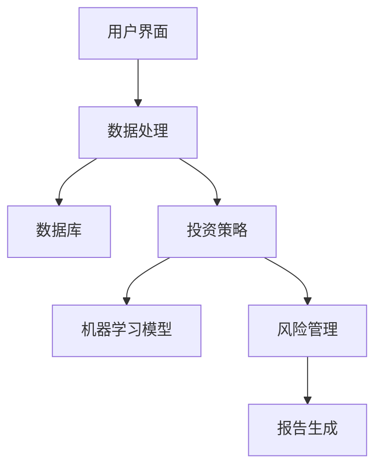
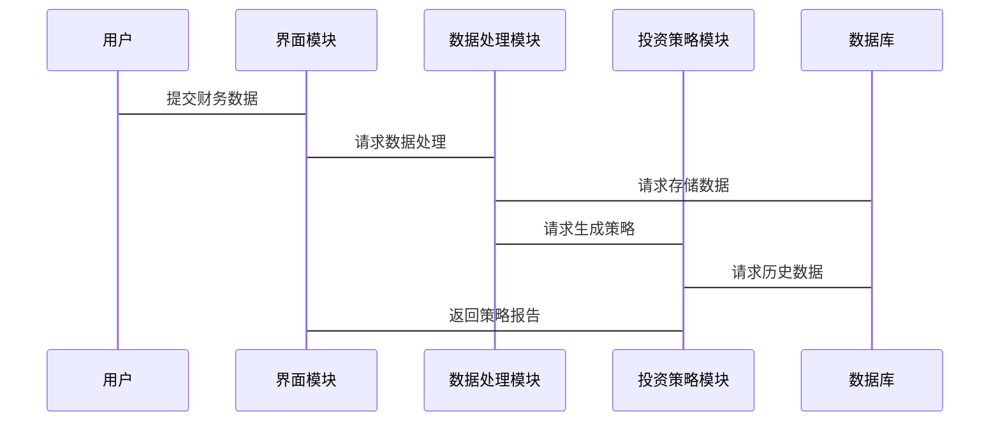

                 


# AI驱动的个人财富管理系统设计

> 关键词：AI, 个人财富管理, 系统设计, 机器学习, 投资策略

> 摘要：本文详细探讨了AI在个人财富管理中的应用，从系统设计到算法实现，再到实际案例分析，全面解析如何利用AI技术优化个人财务管理和投资决策。

---

# 第1章: AI驱动的个人财富管理概述

## 1.1 AI在财富管理中的应用背景

### 1.1.1 财富管理的定义与目标

财富管理是指通过科学的规划和管理，实现个人或家庭财务的最优配置，以达到财富保值、增值的目的。传统的财富管理依赖于人工分析和经验判断，而随着AI技术的发展，智能化的财富管理成为可能。

### 1.1.2 AI技术在财富管理中的应用背景

AI技术，尤其是机器学习和深度学习，能够处理海量数据，发现复杂模式，并做出预测和决策。在财富管理领域，AI可以用于市场预测、投资组合优化、风险评估等方面。

### 1.1.3 个人财富管理的痛点与需求

传统财富管理存在效率低、成本高、个性化不足等问题。AI技术能够解决这些问题，提供个性化的投资建议，降低管理成本，提高决策效率。

## 1.2 AI驱动的财富管理核心概念

### 1.2.1 个人财富管理的数字化转型

数字化转型是指利用信息技术和数据分析，将传统的财富管理过程转化为数字化、智能化的流程。通过数字化，财富管理能够更高效、更精准地满足客户需求。

### 1.2.2 AI在财富管理中的核心作用

AI通过数据驱动的方法，帮助投资者做出更科学的投资决策。AI能够分析市场趋势、预测风险、优化投资组合，提供个性化的财富管理方案。

### 1.2.3 财富管理系统的功能架构

AI驱动的财富管理系统通常包括数据采集、数据分析、投资策略生成、风险管理等功能模块。这些模块协同工作，为用户提供全面的财富管理服务。

---

# 第2章: 数据采集与处理

## 2.1 数据采集的定义与流程

### 2.1.1 数据来源与采集方式

财富管理系统的数据来源包括银行账户、股票交易记录、消费记录等。数据采集可以通过API接口、数据库查询等方式进行。

### 2.1.2 数据清洗与预处理

数据清洗是确保数据质量的重要步骤，包括去除重复数据、处理缺失值、消除噪声等。预处理步骤还包括数据标准化和归一化，以便后续分析。

### 2.1.3 数据存储与管理

数据通常存储在数据库中，可以采用关系型数据库或分布式数据库。数据管理需要考虑数据的安全性、可扩展性和高效性。

## 2.2 数据分析与特征提取

### 2.2.1 数据分析的基本方法

数据分析包括描述性分析、诊断性分析、预测性分析和规范性分析。在财富管理中，预测性分析尤为重要，用于预测市场走势和投资回报。

### 2.2.2 特征提取的关键技术

特征提取是将原始数据转化为更有意义的特征的过程。常用的技术包括主成分分析（PCA）、线性判别分析（LDA）等。特征提取能够提高模型的性能和准确性。

### 2.2.3 数据可视化与洞察

通过数据可视化工具，如Matplotlib、Tableau等，可以直观展示数据中的规律和趋势。数据可视化有助于更好地理解数据，发现潜在的洞察。

---

# 第3章: AI算法在财富管理中的应用

## 3.1 机器学习在财富管理中的应用

### 3.1.1 监督学习在财富预测中的应用

监督学习通过训练数据预测目标变量。例如，使用线性回归模型预测股票价格，使用支持向量机（SVM）进行分类预测市场趋势。

### 3.1.2 非监督学习在客户分群中的应用

非监督学习用于无标签数据的聚类分析。例如，使用K-means算法将客户分为不同的风险偏好群体，为每个群体提供个性化的投资建议。

### 3.1.3 强化学习在投资策略中的应用

强化学习通过试错机制优化投资策略。例如，使用Q-Learning算法在模拟环境中训练投资策略，以最大化投资回报。

## 3.2 深度学习在财富管理中的应用

### 3.2.1 RNN在时间序列预测中的应用

循环神经网络（RNN）擅长处理时间序列数据，可用于预测股票价格走势和市场波动。例如，使用LSTM模型预测短期市场趋势。

### 3.2.2 CNN在金融图像识别中的应用

卷积神经网络（CNN）用于图像识别，可以分析金融市场中的图表数据，如K线图，辅助投资者做出决策。

### 3.2.3 Transformer在自然语言处理中的应用

Transformer模型用于处理文本数据，可用于分析财经新闻，识别市场情绪，辅助投资决策。

## 3.3 算法优缺点分析

### 3.3.1 各种算法的优缺点对比

| 算法类型 | 优点 | 缺点 |
|----------|------|------|
| 监督学习 | 数据标签明确，结果可解释性高 | 需要大量标注数据，不适合无标签数据 |
| 非监督学习 | 可以发现数据中的隐藏结构 | 结果解释性差，聚类效果依赖于参数设置 |
| 强化学习 | 适合动态环境，策略优化能力强 | 需要大量试错，计算成本高 |
| RNN | 善于处理时间序列数据 | 长期依赖问题，训练困难 |
| CNN | 适合图像数据，特征提取能力强 | 不擅长时间序列数据 |
| Transformer | 并行计算能力强，适合长文本处理 | 对GPU资源要求高 |

### 3.3.2 算法选择的策略与建议

算法选择应基于具体问题、数据特性和计算资源。例如，对于时间序列预测，优先选择RNN或LSTM；对于图像识别，优先选择CNN；对于无标签数据，优先选择非监督学习。

---

# 第4章: 系统架构与设计

## 4.1 系统功能模块设计

### 4.1.1 用户界面模块

用户界面模块包括用户登录、数据输入、投资组合查看等功能。用户可以通过界面提交财务数据，查看投资建议和风险管理报告。

### 4.1.2 数据处理模块

数据处理模块负责接收数据、清洗数据、存储数据。数据处理模块需要与数据库交互，确保数据的准确性和完整性。

### 4.1.3 投资策略模块

投资策略模块基于机器学习模型生成投资建议，包括资产配置、风险评估、市场预测等功能。模块需要与数据处理模块和用户界面模块协同工作。

## 4.2 系统架构设计

### 4.2.1 系统架构图

以下是系统架构的Mermaid图：



### 4.2.2 系统交互流程

以下是系统交互的Mermaid序列图：



## 4.3 项目实战

### 4.3.1 环境安装

需要安装Python、机器学习库（如Scikit-learn、TensorFlow）、数据处理库（如Pandas）、可视化库（如Matplotlib）以及数据库管理库（如SQLAlchemy）。

### 4.3.2 系统核心实现源代码

以下是投资策略模块的Python代码示例：

```python
import numpy as np
import pandas as pd
from sklearn.model import LinearRegression

# 数据处理
data = pd.read_csv('wealth_data.csv')
X = data[['income', 'expenses', 'investments']]
y = data['net_worth']

# 模型训练
model = LinearRegression()
model.fit(X, y)

# 预测
new_data = np.array([[50000, 20000, 30000]])
prediction = model.predict(new_data)
print("预测净资产：", prediction[0])
```

### 4.3.3 代码应用解读与分析

上述代码实现了一个简单的线性回归模型，用于预测净资产。通过输入收入、支出和投资金额，模型可以预测用户的净资产价值。这可以作为投资策略的一部分，帮助用户优化资产配置。

### 4.3.4 实际案例分析

假设一个用户年收入为50000元，年支出为20000元，当前投资为30000元。通过上述模型预测，用户的净资产预计为40000元。基于此，系统可以推荐适当的投资组合，如增加股票投资比例，减少债券投资比例。

### 4.3.5 项目小结

通过实际案例分析，我们可以看到AI在财富管理中的巨大潜力。模型能够帮助用户做出更科学的投资决策，提升财务状况。

---

# 第5章: 总结与展望

## 5.1 本章小结

本文详细介绍了AI驱动的个人财富管理系统的设计与实现，包括系统架构、数据处理、算法实现等方面。通过实际案例分析，展示了AI在财富管理中的应用价值。

## 5.2 未来展望

随着AI技术的不断发展，财富管理系统将更加智能化和个性化。未来的系统可能会集成更多的数据源，采用更复杂的模型，提供更精准的投资建议。同时，随着区块链技术的发展，财富管理系统可能会更加安全和透明。

---

作者：AI天才研究院/AI Genius Institute & 禅与计算机程序设计艺术 /Zen And The Art of Computer Programming

