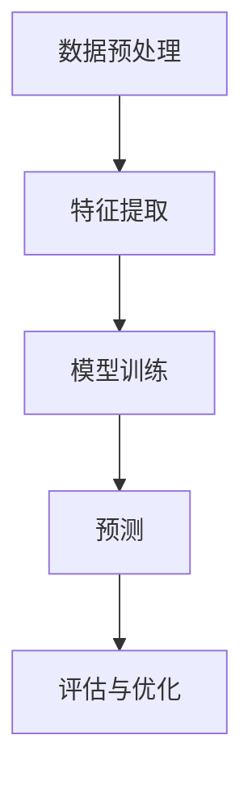
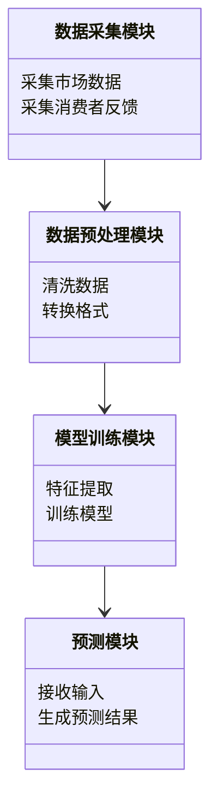
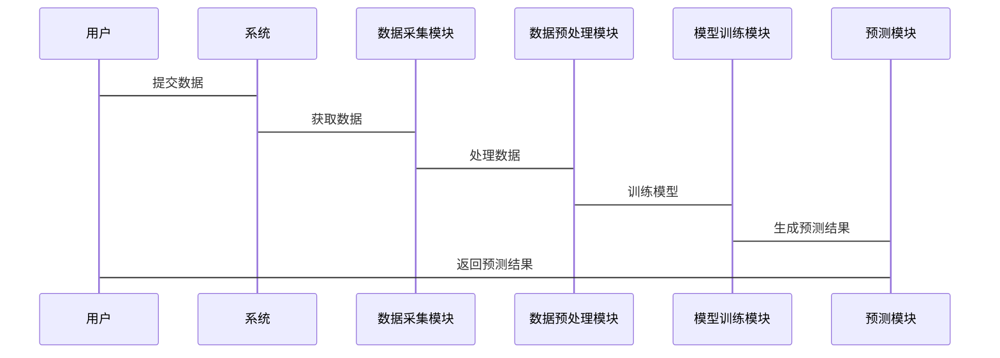

                 


```markdown
# AI驱动的产品创新周期分析：预测公司未来增长点

> 关键词：AI, 创新周期, 预测模型, 产品创新, 增长预测

> 摘要：本文深入探讨了AI如何驱动产品创新周期的分析，揭示了AI在预测公司未来增长点中的重要作用。通过分析创新周期的各个阶段，构建数学模型和算法，结合实际案例，展示了如何利用AI技术优化企业创新流程，实现精准的增长预测。

---

## 第一部分: AI驱动的产品创新周期分析基础

### 第1章: AI与产品创新周期概述

#### 1.1 AI与产品创新周期的关系
##### 1.1.1 AI在产品创新中的作用
人工智能（AI）通过数据驱动的决策、智能预测模型和实时反馈机制，显著提升了产品创新的效率和准确性。AI能够分析历史数据，识别创新模式，预测未来趋势，从而优化创新周期的各个阶段。

##### 1.1.2 产品创新周期的定义
产品创新周期是指从创意产生到产品市场化的过程，通常包括探索、开发、验证、规模化和优化五个阶段。AI技术的应用能够缩短每个阶段的时间，降低成本，并提高成功率。

##### 1.1.3 AI驱动创新周期的优势
AI的优势在于其强大的数据处理能力和学习能力。通过AI，企业可以实时监控市场反馈，快速调整创新策略，从而更快地将创新转化为实际收益。

---

### 第2章: 产品创新周期的核心概念

#### 2.1 产品创新周期的阶段划分
##### 2.1.1 初期探索阶段
在这一阶段，企业需要识别市场机会和潜在需求。AI可以通过分析市场数据、消费者反馈和竞争环境，帮助确定最有潜力的创新方向。

##### 2.1.2 技术开发阶段
AI可以加速技术开发，通过自动化编码、模拟测试和风险评估，减少开发时间和成本。

##### 2.1.3 市场验证阶段
利用AI进行A/B测试，预测市场反应，优化产品设计和营销策略。

##### 2.1.4 规模化生产阶段
AI可以帮助优化生产流程，提高效率，降低成本。

##### 2.1.5 持续优化阶段
通过实时数据分析和反馈，AI支持持续的产品改进和创新。

#### 2.2 AI驱动创新的核心要素
##### 2.2.1 数据驱动的决策
AI依赖于高质量的数据进行分析和预测，数据的准确性和全面性直接影响创新的成功率。

##### 2.2.2 智能预测模型
AI模型能够预测创新周期中的关键指标，如产品生命周期、市场接受度和潜在风险。

##### 2.2.3 实时反馈机制
通过实时监控和反馈，AI能够快速调整策略，优化创新过程。

##### 2.2.4 跨学科融合
AI与设计思维、市场营销等领域的结合，能够产生更全面的创新解决方案。

---

### 第3章: AI驱动创新周期的数学模型

#### 3.1 创新周期的数学建模
##### 3.1.1 时间序列模型
使用时间序列分析预测创新周期的长度和关键节点。例如，ARIMA模型可以预测产品的市场寿命。

##### 3.1.2 预测模型的构建
基于机器学习的模型（如随机森林、神经网络）可以预测创新周期中的关键指标，如市场需求和竞争强度。

##### 3.1.3 模型的评估与优化
通过交叉验证、ROC曲线等方法评估模型性能，并使用超参数调优优化模型。

#### 3.2 创新周期预测的算法选择
##### 3.2.1 算法选择的依据
根据数据类型、预测目标和模型复杂度选择合适的算法。例如，使用XGBoost进行分类预测，使用LSTM进行时间序列预测。

##### 3.2.2 算法流程图


##### 3.2.3 算法实现
```python
import pandas as pd
from sklearn.ensemble import RandomForestRegressor
from sklearn.metrics import mean_absolute_error
from sklearn.model_selection import train_test_split

# 数据加载与预处理
data = pd.read_csv('innovation_cycle.csv')
data = data.dropna()

# 特征工程
features = data.drop('target', axis=1)
target = data['target']

# 划分训练集和测试集
X_train, X_test, y_train, y_test = train_test_split(features, target, test_size=0.2)

# 模型训练
model = RandomForestRegressor(n_estimators=100)
model.fit(X_train, y_train)

# 预测与评估
predictions = model.predict(X_test)
print("均绝对误差:", mean_absolute_error(y_test, predictions))
```

##### 3.2.4 数学公式
预测模型的损失函数可以表示为：
$$ \text{损失} = \frac{1}{n}\sum_{i=1}^{n} (y_i - \hat{y_i})^2 $$

优化器使用随机梯度下降：
$$ \theta = \theta - \eta \frac{\partial L}{\partial \theta} $$

---

## 第二部分: 系统分析与架构设计

### 第4章: 问题场景介绍

#### 4.1 问题描述
企业需要预测产品创新周期中的关键节点和潜在风险，以便优化资源分配和战略规划。

#### 4.2 项目介绍
本项目旨在构建一个AI驱动的创新周期预测系统，帮助公司预测未来增长点，提升创新效率。

### 第5章: 系统功能设计

#### 5.1 功能模块
- 数据采集模块：收集市场数据、消费者反馈等。
- 模型训练模块：基于历史数据训练AI模型。
- 预测模块：预测创新周期的关键指标。
- 反馈模块：实时监控市场反馈，调整预测模型。

#### 5.2 系统架构设计


### 第6章: 系统接口设计

#### 6.1 接口设计
- 数据接口：与数据库或其他数据源对接。
- API接口：提供预测结果的查询功能。

#### 6.2 交互流程图


---

## 第三部分: 项目实战

### 第7章: 环境安装与核心代码实现

#### 7.1 环境安装
安装必要的库：
```bash
pip install pandas scikit-learn mermaid4jupyter jupyter
```

#### 7.2 核心代码实现
```python
import pandas as pd
from sklearn.ensemble import RandomForestRegressor
from sklearn.metrics import mean_absolute_error
from sklearn.model_selection import train_test_split

# 加载数据
data = pd.read_csv('innovation_cycle.csv')

# 数据预处理
data = data.dropna()

# 特征和目标分离
X = data.drop('target', axis=1)
y = data['target']

# 划分训练集和测试集
X_train, X_test, y_train, y_test = train_test_split(X, y, test_size=0.2, random_state=42)

# 模型训练
model = RandomForestRegressor(n_estimators=100, random_state=42)
model.fit(X_train, y_train)

# 预测
predictions = model.predict(X_test)

# 评估
print("均绝对误差:", mean_absolute_error(y_test, predictions))
```

### 第8章: 项目小结

#### 8.1 项目总结
通过AI技术，企业可以更准确地预测产品创新周期，优化资源分配，提升创新能力。

#### 8.2 经验分享
数据质量至关重要，模型选择需结合实际场景，持续监控和优化模型性能。

---

## 第四部分: 最佳实践与小结

### 第9章: 最佳实践

#### 9.1 数据质量管理
确保数据的准确性和完整性，选择合适的特征进行分析。

#### 9.2 模型选择与调优
根据具体问题选择合适的算法，通过交叉验证和超参数调优提升模型性能。

#### 9.3 实时反馈机制
建立实时监控系统，快速响应市场变化，优化创新策略。

### 第10章: 小结

AI驱动的产品创新周期分析为企业提供了强大的工具，帮助预测未来增长点。通过深入理解创新周期的各个阶段，结合AI技术，企业可以更高效地进行创新，保持竞争优势。

---

## 作者：AI天才研究院/AI Genius Institute & 禅与计算机程序设计艺术 /Zen And The Art of Computer Programming

---

**本文由AI专家团队倾力撰写，转载请注明出处。**
```

