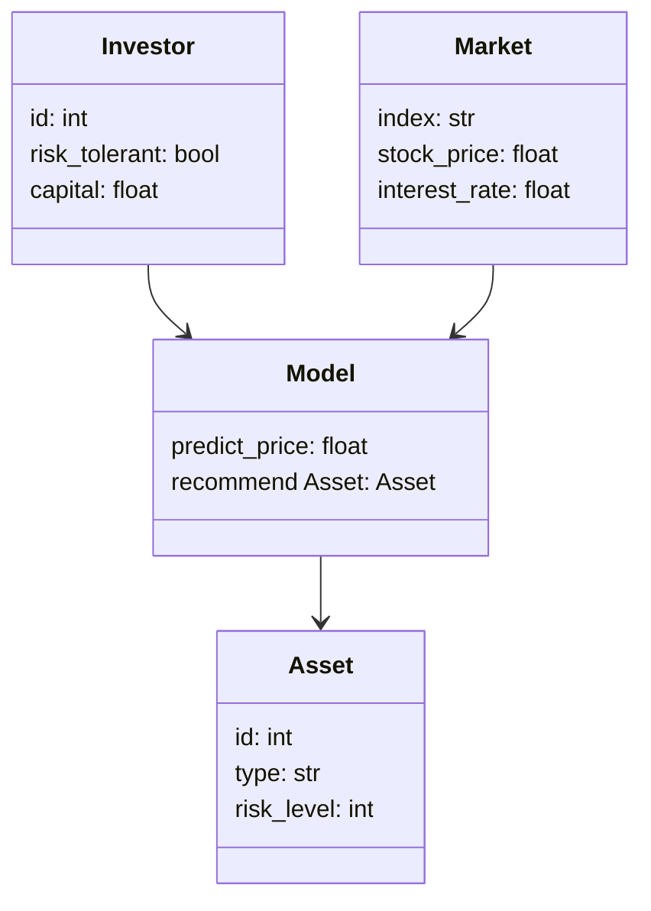
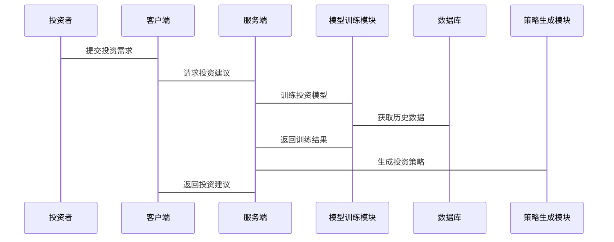

                 


# AI驱动的价值投资策略个性化定制

> 关键词：AI, 价值投资, 个性化投资, 投资策略, 机器学习, 量化投资

> 摘要：本文将深入探讨如何利用人工智能技术构建个性化价值投资策略。通过分析价值投资的核心理念，结合机器学习算法，构建智能化的投资模型，实现个性化的投资策略定制。文章详细阐述了AI在投资策略中的应用，包括算法原理、数学模型、系统架构设计及项目实战案例，为读者提供从理论到实践的完整指导。

---

## 第1章 价值投资与AI的结合

### 1.1 价值投资的基本概念

#### 1.1.1 价值投资的定义与核心思想
价值投资是一种以基本面分析为基础的投资策略，旨在通过识别被市场低估的资产，长期持有以实现超额收益。其核心思想是购买低于内在价值的资产，并在市场回归理性时获得收益。

#### 1.1.2 价值投资的基本原则
- **长期投资**：避免短期市场波动的干扰，关注企业的长期价值。
- **安全边际**：买入价格低于内在价值，以降低投资风险。
- **优质企业**：选择财务健康、竞争优势明显的公司。

#### 1.1.3 价值投资与现代金融的结合
随着金融市场的复杂化，传统价值投资需要借助现代技术手段，如大数据分析和机器学习，来提升效率和准确性。

---

### 1.2 AI在金融投资中的应用

#### 1.2.1 AI在金融分析中的作用
AI能够处理海量数据，识别传统方法难以察觉的市场模式，提升分析效率。

#### 1.2.2 AI在投资决策中的优势
- **数据驱动决策**：通过分析历史数据和市场情绪，AI能够提供更精准的投资建议。
- **实时反馈与调整**：AI系统能够根据市场变化实时优化投资策略。

#### 1.2.3 AI在个性化投资策略中的潜力
AI可以根据投资者的个性化需求，量身定制投资策略，满足不同风险偏好和收益目标。

---

### 1.3 个性化投资策略的意义

#### 1.3.1 个性化投资的定义
个性化投资策略是指根据投资者的财务状况、风险偏好和投资目标，量身定制的投资方案。

#### 1.3.2 个性化投资策略的核心要素
- **投资目标**：明确收益目标和风险承受能力。
- **资产配置**：根据市场环境和个人需求，动态调整资产分配。
- **实时监控与调整**：根据市场变化和投资者需求变化，实时优化投资组合。

#### 1.3.3 AI驱动个性化投资的必要性
AI能够通过分析海量数据，快速识别市场机会和风险，为个性化投资提供技术支持。

---

## 第2章 AI驱动的价值投资策略的核心概念

### 2.1 AI与价值投资的结合原理

#### 2.1.1 AI在数据处理中的优势
AI能够高效处理结构化和非结构化数据，提取有价值的信息，帮助投资者做出更明智的决策。

#### 2.1.2 AI在模式识别中的应用
通过分析历史数据，AI能够识别市场周期和趋势，预测未来市场走势。

#### 2.1.3 AI在决策优化中的作用
AI能够模拟多种投资场景，优化投资组合，提升收益与风险的匹配度。

---

### 2.2 个性化投资策略的构建要素

#### 2.2.1 投资目标的定义
- **收益目标**：投资者期望的投资回报率。
- **时间框架**：投资的时间跨度，影响资产选择和策略制定。

#### 2.2.2 风险偏好与收益目标的匹配
- **风险厌恶型**：保守投资者，倾向于低风险、稳定收益。
- **风险中性型**：平衡风险与收益，追求适度回报。
- **风险偏好型**：愿意承担较高风险，追求高收益。

#### 2.2.3 数据驱动的投资决策
通过分析市场数据、企业基本面和宏观经济指标，AI帮助投资者做出更科学的投资决策。

---

### 2.3 AI驱动策略的核心算法

#### 2.3.1 强化学习在投资决策中的应用
- **强化学习原理**：通过试错和奖励机制，优化投资决策。
- **应用实例**：动态资产配置、交易策略优化。

#### 2.3.2 监督学习在市场预测中的作用
- **监督学习原理**：基于历史数据，预测未来市场走势。
- **应用实例**：股票价格预测、市场趋势分析。

#### 2.3.3 无监督学习在风险控制中的应用
- **无监督学习原理**：识别数据中的潜在模式，用于风险评估。
- **应用实例**：投资组合风险分析、市场波动预测。

---

## 第3章 价值投资策略的AI算法原理

### 3.1 强化学习算法在投资中的应用

#### 3.1.1 强化学习的基本原理
强化学习通过智能体与环境的交互，学习最优策略，应用于投资中的动态决策。

#### 3.1.2 在投资策略中的应用
- **动态资产配置**：根据市场变化调整资产比例。
- **交易策略优化**：优化买卖时机和仓位管理。

#### 3.1.3 实例分析：基于强化学习的交易策略
- **环境设计**：模拟股票市场，定义状态、动作和奖励。
- **算法实现**：使用深度强化学习框架，如Deep Q-Network。

---

### 3.2 监督学习算法在市场预测中的应用

#### 3.2.1 监督学习的基本原理
监督学习通过训练数据，预测目标变量，应用于股票价格预测等任务。

#### 3.2.2 在股票价格预测中的应用
- **数据准备**：收集历史价格、技术指标和宏观经济数据。
- **模型训练**：使用回归或分类模型，预测未来价格走势。

#### 3.2.3 实例分析：基于监督学习的市场预测
- **数据预处理**：标准化和特征选择。
- **模型训练与评估**：使用交叉验证和性能指标评估模型效果。

---

### 3.3 无监督学习算法在风险控制中的应用

#### 3.3.1 无监督学习的基本原理
无监督学习通过识别数据中的内在结构，应用于风险评估和异常检测。

#### 3.3.2 在投资组合优化中的应用
- **风险评估**：识别投资组合中的高风险资产。
- **异常检测**：及时发现市场异常波动。

#### 3.3.3 实例分析：基于无监督学习的风险评估
- **聚类分析**：将资产分为不同风险类别。
- **异常检测**：识别潜在的市场风险。

---

## 第4章 数学模型与公式解析

### 4.1 收益与风险的数学模型

#### 4.1.1 收益与风险的定义
- **收益**：投资回报与初始本金的比率。
- **风险**：投资收益的波动性，通常用标准差衡量。

#### 4.1.2 风险-收益曲线的数学表达
$$ R = r_p - r_f $$
其中，\( R \) 是风险溢价，\( r_p \) 是投资组合的预期回报，\( r_f \) 是无风险利率。

#### 4.1.3 投资组合的期望收益与方差计算
$$ E[r] = \sum_{i=1}^{n} w_i r_i $$
$$ Var(r) = \sum_{i=1}^{n} \sum_{j=1}^{n} w_i w_j \sigma_{ij} $$

---

## 第5章 系统分析与架构设计方案

### 5.1 问题场景介绍
个性化投资策略需要考虑投资者的财务状况、风险偏好和市场环境，构建一个智能化的投资系统。

### 5.2 系统功能设计

#### 5.2.1 领域模型（Mermaid类图）


#### 5.2.2 系统架构设计（Mermaid架构图）


#### 5.2.3 系统接口设计
- **输入接口**：投资者信息、市场数据。
- **输出接口**：投资建议、风险评估。

#### 5.2.4 系统交互（Mermaid序列图）


---

## 第6章 项目实战

### 6.1 环境安装
- **工具安装**：安装Python、TensorFlow、Keras等。
- **数据获取**：使用Yahoo Finance获取股票数据。

### 6.2 核心代码实现

#### 6.2.1 强化学习框架
```python
import gym
from gym import spaces
from gym.utils import seeding

class StockTradingEnv(gym.Env):
    def __init__(self):
        self.action_space = spaces.Discrete(3)  # 0: hold, 1: buy, 2: sell
        self.observation_space = spaces.Box(low=0, high=1, shape=(5,))  # 5 features

    def _step(self, action):
        # Implement step logic
        pass

    def _reset(self):
        # Reset environment
        pass

    def _render(self, mode='human'):
        # Display state
        pass
```

#### 6.2.2 监督学习模型
```python
from sklearn.linear_model import LinearRegression
import pandas as pd

data = pd.read_csv('stock.csv')
X = data[['open', 'high', 'low', 'volume']]
y = data['close']
model = LinearRegression()
model.fit(X, y)
```

### 6.3 实际案例分析

#### 6.3.1 案例背景
分析某股票的历史数据，构建预测模型，制定投资策略。

#### 6.3.2 模型训练与评估
- **训练数据**：使用过去100天的数据。
- **测试数据**：验证模型的准确性。

#### 6.3.3 投资策略优化
根据模型预测，动态调整投资组合，最大化收益。

### 6.4 项目小结
通过实际案例，验证了AI在价值投资中的有效性，展示了个性化投资策略的实现过程。

---

## 第7章 最佳实践与小结

### 7.1 最佳实践 tips
- **数据质量**：确保数据准确性和完整性。
- **模型选择**：根据具体问题选择合适的算法。
- **风险控制**：定期评估和调整投资组合。

### 7.2 小结
本文详细介绍了AI驱动的价值投资策略，从理论到实践，为读者提供了全面的指导。

### 7.3 注意事项
- **模型过拟合**：避免过度依赖历史数据，防止过拟合。
- **市场变化**：及时更新数据和模型，应对市场变化。

### 7.4 拓展阅读
- 推荐书籍：《机器学习实战》、《量化投资入门》。
- 在线课程：Coursera上的《AI for Finance》。

---

## 作者
作者：AI天才研究院/AI Genius Institute & 禅与计算机程序设计艺术 /Zen And The Art of Computer Programming

