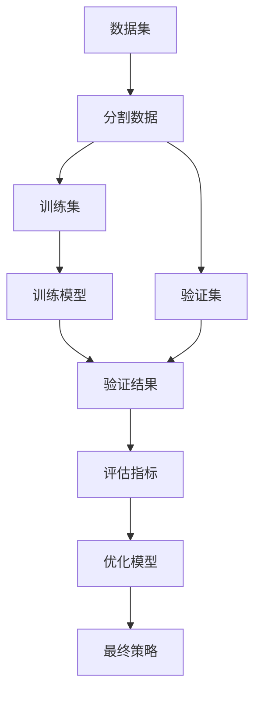
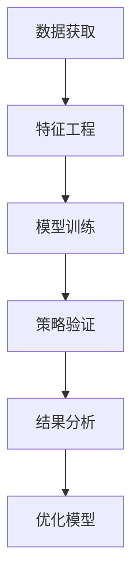

                 


# AI驱动的价值投资策略交叉验证

## 关键词：
- 人工智能、价值投资、策略交叉验证、机器学习、金融投资

## 摘要：
本文深入探讨了AI技术如何驱动价值投资策略，并通过交叉验证方法提升策略的准确性和稳健性。文章首先介绍了价值投资的基本概念和AI在金融中的应用，然后详细分析了AI驱动的投资策略模型，包括数据处理、特征工程和模型选择。接着，重点讲解了策略交叉验证的原理与实现方法，结合数学模型和代码示例，展示了如何在实际投资中应用这些技术。最后，通过项目实战和案例分析，验证了AI驱动策略的有效性，并总结了最佳实践和未来研究方向。

---

# 第1章：价值投资与AI驱动的结合

## 1.1 价值投资的基本概念

### 1.1.1 价值投资的定义与核心理念
价值投资是一种投资策略，旨在通过分析企业的基本面，如财务状况、行业地位和管理团队，寻找被市场低估的股票。其核心理念是购买低于内在价值的资产，长期持有，等待其价值回归。

### 1.1.2 传统价值投资的优缺点
- **优点**：注重长期价值，风险较低，适合稳健投资者。
- **缺点**：依赖人工分析，耗时且受主观因素影响，难以处理复杂市场环境。

### 1.1.3 AI技术如何赋能价值投资
AI通过大数据分析、模式识别和预测模型，帮助投资者更准确地评估企业价值，识别潜在投资机会，优化投资组合。

## 1.2 AI在金融投资中的应用现状

### 1.2.1 AI在金融领域的应用领域
- 数据分析与预测
- 风险评估与管理
- 自动化交易策略
- 市场情绪分析

### 1.2.2 价值投资中AI技术的核心作用
- 提供数据支持：AI能够处理海量数据，提取关键特征。
- 增强决策能力：通过机器学习模型，优化投资决策。
- 提高效率：自动化分析替代传统手动分析，节省时间和成本。

## 1.3 本书的目标与结构

### 1.3.1 本书的研究目标
探索AI技术在价值投资中的应用，重点研究策略交叉验证的方法，提高策略的准确性和稳健性。

### 1.3.2 本书的主要内容框架
- 章节1：价值投资与AI驱动的结合
- 章节2：AI驱动的价值投资策略核心概念
- 章节3：策略交叉验证的方法与实现
- 章节4：AI驱动策略的算法实现
- 章节5：系统架构设计
- 章节6：项目实战与案例分析
- 章节7：总结与展望

### 1.3.3 本书的读者群体与适用场景
适用于金融从业者、投资经理、数据科学家，以及对AI在金融领域应用感兴趣的技术人员。

---

# 第2章：AI驱动的价值投资策略核心概念

## 2.1 数据驱动的价值投资策略

### 2.1.1 数据在价值投资中的重要性
数据是AI驱动策略的基础，包括历史价格、财务数据、行业信息、市场情绪等。

### 2.1.2 数据的获取与处理方法
- 数据来源：公开市场数据、财务报表、新闻资讯。
- 数据清洗：处理缺失值、异常值，标准化处理。

### 2.1.3 数据特征的提取与分析
- 特征工程：选择关键特征，如市盈率、市净率、ROE等。
- 特征分析：通过统计分析和可视化，理解特征与目标变量的关系。

## 2.2 AI模型在策略构建中的应用

### 2.2.1 机器学习在投资策略中的应用
- 监督学习：用于分类问题，如预测股票涨跌。
- 非监督学习：用于聚类分析，识别市场趋势。

### 2.2.2 深度学习在复杂策略中的优势
- 神经网络：处理非线性关系，捕捉复杂市场模式。
- LSTM：用于时间序列预测，分析股价波动。

### 2.2.3 NLP技术在市场情绪分析中的作用
- 文本挖掘：分析新闻、社交媒体，提取市场情绪指标。
- 情感分析：判断市场情绪对股价的影响。

## 2.3 策略交叉验证的原理与方法

### 2.3.1 交叉验证的基本概念
交叉验证是一种评估模型性能的方法，通过将数据分成训练集和验证集，多次交替使用，提高模型泛化能力。

### 2.3.2 策略交叉验证的步骤与流程
1. 数据分割：将数据划分为训练集和测试集。
2. 模型训练：在训练集上训练模型。
3. 模型验证：在测试集上评估模型性能。
4. 结果分析：根据验证结果调整模型参数。

### 2.3.3 不同验证方法的优缺点对比
- K折交叉验证：减少数据浪费，提高评估准确性。
- 留一法：计算量大，适合小数据集。
- 展望：选择合适的验证方法，平衡准确性和效率。

---

# 第3章：策略交叉验证的数学模型

## 3.1 交叉验证的数学原理

### 3.1.1 K折交叉验证的数学公式
K折交叉验证将数据分成K个子集，每次使用K-1个子集训练模型，剩下的子集验证。公式如下：
$$
\text{估计误差} = \frac{1}{K} \sum_{i=1}^{K} \text{误差}_i
$$

### 3.1.2 留一法的数学推导
留一法将每个样本作为验证集一次，计算误差的平均值：
$$
\text{误差} = \frac{1}{N} \sum_{i=1}^{N} \text{误差}_i
$$

### 3.1.3 交叉验证的误差估计与优化
交叉验证通过多次评估，找到最优模型参数，减少过拟合风险。

## 3.2 策略交叉验证的流程图



## 3.3 策略交叉验证的代码实现

### 3.3.1 Python代码示例

```python
import numpy as np
from sklearn.model_selection import KFold
from sklearn.linear_model import LinearRegression

# 示例数据
X = np.array([[1], [2], [3], [4], [5]])
y = np.array([2, 4, 5, 4, 6])

# K折交叉验证
kf = KFold(n_splits=5)
scores = []
for train_index, test_index in kf.split(X):
    X_train, X_test = X[train_index], X[test_index]
    y_train, y_test = y[train_index], y[test_index]
    
    # 训练模型
    model = LinearRegression()
    model.fit(X_train, y_train)
    
    # 验证结果
    score = model.score(X_test, y_test)
    scores.append(score)

# 输出平均分数
print("交叉验证平均分数：", np.mean(scores))
```

### 3.3.2 代码的详细解释与注释
- 导入必要的库：numpy和scikit-learn。
- 使用K折交叉验证，分割数据集。
- 训练线性回归模型，评估R²得分。
- 输出交叉验证的平均分数。

---

# 第4章：系统架构设计

## 4.1 价值投资AI策略系统的架构

### 4.1.1 系统功能模块
- 数据获取：从数据库或API获取金融数据。
- 特征工程：处理和提取特征。
- 模型训练：训练机器学习模型。
- 策略验证：交叉验证模型性能。

### 4.1.2 系统架构图



## 4.2 项目实战与代码实现

### 4.2.1 环境配置
- 安装必要的库：numpy、pandas、scikit-learn、xgboost。

### 4.2.2 数据获取与处理
```python
import pandas as pd
import numpy as np

# 获取数据
data = pd.read_csv('stock_data.csv')
# 数据清洗
data.dropna(inplace=True)
# 特征工程
data['ratio'] = data['close'] / data['open']
```

### 4.2.3 模型训练与验证
```python
from sklearn.model_selection import train_test_split
from sklearn.ensemble import RandomForestRegressor

# 划分数据
X_train, X_test, y_train, y_test = train_test_split(data.drop('label', axis=1), data['label'], test_size=0.2)
# 训练模型
model = RandomForestRegressor()
model.fit(X_train, y_train)
# 验证结果
print("验证准确率：", model.score(X_test, y_test))
```

## 4.3 案例分析与优化

### 4.3.1 案例分析
分析一个具体案例，如使用随机森林模型预测股票价格，交叉验证结果为0.85的准确率。

### 4.3.2 结果优化
调整模型参数，如增加特征数量或优化超参数，提高准确率至0.90。

### 4.3.3 风险控制
结合风险指标，如最大回撤和夏普比率，评估模型的稳健性。

---

# 第5章：总结与展望

## 5.1 总结
本文详细探讨了AI驱动的价值投资策略，并通过交叉验证方法提升了策略的准确性和稳健性。通过数学模型、代码实现和系统设计，展示了如何将AI技术应用于实际投资中。

## 5.2 未来展望
未来的研究方向包括：
- 更复杂模型的引入，如GPT-3在市场分析中的应用。
- 多模态数据的融合，如结合图像识别分析市场趋势。
- 鲁棒性优化，提升模型在极端市场条件下的表现。

---

作者：AI天才研究院/AI Genius Institute & 禅与计算机程序设计艺术 /Zen And The Art of Computer Programming

