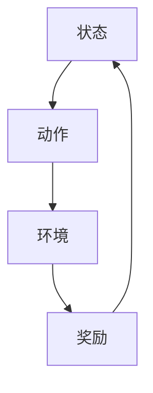
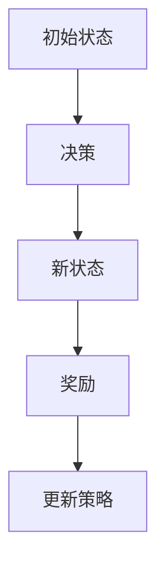
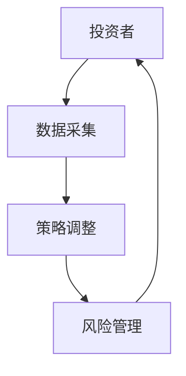
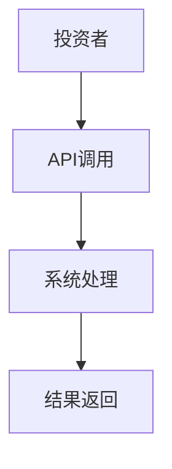

                 


# AI驱动的价值投资策略动态调整

## 关键词：价值投资、AI驱动、策略调整、强化学习、动态规划

## 摘要：  
本文探讨如何利用人工智能技术优化价值投资策略，并实现动态调整。通过分析价值投资的核心要素、AI在金融投资中的应用，以及动态调整的实现方法，本文提供了一种基于AI的动态调整框架，帮助投资者在复杂市场环境中做出更明智的投资决策。文章内容涵盖算法原理、系统架构设计、项目实战等，为读者提供全面的技术指导。

---

## 第一部分：价值投资与AI的结合

### 第1章：价值投资的定义与AI驱动的结合

#### 1.1 价值投资的定义与核心要素  
价值投资是一种以低于内在价值的价格买入优质资产的投资策略，其核心在于寻找市场低估的公司。价值投资的核心要素包括：基本面分析、安全边际、长期视角和逆向思维。  

- **基本面分析**：关注公司的财务状况、盈利能力、行业地位等因素。  
- **安全边际**：买入价格应低于公司内在价值，以降低风险。  
- **长期视角**：关注企业的长期竞争优势，而非短期市场波动。  
- **逆向思维**：在市场恐慌时寻找机会，在市场狂热时保持冷静。  

#### 1.2 AI在金融投资中的应用现状  
人工智能在金融领域的应用日益广泛，特别是在数据处理、模式识别和决策优化方面表现出色。  

- **金融分析**：AI能够快速处理大量数据，发现市场中的规律和趋势。  
- **风险管理**：通过预测市场波动和识别潜在风险，AI帮助投资者降低损失。  
- **投资组合优化**：AI能够根据市场变化动态调整投资组合，以实现最优收益。  

#### 1.3 价值投资策略动态调整的意义  
传统的价值投资策略通常是静态的，而市场环境的变化（如经济周期、行业趋势、政策变化）可能导致策略失效。动态调整能够帮助投资者及时应对市场变化，提高投资组合的适应性和收益能力。AI的引入使得动态调整更加智能化和高效化。  

---

### 第2章：AI驱动的价值投资策略动态调整的核心原理

#### 2.1 强化学习在策略调整中的应用  
强化学习是一种通过试错和奖励机制优化决策的算法。在价值投资中，强化学习可以用于动态调整投资组合。  

##### 2.1.1 强化学习的基本原理  
强化学习的核心在于“试错”和“奖励”。智能体通过与环境交互，不断调整动作以最大化累积奖励。  

##### 2.1.2 在价值投资中的应用  
- **状态空间**：市场环境、资产价格、公司基本面等。  
- **动作空间**：买入、卖出、持有等操作。  
- **奖励机制**：基于投资收益和风险的综合评估。  

##### 2.1.3 算法流程图  


#### 2.2 动态规划与投资策略调整  
动态规划是一种通过分解问题来优化决策的算法。在投资策略调整中，动态规划可以帮助投资者在不同时间点做出最优决策。  

##### 2.2.1 动态规划的基本概念  
动态规划通过将问题分解为子问题，逐步求解最优解。  

##### 2.2.2 在策略调整中的应用  
- **状态转移**：根据当前状态和动作，预测下一个状态。  
- **价值函数**：评估每个状态下的最优价值。  
- **策略优化**：通过不断优化策略，提高投资收益。  

##### 2.2.3 算法流程图  


#### 2.3 数学模型与公式  
在动态调整中，数学模型是核心工具。以下是一些常用的公式：  

- **价值函数**：  
  $$ V(s) = \max_{a} [ r + V(s') ] $$  
  其中，$s$ 是当前状态，$a$ 是动作，$r$ 是奖励，$s'$ 是新状态。  

- **策略优化**：  
  $$ \pi(a|s) = \arg \max_{a} [ Q(s,a) ] $$  
  其中，$Q(s,a)$ 是动作价值函数。  

---

### 第3章：系统架构设计与实现

#### 3.1 系统功能设计  
系统功能设计是实现AI驱动的价值投资策略动态调整的基础。  

##### 3.1.1 领域模型  


##### 3.1.2 功能模块划分  
- 数据采集模块：收集市场数据和公司基本面信息。  
- 策略调整模块：基于AI算法动态调整投资策略。  
- 风险管理模块：监控和管理投资风险。  

#### 3.2 系统架构设计  
系统架构设计决定了系统的稳定性和扩展性。  

##### 3.2.1 系统架构图  


##### 3.2.2 架构设计的考虑因素  
- **可扩展性**：支持多种投资策略和数据源。  
- **实时性**：能够快速响应市场变化。  
- **安全性**：确保数据安全和系统稳定。  

#### 3.3 系统接口设计  
系统接口设计是实现功能的重要环节。  

##### 3.3.1 API接口定义  
- **输入接口**：市场数据、公司基本面信息。  
- **输出接口**：投资建议、风险提示。  

##### 3.3.2 接口调用流程  


---

### 第4章：项目实战与实现

#### 4.1 环境配置与安装  
项目实战需要配置合适的开发环境。  

##### 4.1.1 开发环境的选择  
推荐使用Python编程语言，搭配以下工具：  
- **NumPy**：数值计算库。  
- **Pandas**：数据分析库。  
- **TensorFlow**：深度学习框架。  

##### 4.1.2 必要工具的安装  
```bash
pip install numpy pandas tensorflow
```

#### 4.2 核心算法实现  
以下是一个强化学习算法的实现示例：  

##### 4.2.1 强化学习算法的实现  
```python
class Agent:
    def __init__(self):
        self.model = ...  # 定义模型
    def take_action(self, state):
        # 根据状态选择动作
        pass
    def update(self, state, action, reward):
        # 更新模型参数
        pass
```

#### 4.3 案例分析与详细解读  
以某股票为例，分析如何利用AI驱动的策略动态调整进行投资。  

##### 4.3.1 案例背景介绍  
假设某股票当前价格为100元，公司基本面良好，但市场情绪低迷。  

##### 4.3.2 数据分析与处理  
使用历史数据训练模型，预测未来价格走势。  

##### 4.3.3 算法应用与结果分析  
通过强化学习算法，模型建议在价格跌至90元时买入，在价格涨至110元时卖出。  

---

### 第5章：最佳实践与总结

#### 5.1 最佳实践与注意事项  
- **数据质量**：确保数据的准确性和及时性。  
- **模型选择**：根据具体场景选择合适的算法。  
- **系统维护**：定期更新模型和数据。  

#### 5.2 未来趋势与拓展阅读  
- **价值投资与AI的结合**：未来将更加紧密。  
- **量子计算的应用**：可能进一步提升AI在投资中的作用。  

---

## 作者：AI天才研究院/AI Genius Institute & 禅与计算机程序设计艺术 /Zen And The Art of Computer Programming

